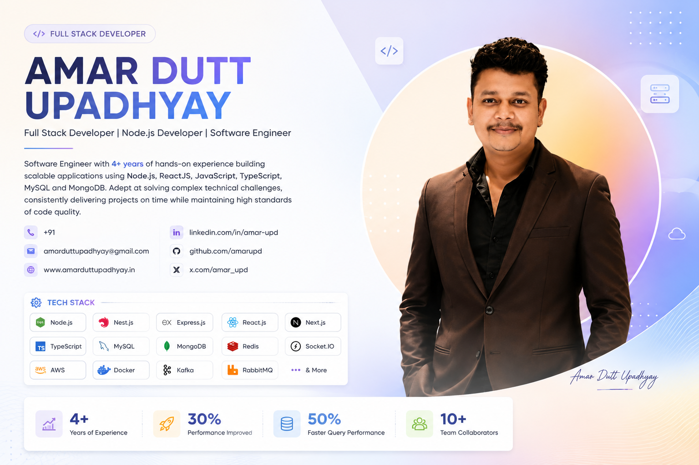
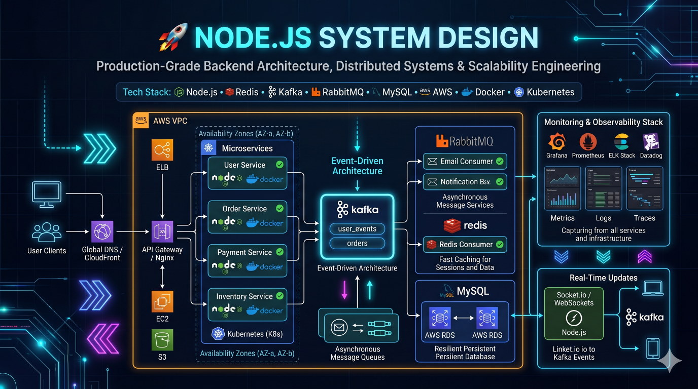
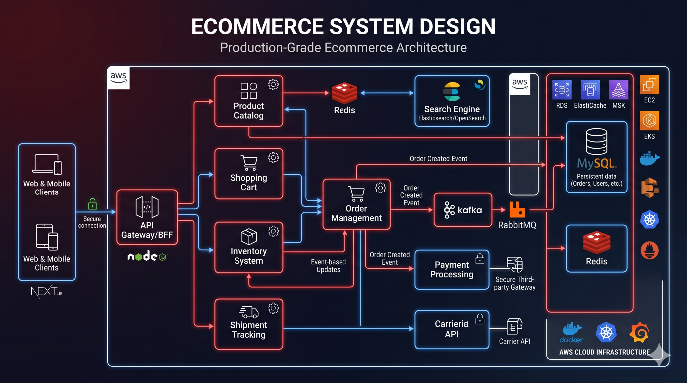
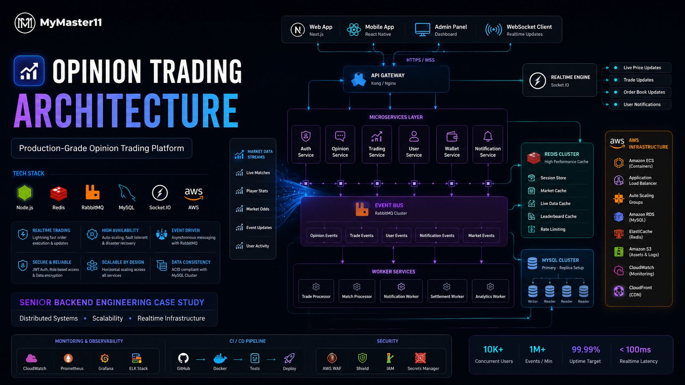

# 🚀 Developer Portfolio



> Senior-Level Engineering Portfolio | System Design | Architecture | Scalability | Production Engineering

---

## 👨‍💻 About Me

Hi, I'm **Amar Dutt Upadhyay**.

I am a **Full Stack Software Engineer** with **4+ years of professional experience** designing, building, deploying, and scaling modern web applications and distributed systems.

My primary expertise lies in:

* Node.js
* NestJS
* Express.js
* AdonisJS
* React.js
* Next.js
* MySQL
* MongoDB
* Redis
* AWS
* Docker
* Socket.IO
* Kafka
* RabbitMQ

Throughout my engineering journey, I have worked on:

* Fantasy Sports Platforms
* Live Score Systems
* Ecommerce Platforms
* Real-Time Applications
* Opinion Trading Platforms
* Event-Driven Architectures
* Scalable Backend Systems

This repository serves as a consolidated engineering portfolio focused on architecture, scalability, reliability, and production-grade engineering practices.

---

## 🎯 Repository Goals

This repository is designed to demonstrate:

* Engineering decision-making
* Production architecture thinking
* Scalability strategies
* Reliability patterns
* Performance optimization
* Distributed system concepts
* Cloud infrastructure knowledge
* Technical leadership principles
* System design expertise

Rather than showcasing proprietary code, this repository focuses on the reasoning, tradeoffs, and engineering approaches used when building large-scale systems.

---

## 🏗 Architecture Overview



Modern software systems require significantly more than application code.

A production-grade platform typically consists of:

```text
Users
  │
  ▼
CDN
  │
  ▼
Load Balancer
  │
  ▼
Application Layer
  │
  ├── API Services
  ├── Authentication
  ├── Business Logic
  └── Background Workers
  │
  ▼
Caching Layer (Redis)
  │
  ▼
Database Layer
  │
  ▼
Monitoring & Observability
```

This repository explores each layer in detail through architecture documentation, case studies, and engineering discussions.

---

## 🛠 Technology Stack

### Backend Engineering

* Node.js
* NestJS
* Express.js
* AdonisJS
* TypeScript
* JavaScript

### Frontend Engineering

* React.js
* Next.js
* Redux
* Zustand
* Material UI

### Databases

* MySQL
* PostgreSQL
* MongoDB
* Redis

### Messaging & Realtime

* Socket.IO
* Kafka
* RabbitMQ

### Cloud & Infrastructure

* AWS
* Docker
* Kubernetes
* Nginx
* Linux

### DevOps

* GitHub Actions
* CI/CD Pipelines
* Infrastructure as Code
* Monitoring Systems

---

## 📚 Repository Structure

```text
developer-portfolio/
│
├── docs/
│   ├── architecture/
│   ├── scalability/
│   ├── reliability/
│   ├── devops/
│   ├── observability/
│   ├── security/
│   ├── case-studies/
│   ├── system-design/
│   └── leadership/
│
├── diagrams/
│
├── references/
│
├── profile/
│
└── assets/
```

---

## 📖 Documentation Roadmap

### Architecture

* Backend Architecture
* Frontend Architecture
* API Design
* Event-Driven Systems
* Microservices Architecture
* Monolith vs Microservices

### Scalability

* Horizontal Scaling
* Vertical Scaling
* Redis Strategies
* Caching Patterns
* Queue Processing
* Database Scaling

### Reliability

* High Availability
* Disaster Recovery
* Circuit Breakers
* Retry Strategies
* Graceful Degradation

### DevOps

* CI/CD Pipelines
* Docker Strategy
* AWS Infrastructure
* Deployment Strategies
* Infrastructure as Code

### Observability

* Monitoring
* Logging
* Metrics
* Tracing
* Alerting
* SLO / SLA / SLI

### Security

* Authentication
* Authorization
* API Security
* Secrets Management
* Data Protection

---

## 🧠 Engineering Topics Covered

This repository focuses on real-world engineering challenges including:

### Performance

* API optimization
* Database tuning
* Query optimization
* Caching architecture

### Scalability

* High traffic systems
* Stateless architecture
* Distributed caching
* Horizontal scaling

### Reliability

* Fault tolerance
* Failover mechanisms
* Recovery procedures
* Resilience engineering

### Operations

* Monitoring
* Alerting
* Incident response
* Production readiness

### Leadership

* Technical decision making
* Engineering tradeoffs
* Code review philosophy
* Technical debt management

---

## 📈 Featured Case Studies

### Fantasy Sports Platform


Topics covered:

* Live score ingestion
* Realtime leaderboards
* Player points engine
* Redis optimization
* Socket.IO scaling

---

### Ecommerce Platform



Topics covered:

* Product catalog architecture
* Order management
* Inventory systems
* Checkout workflows
* Payment processing

---

### Opinion Trading Platform



Topics covered:

* Market event processing
* Realtime updates
* Transaction consistency
* Scalability challenges
* Event-driven workflows

---

## 🏆 Professional Highlights

* 4+ Years of Software Engineering Experience
* Full Stack Engineering Background
* Node.js Specialist
* Distributed Systems Enthusiast
* Production Architecture Experience
* Real-Time Systems Development
* Cloud Infrastructure Exposure
* System Design Practitioner

---

## 🔭 Future Additions

Planned enhancements include:

* Additional architecture case studies
* Advanced system design walkthroughs
* Distributed systems deep dives
* Performance engineering guides
* Production readiness frameworks
* Engineering leadership content
* Infrastructure blueprints
* Incident management playbooks

---

## 📬 Connect

### Amar Dutt Upadhyay

Full Stack Software Engineer

Core Areas:

* Backend Engineering
* System Design
* Cloud Architecture
* Scalable Systems
* Distributed Applications

This repository represents my ongoing effort to document engineering knowledge, architecture practices, and production-grade system design approaches accumulated throughout my professional experience.

---

## ⭐ Repository Philosophy

> Great engineering is not defined by frameworks or programming languages.

> Great engineering is the ability to make sound technical decisions, understand tradeoffs, design resilient systems, and build software that continues to operate reliably as complexity grows.

This repository exists to showcase that mindset.
