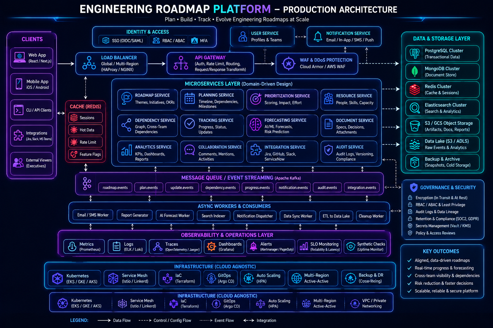

# Engineering Philosophy

## Overview

Engineering philosophy influences every technical decision made throughout the lifecycle of a software system.

Technologies change. Frameworks evolve. Infrastructure platforms improve.

However, the principles used to evaluate tradeoffs, manage complexity, and design resilient systems tend to remain relevant regardless of the technology stack.

This document outlines the engineering principles that guide my approach to software architecture, system design, software development, operational excellence, and technical leadership.

---

## Why Engineering Philosophy Matters

Many software projects fail not because of technology limitations, but because of poor engineering decisions.

Common causes include:

* Overengineering
* Premature optimization
* Lack of operational visibility
* Unclear ownership
* Excessive complexity
* Poor scalability planning
* Weak reliability strategies

Engineering philosophy provides a framework for making consistent decisions when multiple solutions appear technically viable.

---

## Principle 1: Solve the Business Problem First

Technology exists to solve business problems.

The most elegant architecture is not always the most valuable architecture.

Before evaluating technologies, I focus on understanding:

### Business Goals

* What problem are we solving?
* Who benefits from the solution?
* What outcomes define success?

### Constraints

* Budget
* Timeline
* Team Size
* Existing Systems
* Regulatory Requirements

### Risks

* Growth uncertainty
* Operational burden
* Technical debt
* Scalability requirements

A solution that satisfies business objectives with reasonable complexity is often preferable to a technically impressive but operationally expensive design.

---

## Principle 2: Simplicity Scales Better Than Complexity

Complexity is one of the most expensive costs in software engineering.

Complex systems often introduce:

* More bugs
* Longer onboarding times
* Increased operational burden
* Higher maintenance costs
* Greater failure probability

Whenever possible, I prefer:

### Simple Architecture

Before introducing:

* Microservices
* Event Streaming
* Service Meshes
* Distributed Transactions

I first ask:

> Can a simpler solution solve the problem effectively?

Many systems can successfully scale far beyond initial expectations using a well-structured monolith.

---

## Principle 3: Design for Change

Requirements evolve.

Teams grow.

Traffic increases.

Business priorities shift.

A system should not be optimized solely for today's requirements.

Instead, systems should be designed to accommodate future change with minimal disruption.

### Characteristics of Change-Friendly Systems

* Clear boundaries
* Modular architecture
* Low coupling
* High cohesion
* Well-defined interfaces
* Strong documentation

The goal is not predicting the future perfectly.

The goal is making future adaptation easier.

---

## Principle 4: Reliability Is a Feature

Users care about outcomes.

A feature-rich system that frequently fails provides little value.

Reliability should be considered from the beginning rather than added later.

### Reliability Considerations

* Error Handling
* Retry Strategies
* Failover Mechanisms
* Monitoring
* Alerting
* Disaster Recovery
* Incident Response

A system's success is often determined by how well it behaves during failures rather than during normal operation.

---

## Principle 5: Scalability Should Be Intentional

Scalability is often misunderstood.

Not every application requires internet-scale architecture.

However, every application should have a path toward growth.

### Questions I Frequently Ask

* What happens if traffic grows 10x?
* What happens if data grows 100x?
* What are the current bottlenecks?
* What components scale independently?

Scalability planning focuses on identifying constraints before they become production problems.

---

## Principle 6: Observability Is Essential

You cannot improve what you cannot measure.

Production systems require visibility.

Without observability, troubleshooting becomes guesswork.

### Observability Pillars

#### Metrics

Measure system behavior.

Examples:

* Request Volume
* Error Rates
* Latency
* Resource Utilization

#### Logs

Provide operational context.

Examples:

* Application Events
* Exceptions
* Security Events

#### Traces

Track requests across distributed systems.

Examples:

* Service Dependencies
* Performance Bottlenecks
* Request Flow Analysis

Observability should be designed into systems rather than added after incidents occur.

---

## Principle 7: Security Is Everyone's Responsibility

Security is not solely a compliance requirement.

It is an engineering responsibility.

Security considerations should influence:

* API Design
* Authentication
* Authorization
* Infrastructure
* Data Storage
* Deployment Pipelines

### Security Mindset

Assume:

* Inputs are untrusted
* Networks are hostile
* Credentials can leak
* Services can be compromised

This mindset encourages layered defense strategies rather than relying on single points of protection.

---

## Principle 8: Automation Reduces Risk

Manual processes create inconsistency.

As systems grow, operational tasks should become increasingly automated.

Examples include:

* Deployments
* Testing
* Infrastructure Provisioning
* Monitoring Setup
* Backups
* Security Scanning

Automation improves:

* Reliability
* Repeatability
* Speed
* Auditability

---

## Principle 9: Performance Is About User Experience

Performance optimization should focus on user impact rather than technical vanity metrics.

### Examples

Improving:

* Page Load Time
* API Response Time
* Checkout Completion Speed
* Realtime Update Latency

Often delivers greater business value than optimizing low-impact internal operations.

Performance work should be guided by measurement and user outcomes.

---

## Principle 10: Tradeoffs Are Inevitable

Engineering rarely involves perfect solutions.

Most decisions involve balancing competing priorities.

Examples include:

| Goal        | Potential Cost              |
| ----------- | --------------------------- |
| Scalability | Increased Complexity        |
| Reliability | Higher Infrastructure Costs |
| Performance | Additional Development Time |
| Security    | Reduced Convenience         |
| Flexibility | More Maintenance            |

Understanding tradeoffs is one of the most important engineering skills.

The objective is not eliminating tradeoffs.

The objective is making them intentionally.

---

## Architecture Decision Framework

When evaluating solutions, I generally assess them through five dimensions:

### Business Value

Does the solution solve the intended problem?

### Complexity

Can the team reasonably maintain it?

### Scalability

Can it support future growth?

### Reliability

How does it behave during failures?

### Operational Cost

What resources are required to operate it successfully?

Solutions that perform well across these dimensions are usually more sustainable long term.

---

## Technical Leadership Perspective

As engineers gain experience, their impact extends beyond implementation.

Technical leadership involves:

* Architecture Guidance
* Decision Making
* Mentoring
* Risk Management
* Long-Term Planning

The focus shifts from writing code to improving systems, teams, and engineering processes.

A successful engineering organization is built through shared knowledge, clear standards, and consistent decision-making frameworks.

---

## Continuous Learning Philosophy

Technology changes continuously.

Rather than chasing every trend, I focus on strengthening foundational knowledge in:

* System Design
* Distributed Systems
* Networking
* Databases
* Cloud Infrastructure
* Reliability Engineering

Strong fundamentals remain valuable regardless of emerging tools and frameworks.

---

## Engineering Outcome

The philosophy documented here can be summarized in a single statement:

> Build systems that solve real problems, remain understandable, scale responsibly, operate reliably, and evolve gracefully over time.

Most engineering success is not the result of individual technologies.

It is the result of thoughtful decisions, deliberate tradeoffs, operational awareness, and a commitment to continuous improvement.

These principles guide the architecture discussions, system designs, and case studies throughout this repository.
