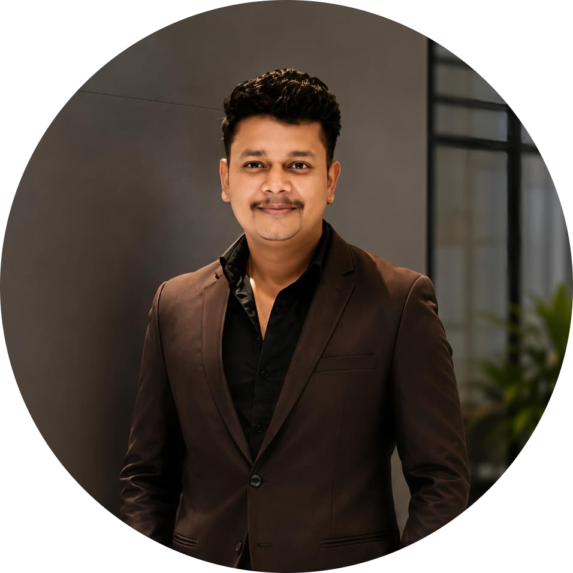

# Professional Summary

## Overview

This document provides a professional overview of my engineering background, technical expertise, areas of specialization, and the principles that guide my approach to software development.

The objective is not merely to list technologies, but to demonstrate the progression from software implementation toward architecture, scalability, operational excellence, and engineering leadership.

---

## Engineering Profile

### Amar Dutt Upadhyay

**Full Stack Software Engineer**

With more than four years of professional software engineering experience, I have worked across the full software development lifecycle, including:

* Product Development
* Backend Engineering
* Frontend Engineering
* Architecture Design
* Database Engineering
* Cloud Deployments
* Performance Optimization
* Production Operations

My primary focus has evolved from feature development toward designing systems that remain maintainable, scalable, observable, and reliable under increasing business and technical complexity.

---

## Core Engineering Philosophy

Software engineering extends beyond writing code.

Production systems require balancing:

* Performance
* Reliability
* Maintainability
* Scalability
* Security
* Developer Experience
* Operational Simplicity

Many engineering decisions involve tradeoffs rather than perfect solutions.

A successful engineer understands not only how to build a system but also:

* Why a particular design was chosen
* What limitations exist
* How the system evolves over time
* What operational risks must be managed

---

## Technical Expertise

### Backend Engineering

Primary technologies:

* Node.js
* NestJS
* Express.js
* AdonisJS
* TypeScript
* JavaScript

Key areas:

* REST API Design
* Service Architecture
* Authentication Systems
* Authorization Models
* Event Processing
* Queue-Based Workloads
* Background Jobs
* Realtime Communication

---

### Frontend Engineering

Primary technologies:

* React.js
* Next.js
* Material UI
* Zustand
* Redux

Focus areas:

* Scalable Frontend Architecture
* State Management
* Performance Optimization
* Server-Side Rendering
* User Experience Engineering
* Responsive Interfaces

---

### Database Engineering

Experience with:

* MySQL
* PostgreSQL
* MongoDB
* Redis

Topics frequently addressed:

* Data Modeling
* Query Optimization
* Index Design
* Replication Strategies
* Data Consistency
* Caching Architectures

---

### Distributed Systems

Areas of interest and implementation:

* Event-Driven Systems
* Message Queues
* Realtime Systems
* Distributed Caching
* Service Communication
* High Availability Patterns

Technologies:

* Kafka
* RabbitMQ
* Redis Streams
* Socket.IO

---

### Cloud & Infrastructure

Experience working with:

* AWS
* Docker
* Linux
* Nginx
* CI/CD Pipelines

Focus areas:

* Deployment Automation
* Infrastructure Reliability
* Containerization
* Environment Management
* Monitoring Integration

---

## Industry Domains

Throughout my professional career, I have worked on systems across multiple domains.

### Fantasy Sports Platforms

Engineering challenges:

* Realtime Score Updates
* Leaderboard Computation
* High Traffic Events
* Contest Processing
* Player Statistics Aggregation

---

### Ecommerce Platforms

Engineering challenges:

* Product Catalog Management
* Inventory Systems
* Checkout Workflows
* Order Management
* User Experience Optimization

---

### Opinion Trading Platforms

Engineering challenges:

* Event Processing
* Transaction Integrity
* Market State Management
* Realtime Updates
* Scalability Requirements

---

## Engineering Strengths

### System Thinking

I prefer understanding entire systems rather than isolated features.

This includes:

* User Experience
* Backend Services
* Databases
* Infrastructure
* Deployment Pipelines
* Operational Monitoring

This perspective helps identify bottlenecks, dependencies, and opportunities for optimization.

---

### Scalability Mindset

When designing systems, I routinely consider:

* Traffic Growth
* Data Growth
* Infrastructure Costs
* Operational Complexity

The goal is not premature optimization but creating architectures capable of evolving without extensive rewrites.

---

### Reliability Focus

Reliable systems are often more valuable than feature-rich systems.

Key concerns include:

* Fault Tolerance
* Failure Recovery
* Monitoring
* Alerting
* Incident Response
* Operational Visibility

---

### Continuous Improvement

Technology evolves rapidly.

I actively invest in:

* System Design
* Distributed Systems
* Cloud Architecture
* Performance Engineering
* DevOps Practices
* Engineering Leadership

Learning is treated as an ongoing engineering responsibility rather than a periodic activity.

---

## Engineering Approach

When evaluating technical solutions, I typically consider:

### 1. Business Requirements

What problem are we solving?

### 2. Technical Constraints

What limitations exist?

### 3. Scalability Requirements

What happens at 10x growth?

### 4. Reliability Expectations

How should failures be handled?

### 5. Operational Impact

How will the system be monitored and maintained?

### 6. Long-Term Maintainability

Can future engineers easily understand and evolve the solution?

---

## Career Direction

My long-term focus is continuing to grow toward roles involving:

* Senior Software Engineering
* Staff Engineering
* System Architecture
* Technical Leadership
* Platform Engineering

These responsibilities align closely with my interests in system design, scalability, reliability, and engineering strategy.

---

## Engineering Outcome

My engineering journey has reinforced a simple principle:

Technology choices matter, but architecture and decision-making matter more.

The most successful systems are not necessarily built with the newest technologies. They are built through thoughtful engineering decisions, careful tradeoff analysis, operational awareness, and continuous refinement.

This portfolio documents that philosophy through architecture discussions, system design explorations, case studies, and engineering frameworks developed through professional experience.
