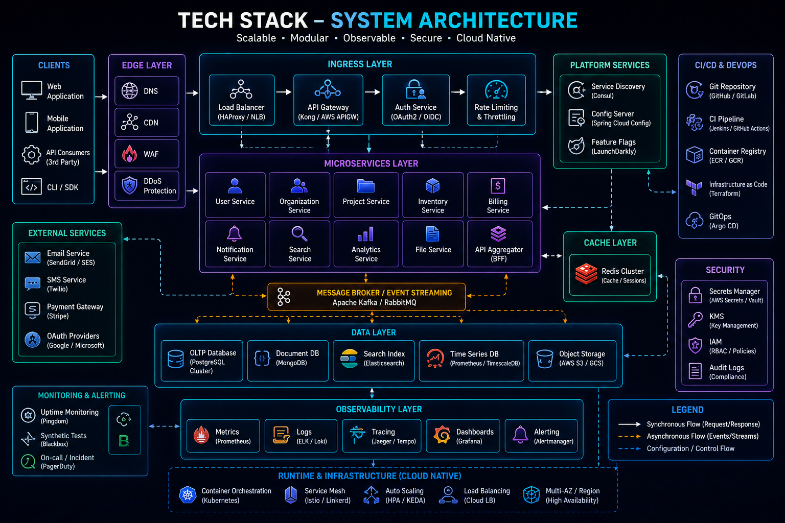

# Technical Expertise

## Overview

This document provides a structured view of my technical expertise across software engineering disciplines.

The goal is not to create a simple list of technologies, but to demonstrate how various technologies, tools, and engineering practices are applied to design, build, deploy, and operate production-grade systems.

My experience spans full stack development, backend architecture, distributed systems, cloud infrastructure, realtime platforms, and engineering operations.

---

## Engineering Focus Areas

### Primary Specializations

* Backend Engineering
* Full Stack Development
* System Design
* Distributed Systems
* Realtime Applications
* Cloud Infrastructure
* Scalability Engineering
* Reliability Engineering

---

# Backend Engineering

Backend systems are the foundation of modern applications.

My primary expertise is centered around designing and building scalable backend services capable of supporting production workloads.

## Core Technologies

### Node.js

Primary backend runtime.

Experience includes:

* REST APIs
* Authentication Systems
* Realtime Services
* Background Processing
* Service-Oriented Architecture
* High-Concurrency Applications

### NestJS

Used for:

* Enterprise Applications
* Modular Architectures
* Dependency Injection
* Domain Separation
* Scalable Service Design

### Express.js

Used for:

* Lightweight APIs
* Service Development
* Middleware Architecture
* Performance-Oriented Implementations

### AdonisJS

Used for:

* Full-Featured Backend Systems
* ORM-Based Applications
* Authentication Workflows
* Ecommerce Platforms

---

## Backend Engineering Competencies

### API Design

Experience designing:

* REST APIs
* Resource-Oriented APIs
* Versioned APIs
* Secure APIs

Considerations include:

* Maintainability
* Scalability
* Backward Compatibility
* Developer Experience

---

### Authentication & Authorization

Implemented systems involving:

* JWT Authentication
* Session Management
* Role-Based Access Control
* Permission Models
* Secure Token Handling

---

### Service Architecture

Approaches used:

* Layered Architecture
* Modular Design
* Service Separation
* Domain-Oriented Organization

Goals:

* Maintainability
* Testability
* Scalability

---

# Frontend Engineering

Frontend engineering is responsible for translating business functionality into efficient user experiences.

## Core Technologies

### React.js

Experience includes:

* Component Architecture
* State Management
* API Integration
* Performance Optimization
* Responsive Applications

---

### Next.js

Experience includes:

* Server-Side Rendering
* Static Site Generation
* Dynamic Routing
* SEO Optimization
* Ecommerce Applications

---

### State Management

Technologies used:

* Zustand
* Redux
* Context API

Use cases:

* Authentication
* Shopping Cart Management
* Realtime Data Synchronization
* Global Application State

---

## Frontend Engineering Competencies

### UI Architecture

Focus areas:

* Reusability
* Maintainability
* Component Isolation
* Scalability

---

### Performance Optimization

Topics addressed:

* Lazy Loading
* Code Splitting
* Memoization
* Bundle Optimization
* Rendering Efficiency

---

### User Experience Engineering

Goals:

* Fast Interfaces
* Responsive Design
* Accessibility Considerations
* Mobile Optimization

---

# Database Engineering

Data architecture plays a critical role in system performance and reliability.

---

## Relational Databases

### MySQL

Primary production database experience.

Areas of expertise:

* Data Modeling
* Index Optimization
* Query Analysis
* Relationship Design
* Transaction Handling

---

### PostgreSQL

Experience includes:

* Schema Design
* Relational Modeling
* Performance Tuning
* Analytical Queries

---

## NoSQL Databases

### MongoDB

Used for:

* Flexible Data Structures
* Rapid Development
* Document-Oriented Storage

Topics explored:

* Aggregation Pipelines
* Indexing
* Data Modeling

---

## Caching Layer

### Redis

Extensive practical experience.

Use cases:

* Session Storage
* Leaderboards
* Caching
* Rate Limiting
* Realtime Data
* Queue Processing

---

## Database Competencies

### Query Optimization

Focus areas:

* Execution Plans
* Index Strategy
* Join Optimization
* Query Refactoring

---

### Data Modeling

Principles:

* Normalization
* Selective Denormalization
* Relationship Design
* Consistency Management

---

# Realtime Systems

Realtime applications require specialized architectural approaches.

## Technologies

### Socket.IO

Experience includes:

* Live Score Systems
* Notifications
* Event Broadcasting
* User Presence Tracking

---

### Redis Pub/Sub

Used for:

* Event Distribution
* Cross-Instance Communication
* Realtime Synchronization

---

## Realtime Engineering Challenges

Topics addressed:

* Connection Management
* Message Distribution
* Scaling WebSocket Servers
* Event Consistency
* Latency Optimization

---

# Distributed Systems

As applications grow, distributed architectures become increasingly important.

## Concepts Applied

### Event-Driven Architecture

Use cases:

* Background Processing
* Service Communication
* Asynchronous Workflows

---

### Message Queues

Technologies explored:

* RabbitMQ
* Kafka
* Redis Streams

Benefits:

* Decoupling
* Scalability
* Reliability

---

### Distributed Caching

Goals:

* Performance Improvement
* Database Load Reduction
* Fast Data Access

---

# Cloud & Infrastructure

Infrastructure knowledge is essential for operating production systems.

## Cloud Platforms

### AWS

Areas of exposure:

* Compute Services
* Storage Services
* Networking
* Monitoring
* Security Controls

---

## Containerization

### Docker

Used for:

* Local Development
* Environment Consistency
* Application Packaging
* Deployment Standardization

---

## Web Infrastructure

### Nginx

Used for:

* Reverse Proxying
* Load Distribution
* SSL Termination
* Request Routing

---

## Linux Administration

Topics:

* Server Management
* Process Monitoring
* Log Analysis
* Deployment Operations

---

# DevOps & Operations

Software engineering extends beyond development into deployment and operations.

## CI/CD

Experience with:

* Automated Builds
* Automated Testing
* Deployment Pipelines

Goals:

* Faster Releases
* Reduced Risk
* Consistent Deployments

---

## Infrastructure Automation

Focus areas:

* Repeatability
* Reliability
* Operational Efficiency

---

## Production Operations

Topics:

* Incident Investigation
* Monitoring
* Logging
* Root Cause Analysis

---

# Observability

Reliable systems require visibility.

## Monitoring

Metrics commonly monitored:

* Request Volume
* Error Rates
* Latency
* Resource Utilization

---

## Logging

Focus:

* Structured Logging
* Error Analysis
* Operational Diagnostics

---

## Tracing

Used to understand:

* Request Flows
* Service Dependencies
* Performance Bottlenecks

---

# Security Engineering

Security considerations are integrated into system design.

## Areas of Focus

### Authentication

* JWT
* Session Security
* Token Management

---

### Authorization

* RBAC
* Permission Systems
* Access Controls

---

### API Security

* Input Validation
* Rate Limiting
* Secure Communication

---

### Data Protection

* Secure Storage
* Encryption Practices
* Credential Management

---

# Architecture & System Design

System design has become a major area of ongoing study and practical application.

## Topics of Interest

### Scalability

* Horizontal Scaling
* Stateless Services
* Distributed Systems

---

### Reliability

* High Availability
* Fault Tolerance
* Recovery Strategies

---

### Performance

* Caching
* Database Optimization
* Efficient Architectures

---

### Operational Excellence

* Monitoring
* Alerting
* Deployment Strategies
* Incident Response

---

# Engineering Strength Matrix

| Area                 | Competency               |
| -------------------- | ------------------------ |
| Backend Engineering  | Advanced                 |
| Node.js Ecosystem    | Advanced                 |
| API Design           | Advanced                 |
| Database Engineering | Advanced                 |
| Redis                | Advanced                 |
| Realtime Systems     | Advanced                 |
| React.js             | Advanced                 |
| Next.js              | Advanced                 |
| System Design        | Advanced                 |
| Scalability Concepts | Advanced                 |
| Cloud Infrastructure | Intermediate             |
| DevOps Practices     | Intermediate             |
| Distributed Systems  | Intermediate to Advanced |
| Security Engineering | Intermediate             |
| Technical Leadership | Growing Focus Area       |

---

# Continuous Learning Areas

Current areas of deeper exploration include:

* Distributed Systems
* Event-Driven Architectures
* Platform Engineering
* Reliability Engineering
* Cloud Native Infrastructure
* Kubernetes
* Performance Engineering
* Engineering Leadership

---

## Engineering Outcome

Technical expertise is not defined by the number of technologies known.

It is defined by the ability to apply appropriate technologies to solve business problems while balancing scalability, reliability, maintainability, security, and operational complexity.

The technologies documented here represent tools used throughout that process, while the true focus remains engineering decision-making and system design.
