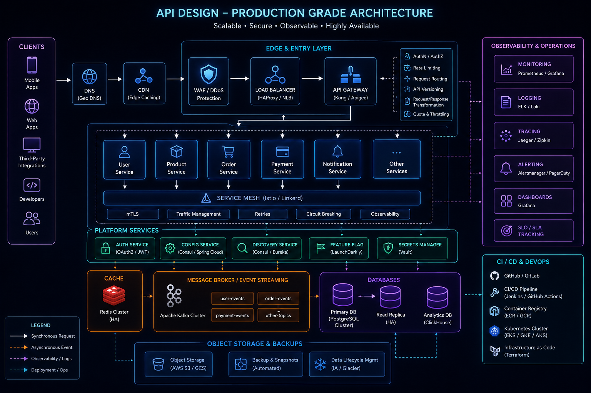
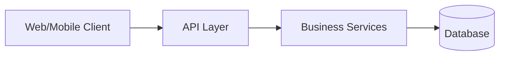
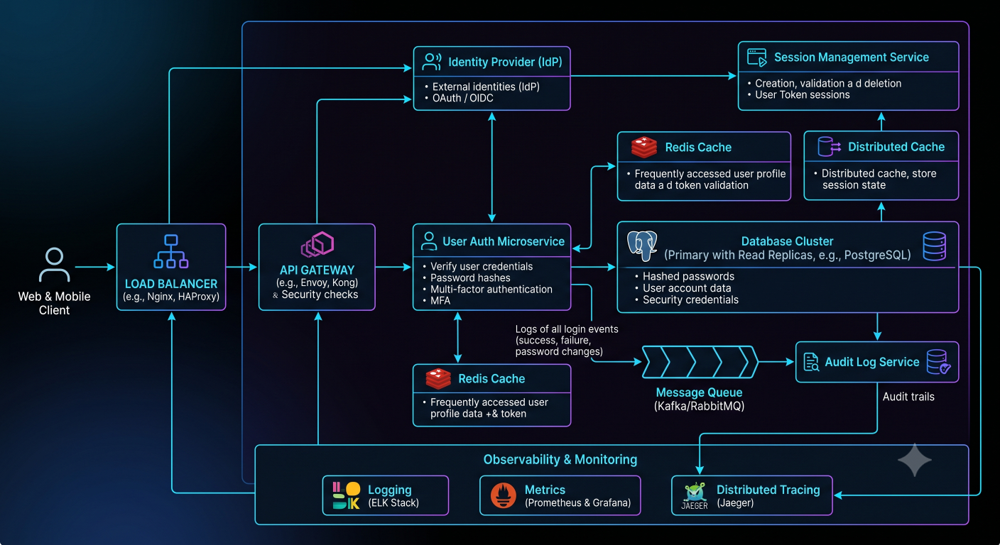
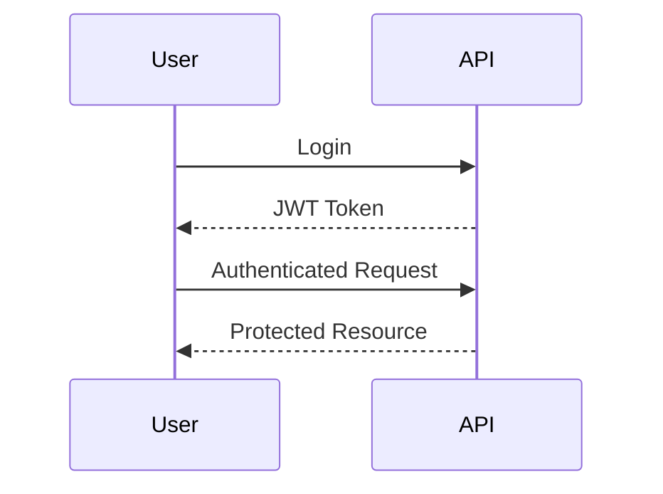
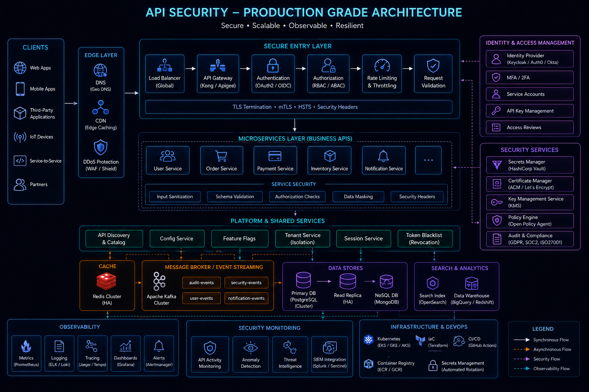

# API Design Principles



## Overview

Application Programming Interfaces (APIs) are the contracts through which systems communicate.

In modern software architectures, APIs often outlive individual applications, frameworks, databases, and even engineering teams. Poor API design introduces long-term maintenance costs, integration challenges, security risks, and scalability issues.

Well-designed APIs enable:

* Consistent Developer Experience
* Faster Product Development
* Easier Integrations
* Better Maintainability
* Improved Scalability
* Long-Term Evolution

This document outlines the principles, patterns, tradeoffs, and production considerations involved in designing high-quality APIs.

---

## Objectives

A production-grade API should be:

* Consistent
* Predictable
* Secure
* Scalable
* Versionable
* Observable
* Well Documented

The goal is to make APIs intuitive for both internal and external consumers.

---

# API Architecture Role


In a typical architecture, APIs serve as the boundary between clients and business systems.



The API layer should focus on:

* Request Validation
* Authentication
* Authorization
* Response Formatting
* Error Handling

Business logic should remain within service layers.

---

# Principle 1: Design Around Resources

One of the most widely adopted approaches is resource-oriented design.

Resources represent business entities.

Examples:

```text
Users
Products
Orders
Payments
Teams
Matches
```

---

## Good Resource Design

```http
GET    /users
GET    /users/{id}

POST   /users

PUT    /users/{id}

DELETE /users/{id}
```

Benefits:

* Predictability
* Consistency
* Easier Documentation

---

## Poor Resource Design

```http
GET /getUsers

POST /createUser

POST /updateUser

POST /deleteUser
```

Problems:

* Verb-Based Design
* Inconsistent Patterns
* Harder Maintenance

---

# Principle 2: Consistent Naming Conventions

Consistency reduces cognitive load.

---

## Recommended Naming

Use:

```text
/users
/products
/orders
/order-items
/payment-transactions
```

Characteristics:

* Nouns
* Lowercase
* Hyphenated when needed
* Plural resources

---

## Avoid

```text
/UserData
/GetAllOrders
/ProductInfo
```

Inconsistent naming creates confusion across teams.

---

# Principle 3: Use HTTP Methods Correctly

HTTP methods communicate intent.

---

## GET

Retrieve data.

Example:

```http
GET /products
```

Characteristics:

* Safe
* Idempotent

---

## POST

Create resources.

Example:

```http
POST /orders
```

---

## PUT

Replace an existing resource.

Example:

```http
PUT /users/123
```

Characteristics:

* Idempotent

---

## PATCH

Partial update.

Example:

```http
PATCH /users/123
```

---

## DELETE

Remove a resource.

Example:

```http
DELETE /users/123
```

---

# Principle 4: Meaningful URLs

URLs should communicate intent clearly.

---

## Good Examples

```http
/users/123

/orders/456

/products/789/reviews
```

---

## Poor Examples

```http
/api/getUser?id=123

/api/processOrder?id=456

/api/productData
```

Good URLs improve readability and maintainability.

---

# Principle 5: Version APIs

APIs evolve over time.

Versioning enables controlled change.

---

## URI Versioning

Example:

```http
/api/v1/users

/api/v2/users
```

Advantages:

* Explicit
* Easy to Understand

---

## Header Versioning

Example:

```http
Accept-Version: v2
```

Advantages:

* Cleaner URLs

Tradeoff:

* Harder Discovery

---

# Principle 6: Standardize Responses

Consistency improves client development.

---

## Success Response

```json
{
  "success": true,
  "data": {
    "id": 1,
    "name": "Amar"
  }
}
```

---

## Error Response

```json
{
  "success": false,
  "message": "User not found",
  "errorCode": "USER_NOT_FOUND"
}
```

Benefits:

* Predictable Parsing
* Easier Error Handling

---

# Principle 7: Proper HTTP Status Codes

Status codes communicate outcomes.

---

## Success Codes

| Code | Meaning          |
| ---- | ---------------- |
| 200  | Success          |
| 201  | Resource Created |
| 204  | No Content       |

---

## Client Errors

| Code | Meaning      |
| ---- | ------------ |
| 400  | Bad Request  |
| 401  | Unauthorized |
| 403  | Forbidden    |
| 404  | Not Found    |
| 409  | Conflict     |

---

## Server Errors

| Code | Meaning             |
| ---- | ------------------- |
| 500  | Internal Error      |
| 502  | Bad Gateway         |
| 503  | Service Unavailable |

---

## Common Mistake

Returning:

```http
200 OK
```

For every response.

This hides important information from consumers.

---

# Principle 8: Pagination

Large datasets should never be returned entirely.

---

## Example

```http
GET /products?page=1&limit=20
```

---

## Response

```json
{
  "data": [],
  "pagination": {
    "page": 1,
    "limit": 20,
    "total": 500
  }
}
```

Benefits:

* Better Performance
* Reduced Memory Usage
* Faster Responses

---

# Principle 9: Filtering & Sorting

Consumers should be able to request relevant data.

---

## Filtering

```http
GET /products?category=shoes
```

---

## Sorting

```http
GET /products?sort=price
```

---

## Combined

```http
GET /products?category=shoes&sort=price&page=1
```

Benefits:

* Flexible Queries
* Reduced Client Processing

---

# Principle 10: Idempotency

Operations should behave predictably.

---

## Idempotent

```http
PUT /users/123
```

Multiple identical requests:

Same outcome.

---

## Non-Idempotent

```http
POST /orders
```

Multiple identical requests:

Multiple orders created.

---

## Payment Example

For payment APIs:

Use idempotency keys.

```http
Idempotency-Key: abc123
```

Benefits:

* Prevent Duplicate Charges
* Improve Reliability

---

# Authentication Architecture



APIs should secure access appropriately.

---

## JWT Authentication

Typical Flow:



Benefits:

* Stateless
* Scalable

---

## OAuth2

Useful for:

* Third-Party Integrations
* Enterprise Applications

---

# Authorization

Authentication identifies users.

Authorization determines permissions.

---

## Example

```text
Admin
 ├── Manage Users
 ├── Manage Orders

Customer
 └── View Own Orders
```

Authorization should be enforced consistently across APIs.

---

# Validation Principles

Never trust client input.

Validate:

* Request Body
* Query Parameters
* Headers
* File Uploads

---

## Example

```json
{
  "email": "invalid-email"
}
```

Should return:

```http
400 Bad Request
```

With clear validation details.

---

# Rate Limiting



Protect APIs from abuse.

---

## Example

```text
100 Requests / Minute
```

Benefits:

* Abuse Prevention
* Resource Protection
* Security Enhancement

---

## Strategies

* IP Based
* User Based
* API Key Based

---

# API Security Principles

---

## HTTPS Everywhere

All traffic should be encrypted.

---

## Input Sanitization

Protect against:

* SQL Injection
* XSS
* Command Injection

---

## Least Privilege

Consumers receive only required access.

---

## Secret Protection

Never expose:

* Database Credentials
* API Secrets
* Internal Tokens

---

# Observability


APIs must be observable.

---

## Metrics

Track:

* Requests Per Second
* Error Rates
* Latency
* Throughput

---

## Logging

Record:

* Requests
* Errors
* Security Events

---

## Tracing

Understand:

* Request Flow
* Service Dependencies
* Performance Bottlenecks

---

# API Documentation

Good APIs require excellent documentation.

---

## Documentation Should Include

* Endpoints
* Request Examples
* Response Examples
* Error Codes
* Authentication Requirements

---

## Tools

Examples:

* OpenAPI
* Swagger
* Postman Collections

Documentation is part of the product.

---

# Common API Design Mistakes

---

## Inconsistent Responses

Different structures across endpoints.

---

## Poor Naming

Confusing resource names.

---

## Missing Versioning

Creates upgrade challenges.

---

## Returning Excessive Data

Increases latency and bandwidth usage.

---

## Weak Error Handling

Makes debugging difficult.

---

## Business Logic in Controllers

Creates maintenance problems.

---

# Engineering Tradeoffs

| Decision           | Benefit     | Cost                   |
| ------------------ | ----------- | ---------------------- |
| Strict Versioning  | Stability   | Additional Maintenance |
| Rich Responses     | Better UX   | Larger Payloads        |
| Pagination         | Performance | Additional Complexity  |
| JWT Authentication | Scalability | Token Management       |
| Rate Limiting      | Security    | User Restrictions      |

---

# API Maturity Model

```text
Basic Endpoints
        │
        ▼
Consistent APIs
        │
        ▼
Versioned APIs
        │
        ▼
Documented APIs
        │
        ▼
Observable APIs
        │
        ▼
Enterprise API Platform
```

Organizations often progress through these stages as systems evolve.

---

# Interview Perspective

In system design interviews, API discussions frequently reveal architectural maturity.

Strong candidates discuss:

* Resource Design
* Versioning
* Authentication
* Authorization
* Pagination
* Idempotency
* Observability

Rather than focusing solely on endpoint definitions.

---

# Engineering Outcome

Well-designed APIs become long-lived contracts that support product growth, developer productivity, and system scalability.

The best APIs are:

* Predictable
* Secure
* Consistent
* Observable
* Easy to Evolve

Successful API design is not simply about exposing functionality—it is about creating durable interfaces that remain useful and maintainable as systems and organizations grow.
