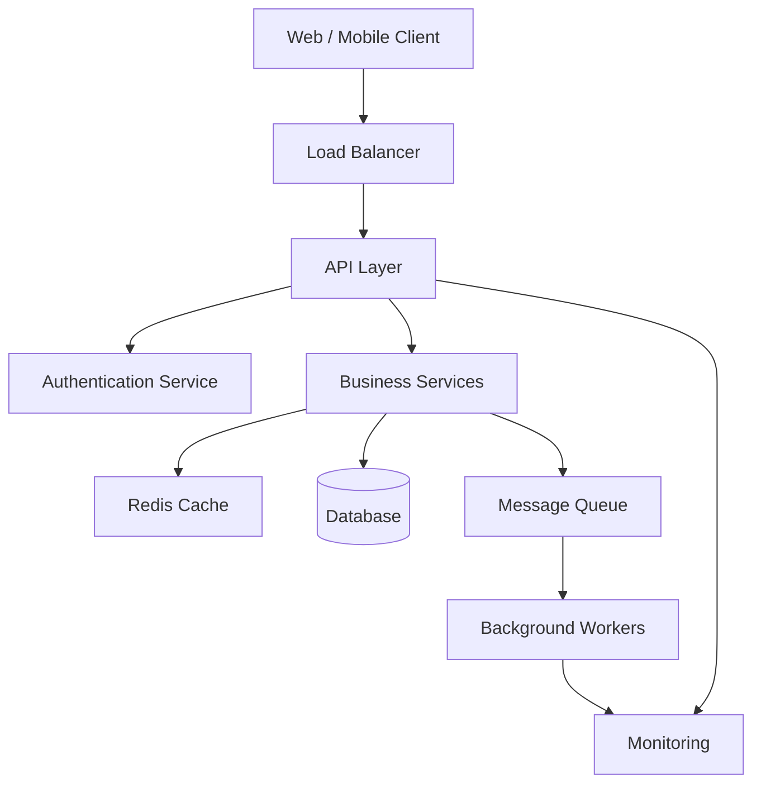
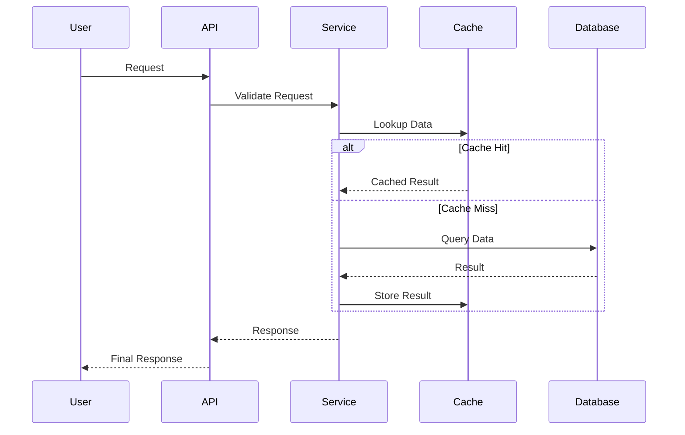
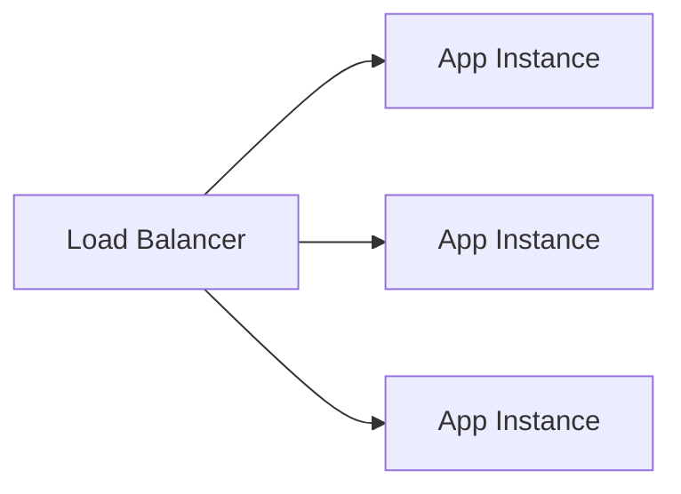
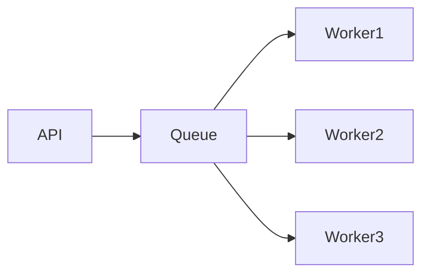

# Backend Architecture


## Overview

Backend architecture forms the foundation of every production-grade software system.

While frontend applications provide the user experience, backend systems are responsible for:

* Business Logic
* Data Management
* Authentication
* Authorization
* Scalability
* Reliability
* Integrations
* Operational Stability

This document outlines the architectural principles, patterns, and engineering decisions commonly used when designing modern backend systems.

The focus is not on a specific framework or programming language, but rather on creating systems that remain maintainable, scalable, and reliable as business requirements evolve.

---

## Objectives

A well-designed backend architecture should achieve the following goals:

### Functional Goals

* Serve application requests
* Execute business logic
* Manage application data
* Integrate with external systems
* Process asynchronous workloads

### Non-Functional Goals

* Scalability
* Reliability
* Security
* Maintainability
* Observability
* Performance

---

## High-Level Architecture




---

## Architectural Layers

Modern backend systems benefit from clear separation of concerns.

A layered architecture helps reduce coupling while improving maintainability.

---

## Presentation Layer

### Responsibilities

* Handle incoming requests
* Validate input
* Transform responses
* Manage authentication context

### Examples

* REST Controllers
* GraphQL Resolvers
* API Gateways

### Design Principle

This layer should remain thin.

Business logic should not be implemented directly inside controllers.

---

## Business Layer

### Responsibilities

* Domain Logic
* Validation Rules
* Workflow Execution
* Decision Making

### Examples

* Order Processing
* Contest Settlement
* Payment Validation
* User Management

### Benefits

* Easier testing
* Better maintainability
* Improved scalability

This layer represents the core value of the system.

---

## Data Access Layer

### Responsibilities

* Database Operations
* Query Execution
* Transaction Management
* Persistence Logic

### Examples

* Repositories
* Data Access Objects
* ORM Models

### Design Principle

Database implementation details should remain isolated from business logic.

---

## Infrastructure Layer

### Responsibilities

* External Integrations
* Caching
* Storage Services
* Queue Systems
* Notification Services

### Examples

* Redis
* AWS S3
* RabbitMQ
* Kafka
* Email Providers

This layer enables interaction with external systems without polluting core business logic.

---

# Request Lifecycle

Understanding request flow is critical when designing scalable systems.



---

# Backend Design Principles

---

## Single Responsibility

Each component should have one primary responsibility.

Examples:

### Good

```text
UserController
UserService
UserRepository
```

### Bad

```text
UserController
 ├── Authentication
 ├── Validation
 ├── Business Logic
 ├── Database Access
 └── Email Sending
```

---

## Dependency Inversion

High-level modules should not depend directly on implementation details.

Benefits:

* Easier Testing
* Improved Flexibility
* Better Maintainability

---

## Loose Coupling

Services should communicate through well-defined interfaces.

Benefits:

* Easier Refactoring
* Independent Development
* Better Scalability

---

## High Cohesion

Related functionality should remain grouped together.

Benefits:

* Improved Readability
* Reduced Complexity
* Better Ownership

---

# API Architecture


API design significantly impacts maintainability and developer experience.

---

## Resource-Oriented Design

Example:

```text
/users
/users/:id
/orders
/orders/:id
/products
/products/:id
```

Benefits:

* Predictable APIs
* Easier Documentation
* Better Consistency

---

## Versioning Strategy

Example:

```text
/api/v1/users
/api/v2/users
```

Benefits:

* Backward Compatibility
* Safer Upgrades
* Controlled Evolution

---

## Standardized Responses

Example:

```json
{
  "success": true,
  "data": {},
  "message": "Operation successful"
}
```

Benefits:

* Consistent Client Behavior
* Easier Error Handling

---

# Scalability Considerations

Backend systems should be designed with growth in mind.

---

## Stateless Services

Preferred approach:

```text
Request 1 → Server A
Request 2 → Server B
Request 3 → Server C
```

Benefits:

* Easier Horizontal Scaling
* Better Load Distribution
* Simplified Deployments

---

## Horizontal Scaling



Advantages:

* Improved Availability
* Increased Capacity
* Better Fault Isolation

---

## Caching Layer


Caching reduces database load.

Common use cases:

* User Profiles
* Leaderboards
* Product Catalogs
* Configuration Data

Technologies:

* Redis
* Memcached

---

## Queue-Based Processing


Not all workloads should be executed synchronously.

Examples:

* Email Delivery
* Report Generation
* Notification Processing
* Data Imports

Architecture:



Benefits:

* Reduced Response Times
* Better Reliability
* Independent Scaling

---

# Reliability Considerations

Backend systems must assume failures will occur.

---

## Failure Scenarios

Examples:

* Database Downtime
* Cache Failures
* Third-Party API Outages
* Network Issues

---

## Resilience Patterns

### Retry Mechanisms

Used for:

* Temporary Failures
* Network Interruptions

---

### Circuit Breakers

Used to:

* Prevent Cascading Failures
* Protect Dependencies

---

### Graceful Degradation

When systems fail:

* Maintain Core Features
* Disable Non-Critical Features
* Preserve User Experience

---

# Security Considerations


Security should be integrated into architecture from the beginning.

---

## Authentication

Common approaches:

* JWT
* OAuth
* Session-Based Authentication

---

## Authorization

Models:

* Role-Based Access Control
* Permission-Based Systems

---

## Input Validation

Validate:

* Request Bodies
* Query Parameters
* Headers
* Uploaded Files

Never trust client input.

---

## Rate Limiting

Protects against:

* Abuse
* Brute Force Attacks
* Resource Exhaustion

---

# Observability


Production systems require visibility.

---

## Metrics

Examples:

* Request Rate
* Error Rate
* Response Time

---

## Logging

Examples:

* Errors
* Business Events
* Security Events

---

## Tracing

Provides visibility into:

* Request Flow
* Service Dependencies
* Performance Bottlenecks

---

# Engineering Tradeoffs

| Decision           | Benefit             | Cost                         |
| ------------------ | ------------------- | ---------------------------- |
| Monolith           | Simpler Development | Scaling Constraints          |
| Microservices      | Independent Scaling | Operational Complexity       |
| Redis Caching      | Faster Responses    | Cache Consistency Challenges |
| Async Processing   | Better Performance  | Increased Complexity         |
| Horizontal Scaling | High Availability   | Infrastructure Cost          |

---

# Common Architecture Mistakes

### Overengineering

Building for hypothetical scale rather than actual requirements.

---

### Tight Coupling

Creates maintenance challenges and slows development.

---

### Ignoring Monitoring

Reduces operational visibility.

---

### Database-Centric Design

Business logic becomes difficult to maintain.

---

### Premature Microservices

Introduces complexity without proportional value.

---

# Future Evolution Path

Typical backend evolution:

```text
Monolith
   │
   ▼
Modular Monolith
   │
   ▼
Service-Oriented Architecture
   │
   ▼
Event-Driven Systems
   │
   ▼
Distributed Platform
```

Not every system should reach the final stage.

Architecture should evolve according to business needs.

---

# Engineering Outcome

Effective backend architecture is not about choosing specific technologies.

It is about creating systems that:

* Solve business problems
* Scale predictably
* Remain maintainable
* Operate reliably
* Recover gracefully
* Support future growth

The strongest architectures balance simplicity, flexibility, performance, and operational excellence while minimizing unnecessary complexity.
