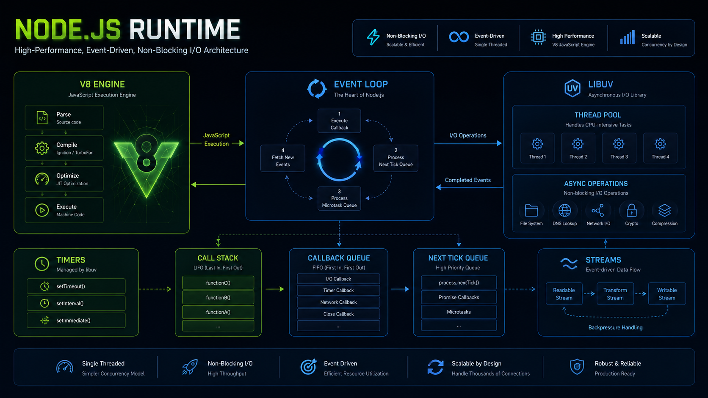
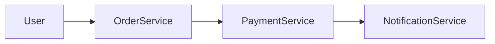
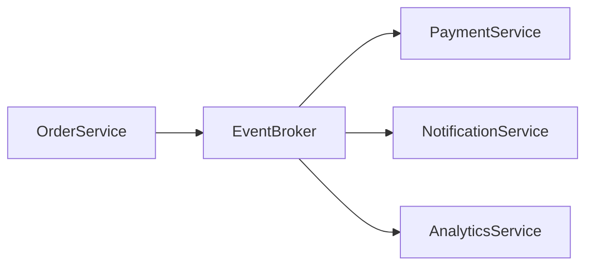
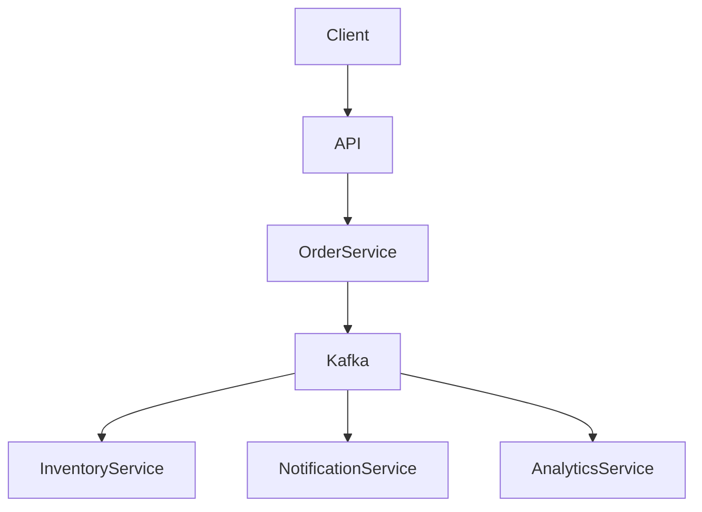
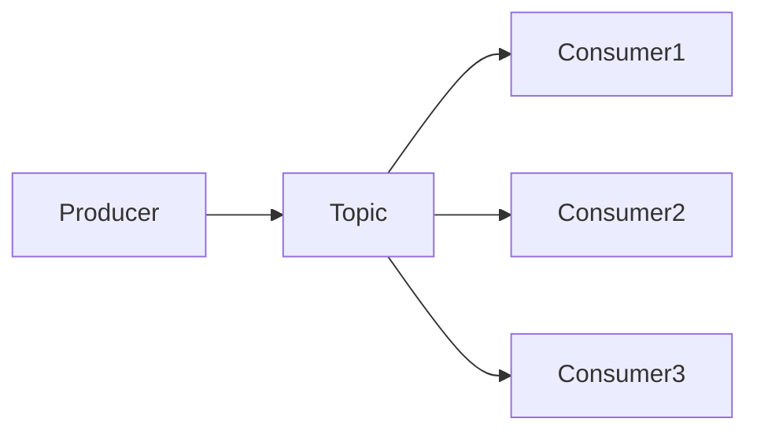
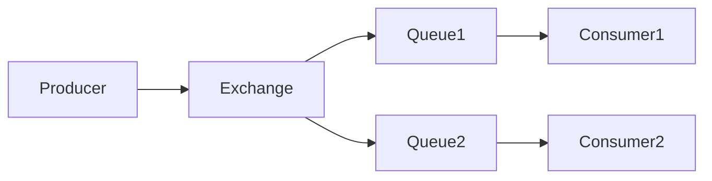
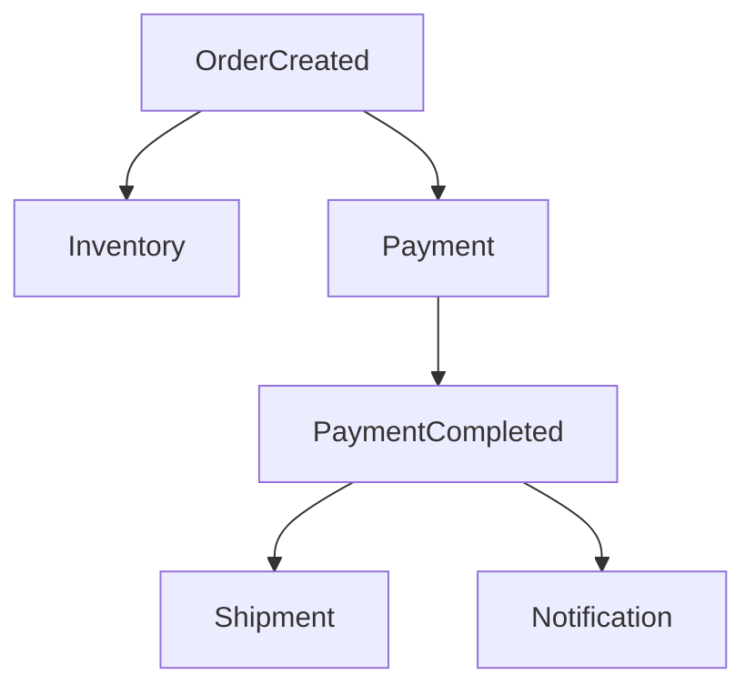
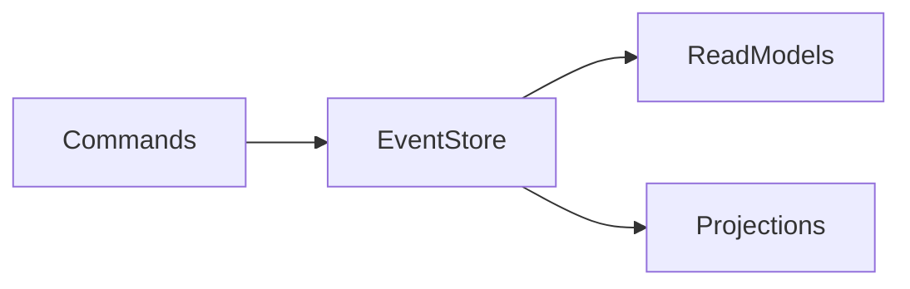
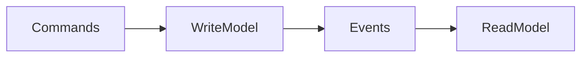

# Event-Driven Systems



## Overview

As software systems grow in scale and complexity, synchronous request-response communication often becomes a bottleneck.

Traditional architectures create direct dependencies between services, increasing coupling, reducing resilience, and limiting scalability.

Event-driven architecture (EDA) addresses these challenges by allowing systems to communicate through events rather than direct calls.

Instead of asking another service to immediately perform an action, a service publishes an event describing something that happened.

Other services react to that event independently.

This approach enables:

* Loose Coupling
* Scalability
* Resilience
* Extensibility
* Asynchronous Processing

Event-driven systems are widely used across modern technology platforms, including ecommerce systems, payment platforms, social networks, realtime applications, logistics systems, and financial services.

---

## Objectives

Event-driven architecture aims to:

* Reduce Service Coupling
* Improve Scalability
* Enable Asynchronous Workflows
* Increase Reliability
* Support Independent Service Evolution
* Improve System Flexibility

---

# What Is an Event?

An event represents a fact that occurred in the system.

Examples:

```text
UserRegistered

OrderCreated

PaymentCompleted

ContestJoined

MatchStarted

InventoryUpdated
```

Events describe past actions.

They should not represent commands.

---

## Good Event Naming

```text
OrderCreated

PaymentProcessed

InventoryReserved
```

Events communicate facts.

---

## Poor Event Naming

```text
CreateOrder

ReserveInventory

ProcessPayment
```

These represent commands rather than events.

---

# Event-Driven Architecture

## Traditional Request-Response



Characteristics:

* Tight Coupling
* Runtime Dependencies
* Failure Propagation

---

## Event-Driven Approach



Characteristics:

* Loose Coupling
* Independent Processing
* Better Scalability

---

# Core Components

---

## Event Producer

Produces events.

Examples:

* Order Service
* Payment Service
* User Service

Example:

```text
Order Service

Publishes

OrderCreated
```

---

## Event Broker

Responsible for transporting events.

Examples:

* Kafka
* RabbitMQ
* Redis Streams
* AWS EventBridge

Responsibilities:

* Delivery
* Routing
* Persistence
* Retry Handling

---

## Event Consumer

Consumes events and performs actions.

Examples:

* Notification Service
* Analytics Service
* Inventory Service

---

# High-Level Architecture




---

# Why Organizations Use Event-Driven Systems

---

## Scalability

Consumers scale independently.

Example:

```text
Order Service
3 Instances

Analytics Service
20 Instances
```

Each service scales according to workload.

---

## Loose Coupling

Services do not need direct awareness of every consumer.

Example:

```text
OrderCreated Event

Consumers:

Inventory

Notifications

Analytics

Fraud Detection
```

The producer remains unchanged.

---

## Reliability

Temporary consumer failures do not necessarily impact producers.

Benefits:

* Fault Isolation
* Retry Support
* Increased Resilience

---

## Extensibility

New consumers can be introduced without modifying producers.

Example:

```text
Existing Event

OrderCreated

New Consumer Added

Recommendation Engine
```

No producer changes required.

---

# Message Broker Comparison


Different technologies solve different problems.

---

# Kafka

## Characteristics

Kafka is a distributed event streaming platform designed for high throughput and durable event storage.

---

## Architecture



---

## Strengths

* High Throughput
* Durable Storage
* Event Replay
* Horizontal Scalability
* Large Data Volumes

---

## Common Use Cases

* Activity Streams
* Analytics Pipelines
* Realtime Platforms
* Financial Systems
* Event Sourcing

---

## Tradeoffs

* Operational Complexity
* Infrastructure Requirements
* Learning Curve

---

# RabbitMQ

## Characteristics

RabbitMQ focuses on reliable message delivery and flexible routing.

---

## Architecture



---

## Strengths

* Mature Ecosystem
* Reliable Delivery
* Flexible Routing
* Easier Adoption

---

## Common Use Cases

* Background Jobs
* Notifications
* Email Processing
* Task Distribution

---

## Tradeoffs

* Lower Throughput Than Kafka
* Not Optimized For Large Event Histories

---

# Redis Streams

## Characteristics

Redis Streams provide lightweight event streaming within Redis.

---

## Strengths

* Simplicity
* Fast Performance
* Existing Redis Ecosystem

---

## Common Use Cases

* Lightweight Event Processing
* Realtime Applications
* Internal Messaging

---

## Tradeoffs

* Less Feature Rich
* Smaller Ecosystem
* Limited Long-Term Event Storage

---

# Event Flow Example

## Ecommerce Workflow



This demonstrates a complete business workflow through events.

---

# Eventual Consistency

One of the most important concepts in event-driven systems.

---

## Traditional Transaction

```text
Order Created

Payment Completed

Inventory Reserved

Single Transaction
```

Strong consistency.

---

## Event-Driven Workflow

```text
Order Created

Event Published

Inventory Updated

Payment Processed

Notification Sent
```

Occurs asynchronously.

---

## Benefits

* Scalability
* Resilience

---

## Tradeoff

Temporary inconsistencies may occur.

Example:

```text
Order Exists

Inventory Update Pending
```

Systems must tolerate short periods of inconsistency.

---

# Event Sourcing

Event sourcing stores events as the source of truth.

Instead of storing current state:

```text
Balance = 1000
```

Store:

```text
Deposit 500

Withdraw 200

Deposit 700
```

Current state is reconstructed from events.

---

## Event Sourcing Architecture



---

## Advantages

* Complete Audit History
* Event Replay
* Temporal Analysis

---

## Challenges

* Increased Complexity
* Event Versioning
* Data Reconstruction

---

# CQRS

Command Query Responsibility Segregation (CQRS) often accompanies event sourcing.

---

## Traditional Model

```text
Read

Write

Same Database
```

---

## CQRS Model



Benefits:

* Independent Scaling
* Optimized Reads
* Optimized Writes

---

# Reliability Patterns

Event-driven systems must account for failures.

---

## Retry Mechanisms

Handle temporary failures.

Examples:

* Network Issues
* Database Timeouts

---

## Dead Letter Queues

Messages that repeatedly fail processing are isolated.


Benefits:

* Prevent Message Loss
* Easier Investigation

---

## Idempotency

Consumers must safely process duplicate events.

Example:

```text
PaymentCompleted
```

Processing multiple times should not charge customers repeatedly.

---

# Ordering Considerations

Some systems require ordered processing.

Example:

```text
Account Created

Account Verified

Account Activated
```

Incorrect order can create invalid state.

---

## Kafka Advantage

Kafka provides partition-level ordering guarantees.

---

# Observability


Distributed event systems require strong observability.

---

## Metrics

Monitor:

* Event Throughput
* Consumer Lag
* Queue Length
* Failure Rate

---

## Logging

Track:

* Event Processing
* Failures
* Retries

---

## Tracing

Understand:

* Event Flow
* Consumer Behavior
* Processing Delays

---

# Security Considerations

Event systems should secure:

* Producers
* Consumers
* Brokers

---

## Common Controls

* Authentication
* Authorization
* Encryption
* Network Isolation

---

# Common Architecture Mistakes

---

## Overusing Events

Not every workflow requires asynchronous processing.

---

## Poor Event Naming

Creates confusion and maintenance challenges.

---

## Missing Idempotency

Can cause duplicate actions.

---

## Ignoring Observability

Makes troubleshooting difficult.

---

## Large Event Payloads

Increase storage and transmission costs.

---

# Real-World Use Cases

---

## Ecommerce

Events:

```text
OrderCreated

PaymentCompleted

ShipmentCreated
```

---

## Fantasy Sports

Events:

```text
MatchStarted

PlayerScored

LeaderboardUpdated
```

---

## Opinion Trading

Events:

```text
MarketCreated

TradeExecuted

SettlementCompleted
```

---

## Social Networks

Events:

```text
PostCreated

CommentAdded

NotificationGenerated
```

---

# Engineering Tradeoffs

| Benefit             | Cost                            |
| ------------------- | ------------------------------- |
| Loose Coupling      | Increased Complexity            |
| Independent Scaling | Eventual Consistency            |
| Reliability         | Additional Infrastructure       |
| Extensibility       | More Observability Requirements |
| High Throughput     | Operational Overhead            |

---

# Architecture Evolution Path

```text
Synchronous APIs
       │
       ▼
Background Jobs
       │
       ▼
Message Queues
       │
       ▼
Event-Driven Architecture
       │
       ▼
Event Streaming Platform
```

Organizations often progress through these stages gradually.

---

# Interview Perspective

Strong system design discussions around event-driven systems typically cover:

* Producer/Consumer Design
* Message Brokers
* Eventual Consistency
* Idempotency
* Dead Letter Queues
* Event Ordering
* Observability
* Scalability Tradeoffs

The focus should remain on architectural reasoning rather than specific technologies.

---

# Engineering Outcome

Event-driven systems enable organizations to build scalable, resilient, and loosely coupled architectures capable of supporting complex business workflows.

However, these benefits come with additional operational and architectural complexity.

Successful event-driven platforms are built through careful event modeling, robust reliability mechanisms, strong observability practices, and a clear understanding of consistency tradeoffs.

When implemented thoughtfully, event-driven architecture becomes a powerful foundation for modern distributed systems.
