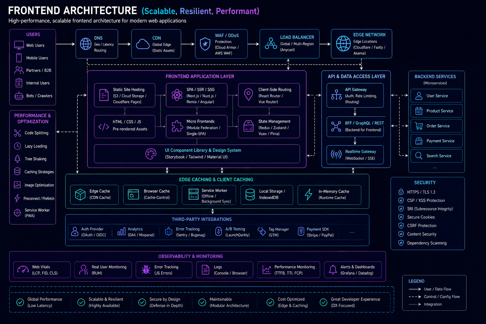
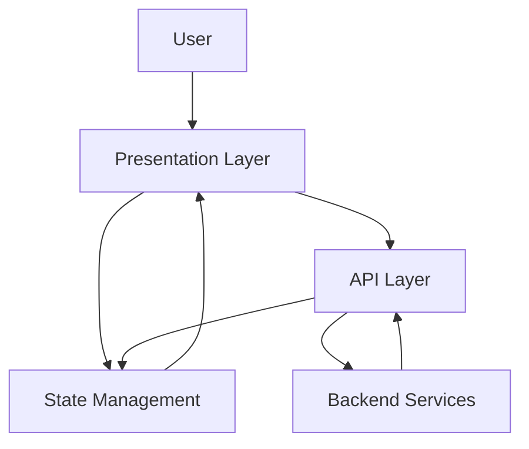
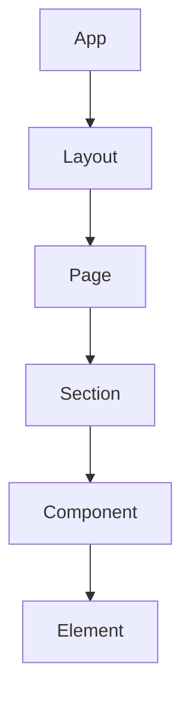
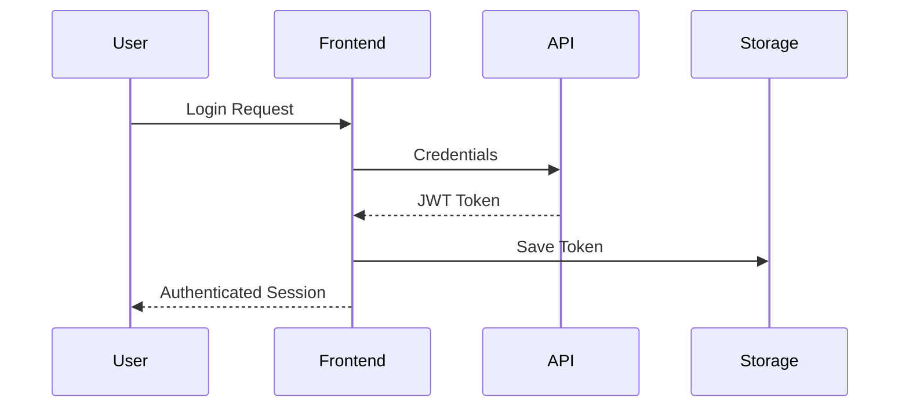

# Frontend Architecture



## Overview

Frontend architecture is responsible for transforming business capabilities into intuitive, performant, and maintainable user experiences.

As applications grow, frontend complexity often increases faster than expected due to:

* Expanding feature sets
* State management challenges
* API integrations
* Performance requirements
* Responsive design needs
* Team collaboration

A well-designed frontend architecture enables teams to deliver features rapidly while maintaining code quality, scalability, and user experience.

This document explores the architectural principles, design patterns, and engineering decisions commonly used in modern frontend applications.

---

## Objectives

A production-grade frontend architecture should achieve the following goals:

### User Experience Goals

* Fast loading experiences
* Responsive interfaces
* Accessible design
* Consistent behavior

### Engineering Goals

* Maintainability
* Scalability
* Reusability
* Testability
* Performance
* Developer Experience

---

## High-Level Frontend Architecture




---

# Architectural Layers

Modern frontend applications benefit from clear separation between concerns.

---

## Presentation Layer

### Responsibilities

* Rendering UI
* User Interaction
* Component Composition
* Visual State

Examples:

* Buttons
* Forms
* Cards
* Tables
* Navigation Components

### Characteristics

* Reusable
* Predictable
* Stateless whenever possible

The presentation layer should focus primarily on rendering.

---

## State Management Layer

### Responsibilities

* Application State
* Authentication State
* Cart State
* User Preferences
* Global UI State

Examples:

* Redux
* Zustand
* Context API

Benefits:

* Predictable Data Flow
* Reduced Prop Drilling
* Improved Maintainability

---

## API Layer

### Responsibilities

* HTTP Requests
* Response Transformation
* Error Handling
* Authentication Headers

Examples:

```text
services/
├── auth.service.ts
├── user.service.ts
├── product.service.ts
└── order.service.ts
```

Benefits:

* Centralized Communication
* Easier Maintenance
* Consistent Error Handling

---

## Routing Layer

### Responsibilities

* Navigation
* Protected Routes
* Dynamic Routes
* Layout Composition

Examples:

* Next.js Router
* React Router

---

# Component Architecture


Component architecture directly influences maintainability and scalability.

---

## Component Hierarchy



---

## Design Principles

### Reusability

Components should be designed for multiple use cases.

Example:

```text
Button
Card
Modal
Input
```

Rather than creating feature-specific versions for every screen.

---

### Single Responsibility

A component should have one primary purpose.

### Good Example

```text
ProductCard
```

Displays product information.

### Bad Example

```text
ProductCard
 ├── Product Rendering
 ├── Cart Logic
 ├── Checkout Logic
 ├── API Calls
 └── Analytics
```

---

### Composition Over Inheritance

Preferred approach:

```text
Page
 ├── Header
 ├── Sidebar
 ├── Content
 └── Footer
```

Benefits:

* Flexibility
* Reusability
* Easier Maintenance

---

# Folder Structure Strategy

A scalable frontend architecture requires predictable organization.

Example:

```text
src/
│
├── components/
├── pages/
├── views/
├── services/
├── stores/
├── hooks/
├── utils/
├── styles/
└── assets/
```

Benefits:

* Easier Navigation
* Team Scalability
* Consistent Structure

---

# State Management Architecture

State complexity increases as applications grow.

---

## Local State

Suitable for:

* Form Inputs
* Modal Visibility
* UI Interactions

Example:

```text
useState()
```

---

## Shared State

Suitable for:

* Authentication
* Theme Settings
* User Preferences

Example:

```text
Context API
```

---

## Global State

Suitable for:

* Shopping Cart
* User Sessions
* Realtime Data
* Application-Wide Data

Examples:

* Redux
* Zustand

---

## State Flow


Benefits:

* Predictable Updates
* Centralized Logic
* Easier Debugging

---

# Frontend Performance Architecture

Performance directly impacts user engagement and conversion rates.

---

## Code Splitting

Goal:

Load only necessary code.

Examples:

* Dynamic Imports
* Route-Based Splitting

Benefits:

* Smaller Initial Bundle
* Faster Loading

---

## Lazy Loading

Suitable for:

* Images
* Components
* Feature Modules

Benefits:

* Reduced Initial Load
* Improved Performance

---

## Caching Strategies

Examples:

* Browser Cache
* CDN Cache
* API Cache

Benefits:

* Reduced Network Requests
* Faster User Experience

---

## Rendering Optimization

Common techniques:

* Memoization
* Virtualization
* Efficient Re-Renders

Tools:

* React.memo
* useMemo
* useCallback

---

# Next.js Architecture Considerations


For modern React applications, Next.js provides architectural advantages.

---

## Server-Side Rendering (SSR)

Benefits:

* SEO
* Faster First Paint
* Better Social Sharing

---

## Static Site Generation (SSG)

Benefits:

* Maximum Performance
* CDN Distribution
* Reduced Server Load

---

## Incremental Static Regeneration (ISR)

Benefits:

* Dynamic Content
* Static Performance
* Controlled Updates

---

## API Routes

Suitable for:

* Lightweight Services
* Authentication Proxies
* Utility Endpoints

---

# Authentication Architecture


Authentication impacts nearly every frontend application.

---

## Typical Flow



---

## Common Storage Options

### HttpOnly Cookies

Advantages:

* Better Security
* Reduced XSS Risk

---

### Local Storage

Advantages:

* Simplicity

Tradeoff:

* Increased Security Risk

---

# Error Handling Architecture

Errors should be managed consistently.

---

## Categories

### Validation Errors

User Input Issues

### API Errors

Server Communication Failures

### Network Errors

Connectivity Problems

### Unexpected Errors

Application Failures

---

## Error Strategy

Goals:

* Helpful Feedback
* Graceful Recovery
* Minimal User Friction

---

# Responsive Architecture

Modern applications must support multiple device types.

---

## Breakpoint Strategy

Examples:

```text
Mobile
Tablet
Desktop
Large Desktop
```

---

## Mobile-First Approach

Benefits:

* Better Accessibility
* Improved Performance
* Simplified Scaling

---

# Frontend Security Considerations


Frontend security complements backend security.

---

## Key Concerns

### XSS Protection

Prevent script injection.

---

### CSRF Protection

Prevent unauthorized requests.

---

### Secure Authentication

Protect tokens and session data.

---

### Input Sanitization

Validate and sanitize user-generated content.

---

# Observability

Frontend systems also require visibility.

---

## Monitoring

Metrics:

* Page Load Time
* API Latency
* Error Rates
* User Interactions

---

## Logging

Examples:

* Client Errors
* Network Failures
* UI Exceptions

---

## Analytics

Examples:

* User Journeys
* Feature Usage
* Conversion Funnels

---

# Engineering Tradeoffs

| Decision         | Benefit                | Cost                      |
| ---------------- | ---------------------- | ------------------------- |
| Global State     | Centralized Management | Increased Complexity      |
| SSR              | Better SEO             | Higher Server Cost        |
| SSG              | Fast Performance       | Limited Real-Time Updates |
| Component Reuse  | Faster Development     | Initial Design Effort     |
| Client Rendering | Simpler Deployment     | SEO Limitations           |

---

# Common Frontend Architecture Mistakes

### Excessive Global State

Creates unnecessary complexity.

---

### Business Logic Inside Components

Reduces maintainability.

---

### Inconsistent Folder Structures

Makes onboarding difficult.

---

### Overusing Context

Can lead to performance issues.

---

### Ignoring Performance

Results in poor user experience.

---

# Frontend Evolution Path

```text
Simple Components
        │
        ▼
Reusable Components
        │
        ▼
Design System
        │
        ▼
Modular Frontend
        │
        ▼
Scalable Enterprise Frontend
```

As applications grow, architecture becomes increasingly important.

---

# Engineering Outcome

Frontend architecture is not primarily about frameworks or libraries.

It is about building applications that:

* Scale with product growth
* Remain maintainable
* Deliver excellent user experiences
* Support engineering productivity
* Operate efficiently in production

The strongest frontend architectures balance user experience, performance, maintainability, and engineering velocity while minimizing unnecessary complexity.
