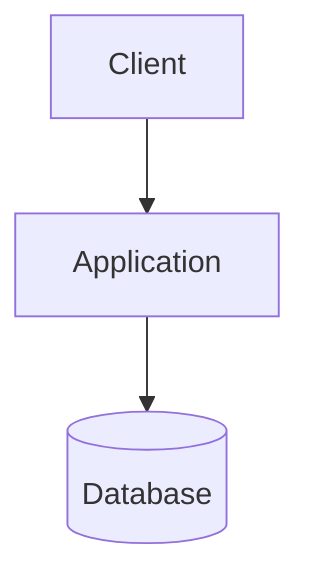
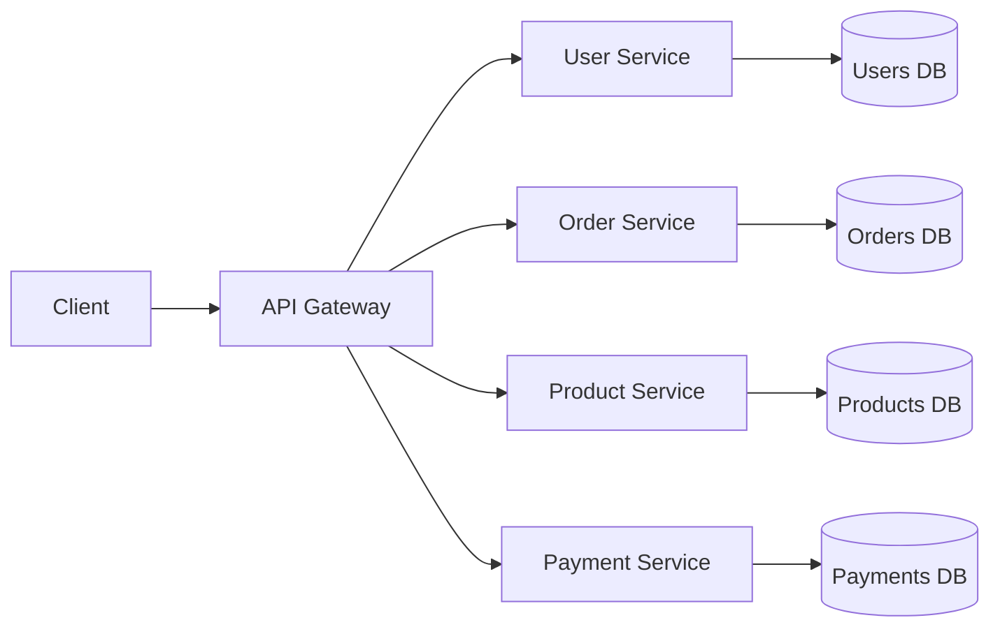
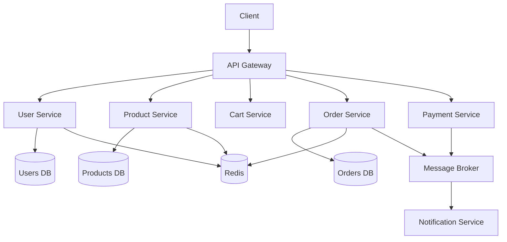
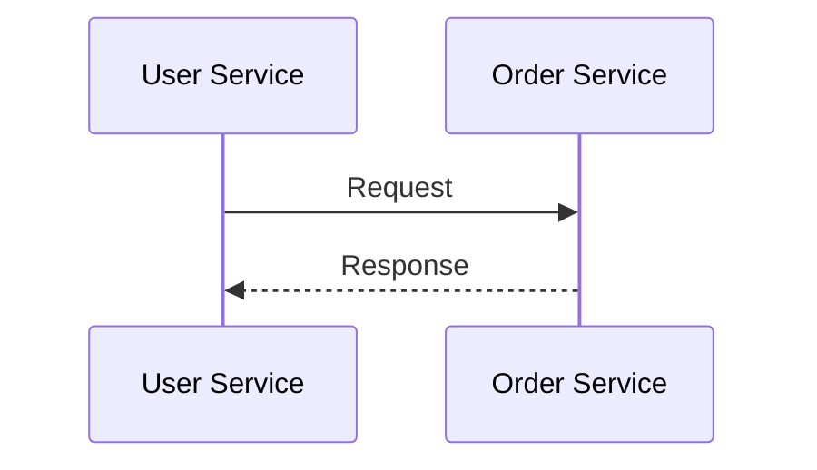
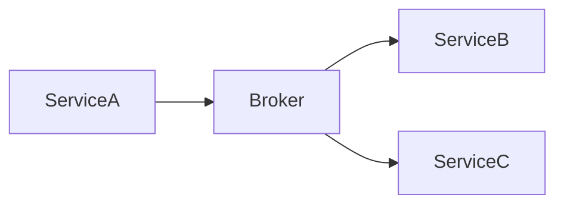
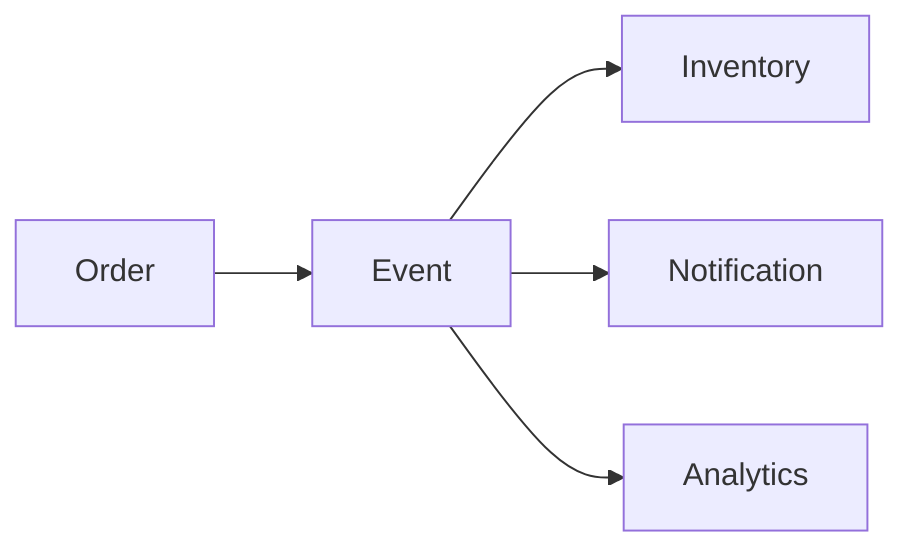
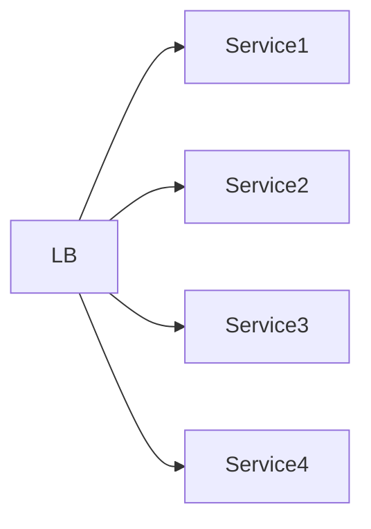

# Microservices Architecture


## Overview

Microservices architecture is an architectural approach where a system is decomposed into multiple independently deployable services that collaborate to deliver business capabilities.

Unlike monolithic applications, where all functionality resides within a single deployment unit, microservices separate domains into isolated services with clear ownership boundaries.

While microservices can provide significant scalability and organizational benefits, they also introduce operational complexity that must be justified by business requirements.

This document explores the principles, architecture patterns, tradeoffs, and production considerations involved in designing and operating microservices-based systems.

---

## Objectives

Microservices architecture is typically adopted to achieve:

### Technical Goals

* Independent Deployments
* Service Isolation
* Horizontal Scalability
* Technology Flexibility
* Fault Containment

### Organizational Goals

* Team Autonomy
* Faster Delivery Cycles
* Clear Ownership
* Reduced Coordination Overhead

---

## Monolith vs Microservices

A monolithic architecture packages all functionality into a single deployable application.



A microservices architecture distributes functionality across multiple services.



---

## Why Organizations Adopt Microservices

As systems grow, several challenges emerge within monolithic architectures.

### Increasing Codebase Size

Large codebases become:

* Difficult to Understand
* Difficult to Deploy
* Difficult to Maintain

---

### Team Scaling Challenges

Multiple teams working in a single application often experience:

* Merge Conflicts
* Release Coordination Issues
* Ownership Ambiguity

---

### Independent Scaling Requirements

Different business domains often have different scaling characteristics.

Example:

```text
Authentication Service
  5,000 requests/minute

Live Score Service
  500,000 requests/minute
```

Microservices allow scaling only the services that require additional capacity.

---

## Domain-Driven Service Boundaries

One of the most important decisions in microservices architecture is defining service boundaries.

Services should be aligned with business domains rather than technical layers.

### Good Example

```text
User Service
Order Service
Product Service
Payment Service
Notification Service
```

Each service owns:

* Business Logic
* Data
* APIs

---

### Poor Example

```text
Controller Service
Database Service
Validation Service
Utility Service
```

These boundaries create excessive coupling and operational complexity.

---

## High-Level Microservices Architecture




---

# API Gateway Pattern

An API Gateway serves as the entry point for clients.

### Responsibilities

* Authentication
* Authorization
* Request Routing
* Rate Limiting
* Aggregation
* Logging

---

## Benefits

### Simplified Client Integration

Clients communicate with a single endpoint.

### Security Enforcement

Centralized authentication and authorization.

### Traffic Control

Rate limiting and request management.

---

## Tradeoffs

Potential concerns:

* Additional Latency
* Single Point of Failure (if not highly available)
* Operational Complexity

---

# Service Communication

Microservices communicate through two primary approaches.

---

## Synchronous Communication

Examples:

* REST APIs
* gRPC



### Advantages

* Simpler Understanding
* Immediate Results

### Challenges

* Tight Runtime Dependencies
* Cascading Failures
* Latency Accumulation

---

## Asynchronous Communication

Examples:

* Kafka
* RabbitMQ
* Redis Streams



### Advantages

* Decoupling
* Resilience
* Scalability

### Challenges

* Eventual Consistency
* Increased Complexity
* Event Tracking

---

# Database Architecture

A foundational microservices principle:

> Each service owns its own data.

---

## Database per Service Pattern

```mermaid
flowchart LR

    User Service --> UsersDB

    Order Service --> OrdersDB

    Product Service --> ProductsDB
```

Benefits:

* Service Independence
* Independent Scaling
* Better Ownership

---

## Anti-Pattern

Shared Database:

```text
User Service
Order Service
Product Service
      │
      ▼
Shared Database
```

Problems:

* Tight Coupling
* Deployment Risk
* Ownership Confusion

---

# Event-Driven Architecture


Microservices often leverage events to reduce direct dependencies.

---

## Example Workflow

Order Created:

```text
Order Service
    │
    ▼
OrderCreated Event
    │
    ├── Inventory Service
    ├── Notification Service
    └── Analytics Service
```

Benefits:

* Loose Coupling
* Scalability
* Extensibility

---

## Event Flow Example



---

# Scalability Considerations


Microservices support independent scaling.

---

## Example

```text
Authentication Service
2 Instances

Order Service
5 Instances

Live Score Service
50 Instances
```

Resources are allocated according to demand.

---

## Horizontal Scaling



Benefits:

* Increased Capacity
* High Availability
* Fault Isolation

---

# Reliability Patterns

Distributed systems must assume failures.

---

## Circuit Breakers

Prevent cascading failures when dependencies become unavailable.

Example:

```text
Payment Service Down

Order Service
     │
     ▼
Circuit Open

Fallback Activated
```

---

## Retry Policies

Suitable for:

* Temporary Network Issues
* Transient Failures

Avoid:

* Infinite Retries
* Aggressive Retry Storms

---

## Graceful Degradation

Non-critical functionality can be temporarily disabled.

Examples:

* Recommendations
* Notifications
* Analytics

Core business operations continue functioning.

---

# Service Discovery

As services scale dynamically, locations change.

Service discovery enables services to locate one another automatically.

Examples:

* Kubernetes DNS
* Consul
* Eureka

---

# Observability


Observability becomes increasingly important in distributed systems.

---

## Metrics

Examples:

* Request Rates
* Error Rates
* Service Availability
* Queue Depth

---

## Centralized Logging

Logs from all services are aggregated into a centralized platform.

Benefits:

* Easier Troubleshooting
* Faster Incident Response

---

## Distributed Tracing

Tracing reveals:

* Service Dependencies
* Latency Bottlenecks
* Request Paths

---

## Example Trace

```text
API Gateway
      │
      ▼
User Service
      │
      ▼
Order Service
      │
      ▼
Payment Service
```

---

# Security Considerations


Microservices increase the attack surface of a system.

---

## Authentication

Options:

* JWT
* OAuth2
* OpenID Connect

---

## Service-to-Service Security

Approaches:

* mTLS
* Signed Tokens
* Private Networks

---

## Secrets Management

Examples:

* AWS Secrets Manager
* Vault
* Kubernetes Secrets

---

# Deployment Architecture


Microservices require mature deployment practices.

---

## CI/CD Requirements

Each service should support:

* Independent Builds
* Independent Testing
* Independent Deployment

---

## Containerization

Docker is commonly used for:

* Packaging
* Environment Consistency
* Deployment Standardization

---

## Orchestration

Platforms:

* Kubernetes
* ECS
* Nomad

Benefits:

* Scaling
* Self-Healing
* Scheduling

---

# Common Microservices Mistakes

### Premature Adoption

Microservices are not required for every application.

---

### Incorrect Service Boundaries

Poor boundaries create excessive communication overhead.

---

### Shared Databases

Violates service independence.

---

### Excessive Synchronous Dependencies

Creates cascading failures.

---

### Insufficient Observability

Makes troubleshooting difficult.

---

### Ignoring Operational Complexity

Microservices increase:

* Monitoring Requirements
* Deployment Complexity
* Infrastructure Costs

---

# Engineering Tradeoffs

| Benefit                 | Cost                       |
| ----------------------- | -------------------------- |
| Independent Scaling     | Operational Complexity     |
| Team Autonomy           | Distributed Coordination   |
| Fault Isolation         | More Infrastructure        |
| Independent Deployments | Additional Tooling         |
| Technology Flexibility  | Standardization Challenges |

---

# When Microservices Make Sense

Microservices are often justified when:

* Large Engineering Teams Exist
* Independent Deployments Are Critical
* Domains Are Well Defined
* Traffic Patterns Differ Significantly
* Organizational Scale Supports Additional Complexity

---

# When a Monolith Is Better

A modular monolith is often preferable when:

* Team Size Is Small
* Product Is Early Stage
* Requirements Are Unclear
* Operational Capacity Is Limited

Many successful systems remain monolithic for years before requiring service decomposition.

---

# Evolution Path

```text
Simple Monolith
        │
        ▼
Modular Monolith
        │
        ▼
Service-Oriented Architecture
        │
        ▼
Microservices Platform
        │
        ▼
Event-Driven Ecosystem
```

The goal is not reaching the final stage as quickly as possible.

The goal is evolving architecture in alignment with business growth.

---

# Engineering Outcome

Microservices architecture is a powerful tool for managing scale, organizational complexity, and service independence.

However, it is not a default solution.

Successful microservices platforms emerge from thoughtful domain boundaries, strong operational maturity, robust observability, disciplined deployment practices, and a clear understanding of the tradeoffs involved.

The most effective architecture is not the most complex architecture—it is the architecture that solves business problems while remaining maintainable, scalable, and reliable over time.
