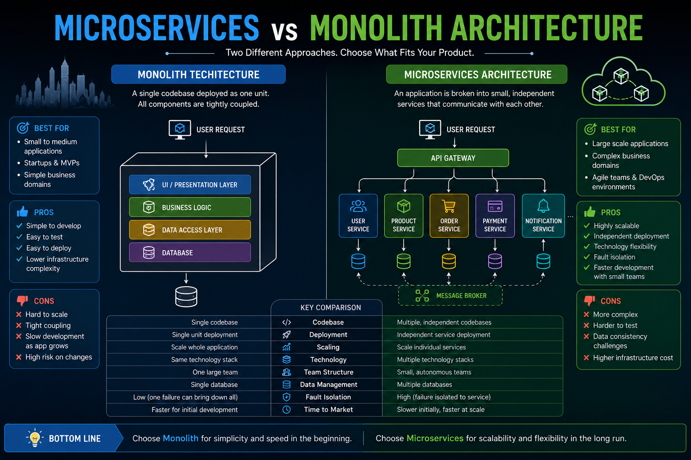
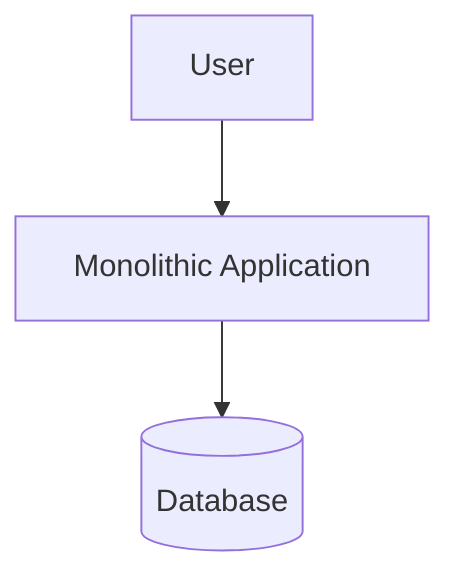
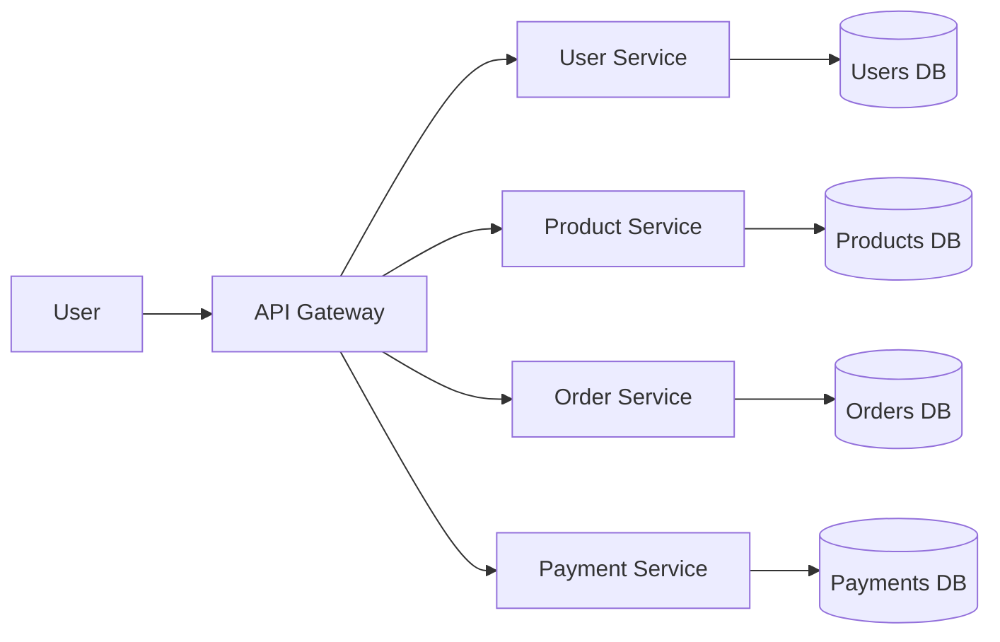
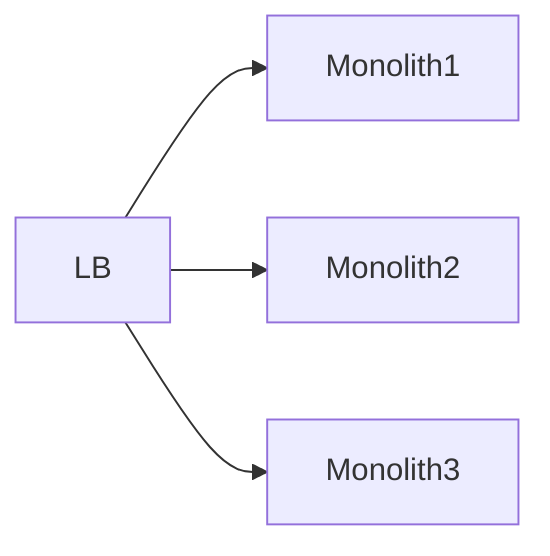
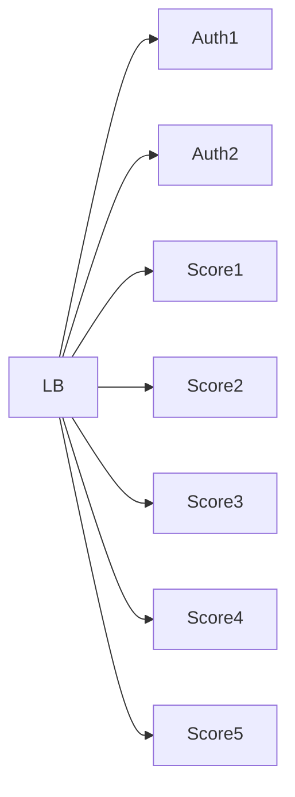
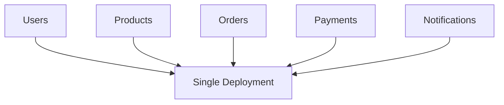

# Monolith vs Microservices



## Overview

One of the most common architectural discussions in modern software engineering is whether to build a system as a **monolith** or adopt a **microservices architecture**.

The industry often portrays microservices as the ultimate architectural destination. In reality, both approaches are valid, and the best choice depends on business requirements, team structure, operational maturity, and scalability needs.

This document examines the architectural tradeoffs, engineering considerations, and real-world decision-making process involved in choosing between monolithic and microservices architectures.

---

## Objectives

This document aims to:

* Compare architectural approaches
* Explain advantages and disadvantages
* Discuss operational considerations
* Explore scalability implications
* Analyze engineering tradeoffs
* Provide practical decision frameworks

---

# What Is a Monolith?

A monolithic application packages all functionality into a single deployable unit.

Typical characteristics:

* Single codebase
* Single deployment artifact
* Shared database
* Centralized business logic

---

## Monolith Architecture




---

## Typical Monolith Structure

```text
application/
│
├── users/
├── products/
├── orders/
├── payments/
├── notifications/
│
└── database/
```

All modules reside within the same application boundary.

---

# What Are Microservices?

Microservices divide functionality into independently deployable services.

Each service owns:

* Business Logic
* APIs
* Data
* Deployment Lifecycle

---

## Microservices Architecture




---

# The Most Important Reality

A common misconception:

> Microservices are always better.

This is incorrect.

Many successful platforms started as monoliths and remained monolithic for years before introducing service decomposition.

Examples across the industry demonstrate that architectural evolution should follow business growth rather than technology trends.

---

# Monolith Advantages

---

## Simpler Development

Everything exists within one application.

Benefits:

* Easier Navigation
* Simpler Debugging
* Faster Onboarding
* Reduced Coordination

---

## Simpler Deployment

Deployment typically involves:

```text
Build
  │
Deploy
  │
Run
```

Benefits:

* Lower Operational Overhead
* Easier Release Management

---

## Easier Testing

Integration testing is generally simpler because all modules exist within a single runtime.

Benefits:

* Faster Development Cycles
* Simpler Debugging

---

## Lower Infrastructure Cost

A monolith generally requires:

* Fewer Servers
* Less Monitoring
* Less Networking Complexity

---

## Faster Early Development

For startups and early-stage products:

Monoliths often maximize development speed.

---

# Monolith Challenges

---

## Growing Codebase

As systems evolve:

```text
Users
Products
Orders
Payments
Notifications
Reports
Analytics
Admin
```

The application becomes increasingly complex.

---

## Deployment Risk

A small change may require deploying the entire application.

Example:

```text
Notification Change

Requires

Full Application Deployment
```

---

## Scaling Limitations

All modules scale together.

Example:

```text
Live Scores
High Traffic

Admin Panel
Low Traffic
```

Both consume resources equally.

---

## Team Coordination

As engineering teams grow:

* Merge Conflicts Increase
* Release Coordination Becomes Harder
* Ownership Becomes Less Clear

---

# Microservices Advantages

---

## Independent Deployments

Each service can be deployed independently.

Example:

```text
Payment Service
Deployment

No Impact

User Service
```

Benefits:

* Faster Releases
* Reduced Deployment Risk

---

## Independent Scaling

Different services can scale according to demand.

Example:

```text
Authentication
2 Instances

Live Scores
50 Instances
```

Benefits:

* Cost Efficiency
* Better Resource Utilization

---

## Team Autonomy

Teams can own specific services.

Example:

```text
Team A
User Service

Team B
Payments

Team C
Orders
```

Benefits:

* Reduced Coordination
* Clear Ownership

---

## Fault Isolation

Failures are more contained.

Example:

```text
Notification Service Down

Order Service Still Operational
```

---

## Technology Flexibility

Different services may use different technologies if justified.

Example:

```text
Payments → Node.js

Analytics → Python

Realtime Engine → Go
```

This flexibility should be used carefully.

---

# Microservices Challenges

---

## Operational Complexity

Microservices require significantly more infrastructure.

Examples:

* Service Discovery
* Monitoring
* Logging
* Tracing
* Networking

---

## Distributed System Problems

Once services communicate across networks:

New challenges appear:

* Latency
* Retries
* Timeouts
* Partial Failures

---

## Data Consistency

A monolith often relies on database transactions.

Microservices frequently require:

* Eventual Consistency
* Distributed Workflows
* Compensation Strategies

---

## Increased Deployment Complexity

Instead of:

```text
1 Application
```

You may have:

```text
20 Services
```

Each requiring:

* Builds
* Deployments
* Monitoring

---

## Higher Cost

Microservices usually require:

* More Infrastructure
* More Tooling
* More Operational Expertise

---

# Scalability Comparison


---

## Monolith Scaling



Possible but coarse-grained.

Everything scales together.

---

## Microservices Scaling



More efficient.

Only hot services scale.

---

# Reliability Comparison

---

## Monolith Reliability

Advantages:

* Fewer Network Dependencies
* Simpler Failure Modes

Challenges:

* Larger Blast Radius

---

## Microservices Reliability

Advantages:

* Better Fault Isolation

Challenges:

* More Failure Points
* Network Reliability Concerns

---

# Team Size Considerations

---

## Small Team

Example:

```text
2–8 Engineers
```

Typically benefits from:

✅ Monolith

Reason:

* Simplicity
* Speed
* Lower Cost

---

## Medium Team

Example:

```text
10–30 Engineers
```

Often benefits from:

✅ Modular Monolith

Reason:

* Controlled Complexity
* Future Evolution Path

---

## Large Organization

Example:

```text
50+ Engineers
```

Often benefits from:

✅ Microservices

Reason:

* Team Independence
* Ownership Boundaries
* Scaling Flexibility

---

# The Modular Monolith

An often overlooked middle ground.

---

## Architecture



Benefits:

* Monolith Simplicity
* Strong Boundaries
* Easier Future Extraction

Many modern systems should start here.

---

# Decision Framework

When evaluating architecture choices, consider:

---

## Team Size

How many engineers will work on the system?

---

## Product Stage

Startup?

Growth Stage?

Enterprise?

---

## Scalability Requirements

Current traffic?

Expected growth?

---

## Operational Maturity

Can the organization support:

* Monitoring
* Tracing
* Service Discovery
* CI/CD Pipelines

---

## Domain Complexity

Are domains naturally separable?

Examples:

* Users
* Payments
* Orders
* Inventory

---

# Practical Recommendations

---

## Choose Monolith When

* Product Is New
* Team Is Small
* Requirements Are Unclear
* Speed Is Critical

---

## Choose Modular Monolith When

* Growth Is Expected
* Domain Boundaries Exist
* Team Is Expanding

---

## Choose Microservices When

* Independent Deployments Are Essential
* Teams Require Autonomy
* Scaling Patterns Differ Significantly
* Operational Maturity Exists

---

# Architecture Evolution Path

```text
Startup
    │
    ▼
Simple Monolith
    │
    ▼
Modular Monolith
    │
    ▼
Service-Oriented Architecture
    │
    ▼
Microservices
```

The goal is not skipping stages.

The goal is evolving architecture at the correct time.

---

# Interview Perspective

A common system design interview mistake:

> "I would immediately use microservices."

A stronger answer is:

> "I would begin with a modular monolith and evolve toward microservices when scaling, deployment, or organizational requirements justify the additional complexity."

This demonstrates architectural maturity and understanding of tradeoffs.

---

# Engineering Tradeoff Summary

| Category               | Monolith    | Microservices |
| ---------------------- | ----------- | ------------- |
| Development Speed      | High        | Medium        |
| Operational Complexity | Low         | High          |
| Deployment Simplicity  | High        | Low           |
| Team Scalability       | Medium      | High          |
| Infrastructure Cost    | Low         | High          |
| Independent Scaling    | Limited     | Excellent     |
| Fault Isolation        | Limited     | Strong        |
| Observability Needs    | Moderate    | Extensive     |
| Organizational Fit     | Small Teams | Large Teams   |

---

# Engineering Outcome

There is no universally correct answer in the monolith versus microservices discussion.

The best architecture is the one that aligns with:

* Business Requirements
* Team Structure
* Operational Capability
* Scalability Needs
* Long-Term Product Strategy

Successful engineers avoid choosing architectures based on trends.

Instead, they select architectures based on the tradeoffs they are willing and able to manage.

That mindset ultimately leads to systems that are simpler, more maintainable, and more successful over time.
