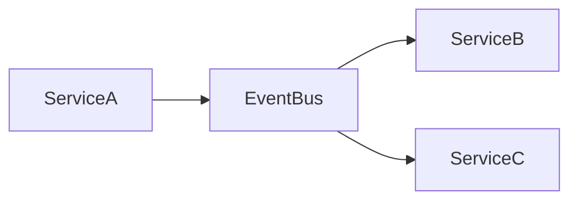
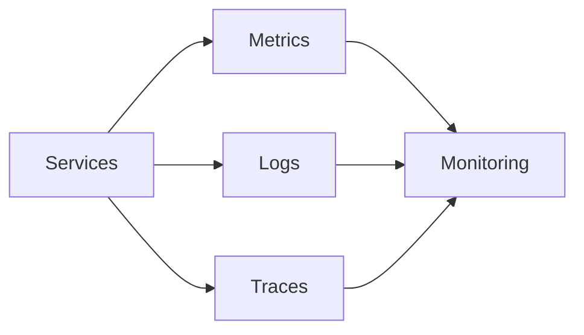

# System Design Principles


## Overview

System design is the discipline of creating software systems that can effectively solve business problems while remaining scalable, reliable, maintainable, secure, and operationally efficient.

A common misconception is that system design is primarily about selecting technologies.

In reality, system design is the process of making informed engineering decisions while balancing tradeoffs across:

* Scalability
* Reliability
* Performance
* Security
* Cost
* Maintainability
* Operational Complexity

The strongest system designs are not necessarily the most sophisticated. They are the systems that deliver business value while remaining understandable and sustainable over time.

This document outlines the core principles that guide effective system design across organizations, industries, and technology stacks.

---

## Objectives

A well-designed system should:

* Solve Business Problems
* Scale Predictably
* Operate Reliably
* Remain Maintainable
* Protect Data
* Support Growth
* Minimize Operational Risk

---

# Principle 1: Understand Requirements First

Before discussing architecture, technologies, databases, or infrastructure, requirements must be understood.

---

## Functional Requirements

Define what the system must do.

Examples:

```text
User Registration

Product Search

Order Placement

Payment Processing

Realtime Score Updates
```

---

## Non-Functional Requirements

Define how the system should behave.

Examples:

```text
99.99% Availability

200ms Response Time

10 Million Users

100,000 Requests/Second
```

---

## Common Mistake

Starting architecture discussions before clarifying requirements.

A correct design begins with understanding the problem.

---

# Principle 2: Design for Simplicity

Simplicity is often undervalued.

Complexity creates:

* More Bugs
* More Failures
* Higher Costs
* Slower Development

---

## Engineering Guideline

Prefer:

```text
Simple Solution
```

Before:

```text
Distributed Platform
```

A simple architecture that satisfies requirements is usually preferable to a complex architecture that solves hypothetical future problems.

---

# Principle 3: Separation of Concerns

Systems should separate responsibilities into logical boundaries.

---

## Example


Benefits:

* Maintainability
* Scalability
* Testability

---

## Anti-Pattern

Mixing:

* UI Logic
* Business Logic
* Database Logic

Inside the same component.

---

# Principle 4: Design for Scalability

Growth is inevitable for successful systems.

The question is not:

> Will traffic increase?

The question is:

> How will the system respond when it does?

---

## Common Scaling Dimensions

### Users

```text
1,000 → 1,000,000
```

### Requests

```text
100 RPS → 100,000 RPS
```

### Data Volume

```text
10 GB → 100 TB
```

---

## Scalability Strategies

* Horizontal Scaling
* Load Balancing
* Caching
* Queue Processing
* Database Partitioning

---

# Principle 5: Reliability Is Mandatory

Failures will occur.

System design should assume failure rather than ignore it.

---

## Potential Failures

* Server Failures
* Database Outages
* Cache Failures
* Network Issues
* Third-Party Downtime

---

## Reliability Techniques

* Retries
* Circuit Breakers
* Redundancy
* Failover
* Graceful Degradation

---

## Reliability Mindset

The question is not:

> Can this fail?

The question is:

> What happens when it fails?

---

# Principle 6: Minimize Coupling

Coupling measures how dependent components are on each other.

---

## Tight Coupling

```text
Service A
   │
   ▼
Service B
   │
   ▼
Service C
```

Problems:

* Failure Propagation
* Deployment Constraints
* Reduced Flexibility

---

## Loose Coupling



Benefits:

* Flexibility
* Scalability
* Independent Evolution

---

# Principle 7: Maximize Cohesion

Components should contain closely related responsibilities.

---

## High Cohesion

```text
Order Service

- Create Orders
- Update Orders
- Cancel Orders
```

---

## Low Cohesion

```text
Order Service

- Orders
- Authentication
- Analytics
- Notifications
```

Poor cohesion increases complexity.

---

# Principle 8: Design for Maintainability

Most system costs occur after deployment.

Maintainability often matters more than initial development speed.

---

## Characteristics

* Clear Boundaries
* Consistent Structure
* Documentation
* Testability
* Observability

---

## Goal

Enable future engineers to understand and evolve the system efficiently.

---

# Principle 9: Optimize Based on Data

Performance decisions should be driven by measurement.

---

## Measure First

Monitor:

* Latency
* Throughput
* Error Rates
* Resource Utilization

---

## Avoid

Premature Optimization

Example:

```text
Optimizing Code

Before

Identifying Bottlenecks
```

---

# Principle 10: Build Observability Into the Design

You cannot operate what you cannot observe.

---

## Three Pillars

### Metrics

Measure behavior.

Examples:

* Requests
* Latency
* Errors

---

### Logs

Provide context.

Examples:

* Exceptions
* User Actions
* System Events

---

### Traces

Track request flow.

Examples:

* Service Dependencies
* Latency Analysis

---

## Observability Architecture




---

# Principle 11: Security by Design

Security should be integrated from the beginning.

---

## Security Areas

* Authentication
* Authorization
* Encryption
* Secret Management
* Audit Logging

---

## Common Mistake

Treating security as a final deployment checklist item.

---

# Principle 12: Design for Failure Recovery

Failures are unavoidable.

Recovery capability is critical.

---

## Recovery Mechanisms

* Backups
* Replication
* Disaster Recovery
* Retry Policies
* Data Restoration

---

## Engineering Question

How quickly can the system recover?

---

# Principle 13: Understand Tradeoffs

Every design decision has consequences.

---

## Example

| Decision         | Benefit             | Cost                   |
| ---------------- | ------------------- | ---------------------- |
| Caching          | Faster Responses    | Cache Invalidation     |
| Microservices    | Independent Scaling | Complexity             |
| Replication      | Availability        | Consistency Challenges |
| Async Processing | Scalability         | Eventual Consistency   |

---

## Engineering Reality

There are no perfect solutions.

Only tradeoffs.

---

# Principle 14: Cost Awareness

System design is also a business discipline.

---

## Resources Have Costs

Examples:

* Servers
* Databases
* Storage
* Networking
* Monitoring

---

## Goal

Balance:

```text
Performance

Reliability

Cost
```

Not simply maximize one dimension.

---

# Principle 15: Evolve Architecture Gradually

Architecture should evolve alongside business growth.

---

## Common Evolution Path

```text
Simple Application
        │
        ▼
Monolith
        │
        ▼
Modular Monolith
        │
        ▼
Service-Oriented Architecture
        │
        ▼
Microservices Platform
```

---

## Mistake

Building for massive scale before product-market fit.

---

# System Design Thinking Framework

When evaluating any architecture, ask:

---

## Business

What problem are we solving?

---

## Scale

How large can this become?

---

## Reliability

How does it fail?

---

## Security

How is access controlled?

---

## Operations

How is it monitored?

---

## Cost

Is the solution economically sustainable?

---

## Maintainability

Can future engineers understand it?

---

# Example Design Evaluation

Consider an ecommerce platform.

---

## Functional Requirements

* Browse Products
* Add To Cart
* Place Orders
* Track Orders

---

## Non-Functional Requirements

* 100,000 Daily Users
* 99.9% Availability
* Fast Checkout

---

## Architectural Decisions

### Caching

Improves:

* Product Retrieval

Tradeoff:

* Cache Invalidation

---

### Queue Processing

Improves:

* Email Processing

Tradeoff:

* Increased Complexity

---

### Read Replicas

Improves:

* Database Scalability

Tradeoff:

* Replication Lag

---

# System Design Interview Perspective

Strong candidates focus on:

* Requirements Gathering
* Bottleneck Identification
* Tradeoff Analysis
* Scalability Planning
* Reliability Strategies

Weak candidates focus exclusively on technologies.

---

## Strong Answer

> "I would begin by understanding requirements, estimating scale, identifying bottlenecks, and evaluating tradeoffs before selecting technologies."

This demonstrates architectural maturity.

---

# Common Design Mistakes

---

## Premature Optimization

Optimizing before measurement.

---

## Overengineering

Introducing unnecessary complexity.

---

## Ignoring Reliability

Assuming failures will not occur.

---

## Weak Observability

Limited operational visibility.

---

## Poor Requirement Analysis

Designing the wrong system efficiently.

---

# Engineering Maturity Model

```text
Write Code
      │
      ▼
Build Features
      │
      ▼
Design Components
      │
      ▼
Design Systems
      │
      ▼
Operate Systems
      │
      ▼
Lead Engineering Decisions
```

As engineers progress, impact shifts from implementation toward decision-making.

---

# Engineering Outcome

System design is ultimately the practice of making engineering decisions under constraints.

The best systems are not defined by frameworks, programming languages, or infrastructure platforms.

They are defined by thoughtful architecture, deliberate tradeoffs, operational awareness, and a deep understanding of business requirements.

Strong system design balances simplicity, scalability, reliability, security, and cost while creating systems that can continue to evolve successfully as requirements change over time.
