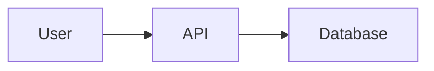
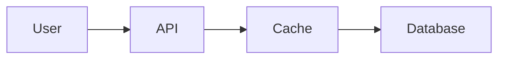
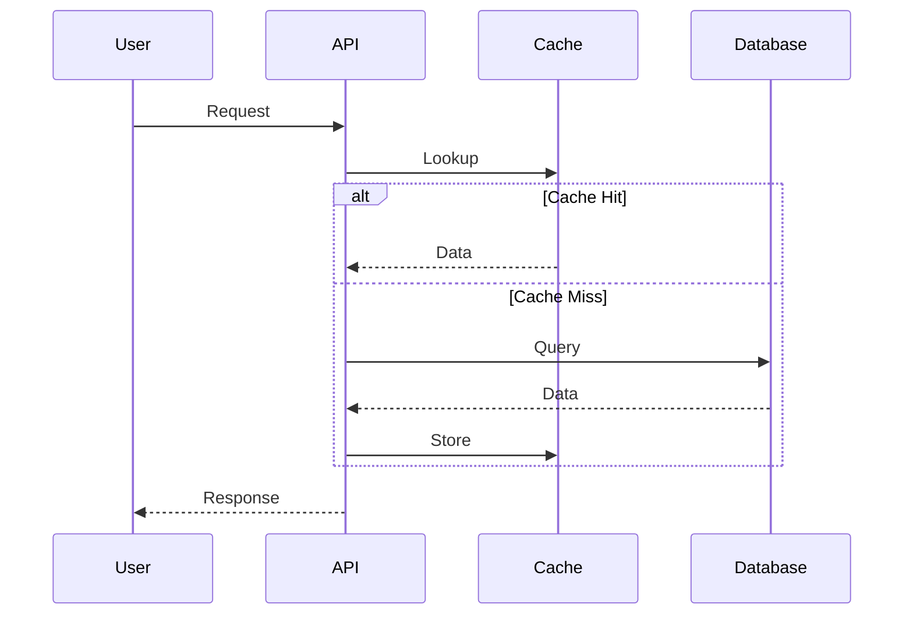
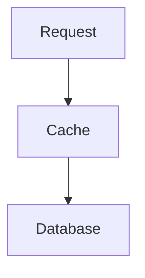
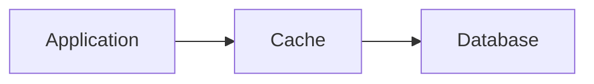
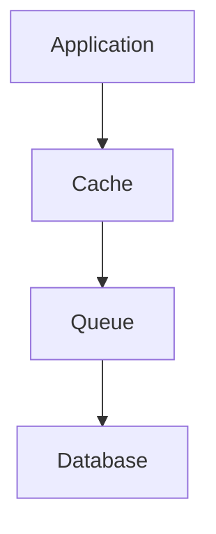
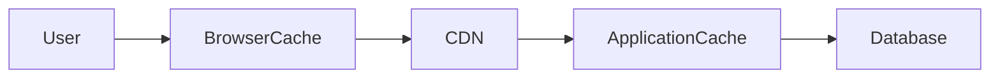
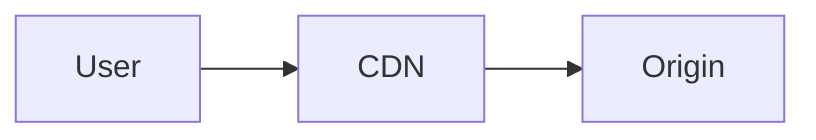
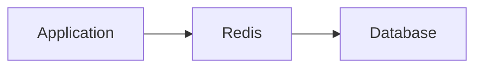
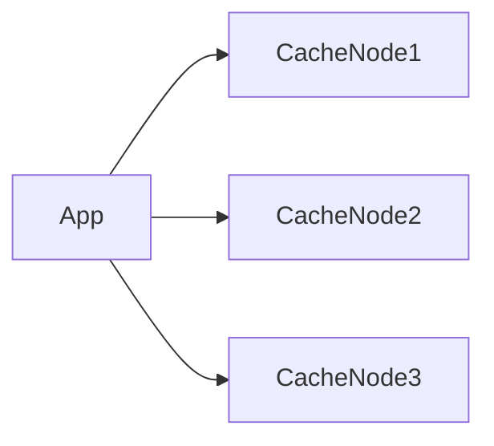

# Caching Patterns


## Overview

Caching is one of the most effective techniques for improving application performance and scalability.

A properly designed cache can:

* Reduce Database Load
* Lower Latency
* Increase Throughput
* Improve User Experience
* Reduce Infrastructure Costs

Many large-scale systems achieve significant performance gains not by increasing hardware resources, but by strategically reducing the number of expensive operations through caching.

However, caching introduces its own challenges, particularly around consistency, invalidation, and operational complexity.

This document explores production-grade caching strategies, architectural patterns, tradeoffs, and real-world implementation approaches.

---

## Objectives

Caching aims to:

* Reduce Expensive Computation
* Reduce Database Queries
* Improve Response Times
* Increase Scalability
* Improve Availability
* Optimize Infrastructure Utilization

---

# Why Caching Matters

Without caching:



Every request reaches the database.

As traffic grows:

```text
10 Requests

↓

1,000 Requests

↓

100,000 Requests
```

Database load increases proportionally.

---

## With Caching



Many requests never reach the database.

Benefits:

* Faster Responses
* Reduced Infrastructure Load
* Better Scalability

---

# What Should Be Cached?

Caching is most effective for:

---

## Frequently Read Data

Examples:

* Product Catalogs
* User Profiles
* Configuration Data
* Rankings
* Statistics

---

## Expensive Computations

Examples:

* Reports
* Analytics
* Recommendation Results

---

## External API Responses

Examples:

* Weather Data
* Currency Rates
* Third-Party Integrations

---

## Static Content

Examples:

* Images
* CSS
* JavaScript
* Documentation

---

# What Should Not Be Cached?

---

## Highly Volatile Data

Examples:

```text
Stock Prices

Live Trading Data

Real-Time Balances
```

Unless carefully managed.

---

## Sensitive Information

Examples:

* Passwords
* Security Tokens
* Personal Data

---

## Large Objects

Excessively large payloads may reduce cache efficiency.

---

# Cache Architecture

## Basic Cache Flow



---

# Cache Aside Pattern

The most common caching pattern.

---

## Flow



---

## Process

```text
Check Cache

↓

Cache Miss

↓

Query Database

↓

Populate Cache

↓

Return Response
```

---

## Advantages

* Simple
* Flexible
* Widely Used

---

## Challenges

* Cache Miss Latency
* Stale Data Risks

---

# Read Through Pattern

The cache itself retrieves data from storage.

---

## Architecture



---

## Benefits

* Simplified Application Logic
* Centralized Cache Handling

---

## Challenges

* More Complex Cache Layer
* Reduced Flexibility

---

# Write Through Pattern

Updates occur in both cache and database simultaneously.

---

## Flow

```text
Write Request

↓

Update Database

↓

Update Cache
```

---

## Architecture


---

## Benefits

* Strong Consistency
* Immediate Cache Availability

---

## Tradeoffs

* Increased Write Latency
* More Infrastructure Work

---

# Write Behind Pattern

Updates occur in cache first.

Database updates occur later.

---

## Flow

```text
Write

↓

Cache Updated

↓

Background Sync

↓

Database Updated
```

---

## Architecture



---

## Benefits

* Very Fast Writes
* Reduced Database Pressure

---

## Risks

* Data Loss
* Eventual Consistency
* Recovery Complexity

---

# Refresh Ahead Pattern

Cache refresh occurs before expiration.

---

## Flow

```text
Cache Near Expiry

↓

Automatic Refresh

↓

Updated Cache
```

Benefits:

* Reduced Cache Misses
* Better User Experience

---

# Multi-Level Caching

Large systems often use multiple cache layers.

---

## Architecture



---

## Benefits

* Reduced Latency
* Improved Scalability
* Better Resource Utilization

---

# Browser Caching

Client-side caching.

---

## Common Content

* Images
* CSS
* JavaScript
* Fonts

---

## Benefits

```text
No Network Request
```

Fastest possible response.

---

# CDN Caching

Content Delivery Networks cache content closer to users.

---

## Architecture



---

## Benefits

* Reduced Latency
* Reduced Origin Traffic
* Improved Global Performance

---

## Common Providers

* Cloudflare
* CloudFront
* Fastly
* Akamai

---

# Application-Level Caching

Frequently used for:

* API Responses
* Database Results
* Aggregated Data

---

## Architecture



---

# Distributed Caching

As systems scale, cache infrastructure scales as well.

---

## Architecture



---

## Benefits

* Horizontal Scalability
* Higher Availability

---

# Cache Invalidation

One of the hardest problems in software engineering.

---

## Why It Matters

Data changes.

Cache may become stale.

Example:

```text
Product Price Updated

↓

Cache Still Old
```

Users see incorrect information.

---

# Invalidation Strategies

---

## Time-Based Expiration

Example:

```text
TTL = 300 Seconds
```

Benefits:

* Simplicity

Tradeoff:

* Temporary Staleness

---

## Event-Based Invalidation

Example:

```text
Product Updated

↓

Invalidate Cache
```

Benefits:

* Better Consistency

---

## Version-Based Caching

Example:

```text
product:123:v1

↓

product:123:v2
```

Benefits:

* Safe Updates

---

# Cache Stampede

Occurs when many requests simultaneously miss cache.

---

## Scenario

```text
Cache Expired

↓

1000 Requests

↓

Database Flooded
```

---

## Solutions

* Request Coalescing
* Staggered Expirations
* Refresh Ahead

---

# Cache Penetration

Repeated requests for nonexistent data.

---

## Example

```text
User ID = 99999999
```

Not found.

Repeated queries hit database.

---

## Solutions

* Negative Caching
* Bloom Filters

---

# Cache Avalanche

Large numbers of keys expire simultaneously.

---

## Example

```text
1 Million Keys

Expire At

12:00 PM
```

Database experiences traffic spike.

---

## Solutions

* Randomized TTLs
* Gradual Expiration

---

# Caching in Microservices


Each service may manage its own cache.

---

## Example

```text
User Service Cache

Product Service Cache

Order Service Cache
```

Benefits:

* Independent Scaling
* Domain Isolation

---

# Observability


Caching requires visibility.

---

## Key Metrics

Monitor:

* Cache Hit Rate
* Cache Miss Rate
* Evictions
* Memory Usage
* Latency

---

## Example Targets

```text
Hit Rate

80–95%
```

Depends on workload.

---

# Real-World Examples

---

## Ecommerce Platform

Cache:

* Product Listings
* Product Details
* Categories

---

## Fantasy Sports Platform

Cache:

* Leaderboards
* Match Statistics
* Contest Rankings

---

## Opinion Trading Platform

Cache:

* Market Data
* Rankings
* Public Statistics

---

## Social Networks

Cache:

* User Profiles
* Timelines
* Trending Topics

---

# Common Caching Mistakes

---

## Caching Everything

Consumes excessive memory.

---

## Missing Invalidation Strategy

Leads to stale data.

---

## Ignoring Cache Metrics

Performance issues remain hidden.

---

## Single Cache Layer

Misses opportunities for optimization.

---

## Treating Cache as Source of Truth

Creates consistency risks.

---

# Engineering Tradeoffs

| Strategy          | Benefit             | Cost                    |
| ----------------- | ------------------- | ----------------------- |
| Cache Aside       | Simplicity          | Cache Miss Latency      |
| Read Through      | Cleaner Logic       | Cache Complexity        |
| Write Through     | Consistency         | Slower Writes           |
| Write Behind      | Fast Writes         | Eventual Consistency    |
| CDN Caching       | Global Performance  | Invalidation Complexity |
| Multi-Level Cache | Maximum Performance | Operational Complexity  |

---

# Interview Perspective

Strong system design candidates discuss:

* Cache Hit Ratios
* Invalidation Strategies
* Cache Stampede Prevention
* Multi-Level Caching
* CDN Integration
* Consistency Tradeoffs

Rather than simply saying:

> "Use Redis."

The architectural reasoning is more important than the technology choice.

---

# Engineering Outcome

Caching is one of the highest-impact scalability techniques available to engineers.

When designed thoughtfully, caching dramatically improves performance, reduces infrastructure costs, and enhances user experience.

Successful caching strategies balance speed, consistency, complexity, and operational maintainability while ensuring cached data remains an accelerator rather than a source of correctness issues.
