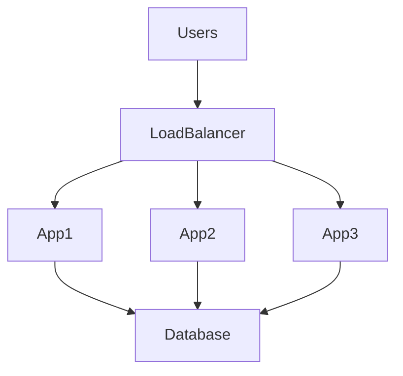
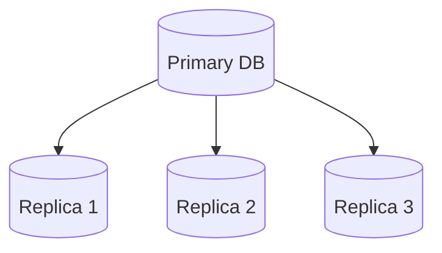
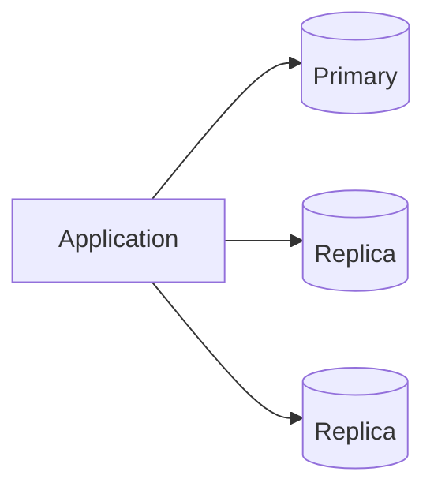
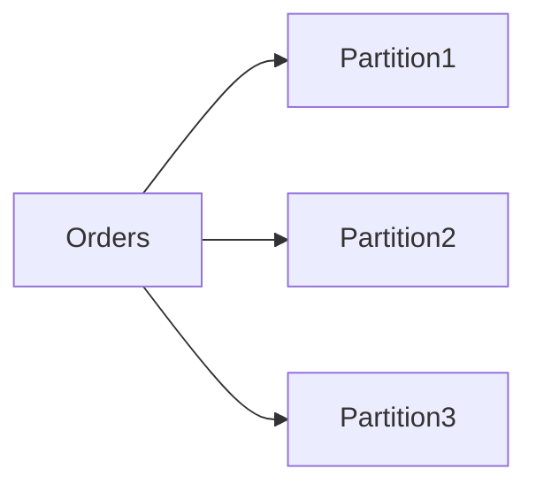
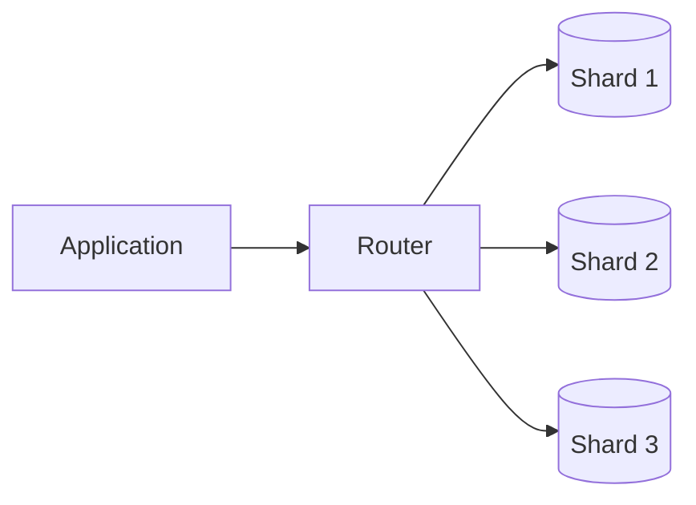
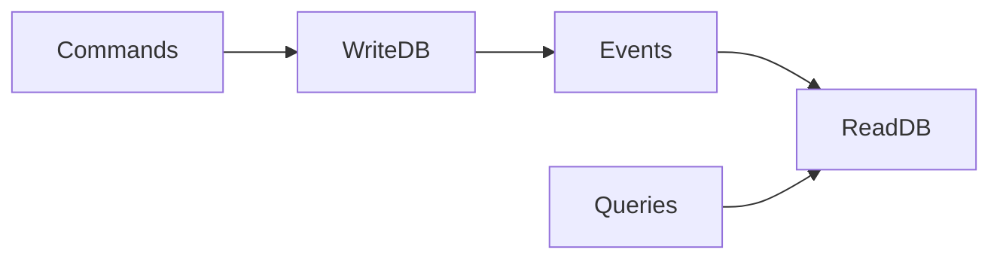
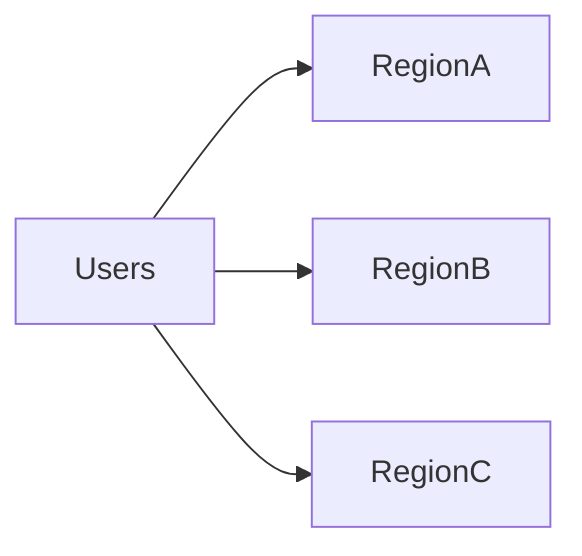
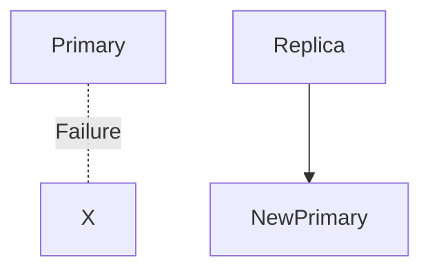

# Database Scaling


## Overview

For most production systems, the database eventually becomes the primary scalability bottleneck.

Application servers can usually be scaled relatively easily through horizontal scaling and load balancing. Databases, however, maintain state, enforce consistency, and handle critical business data, making scaling significantly more challenging.

Many large-scale outages and performance issues originate not from application servers, but from database limitations.

This document explores database scaling strategies, architectural patterns, tradeoffs, and real-world approaches used to support growing workloads.

Topics include:

* Vertical Scaling
* Read Replicas
* Partitioning
* Sharding
* CQRS
* Caching
* Database Bottleneck Analysis
* Production Scaling Patterns

---

## Objectives

Database scaling aims to:

* Support Traffic Growth
* Reduce Query Latency
* Increase Throughput
* Improve Availability
* Prevent Resource Saturation
* Enable Long-Term Growth

---

# Why Databases Become Bottlenecks

Most applications follow a pattern similar to:



As application instances increase, database load grows.

Eventually:

```text
10 App Servers

↓

100 App Servers

↓

1 Database
```

The database becomes the limiting factor.

---

# Common Database Bottlenecks

---

## CPU Saturation

Heavy queries consume CPU resources.

Examples:

* Large Joins
* Aggregations
* Sorting Operations

Symptoms:

* Slow Queries
* Increased Latency

---

## Memory Pressure

Insufficient memory causes:

* Frequent Disk Reads
* Cache Evictions
* Reduced Throughput

Symptoms:

* Increased Query Latency
* Database Instability

---

## Disk I/O

Databases frequently become storage-bound.

Examples:

* Full Table Scans
* Large Writes
* Bulk Operations

Symptoms:

* High I/O Wait Times

---

## Connection Limits

Each connection consumes resources.

Example:

```text
100 Connections

↓

10,000 Connections
```

Can overwhelm database servers.

---

# Database Scaling Strategies

Database scaling generally follows several stages.

```text
Query Optimization
       │
       ▼
Vertical Scaling
       │
       ▼
Read Replicas
       │
       ▼
Caching
       │
       ▼
Partitioning
       │
       ▼
Sharding
```

Organizations often progress through these stages incrementally.

---

# Stage 1: Query Optimization

Before adding infrastructure:

Optimize queries.

---

## Example

Poor Query:

```sql
SELECT *
FROM orders
WHERE user_id = 123;
```

Without indexes:

```text
Full Table Scan
```

---

## Improved Query

```sql
CREATE INDEX idx_user_id
ON orders(user_id);
```

Benefits:

* Faster Queries
* Reduced CPU Usage
* Reduced Disk Access

---

# Stage 2: Vertical Scaling


Increase database resources.

---

## Example

```text
8 CPU
16 GB RAM

↓

32 CPU
128 GB RAM
```

Benefits:

* Fastest Scaling Option
* Minimal Architecture Changes

Limitations:

* Hardware Limits
* Higher Cost
* Single Point of Failure

---

# Stage 3: Read Replicas

Read-heavy applications often benefit from replication.

---

## Architecture



---

## Request Routing



---

## Strategy

### Writes

```text
INSERT
UPDATE
DELETE
```

Go to:

```text
Primary Database
```

---

### Reads

```text
SELECT
```

Go to:

```text
Read Replicas
```

Benefits:

* Increased Read Capacity
* Reduced Primary Load

---

## Tradeoff

Replication Lag

Example:

```text
Write Completed

↓

Replica Updated

(Delayed)
```

Applications must tolerate eventual consistency.

---

# Stage 4: Caching


Caching reduces database traffic.

---

## Architecture


---

## Common Cached Data

* User Profiles
* Product Catalogs
* Leaderboards
* Application Settings

---

## Benefits

* Faster Responses
* Reduced Database Load
* Improved Scalability

---

## Tradeoffs

* Cache Invalidation
* Consistency Challenges

---

# Database Partitioning

Partitioning divides data within a single database.

---

## Example

Orders Table

```text
Orders_2024

Orders_2025

Orders_2026
```

---

## Architecture



Benefits:

* Improved Query Performance
* Easier Maintenance

---

## Common Partition Types

### Range Partitioning

Example:

```text
January

February

March
```

---

### Hash Partitioning

Example:

```text
User ID % 4
```

Distributes data evenly.

---

# Database Sharding

Sharding distributes data across multiple databases.

---

## Example

```text
Users A-M

↓

Shard 1

Users N-Z

↓

Shard 2
```

---

## Architecture



---

## Benefits

* Massive Scale
* Independent Growth

---

## Challenges

* Operational Complexity
* Cross-Shard Queries
* Data Rebalancing

---

# Sharding Strategies

---

## Range-Based Sharding

Example:

```text
User 1–100000

↓

Shard 1

User 100001–200000

↓

Shard 2
```

---

## Hash-Based Sharding

Example:

```text
UserID % NumberOfShards
```

Benefits:

* Even Distribution

---

## Geographic Sharding

Example:

```text
India

↓

Shard A

Europe

↓

Shard B
```

Benefits:

* Reduced Latency
* Regional Compliance

---

# CQRS (Command Query Responsibility Segregation)

Read and write workloads often have different scaling characteristics.

---

## Traditional Architecture


Reads and writes share resources.

---

## CQRS Architecture



Benefits:

* Independent Scaling
* Query Optimization

---

## Tradeoffs

* Eventual Consistency
* Increased Complexity

---

# Multi-Region Databases

Large-scale systems often operate globally.

---

## Architecture



Benefits:

* Lower Latency
* Disaster Recovery
* High Availability

---

## Challenges

* Replication
* Consistency
* Conflict Resolution

---

# Database Reliability


Scaling is ineffective without reliability.

---

## Replication

Provides:

* Redundancy
* Recovery Capability

---

## Automated Failover



Benefits:

* Reduced Downtime

---

## Backups

Critical for:

* Disaster Recovery
* Data Restoration

---

# Database Observability


Database scaling requires visibility.

---

## Key Metrics

Monitor:

* Query Latency
* Connection Count
* CPU Usage
* Memory Usage
* Replication Lag
* Disk Throughput

---

## Query Analysis

Identify:

* Slow Queries
* Missing Indexes
* Expensive Operations

---

## Capacity Planning

Track:

* Data Growth
* Traffic Growth
* Resource Utilization

---

# Real-World Examples

---

## Ecommerce Platform

Challenges:

* Product Searches
* Checkout Workloads
* Order History

Solutions:

* Read Replicas
* Redis Caching

---

## Fantasy Sports Platform

Challenges:

* Leaderboards
* Match Statistics
* User Rankings

Solutions:

* Redis
* Read Replicas
* Partitioned Data

---

## Opinion Trading Platform

Challenges:

* Market Data
* Trade History
* Settlement Processing

Solutions:

* Event-Driven Architecture
* CQRS
* Read Optimization

---

# Common Database Scaling Mistakes

---

## Scaling Before Optimization

Infrastructure cannot compensate for poor queries indefinitely.

---

## Missing Indexes

Creates unnecessary load.

---

## Ignoring Replication Lag

Leads to inconsistent user experiences.

---

## Premature Sharding

Introduces complexity too early.

---

## Weak Observability

Makes bottlenecks difficult to identify.

---

# Engineering Tradeoffs

| Strategy         | Benefit             | Cost                   |
| ---------------- | ------------------- | ---------------------- |
| Vertical Scaling | Simplicity          | Hardware Limits        |
| Read Replicas    | Read Scalability    | Replication Lag        |
| Caching          | High Performance    | Consistency Challenges |
| Partitioning     | Faster Queries      | Management Complexity  |
| Sharding         | Massive Scale       | Operational Overhead   |
| CQRS             | Independent Scaling | Eventual Consistency   |

---

# Interview Perspective

Strong system design candidates discuss database scaling in stages:

1. Query Optimization
2. Indexing
3. Vertical Scaling
4. Read Replicas
5. Caching
6. Partitioning
7. Sharding

Rather than immediately recommending complex distributed architectures.

This demonstrates practical engineering judgment.

---

# Engineering Outcome

Database scaling is one of the most challenging aspects of building large-scale systems.

Successful database architectures evolve gradually, starting with optimization and progressing through replication, caching, partitioning, and sharding only when justified by business requirements.

The strongest database designs balance performance, consistency, availability, operational simplicity, and long-term maintainability while ensuring the system can continue to grow without compromising reliability.
