# Horizontal Scaling

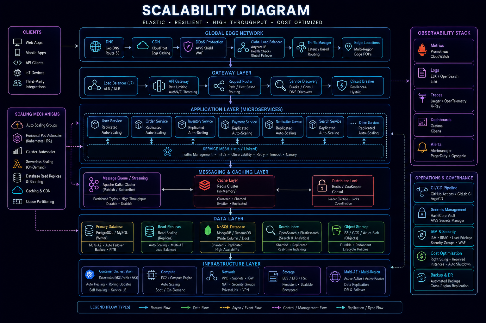

## Overview

Scalability is one of the most important characteristics of successful software systems.

A system that performs well for 1,000 users may fail completely when serving 1,000,000 users if scalability has not been considered.

Horizontal scaling is the process of increasing system capacity by adding more instances of a service rather than increasing the power of an individual machine.

Modern cloud-native architectures heavily favor horizontal scaling because it provides:

* Better Availability
* Greater Fault Tolerance
* Improved Elasticity
* Predictable Growth Paths
* Reduced Infrastructure Risk

This document explores horizontal scaling principles, architecture patterns, operational considerations, and real-world implementation strategies.

---

## Objectives

Horizontal scaling aims to:

* Support Traffic Growth
* Improve Availability
* Increase Reliability
* Eliminate Single Points of Failure
* Enable Elastic Infrastructure
* Reduce Capacity Bottlenecks

---

# What Is Horizontal Scaling?

Horizontal scaling (scale-out) means adding more servers or service instances.

Example:

```text
Before

1 Application Server

After

5 Application Servers
```

Capacity increases by distributing traffic across multiple instances.

---

## Visual Representation

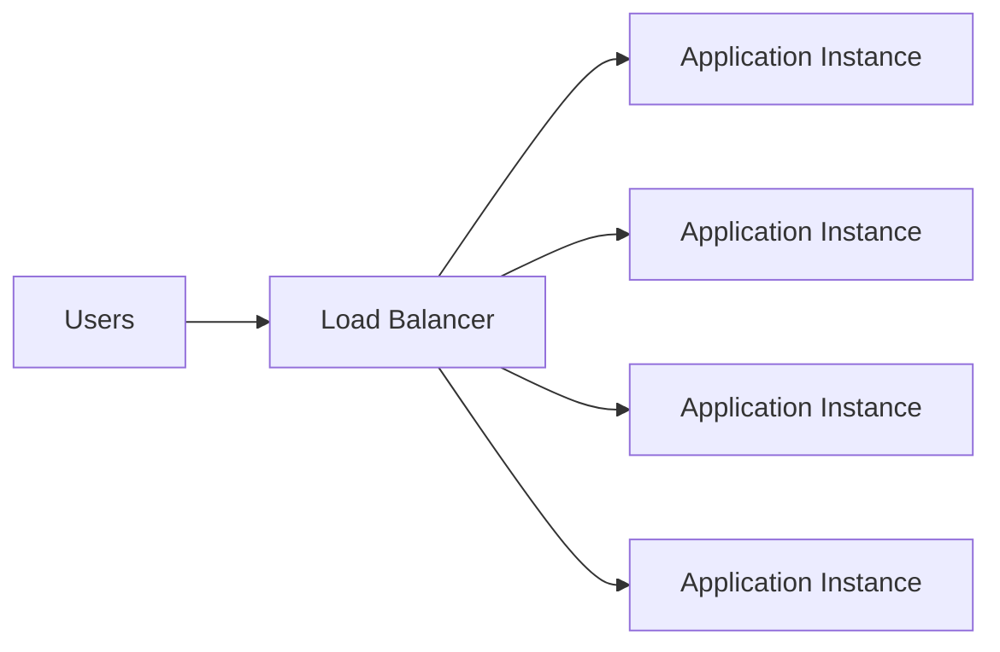

---

# Horizontal Scaling vs Vertical Scaling

## Vertical Scaling

Increase resources on an existing machine.

Example:

```text
4 CPU
8 GB RAM

↓

16 CPU
64 GB RAM
```

Benefits:

* Simpler Architecture
* Minimal Application Changes

Limitations:

* Hardware Limits
* Downtime Risks
* Single Point of Failure

---

## Horizontal Scaling

Add additional machines.

Example:

```text
Server 1
Server 2
Server 3
Server 4
```

Benefits:

* High Availability
* Elastic Growth
* Fault Tolerance

Tradeoff:

* Increased Architectural Complexity

---

# Why Horizontal Scaling Matters

Modern systems often experience:

### Traffic Growth

```text
100 Users

↓

10,000 Users

↓

1,000,000 Users
```

---

### Data Growth

```text
10 GB

↓

1 TB

↓

100 TB
```

---

### Geographic Expansion

Users access systems from multiple regions.

---

### Business Growth

New features generate additional load.

---

# Core Scaling Architecture

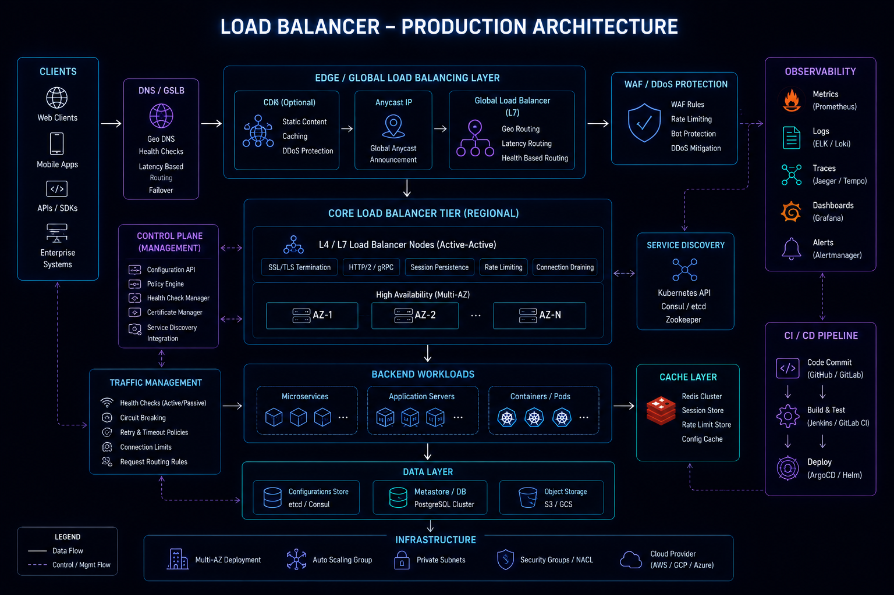

A horizontally scalable architecture typically introduces a load balancer.

---

## Basic Architecture

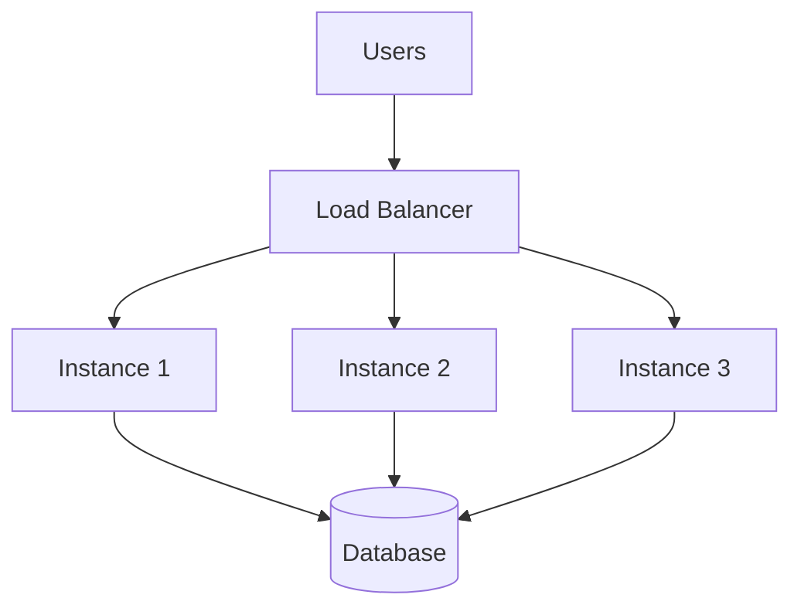

The load balancer distributes incoming requests across available instances.

---

# Load Balancing

Load balancing is the foundation of horizontal scaling.

---

## Responsibilities

* Traffic Distribution
* Health Checks
* Failure Detection
* High Availability
* SSL Termination

---

## Common Technologies

* Nginx
* HAProxy
* AWS ALB
* AWS ELB
* Cloudflare Load Balancing

---

# Load Balancing Strategies

## Round Robin

Requests distributed sequentially.

```text
Request 1 → Server A

Request 2 → Server B

Request 3 → Server C
```

Benefits:

* Simple
* Effective

---

## Least Connections

Requests routed to the least busy server.

Benefits:

* Better Resource Utilization

---

## Weighted Routing

Some servers receive more traffic.

Example:

```text
Server A → 70%

Server B → 20%

Server C → 10%
```

Useful during migrations and canary deployments.

---

# Stateless Architecture

A critical requirement for horizontal scaling.

---

## Problem

Consider:

```text
User Logs In

Session Stored

Server A
```

Next request:

```text
User Routed To

Server B
```

Session unavailable.

---

## Solution

Move state outside application servers.

Examples:

* Redis
* Databases
* Distributed Storage

---

## Stateless Architecture

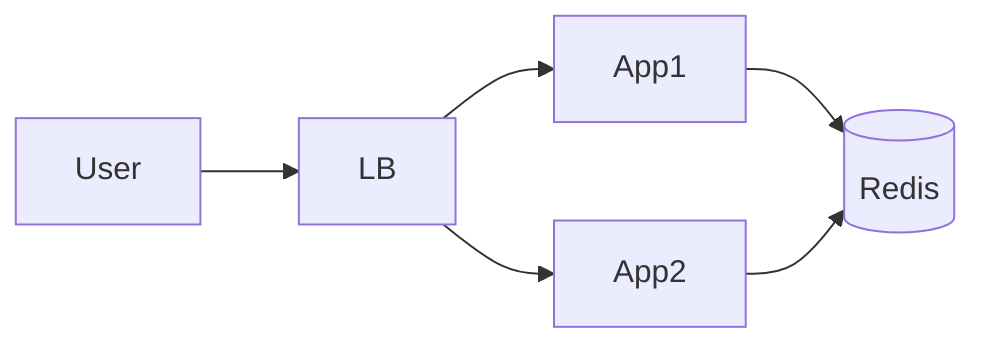

Benefits:

* Easy Scaling
* Consistent User Experience

---

# Database Scaling Challenges

Application servers scale easily.

Databases often become bottlenecks.

---

## Example

```text
10 App Servers

↓

1 Database
```

The database receives increasing load.

---

## Solutions

### Read Replicas

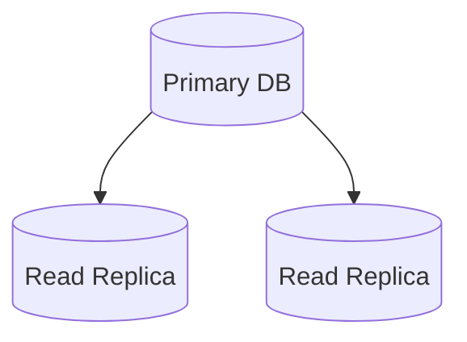

Benefits:

* Increased Read Capacity

---

### Database Sharding

Split data across multiple databases.

Example:

```text
Users A-M → Shard 1

Users N-Z → Shard 2
```

Benefits:

* Massive Scale

Tradeoff:

* Increased Complexity

---

# Caching and Horizontal Scaling

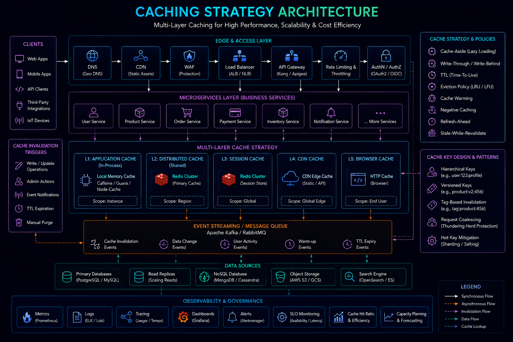

Caching reduces backend load.

---

## Architecture


Benefits:

* Reduced Database Traffic
* Faster Responses

---

## Common Cached Data

* User Profiles
* Product Catalogs
* Leaderboards
* Configuration Data

---

# Auto Scaling

Modern cloud environments support dynamic scaling.

---

## Example

```text
Traffic Low

2 Instances

↓

Traffic High

20 Instances
```

Resources scale automatically.

---

## Scaling Metrics

Common triggers:

* CPU Utilization
* Memory Usage
* Request Rate
* Queue Length

---

## Auto Scaling Architecture

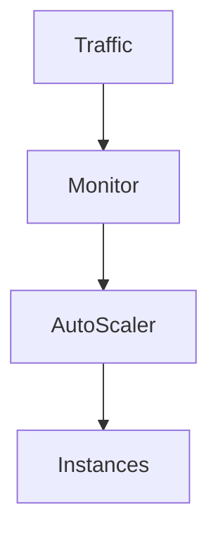

Benefits:

* Cost Optimization
* Automatic Capacity Management

---

# Distributed Systems Considerations

As systems scale horizontally:

New challenges emerge.

---

## Network Communication

Previously:

```text
Function Call
```

Now:

```text
Network Request
```

New risks:

* Latency
* Timeouts
* Partial Failures

---

## Consistency

Distributed systems often require:

* Eventual Consistency
* Replication Management
* Synchronization Strategies

---

# Reliability Benefits

Horizontal scaling improves reliability.

---

## Instance Failure Example

```text
5 Instances Running

↓

1 Instance Fails

↓

4 Instances Continue Serving Traffic
```

System remains operational.

---

## Architecture

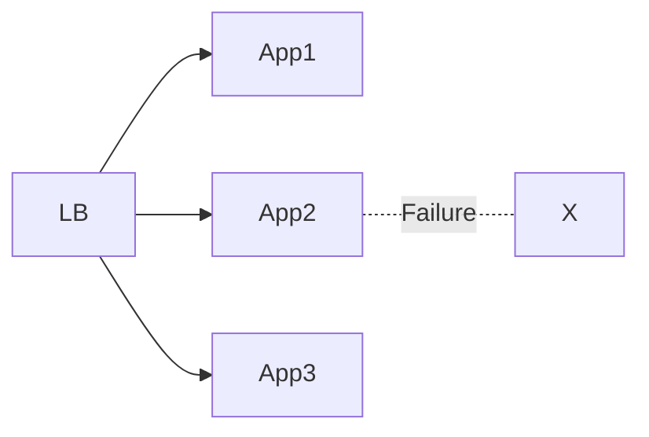

Benefits:

* Fault Tolerance
* Reduced Downtime

---

# Global Scaling

Large systems often operate across multiple regions.

---

## Multi-Region Architecture

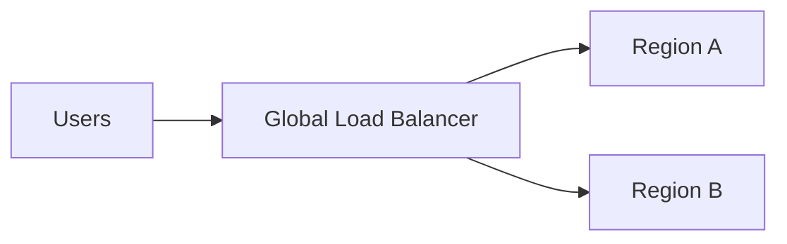

Benefits:

* Lower Latency
* Disaster Recovery
* Geographic Redundancy

---

# Observability Requirements

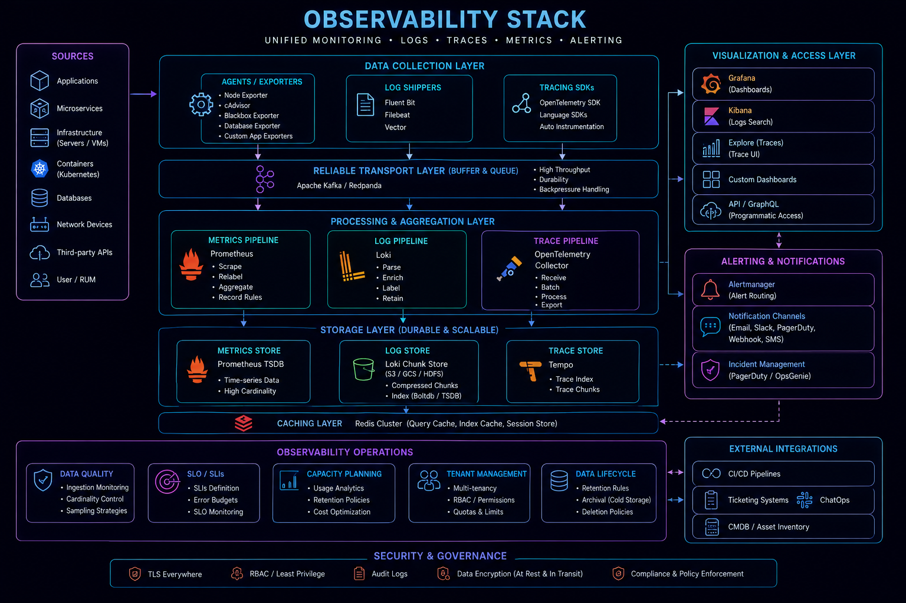

Scaling increases operational complexity.

---

## Metrics

Monitor:

* Requests Per Second
* Error Rate
* CPU Usage
* Memory Usage
* Response Time

---

## Logging

Track:

* Application Errors
* Scaling Events
* Infrastructure Events

---

## Tracing

Identify:

* Latency Sources
* Service Dependencies
* Performance Bottlenecks

---

# Common Scaling Mistakes

---

## Scaling Too Early

Building for millions of users before achieving product-market fit.

---

## Stateful Applications

Prevent effective horizontal scaling.

---

## Ignoring Database Bottlenecks

Application scaling alone is insufficient.

---

## Weak Monitoring

Problems remain invisible.

---

## No Auto Scaling Strategy

Leads to wasted resources or outages.

---

# Real-World Examples

---

## Ecommerce Platform

Scale:

* Product Browsing
* Search
* Checkout APIs

Traffic spikes during:

* Sales
* Promotions
* Festivals

---

## Fantasy Sports Platform

Scale:

* Leaderboards
* Contest APIs
* Match Data Processing

Traffic spikes during:

* Match Start
* Match Finish

---

## Opinion Trading Platform

Scale:

* Market Updates
* Trade Execution APIs
* Realtime Events

Traffic spikes during:

* Market Settlements
* Major Events

---

# Engineering Tradeoffs

| Benefit            | Cost                             |
| ------------------ | -------------------------------- |
| High Availability  | More Infrastructure              |
| Elastic Growth     | Operational Complexity           |
| Better Reliability | Distributed System Challenges    |
| Fault Isolation    | Additional Monitoring            |
| Increased Capacity | Higher Coordination Requirements |

---

# Scaling Evolution Path

```text
Single Server
      │
      ▼
Load Balancer
      │
      ▼
Multiple Instances
      │
      ▼
Auto Scaling
      │
      ▼
Multi-Region Platform
```

Most systems progress through these stages gradually.

---

# Interview Perspective

In system design interviews, strong candidates discuss:

* Load Balancers
* Stateless Services
* Auto Scaling
* Database Bottlenecks
* Caching
* Failure Scenarios
* Traffic Growth

Rather than simply stating:

> "I would add more servers."

Architectural reasoning matters more than infrastructure quantity.

---

# Engineering Outcome

Horizontal scaling is one of the most important techniques for building systems that can grow beyond the limitations of individual machines.

Successful horizontal scaling requires more than adding servers. It requires careful consideration of load balancing, stateless architecture, caching, database scaling, observability, and reliability.

When implemented correctly, horizontal scaling enables systems to handle increasing demand while maintaining performance, availability, and operational resilience.
