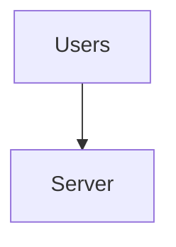
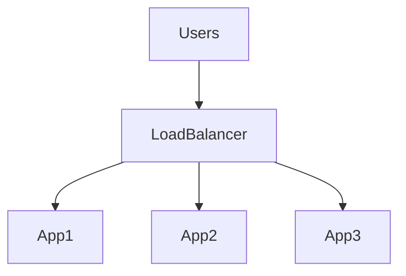
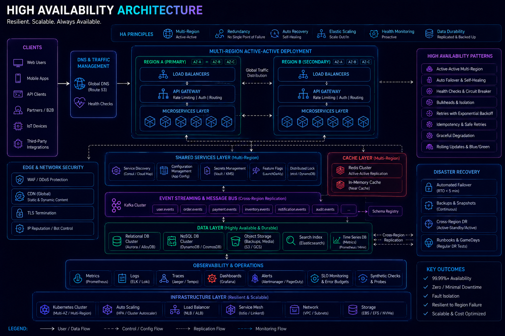
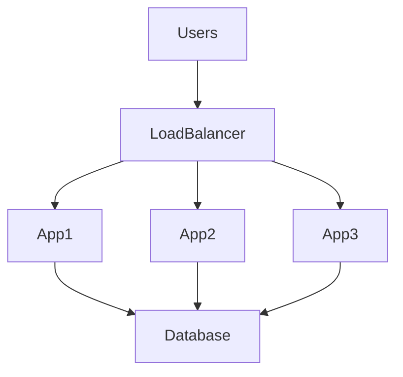
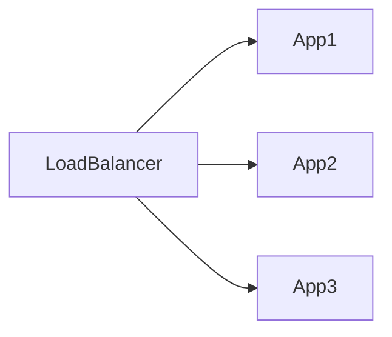
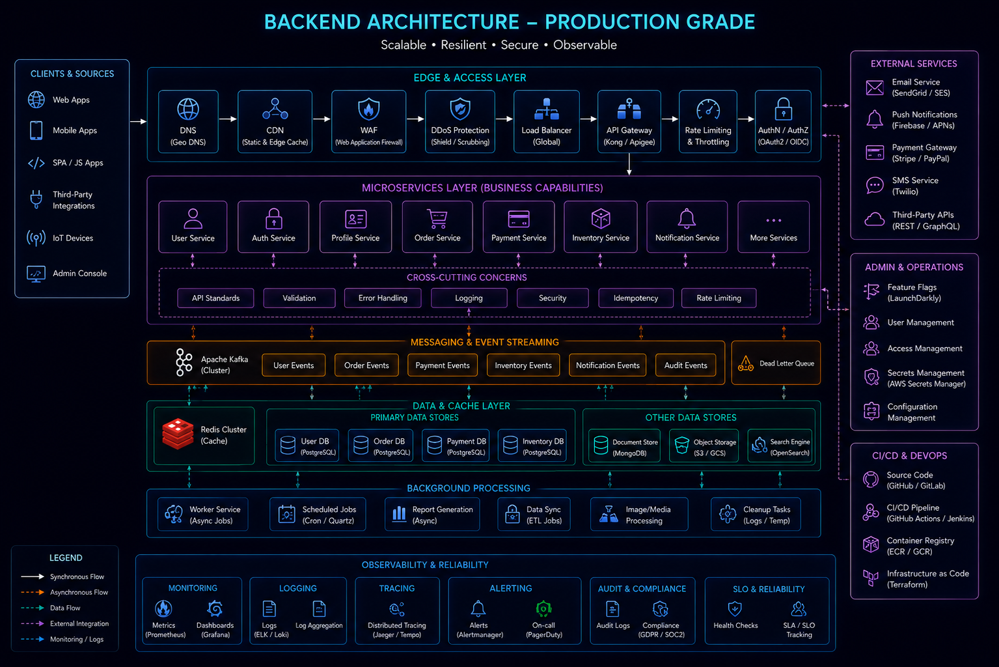
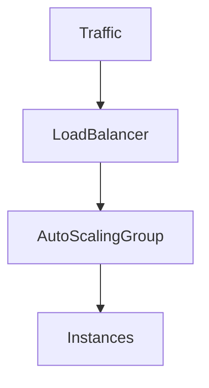
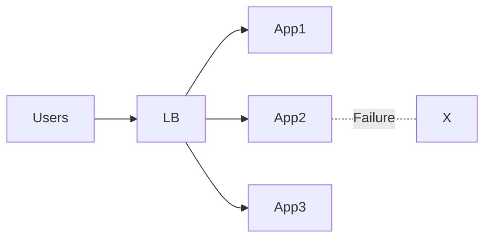
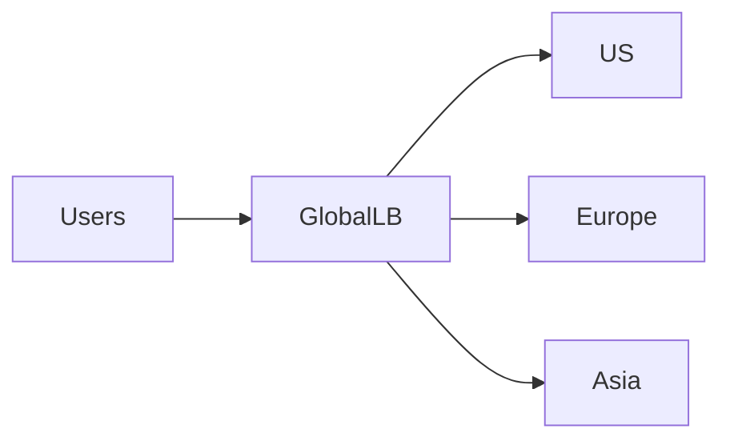
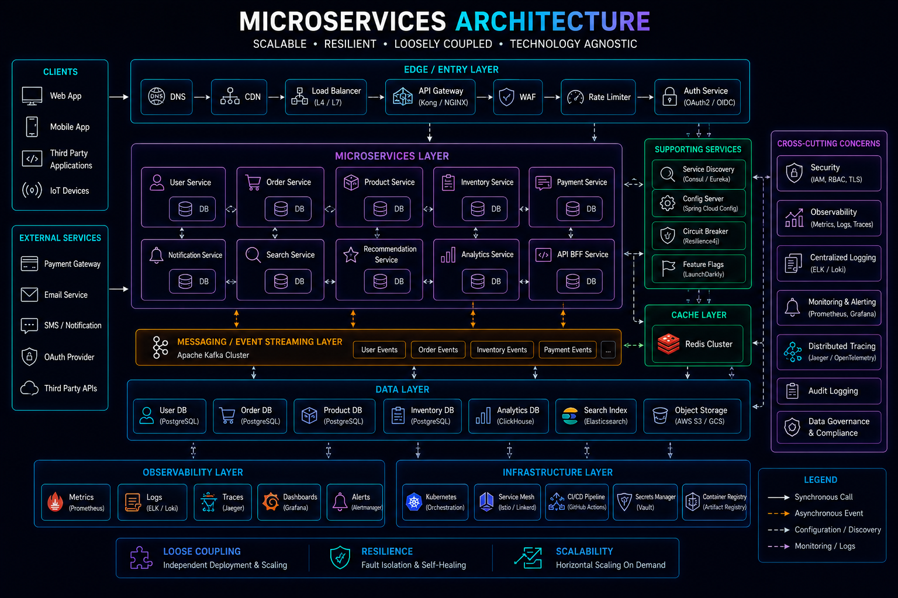

# Load Balancing


## Overview

Load balancing is one of the foundational building blocks of scalable and highly available systems.

As applications grow, a single server becomes insufficient to handle increasing traffic, reliability requirements, and geographic distribution needs.

A load balancer acts as an intelligent traffic manager, distributing incoming requests across multiple backend servers to ensure:

* High Availability
* Fault Tolerance
* Scalability
* Improved Performance
* Better Resource Utilization

Virtually every large-scale platform relies on load balancing, including:

* Ecommerce Platforms
* Streaming Services
* Social Networks
* Financial Systems
* Realtime Applications
* Cloud Infrastructure Platforms

This document explores load balancing architectures, traffic distribution algorithms, operational considerations, and production-grade deployment strategies.

---

## Objectives

Load balancing aims to:

* Distribute Traffic Efficiently
* Eliminate Single Points of Failure
* Improve Availability
* Enable Horizontal Scaling
* Increase Reliability
* Support Global Traffic Distribution

---

# Why Load Balancing Matters

Without a load balancer:



All traffic reaches a single server.

Problems:

* Limited Capacity
* Single Point of Failure
* Poor Scalability

---

## With Load Balancing



Benefits:

* Traffic Distribution
* High Availability
* Better Resource Utilization

---

# Core Responsibilities

A load balancer does more than distribute traffic.

---

## Traffic Routing

Distributes requests across available servers.

---

## Health Monitoring

Detects unhealthy instances.

---

## Failover Management

Automatically removes failed servers.

---

## SSL Termination

Handles TLS/SSL processing centrally.

---

## Traffic Control

Supports:

* Rate Limiting
* Request Filtering
* Routing Rules

---

# High-Level Architecture





---

# Types of Load Balancers

---

## Layer 4 Load Balancer

Operates at:

```text
Transport Layer
```

Uses:

* TCP
* UDP

Routing decisions based on:

* IP Address
* Port

---

### Benefits

* Fast
* Efficient
* Low Overhead

---

### Examples

* AWS Network Load Balancer
* HAProxy (L4 Mode)

---

## Layer 7 Load Balancer

Operates at:

```text
Application Layer
```

Understands:

* HTTP
* HTTPS
* Headers
* Cookies
* Paths

---

### Benefits

* Advanced Routing
* Content Awareness
* Flexible Rules

---

### Examples

* Nginx
* AWS ALB
* Traefik

---

# Traffic Distribution Algorithms

Choosing the right algorithm impacts performance and fairness.

---

## Round Robin

Requests distributed sequentially.

Example:

```text
Request 1 → Server A

Request 2 → Server B

Request 3 → Server C
```

---

### Benefits

* Simple
* Predictable

---

### Limitations

Does not account for server load.

---

## Least Connections

Requests routed to the server with the fewest active connections.

---

### Benefits

* Better Utilization
* Handles Uneven Workloads

---

### Common Usage

* Long-Lived Connections
* WebSocket Systems

---

## Weighted Round Robin

Servers receive traffic according to assigned weights.

Example:

```text
Server A → 70%

Server B → 20%

Server C → 10%
```

---

### Benefits

* Supports Different Server Capacities
* Useful During Migrations

---

## IP Hashing

Routes users based on client IP.

Example:

```text
User A → Server 1

User B → Server 2
```

---

### Benefits

* Session Consistency

---

### Limitations

* Uneven Distribution

---

# Health Checks


Health checks determine whether servers can receive traffic.

---

## Architecture



Regular checks verify server health.

---

## Health Check Types

### TCP Health Checks

Verify:

```text
Port Reachability
```

---

### HTTP Health Checks

Verify:

```text
Application Availability
```

Example:

```http
GET /health
```

---

### Deep Health Checks

Verify:

* Database Connectivity
* Cache Connectivity
* Critical Dependencies

---

# Sticky Sessions

Some applications store session state locally.

---

## Problem

```text
Login Request

↓

Server A

↓

Next Request

↓

Server B
```

Session unavailable.

---

## Solution

Sticky Sessions


User remains routed to the same server.

---

## Benefits

* Session Consistency

---

## Tradeoffs

* Reduced Load Distribution
* Scaling Challenges

---

## Preferred Alternative

Stateless Services

Store sessions in:

* Redis
* Databases
* Distributed Storage

---

# SSL Termination

Load balancers commonly manage TLS encryption.

---

## Architecture


---

## Benefits

* Reduced Application Overhead
* Centralized Certificate Management

---

# Reverse Proxy Architecture

Load balancers frequently act as reverse proxies.

---

## Architecture


Benefits:

* Security
* Routing Flexibility
* Performance

---

# Nginx



Nginx is one of the most widely used load balancers.

---

## Strengths

* High Performance
* Reverse Proxy Features
* SSL Termination
* HTTP Routing

---

## Common Use Cases

* Web Applications
* APIs
* Static Content Delivery

---

# HAProxy

HAProxy is designed specifically for high-performance load balancing.

---

## Strengths

* Extremely Fast
* Reliable
* Advanced Routing

---

## Common Use Cases

* High Traffic Platforms
* Financial Systems
* Enterprise Applications

---

# AWS Load Balancers

---

## Application Load Balancer (ALB)

Layer 7

Supports:

* HTTP
* HTTPS
* Path-Based Routing

---

## Network Load Balancer (NLB)

Layer 4

Supports:

* TCP
* UDP

---

## Classic Load Balancer

Legacy AWS offering.

Generally replaced by:

* ALB
* NLB

---

# Auto Scaling Integration

Load balancing works closely with auto scaling.

---

## Architecture



---

## Benefits

* Automatic Capacity Growth
* Cost Optimization

---

# High Availability Architecture


Load balancing improves availability.

---

## Example



Traffic automatically reroutes.

---

## Benefits

* Reduced Downtime
* Improved Reliability

---

# Global Load Balancing

Large systems often operate across multiple regions.

---

## Architecture



---

## Benefits

* Lower Latency
* Disaster Recovery
* Geographic Redundancy

---

# Traffic Routing Strategies

Global systems may route traffic based on:

---

## Geographic Routing

```text
India → Mumbai

Europe → Frankfurt

US → Virginia
```

---

## Latency-Based Routing

Traffic routed to the fastest region.

---

## Failover Routing

Traffic redirected during outages.

---

# Load Balancing for Microservices



Modern microservices architectures rely heavily on internal load balancing.

---

## Architecture

```mermaid
flowchart LR

    API Gateway

    UserService

    UserService1

    UserService2

    UserService3

    API Gateway --> UserService

    UserService --> UserService1
    UserService --> UserService2
    UserService --> UserService3
```

---

## Benefits

* Independent Scaling
* Service Resilience

---

# Observability

Monitoring load balancers is critical.

---

## Key Metrics

Track:

* Request Rate
* Error Rate
* Latency
* Active Connections
* Backend Health

---

## Example Metrics

```text
Requests Per Second

Backend Availability

Connection Count
```

---

# Common Load Balancing Mistakes

---

## No Health Checks

Failed servers continue receiving traffic.

---

## Stateful Applications

Reduce scaling flexibility.

---

## Ignoring SSL Overhead

Can impact performance.

---

## Uneven Traffic Distribution

Creates hotspots.

---

## Single Load Balancer

Creates a new single point of failure.

---

# Engineering Tradeoffs

| Benefit            | Cost                      |
| ------------------ | ------------------------- |
| High Availability  | Additional Infrastructure |
| Horizontal Scaling | Operational Complexity    |
| Fault Tolerance    | Monitoring Requirements   |
| Better Performance | Configuration Overhead    |
| Global Reach       | Multi-Region Complexity   |

---

# Evolution Path

```text
Single Server
       │
       ▼
Load Balancer
       │
       ▼
Multiple Instances
       │
       ▼
Auto Scaling
       │
       ▼
Multi-Region Architecture
       │
       ▼
Global Traffic Platform
```

Organizations typically evolve through these stages as scale increases.

---

# Interview Perspective

Strong system design candidates discuss:

* Traffic Distribution Algorithms
* Health Checks
* Sticky Sessions
* Stateless Architectures
* SSL Termination
* Global Traffic Routing
* Failure Handling

Rather than simply saying:

> "Add a load balancer."

The architectural reasoning behind the load balancing strategy is what demonstrates engineering maturity.

---

# Engineering Outcome

Load balancing is a critical foundation of scalable and highly available systems.

By intelligently distributing traffic, monitoring service health, and supporting horizontal scaling, load balancers enable applications to handle growth while maintaining performance and reliability.

Successful load balancing architectures combine traffic management, observability, fault tolerance, and operational simplicity to ensure systems remain resilient under increasing demand and unexpected failures.
