# Queue-Based Processing

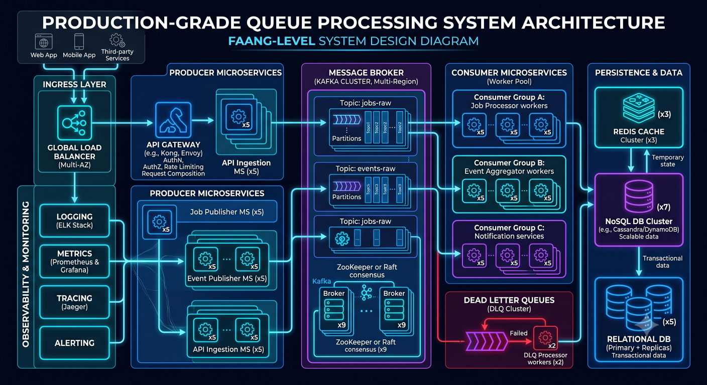

## Overview

Not every operation in a software system should be executed synchronously.

As systems scale, performing all work during the request-response cycle leads to:

* Increased Latency
* Poor User Experience
* Reduced Throughput
* Resource Contention
* Reliability Issues

Queue-based processing addresses these challenges by moving non-critical or time-consuming tasks into asynchronous workflows.

Instead of performing work immediately, applications place tasks into a queue where background workers process them independently.

This architecture improves performance, scalability, reliability, and system resilience.

Queue-based processing is a foundational building block of modern distributed systems and is widely used in:

* Ecommerce Platforms
* Financial Systems
* Social Networks
* Realtime Applications
* Event-Driven Architectures

---

## Objectives

Queue-based systems aim to:

* Reduce Request Latency
* Improve Scalability
* Increase Reliability
* Decouple Services
* Enable Background Processing
* Improve Fault Tolerance

---

# Why Queues Matter

Consider a user registration flow.

Without a queue:

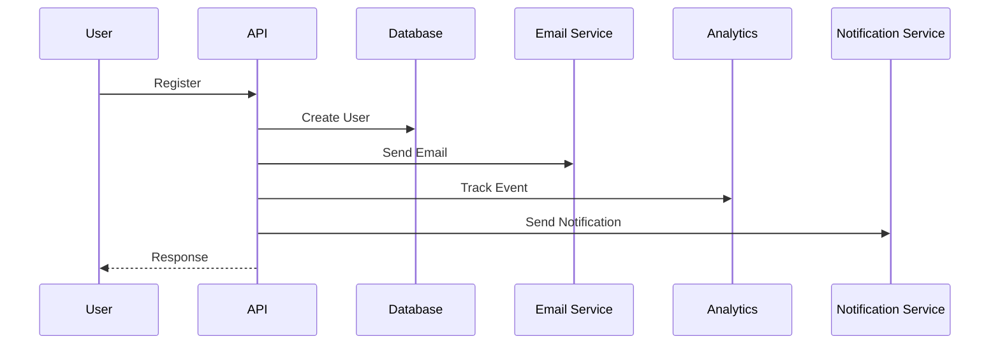

The user waits for every operation.

---

## Problems

* Slow Responses
* External Dependency Failures
* Increased Timeout Risk

---

## Queue-Based Approach

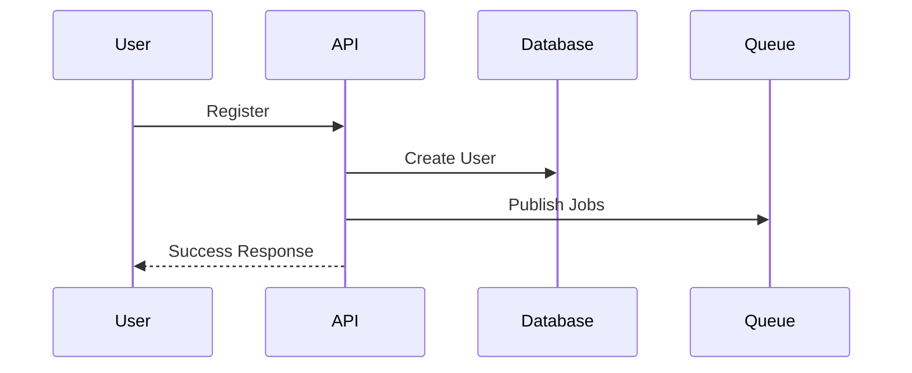

Background workers perform remaining tasks.

Benefits:

* Faster Responses
* Better User Experience
* Improved Reliability

---

# Core Components

Queue-based architectures consist of several key components.

---

## Producer

Creates jobs.

Examples:

* API Services
* Event Processors
* Scheduled Tasks

Example:

```text
Order Service

↓

Create Shipment Job
```

---

## Queue

Stores work awaiting execution.

Responsibilities:

* Persistence
* Ordering
* Delivery
* Retry Support

---

## Consumer / Worker

Processes jobs.

Examples:

* Email Workers
* Analytics Workers
* Notification Workers

---

# High-Level Architecture


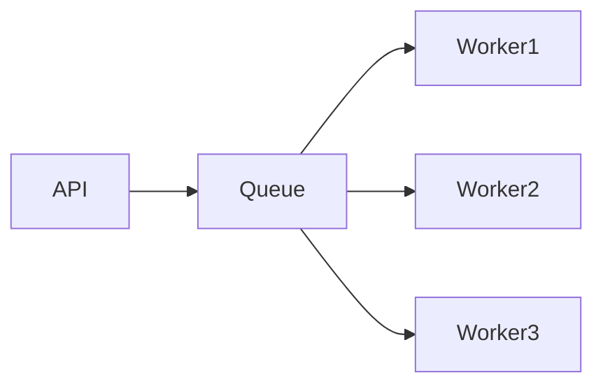

---

# Common Use Cases

---

## Email Delivery

Avoid delaying user requests.

Example:

```text
User Registration

↓

Email Job

↓

Background Processing
```

---

## Notifications

Examples:

* Push Notifications
* SMS
* Email Alerts

---

## Report Generation

Examples:

* Sales Reports
* Analytics Reports
* Financial Reports

---

## Media Processing

Examples:

* Image Resizing
* Video Encoding
* Thumbnail Generation

---

## Payment Reconciliation

Financial workflows often require background processing.

---

## Data Synchronization

Examples:

* CRM Updates
* Third-Party Integrations
* Inventory Sync

---

# Queue Architecture Patterns

---

# Single Queue

Simple architecture.

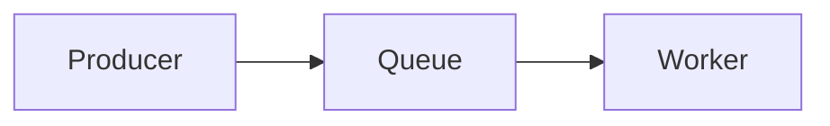

Suitable for:

* Small Systems
* Internal Tools

---

# Multiple Queues

Different workloads use dedicated queues.

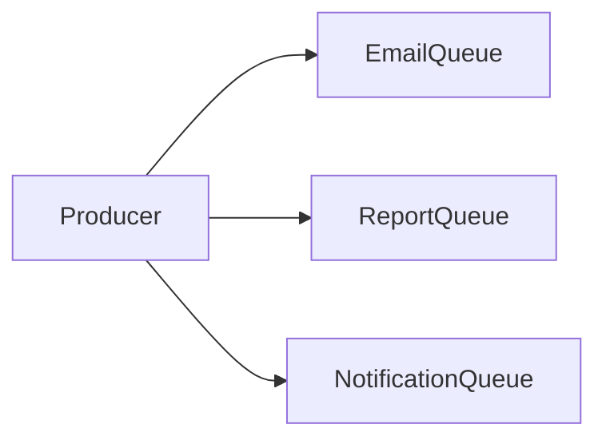

Benefits:

* Isolation
* Independent Scaling

---

# Priority Queues

High-priority tasks execute first.

Example:

```text
Priority 1

Payment Processing

Priority 2

Email Delivery
```

Benefits:

* Better Resource Allocation

---

# RabbitMQ

RabbitMQ is a mature message broker focused on reliable message delivery.

---

## Architecture

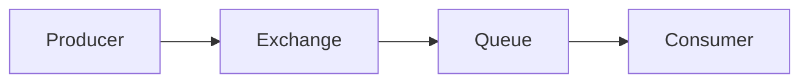

---

## Strengths

* Reliable Delivery
* Flexible Routing
* Mature Ecosystem
* Easy Adoption

---

## Common Use Cases

* Background Jobs
* Notifications
* Workflow Processing

---

## Tradeoffs

* Lower Throughput Than Kafka
* Additional Operational Overhead

---

# Kafka

Kafka is a distributed event streaming platform.

---

## Architecture

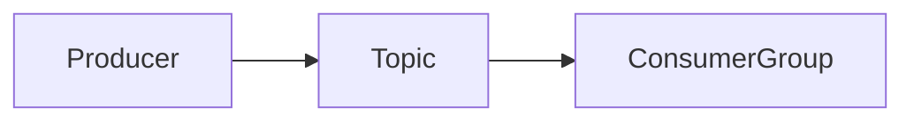

---

## Strengths

* High Throughput
* Event Replay
* Scalability
* Durability

---

## Common Use Cases

* Event Streaming
* Analytics Pipelines
* Realtime Systems

---

## Tradeoffs

* Higher Complexity
* Operational Requirements

---

# Redis-Based Queues

Redis is commonly used for lightweight job processing.

---

## Advantages

* Simplicity
* Fast Performance
* Existing Redis Infrastructure

---

## Common Tools

* BullMQ
* Bull
* Bee Queue

---

## Use Cases

* Background Jobs
* Notifications
* Scheduled Tasks

---

# Worker Scaling

Workers can scale independently from application servers.

---

## Architecture

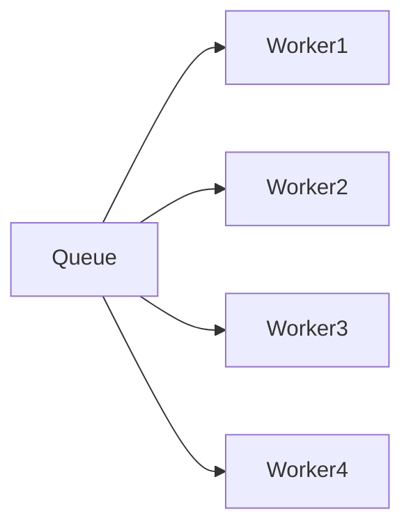

---

## Benefits

* Independent Scaling
* Better Throughput

---

## Example

```text
100 Jobs / Minute

↓

10,000 Jobs / Minute

↓

Add More Workers
```

---

# Retry Mechanisms

Failures are inevitable.

---

## Example

```text
Email Service Unavailable
```

Job should be retried.

---

## Retry Flow

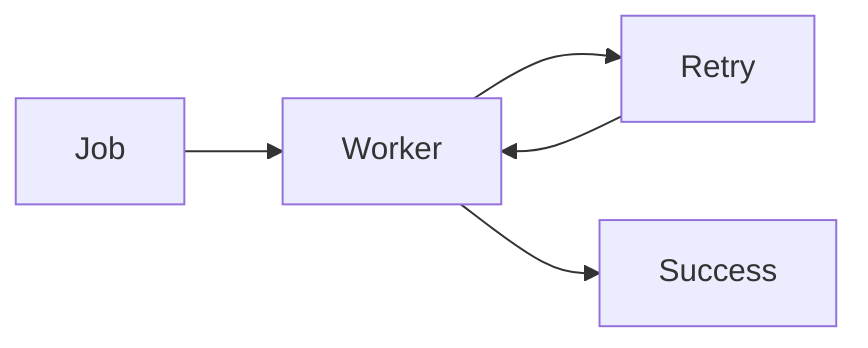

---

## Best Practices

* Exponential Backoff
* Retry Limits
* Failure Monitoring

---

# Dead Letter Queues (DLQ)

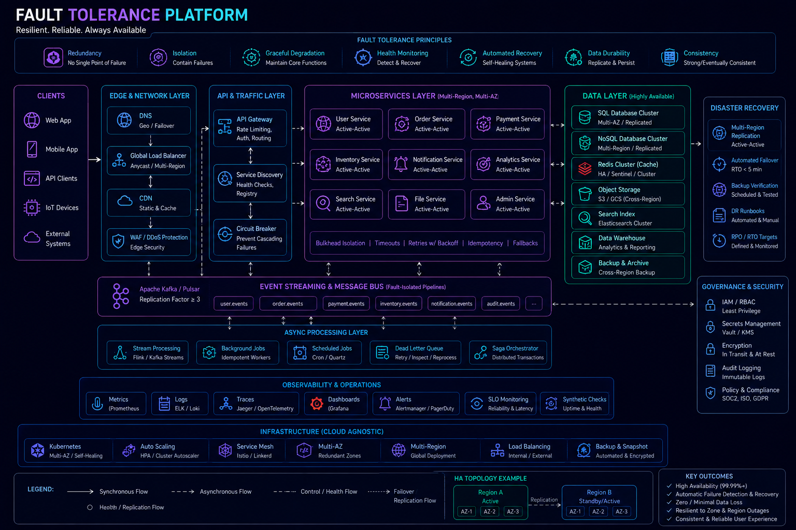

Some jobs repeatedly fail.

These jobs should be isolated.

---

## Architecture


---

## Benefits

* Prevent Infinite Retries
* Easier Investigation
* Improved Stability

---

# Idempotency

Workers must handle duplicate messages safely.

---

## Example

```text
PaymentCompleted
```

If processed twice:

Bad Outcome:

```text
Customer Charged Twice
```

---

## Goal

Multiple executions produce the same result.

---

## Common Strategies

* Idempotency Keys
* Unique Constraints
* State Validation

---

# Ordering Considerations

Some workflows require strict ordering.

---

## Example

```text
AccountCreated

↓

AccountVerified

↓

AccountActivated
```

Incorrect ordering causes problems.

---

## Solutions

* FIFO Queues
* Partitioning Strategies
* Ordered Consumers

---

# Delayed Processing

Some jobs execute later.

---

## Examples

```text
Send Reminder

24 Hours Later
```

```text
Cancel Unpaid Order

After 30 Minutes
```

---

## Benefits

* Workflow Automation
* Reduced Complexity

---

# Queue Monitoring


Queues require observability.

---

## Metrics

Monitor:

* Queue Depth
* Processing Rate
* Failure Rate
* Retry Rate
* Consumer Lag

---

## Example

```text
Queue Depth

10

↓

100

↓

10,000
```

Rapid growth often indicates bottlenecks.

---

# Capacity Planning

Estimate:

* Job Volume
* Peak Traffic
* Worker Capacity

---

## Example

```text
100,000 Jobs/Hour

Worker Capacity

10,000 Jobs/Hour

Required Workers

10+
```

---

# Queue-Based Microservices


Queues enable service decoupling.

---

## Architecture

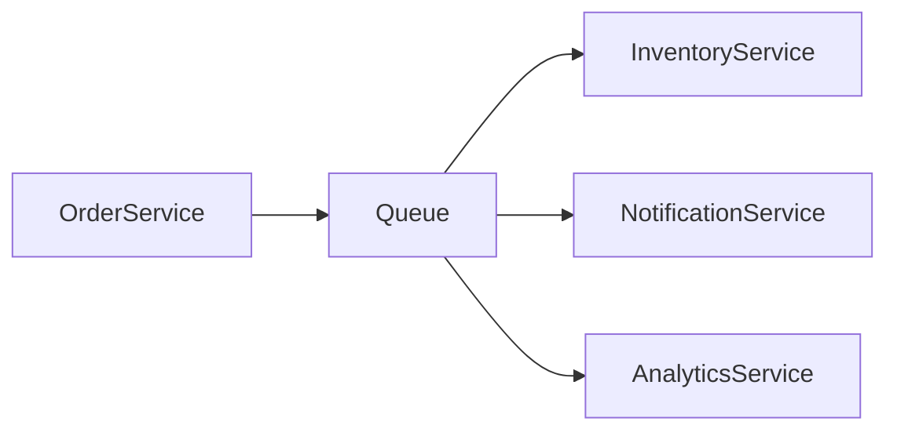

Benefits:

* Independent Services
* Better Scalability

---

# Real-World Examples

---

## Ecommerce Platform

Jobs:

* Order Confirmation
* Shipment Processing
* Inventory Updates

---

## Fantasy Sports Platform

Jobs:

* Leaderboard Updates
* Statistics Processing
* Contest Settlement

---

## Opinion Trading Platform

Jobs:

* Market Settlement
* Portfolio Updates
* Notifications

---

## Social Networks

Jobs:

* Feed Generation
* Notifications
* Recommendation Systems

---

# Common Queue Mistakes

---

## No Retry Strategy

Temporary failures become permanent failures.

---

## Infinite Retries

Can overwhelm systems.

---

## Missing DLQs

Failed jobs disappear.

---

## No Monitoring

Problems remain hidden.

---

## Large Messages

Increase storage and processing costs.

Prefer lightweight payloads.

---

# Engineering Tradeoffs

| Benefit            | Cost                      |
| ------------------ | ------------------------- |
| Faster Responses   | Additional Infrastructure |
| Better Scalability | Operational Complexity    |
| Service Decoupling | Eventual Consistency      |
| Worker Scaling     | Monitoring Requirements   |
| Fault Isolation    | More Components           |

---

# Queue Evolution Path

```text
Synchronous Requests
         │
         ▼
Background Jobs
         │
         ▼
Message Queues
         │
         ▼
Distributed Workers
         │
         ▼
Event-Driven Platform
```

Organizations typically evolve through these stages gradually.

---

# Interview Perspective

Strong system design candidates discuss:

* Worker Scaling
* Retry Policies
* Dead Letter Queues
* Idempotency
* Ordering Guarantees
* Queue Monitoring
* Failure Scenarios

Rather than simply saying:

> "Use RabbitMQ" or "Use Kafka."

Understanding the architectural tradeoffs is more important than the technology itself.

---

# Engineering Outcome

Queue-based processing is a critical technique for building scalable, resilient, and performant systems.

By moving work outside the request-response cycle, organizations can improve user experience, increase throughput, reduce coupling, and build architectures that continue to perform effectively as demand grows.

Successful queue architectures combine reliable messaging, scalable workers, observability, idempotency, and thoughtful failure handling to ensure asynchronous workflows remain dependable under production workloads.
