# Redis Strategies

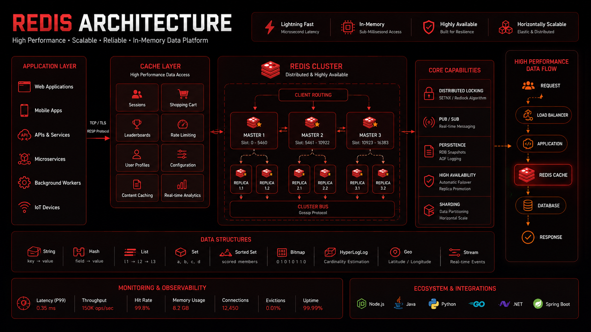

## Overview

Redis is one of the most widely used technologies in modern backend architecture.

While often introduced as a simple cache, Redis has evolved into a versatile in-memory data platform capable of supporting:

* Caching
* Session Storage
* Realtime Messaging
* Rate Limiting
* Distributed Locking
* Leaderboards
* Queue Processing
* Event Streaming

At scale, Redis frequently becomes a critical component for improving performance, reducing database load, enabling realtime experiences, and increasing system resilience.

This document explores production-grade Redis strategies, architectural patterns, operational considerations, and real-world use cases.

---

## Objectives

Redis is commonly used to:

* Reduce Database Load
* Improve Response Times
* Support High Throughput Systems
* Enable Realtime Communication
* Manage Distributed Coordination
* Increase Scalability

---

# Why Redis Matters

Without Redis:

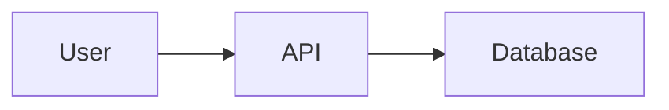

Every request reaches the database.

As traffic grows:

```text
100 Requests

↓

10,000 Requests

↓

100,000 Requests
```

Database pressure increases significantly.

---

## With Redis

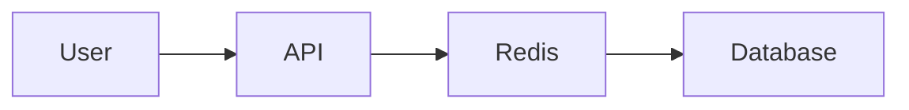

Benefits:

* Reduced Latency
* Lower Database Load
* Better Scalability

---

# Redis Architecture Fundamentals

Redis is:

* In-Memory
* Key-Value Based
* Extremely Fast
* Single Threaded (Core Execution)
* Network Accessible

Because data is stored primarily in memory, operations typically execute in microseconds.

---

# Redis Data Structures

One of Redis' strengths is support for multiple data structures.

---

## Strings

Most common structure.

Example:

```text
user:123:name

↓

Amar
```

Use cases:

* Caching
* Sessions
* Configuration

---

## Hashes

Store structured objects.

Example:

```text
user:123

name = Amar

email = amar@example.com
```

Use cases:

* User Profiles
* Metadata

---

## Lists

Ordered collections.

Use cases:

* Queues
* Activity Streams

---

## Sets

Unique collections.

Use cases:

* Tags
* Membership Checks

---

## Sorted Sets

Elements ordered by score.

Use cases:

* Leaderboards
* Rankings

---

## Streams

Event streaming structure.

Use cases:

* Event Processing
* Realtime Systems

---

# Strategy 1: Caching


Caching is the most common Redis use case.

---

## Architecture


---

## Cache Flow

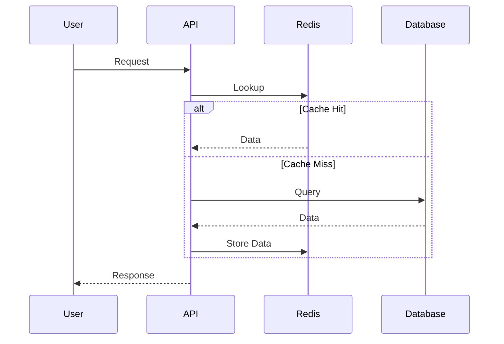

---

## Common Cached Data

* User Profiles
* Product Catalogs
* Match Data
* Configuration Settings
* Search Results

---

## Benefits

* Faster Responses
* Lower Database Load
* Improved Scalability

---

# Cache Invalidation Strategies

Caching is easy.

Cache invalidation is difficult.

---

## Time-Based Expiration

Example:

```text
TTL = 300 Seconds
```

Benefits:

* Simple
* Predictable

---

## Write Through

```text
Update Database

↓

Update Cache
```

Benefits:

* Better Consistency

---

## Cache Aside

Most common strategy.

```text
Read Cache

↓

Cache Miss

↓

Database

↓

Populate Cache
```

---

# Strategy 2: Session Storage

Redis is commonly used for centralized session management.

---

## Problem

Multiple application servers:

```text
App Server A

App Server B

App Server C
```

Session data must be shared.

---

## Solution

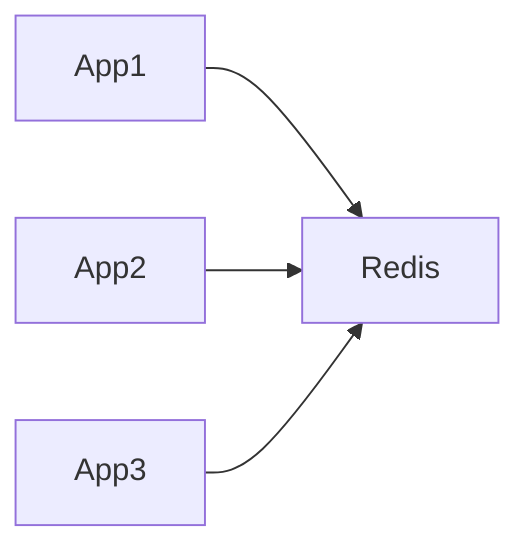

Benefits:

* Stateless Applications
* Horizontal Scaling
* Consistent Sessions

---

# Strategy 3: Leaderboards

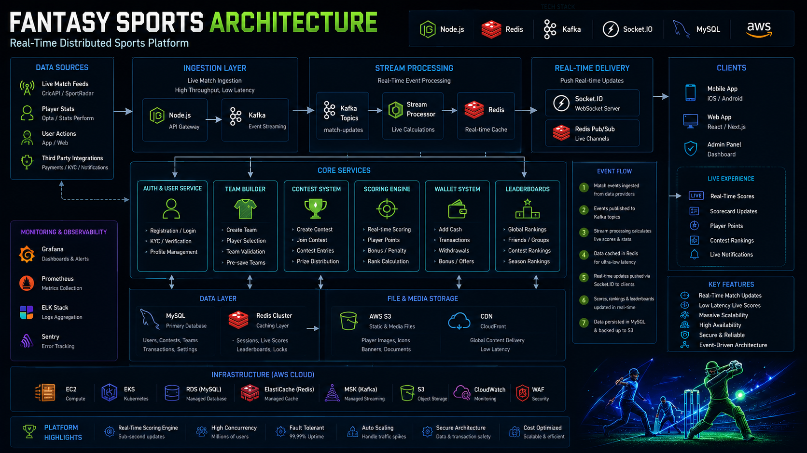

Redis Sorted Sets are ideal for ranking systems.

---

## Example

```text
User A = 100

User B = 250

User C = 150
```

Automatically ordered.

---

## Architecture

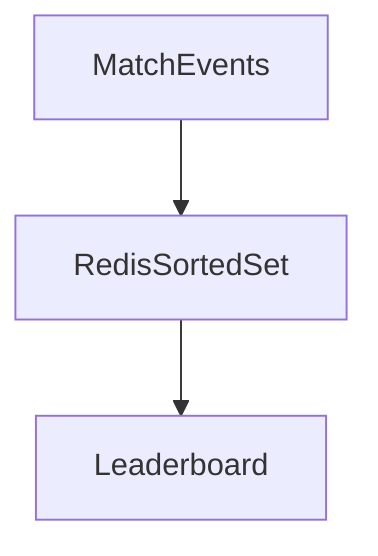

---

## Common Use Cases

* Fantasy Sports Rankings
* Gaming Scores
* Trading Competitions
* Reward Systems

---

## Benefits

* Extremely Fast Ranking
* Efficient Score Updates

---

# Strategy 4: Rate Limiting


Protect APIs from abuse.

---

## Example

```text
100 Requests

Per Minute

Per User
```

---

## Architecture

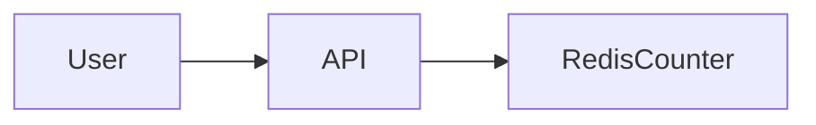

Redis tracks request counts.

---

## Benefits

* Abuse Prevention
* Security Enhancement
* Resource Protection

---

# Strategy 5: Redis Pub/Sub

Redis supports lightweight messaging.

---

## Architecture

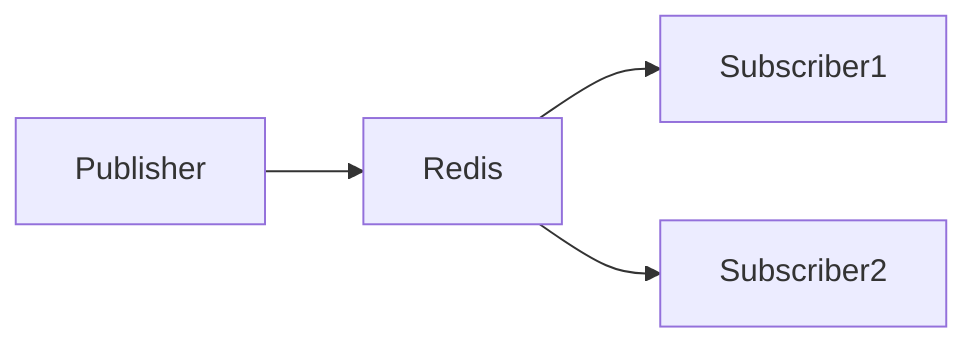

---

## Use Cases

* Notifications
* Chat Systems
* Realtime Updates

---

## Advantages

* Fast
* Simple

---

## Limitations

Messages are not persisted.

Consumers must be online.

---

# Strategy 6: Redis Streams

Redis Streams provide durable event processing.

---

## Architecture

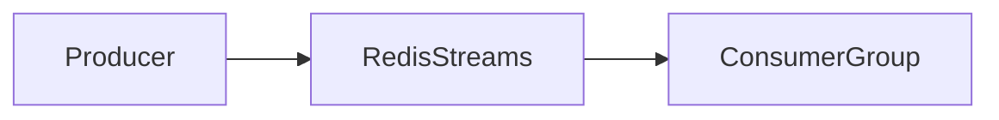

---

## Benefits

* Event Persistence
* Consumer Groups
* Replay Capability

---

## Use Cases

* Event Processing
* Background Jobs
* Workflow Systems

---

# Strategy 7: Distributed Locks

Distributed systems sometimes require coordination.

---

## Problem

Multiple workers:

```text
Worker A

Worker B

Worker C
```

Attempting the same operation.

---

## Solution

Redis Lock:

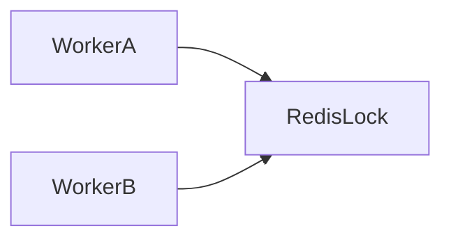

Only one worker succeeds.

---

## Use Cases

* Scheduled Jobs
* Payment Processing
* Inventory Updates

---

# Strategy 8: Realtime Systems

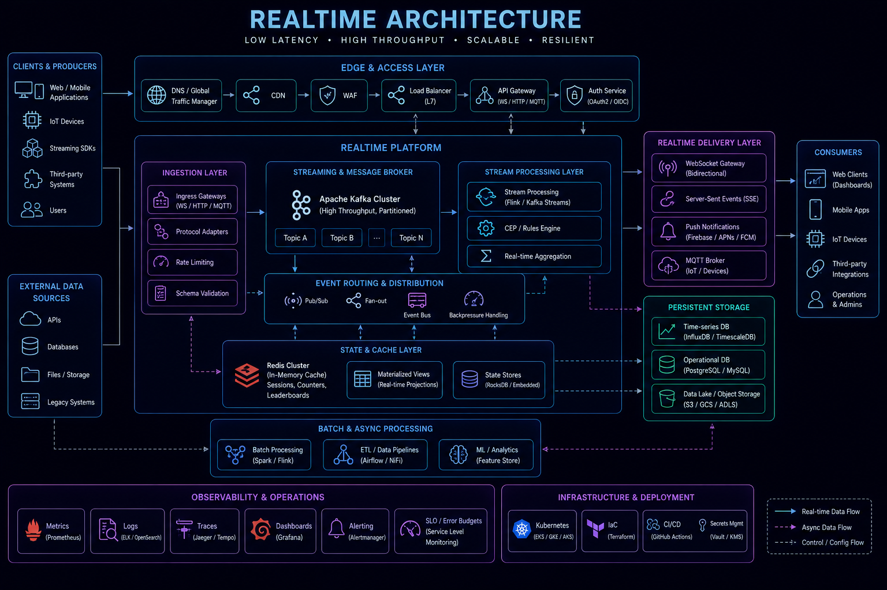

Redis is heavily used in realtime platforms.

---

## Architecture

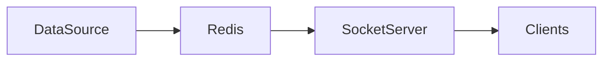

---

## Use Cases

* Live Scores
* Notifications
* Market Data
* Chat Applications

---

# Redis Clustering

Single Redis instances eventually become bottlenecks.

---

## Cluster Architecture

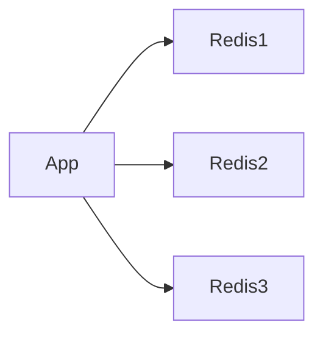

Benefits:

* Horizontal Scaling
* High Availability

---

# Redis Replication

Provides redundancy.

---

## Architecture

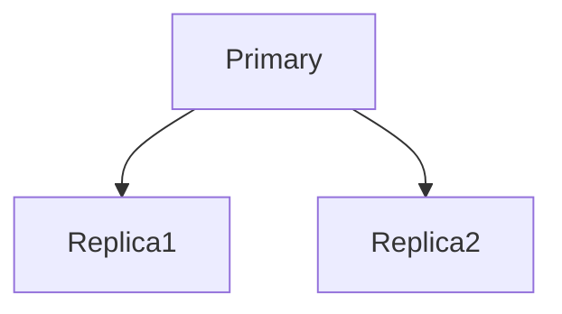

Benefits:

* Read Scaling
* Failover Support

---

# Redis Sentinel

Sentinel provides:

* Health Monitoring
* Automatic Failover
* Service Discovery

---

## Architecture

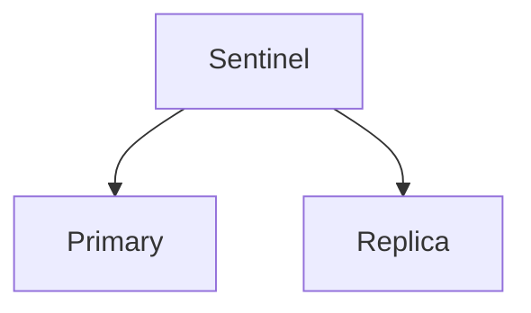

---

# Memory Management

Redis stores data in memory.

Memory planning is critical.

---

## Considerations

Monitor:

* Memory Usage
* Key Growth
* Evictions

---

## Eviction Policies

Examples:

```text
LRU

LFU

TTL Based
```

Choose according to workload.

---

# Redis Security

Security is frequently overlooked.

---

## Recommendations

* Authentication
* TLS Encryption
* Network Isolation
* Least Privilege Access

---

## Avoid

Publicly exposed Redis instances.

---

# Redis Observability


Monitor:

* Memory Usage
* Commands Per Second
* Cache Hit Rate
* Replication Lag
* Evictions
* Latency

---

# Real-World Use Cases

---

## Ecommerce Platform

Redis supports:

* Product Cache
* Cart Storage
* Session Management

---

## Fantasy Sports Platform

Redis supports:

* Leaderboards
* Match Data
* Live Rankings

---

## Opinion Trading Platform

Redis supports:

* Market Updates
* Realtime Events
* User Positions

---

## Social Networks

Redis supports:

* Timelines
* Notifications
* Session Storage

---

# Common Redis Mistakes

---

## Caching Everything

Consumes excessive memory.

---

## Missing TTLs

Creates stale data.

---

## Ignoring Memory Limits

Leads to evictions.

---

## Using Redis As Primary Database

Generally inappropriate for most workloads.

---

## No Monitoring

Operational issues become difficult to detect.

---

# Engineering Tradeoffs

| Strategy          | Benefit                | Cost                      |
| ----------------- | ---------------------- | ------------------------- |
| Caching           | Faster Responses       | Consistency Challenges    |
| Sessions          | Stateless Applications | Additional Infrastructure |
| Pub/Sub           | Simplicity             | No Persistence            |
| Streams           | Durable Messaging      | More Complexity           |
| Leaderboards      | High Performance       | Memory Usage              |
| Distributed Locks | Coordination           | Lock Management           |

---

# Redis Evolution Path

```text
Simple Cache
      │
      ▼
Session Store
      │
      ▼
Realtime Messaging
      │
      ▼
Distributed Coordination
      │
      ▼
Production Redis Platform
```

Organizations often adopt Redis incrementally.

---

# Interview Perspective

Strong system design candidates discuss:

* Cache Patterns
* TTL Strategies
* Cache Invalidation
* Rate Limiting
* Leaderboards
* Distributed Locks
* Realtime Messaging
* Redis Clustering

Rather than describing Redis only as a cache.

This demonstrates practical production experience.

---

# Engineering Outcome

Redis is one of the most versatile technologies in modern backend architecture.

When used effectively, Redis can significantly improve performance, scalability, and user experience while reducing database load and enabling realtime functionality.

Successful Redis deployments require thoughtful data modeling, memory management, observability, and operational planning to ensure Redis remains a performance accelerator rather than a new bottleneck.
