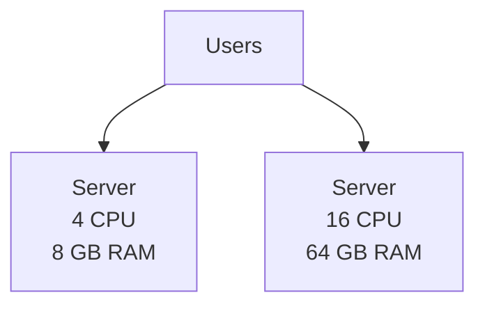
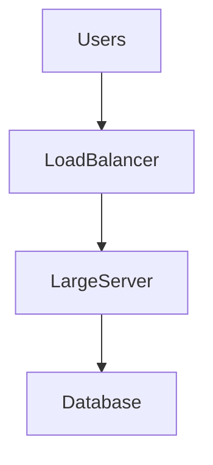
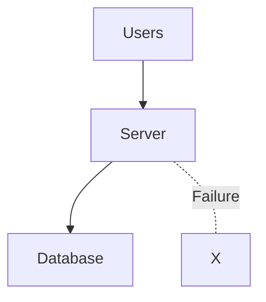
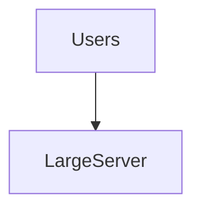
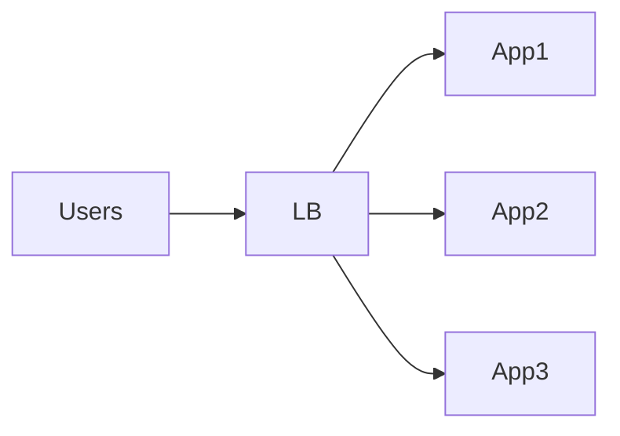
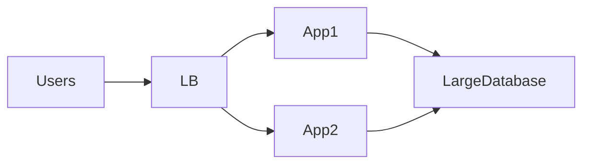

# Vertical Scaling


## Overview

Vertical scaling, also known as **scaling up**, is the process of increasing the resources of an existing machine rather than adding additional machines.

Resources commonly increased include:

* CPU
* Memory (RAM)
* Storage
* Network Capacity

Vertical scaling is often the first scalability strategy adopted by organizations because it is simple, requires minimal architectural changes, and can deliver immediate performance improvements.

However, vertical scaling has practical and economic limits that eventually require organizations to adopt horizontal scaling and distributed system architectures.

This document explores vertical scaling principles, use cases, limitations, architectural considerations, and real-world tradeoffs.

---

## Objectives

Vertical scaling aims to:

* Increase System Capacity
* Improve Performance
* Reduce Resource Bottlenecks
* Delay Architectural Complexity
* Support Business Growth

---

# What Is Vertical Scaling?

Vertical scaling improves the capabilities of an existing machine.

Example:

```text
Before

4 CPU
8 GB RAM

↓

After

16 CPU
64 GB RAM
```

The application architecture remains unchanged.

Only hardware resources increase.

---

# Visual Representation



The number of servers remains constant.

The server becomes more powerful.

---

# Why Organizations Start With Vertical Scaling

Vertical scaling is often the fastest way to increase capacity.

Benefits include:

* Simplicity
* Minimal Code Changes
* Immediate Impact
* Lower Operational Complexity

---

## Example

A Node.js API experiencing high CPU utilization may be moved from:

```text
2 vCPU
4 GB RAM
```

To:

```text
8 vCPU
16 GB RAM
```

With no application changes.

---

# Common Resources Scaled

---

## CPU Scaling

Useful for:

* Computation Heavy Workloads
* Data Processing
* Report Generation
* Analytics

---

### Example

```text
4 Cores

↓

32 Cores
```

Benefits:

* More Parallel Processing
* Increased Throughput

---

## Memory Scaling

Useful for:

* In-Memory Caches
* Large Queries
* Data Processing

---

### Example

```text
8 GB RAM

↓

128 GB RAM
```

Benefits:

* Reduced Disk Access
* Larger Cache Capacity

---

## Storage Scaling

Useful for:

* Databases
* File Storage
* Logging Systems

---

### Example

```text
500 GB SSD

↓

4 TB SSD
```

Benefits:

* Increased Capacity
* Improved Performance

---

## Network Scaling

Useful for:

* High Traffic Platforms
* Streaming Systems
* Realtime Applications

Benefits:

* Higher Throughput
* Lower Congestion

---

# Vertical Scaling Architecture

A typical vertically scaled architecture remains relatively simple.



Unlike distributed systems, operational complexity remains low.

---

# Benefits of Vertical Scaling

---

## Simplicity

The most significant advantage.

No need for:

* Service Discovery
* Distributed Caching
* Complex Networking
* Cross-Service Communication

---

## Faster Adoption

Scaling can often be completed through infrastructure changes alone.

Example:

```text
Resize Instance

Restart Service

Done
```

---

## Lower Operational Complexity

Compared to horizontal scaling:

No need for:

* Multiple Servers
* Synchronization
* Distributed Coordination

---

## Easier Debugging

Single-machine systems are generally easier to troubleshoot.

Benefits:

* Simpler Logs
* Fewer Failure Points
* Easier Monitoring

---

## Reduced Consistency Challenges

Distributed systems introduce:

* Replication Lag
* Eventual Consistency
* Network Partitions

Vertical scaling avoids many of these issues.

---

# Vertical Scaling Limitations

Every machine has finite resources.

---

## Hardware Limits

Eventually:

```text
CPU Maxed Out

Memory Maxed Out

Storage Maxed Out
```

Further scaling becomes impossible.

---

## Single Point of Failure

A vertically scaled system often relies heavily on one machine.

Example:



If the server fails:

System availability is affected.

---

## Downtime Risks

Certain infrastructure upgrades require:

* Reboots
* Migrations
* Maintenance Windows

This may impact availability.

---

## Cost Efficiency Challenges

Scaling larger machines often becomes increasingly expensive.

Example:

| CPU     | Monthly Cost |
| ------- | ------------ |
| 4 Core  | Low          |
| 8 Core  | Medium       |
| 16 Core | High         |
| 64 Core | Very High    |

Cost growth is rarely linear.

---

# Vertical Scaling in Databases

Databases are among the most common vertically scaled systems.

---

## Example

```text
MySQL Server

8 CPU
16 GB RAM

↓

32 CPU
128 GB RAM
```

Benefits:

* Faster Queries
* More Connections
* Increased Cache Capacity

---

## Common Database Bottlenecks

* CPU Saturation
* Memory Pressure
* Storage Throughput
* Connection Limits

Vertical scaling often provides immediate relief.

---

# Vertical Scaling vs Horizontal Scaling


---

## Vertical Scaling



Advantages:

* Simpler
* Easier Management

Limitations:

* Hardware Constraints

---

## Horizontal Scaling



Advantages:

* Elastic Growth
* High Availability

Limitations:

* Greater Complexity

---

# When Vertical Scaling Makes Sense

---

## Early Stage Products

Characteristics:

* Small Team
* Limited Traffic
* Rapid Development

Benefits:

* Faster Delivery
* Lower Complexity

---

## Internal Tools

Characteristics:

* Predictable Usage
* Moderate Scale

Benefits:

* Operational Simplicity

---

## Databases

Databases frequently benefit from vertical scaling before sharding becomes necessary.

---

## Analytics Systems

Resource-intensive workloads often perform well on larger machines.

---

# When Vertical Scaling Becomes a Problem

---

## Massive Traffic Growth

Example:

```text
10 Million Daily Requests

↓

100 Million Daily Requests
```

Hardware limits become restrictive.

---

## Global Applications

Requirements:

* Geographic Distribution
* Regional Redundancy

A single large machine is insufficient.

---

## High Availability Requirements

Targets:

```text
99.99%

99.999%
```

Single-machine architectures struggle to meet these goals.

---

## Distributed Workloads

Examples:

* Event Streaming
* Search Platforms
* Social Networks
* Realtime Systems

Horizontal architectures become necessary.

---

# Hybrid Scaling Strategy

Most production systems use both approaches.

---

## Example Architecture



Applications scale horizontally.

Database scales vertically.

This pattern is extremely common.

---

# Capacity Planning

Vertical scaling should be planned proactively.

---

## Metrics To Monitor

* CPU Utilization
* Memory Usage
* Disk Throughput
* Network Throughput
* Connection Counts

---

## Example Thresholds

```text
CPU > 80%

Memory > 85%

Disk Utilization > 75%
```

These metrics often trigger scaling discussions.

---

# Observability Requirements


Monitoring becomes critical as systems grow.

---

## Infrastructure Metrics

Track:

* CPU
* RAM
* Disk I/O
* Network Utilization

---

## Application Metrics

Track:

* Request Rates
* Latency
* Error Rates

---

## Capacity Metrics

Track:

* Growth Trends
* Resource Consumption
* Scaling Forecasts

---

# Real-World Examples

---

## Ecommerce Platform

Vertical scaling often supports:

* Product Database
* Admin Systems

---

## Fantasy Sports Platform

Vertical scaling may support:

* Statistics Processing
* Historical Data Analysis

---

## Opinion Trading Platform

Vertical scaling may support:

* Settlement Processing
* Reporting Systems

---

# Common Mistakes

---

## Scaling Too Late

Waiting until resources are exhausted.

---

## Ignoring Capacity Trends

Reactive scaling creates risk.

---

## Assuming Vertical Scaling Is Unlimited

Hardware limits always exist.

---

## Relying On A Single Machine

Creates reliability concerns.

---

## Ignoring Cost Curves

Large machines become expensive quickly.

---

# Engineering Tradeoffs

| Benefit                      | Cost                     |
| ---------------------------- | ------------------------ |
| Simplicity                   | Hardware Limits          |
| Faster Adoption              | Single Point of Failure  |
| Easier Operations            | Downtime Risk            |
| Immediate Capacity Gains     | Higher Cost At Scale     |
| Minimal Architecture Changes | Limited Long-Term Growth |

---

# Scaling Evolution Path

```text
Single Server
      │
      ▼
Larger Server
      │
      ▼
Very Large Server
      │
      ▼
Hybrid Scaling
      │
      ▼
Distributed Architecture
```

Many successful systems follow this progression.

---

# Interview Perspective

A common interview mistake is immediately recommending horizontal scaling.

Strong candidates recognize that:

> Vertical scaling is often the simplest and most cost-effective first step.

Before introducing distributed systems, engineers should evaluate whether additional resources on existing infrastructure solve the problem.

This demonstrates pragmatic engineering thinking.

---

# Engineering Outcome

Vertical scaling remains one of the most effective techniques for increasing system capacity while preserving architectural simplicity.

Although it cannot support unlimited growth, it provides a valuable bridge between early-stage systems and fully distributed architectures.

Successful engineering organizations understand when vertical scaling is sufficient, when horizontal scaling becomes necessary, and how to balance both approaches to achieve scalability, reliability, and cost efficiency.
