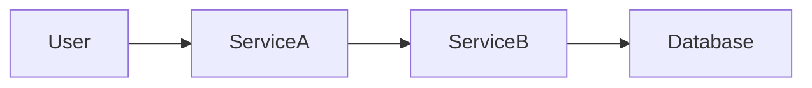
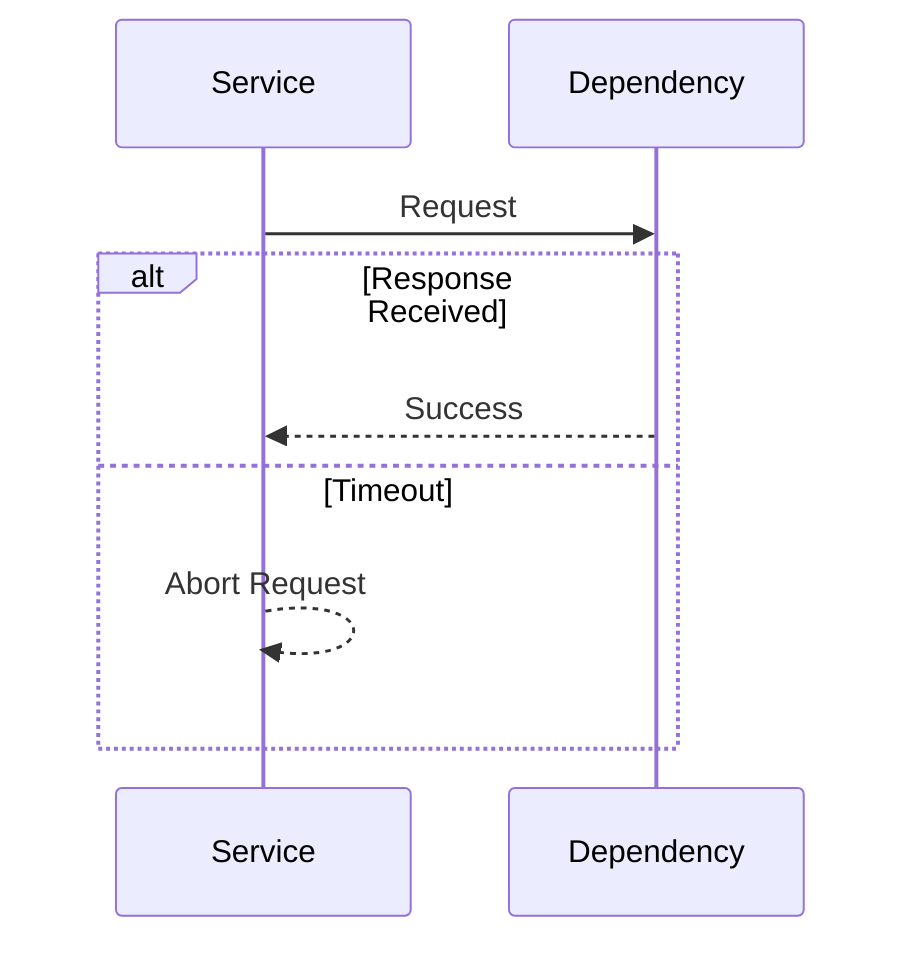
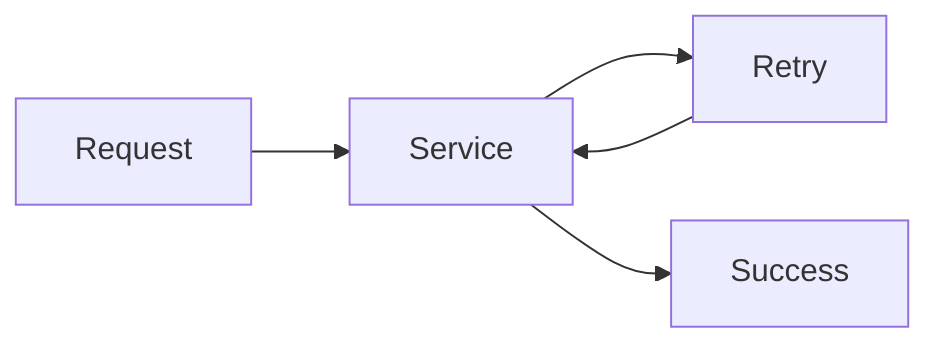
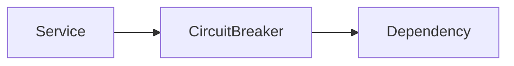
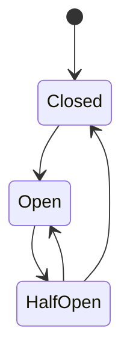
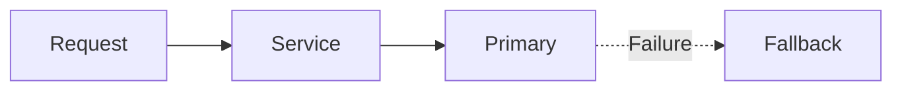
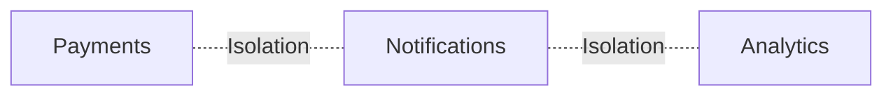
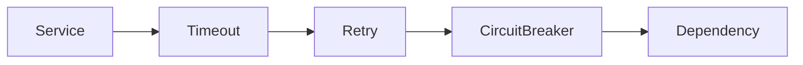
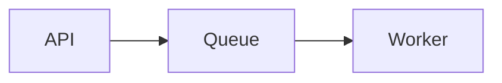

# Circuit Breakers and Retries


## Overview

Modern applications rarely operate in isolation.

Most production systems depend on:

* Databases
* Caches
* Message Brokers
* Internal Services
* External APIs
* Payment Gateways
* Authentication Providers

Every dependency introduces failure risk.

When dependencies become slow or unavailable, systems that lack resilience mechanisms often experience:

* Cascading Failures
* Resource Exhaustion
* Service Outages
* Poor User Experience

Circuit breakers, retries, timeouts, bulkheads, and fallback strategies form the foundation of resilience engineering.

These patterns help systems remain stable when failures occur.

---

## Objectives

Resilience patterns aim to:

* Prevent Cascading Failures
* Improve Reliability
* Reduce Downtime
* Protect Resources
* Enable Graceful Recovery
* Improve User Experience

---

# Why Failures Happen

Failures are normal.

Examples:

```text id="g3p8rl"
Database Outage

Cache Failure

Network Timeout

Payment Gateway Failure

DNS Problems
```

Reliable systems assume these failures will occur.

---

# The Problem With Naive Architectures

Consider:



If Database fails:

```text id="9st2xj"
Database Failure

↓

Service B Failure

↓

Service A Failure

↓

User Impact
```

This becomes a cascading failure.

---

# Timeout Pattern

The simplest resilience mechanism.

---

## Problem

Without timeouts:

```text id="4i7txm"
Request Waits Forever
```

Resources become exhausted.

---

## Solution

Define maximum wait duration.

Example:

```text id="xz3kcn"
Database Timeout

2 Seconds
```

---

## Architecture



---

## Benefits

* Faster Failure Detection
* Resource Protection

---

## Common Mistake

Timeouts that are:

```text id="2dzg6f"
Too Long
```

or

```text id="o4mpn8"
Too Short
```

Both can create operational issues.

---

# Retry Pattern

Many failures are temporary.

Examples:

* Network Glitches
* Connection Drops
* Temporary Service Unavailability

---

## Architecture



---

## Benefits

* Improved Reliability
* Reduced User Impact

---

# Retry Strategies

---

## Fixed Delay

Example:

```text id="dxtr67"
Retry Every 2 Seconds
```

Simple but often inefficient.

---

## Incremental Delay

Example:

```text id="s0e0gk"
Retry 1

1 Second

Retry 2

2 Seconds

Retry 3

3 Seconds
```

---

## Exponential Backoff

Preferred production strategy.

Delay increases exponentially.

Example:

```text id="kj3s6n"
1s

2s

4s

8s

16s
```

---

## Formula

Delay = BaseDelay \times 2^{RetryCount}

---

## Benefits

* Reduced Pressure
* Better Recovery Behavior

---

# Jitter

Exponential backoff alone is insufficient.

---

## Problem

Thousands of clients retry simultaneously.

```text id="7jlwm0"
Retry Storm
```

Occurs.

---

## Solution

Randomized delay.

Example:

```text id="z2c8w3"
2.4 Seconds

4.8 Seconds

7.1 Seconds
```

Requests become distributed.

---

# Retry Limits

Retries should always be bounded.

---

## Example

```text id="b9k2yz"
Maximum Retries = 3
```

---

## Why

Infinite retries can:

* Amplify Outages
* Increase Resource Usage
* Cause Cascading Failures

---

# Circuit Breaker Pattern

The circuit breaker pattern prevents repeated requests to failing systems.

---

## Motivation

Consider:

```text id="k4w0s7"
Payment Service Down
```

Requests continue:

```text id="s2yo6n"
Request

↓

Fail

↓

Retry

↓

Fail

↓

Retry
```

System resources become exhausted.

---

# Circuit Breaker States

---

## Closed

Normal operation.

Requests pass through.

```text id="flb44e"
Healthy State
```

---

## Open

Requests blocked.

```text id="2k8b6l"
Dependency Failing
```

No traffic forwarded.

---

## Half-Open

Limited requests allowed.

Purpose:

```text id="wdzq70"
Recovery Testing
```

---

# Architecture



---

# Circuit Breaker Flow



---

# Benefits

---

## Failure Isolation

Prevents dependency failures from spreading.

---

## Resource Protection

Reduces unnecessary requests.

---

## Faster Recovery

Allows dependencies time to recover.

---

# Fallback Pattern

Fallbacks provide alternative behavior.

---

## Example

Recommendation Engine Failure.

Primary:

```text id="gk9wy5"
ML Recommendations
```

Fallback:

```text id="l0kbg1"
Popular Products
```

---

## Architecture



---

## Benefits

* Improved User Experience
* Better Availability

---

# Bulkhead Pattern

Inspired by ship compartment design.

Failures remain isolated.

---

## Architecture



---

## Benefits

* Reduced Blast Radius
* Resource Protection

---

# Resource Isolation

Separate:

* Worker Pools
* Databases
* Queues
* Infrastructure

---

## Example

```text id="s6n94n"
Payment Workers

Notification Workers
```

Failures remain independent.

---

# Combining Resilience Patterns

Production systems typically combine multiple techniques.

---

## Architecture



---

## Benefits

* Faster Failure Detection
* Controlled Recovery
* Better Stability

---

# Queue-Based Resilience


Queues absorb temporary failures.

---

## Architecture



---

## Benefits

* Decoupling
* Retry Support
* Failure Isolation

---

# Dead Letter Queues

Failed jobs eventually require investigation.

---

## Architecture


---

## Benefits

* Prevent Infinite Retries
* Easier Debugging

---

# Database Resilience

Databases require protection as well.

---

## Strategies

* Timeouts
* Connection Limits
* Retry Policies
* Read Replicas

---

## Example

```text id="6tw0t5"
Database Slow

↓

Read Replica Used
```

---

# External API Resilience

Third-party APIs often fail unexpectedly.

---

## Recommended Pattern

```text id="7q2mj4"
Timeout

Retry

Circuit Breaker

Fallback
```

---

# Observability


Resilience mechanisms require monitoring.

---

## Metrics

Track:

* Retry Counts
* Timeout Rates
* Circuit Breaker Open Events
* Fallback Usage
* Dependency Latency

---

## Logging

Capture:

* Retry Attempts
* Failures
* Recovery Events

---

# Real-World Examples

---

## Ecommerce Platform

Resilience Patterns:

* Payment Circuit Breakers
* Email Queue Retries
* Product Cache Fallbacks

---

## Fantasy Sports Platform

Resilience Patterns:

* Realtime Feed Retries
* Cached Statistics
* Multi-Region Failover

---

## Opinion Trading Platform

Resilience Patterns:

* Settlement Retries
* Market Feed Fallbacks
* Queue-Based Processing

---

# Common Mistakes

---

## Infinite Retries

Creates retry storms.

---

## Missing Timeouts

Resources become exhausted.

---

## No Circuit Breakers

Failures cascade through services.

---

## No Fallback Strategy

Users receive hard failures.

---

## No Monitoring

Resilience failures remain invisible.

---

# Engineering Tradeoffs

| Pattern          | Benefit                  | Cost                      |
| ---------------- | ------------------------ | ------------------------- |
| Timeouts         | Faster Failure Detection | Tuning Complexity         |
| Retries          | Improved Reliability     | Additional Traffic        |
| Circuit Breakers | Failure Isolation        | Configuration Overhead    |
| Fallbacks        | Better UX                | Additional Logic          |
| Bulkheads        | Resource Protection      | Infrastructure Complexity |

---

# Reliability Evolution Path

```text id="6gx3mr"
Basic Error Handling
        │
        ▼
Timeouts
        │
        ▼
Retries
        │
        ▼
Circuit Breakers
        │
        ▼
Fallbacks
        │
        ▼
Resilient Distributed Platform
```

---

# Interview Perspective

Strong system design candidates discuss:

* Timeout Values
* Retry Strategies
* Exponential Backoff
* Circuit Breaker States
* Bulkheads
* Failure Isolation
* Dependency Management

Rather than assuming dependencies always behave correctly.

Reliable systems are designed around failure expectations.

---

# Engineering Outcome

Circuit breakers, retries, timeouts, bulkheads, and fallback strategies form the foundation of resilient distributed systems.

These patterns help organizations build platforms that remain operational despite dependency failures, infrastructure issues, and unexpected outages.

The strongest systems are not those that avoid failure entirely—they are the systems designed to detect, isolate, tolerate, and recover from failures efficiently and predictably.
