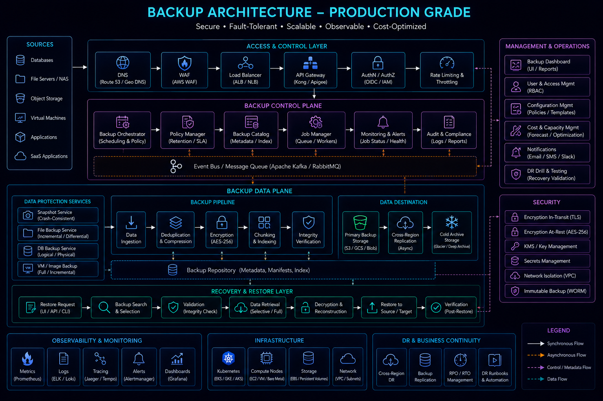
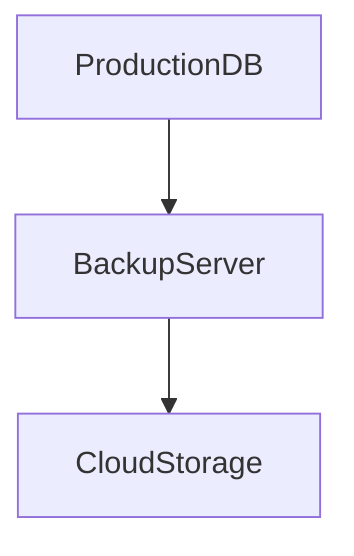
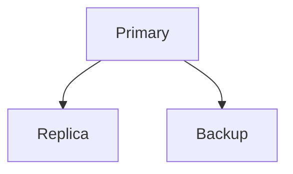
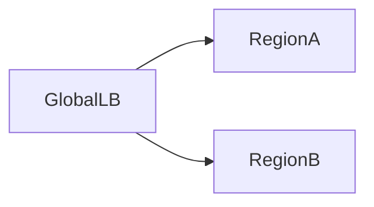

# Disaster Recovery


## Overview

Every production system eventually experiences failures.

Most failures are localized and recoverable:

* Server Crashes
* Database Failures
* Deployment Issues
* Network Interruptions

However, some failures exceed normal operational boundaries and become disasters.

Examples include:

* Regional Cloud Outages
* Data Center Failures
* Data Corruption
* Ransomware Attacks
* Major Security Incidents
* Human Errors
* Catastrophic Infrastructure Failures

Disaster Recovery (DR) is the discipline of preparing systems, teams, and processes to recover from these events while minimizing business impact.

The objective is not merely restoring infrastructure.

The objective is restoring business operations.

---

## Objectives

Disaster recovery planning aims to:

* Protect Critical Data
* Minimize Downtime
* Reduce Revenue Impact
* Support Business Continuity
* Enable Predictable Recovery
* Increase Organizational Resilience

---

# What Is a Disaster?

A disaster is an event that exceeds normal operational recovery capabilities.

---

## Examples

### Infrastructure Disaster

```text id="4v3nzw"
Entire Region Offline
```

---

### Data Disaster

```text id="zqewho"
Database Corruption
```

---

### Security Disaster

```text id="l3ew5m"
Ransomware Attack
```

---

### Operational Disaster

```text id="1gqj8q"
Accidental Production Data Deletion
```

---

## Key Characteristic

Normal failover procedures are insufficient.

Additional recovery processes become necessary.

---

# Business Continuity vs Disaster Recovery

Although related, these concepts are different.

---

## Business Continuity

Focuses on:

```text id="y4wllj"
Maintaining Business Operations
```

---

## Disaster Recovery

Focuses on:

```text id="aqrj8n"
Restoring Systems
```

---

## Relationship

Disaster recovery supports business continuity.

---

# Recovery Metrics

Two metrics guide disaster recovery planning.

---

## Recovery Time Objective (RTO)

Maximum acceptable recovery duration.

Example:

```text id="x4l3jw"
15 Minutes
```

Meaning:

The system must be restored within 15 minutes.

---

## Recovery Point Objective (RPO)

Maximum acceptable data loss.

Example:

```text id="m5ov5e"
5 Minutes
```

Meaning:

No more than 5 minutes of data may be lost.

---

## Relationship

Business\ Risk \propto RTO + RPO

Lower RTO and RPO values generally require greater engineering investment.

---

# Disaster Recovery Tiers

Different businesses require different recovery capabilities.

---

## Tier 0

No Recovery Plan

Characteristics:

```text id="8slcrd"
Manual Recovery
```

High risk.

---

## Tier 1

Basic Backups

Characteristics:

```text id="cvmk4f"
Periodic Backups
```

Recovery may take hours or days.

---

## Tier 2

Automated Backups

Characteristics:

```text id="xljlqv"
Regular Snapshots
```

Improved recovery speed.

---

## Tier 3

Warm Standby

Characteristics:

```text id="3fy3vg"
Secondary Environment Available
```

Reduced downtime.

---

## Tier 4

Multi-Region Recovery

Characteristics:

```text id="q8z1hr"
Cross-Region Infrastructure
```

High resilience.

---

## Tier 5

Active-Active Global Architecture

Characteristics:

```text id="u5c8f0"
Multiple Regions Live
```

Maximum resilience.

---

# Backup Strategies

Backups are the foundation of disaster recovery.

---

## Architecture


---

## Goals

* Data Protection
* Recovery Capability
* Compliance Requirements

---

# Full Backups

Entire dataset copied.

---

## Benefits

* Simple Recovery

---

## Tradeoffs

* Large Storage Requirements
* Longer Backup Time

---

# Incremental Backups

Only changes are copied.

---

## Benefits

* Faster Backup Operations
* Reduced Storage Usage

---

## Tradeoffs

* More Complex Recovery

---

# Differential Backups

Changes since last full backup.

---

## Benefits

* Faster Recovery Than Incremental

---

## Tradeoffs

* Larger Backup Size

---

# Backup Architecture





---

# Backup Best Practices

---

## Automated Backups

Never rely on manual execution.

---

## Encryption

Protect backup data.

---

## Offsite Storage

Avoid storing backups only in production regions.

---

## Retention Policies

Example:

```text id="y4j7k2"
Daily: 30 Days

Weekly: 12 Weeks

Monthly: 12 Months
```

---

# Database Recovery Architecture

Databases typically represent the most critical recovery target.

---

## Replication



---

## Benefits

* Recovery Flexibility
* Reduced Data Loss

---

# Cross-Region Replication


Regional failures require geographic redundancy.

---

## Architecture


---

## Benefits

* Disaster Recovery
* Geographic Resilience

---

## Challenges

* Replication Cost
* Consistency Management

---

# Warm Standby Architecture

Secondary infrastructure exists but handles minimal traffic.

---

## Architecture


---

## Recovery Process

```text id="eblm7w"
Primary Failure

↓

Traffic Redirected

↓

Standby Activated
```

---

## Benefits

* Faster Recovery

---

## Tradeoffs

* Additional Infrastructure Cost

---

# Active-Passive Recovery

One environment remains inactive until disaster occurs.

---

## Benefits

* Lower Cost

---

## Tradeoffs

* Slower Recovery

---

# Active-Active Recovery

Multiple environments serve traffic simultaneously.

---

## Architecture



---

## Benefits

* Lowest Downtime
* Fastest Recovery

---

## Tradeoffs

* Highest Complexity

---

# Infrastructure Recovery

Modern infrastructure should be reproducible.

---

## Infrastructure as Code

Examples:

* Terraform
* CloudFormation
* Pulumi

---

## Benefits

* Faster Recovery
* Consistent Environments

---

## Recovery Principle

Infrastructure should be recreated, not manually rebuilt.

---

# Incident Response

Recovery requires both technology and process.

---

## Incident Lifecycle


---

# Detection

Identify issues quickly.

---

## Sources

* Monitoring
* Alerts
* User Reports

---

# Response

Contain damage.

Examples:

* Disable Services
* Isolate Systems
* Redirect Traffic

---

# Recovery

Restore normal operations.

---

# Post-Incident Review

Analyze:

* Root Cause
* Recovery Effectiveness
* Preventive Improvements

---

# Disaster Recovery Testing

A disaster recovery plan is useless if never tested.

---

## Common Mistake

```text id="utg79t"
Backup Exists

↓

Recovery Never Tested
```

---

## Types of Testing

### Backup Restoration Testing

Verify data restoration.

---

### Failover Testing

Verify standby environments.

---

### Regional Failover Testing

Verify cross-region recovery.

---

### Full Simulation

Test complete recovery process.

---

# Observability During Recovery


Recovery requires visibility.

---

## Metrics

Monitor:

* Recovery Progress
* Service Availability
* Data Replication Status

---

## Logging

Track:

* Recovery Events
* Failover Actions
* Incident Timeline

---

# Security Considerations

Disasters often include security events.

---

## Requirements

* Secure Backups
* Access Controls
* Audit Trails
* Recovery Verification

---

# Real-World Examples

---

## Ecommerce Platform

Requirements:

* Order Data Protection
* Payment Recovery

Solutions:

* Database Replication
* Daily Backups
* Multi-AZ Deployment

---

## Fantasy Sports Platform

Requirements:

* Contest Data Preservation
* Match History Recovery

Solutions:

* Cross-Region Replication
* Automated Backups

---

## Opinion Trading Platform

Requirements:

* Trade Integrity
* Settlement Recovery

Solutions:

* Active-Passive Recovery
* Point-in-Time Recovery

---

# Common Disaster Recovery Mistakes

---

## No Recovery Testing

Plans remain theoretical.

---

## Single Backup Location

Disaster affects backups too.

---

## Weak Documentation

Recovery becomes slower.

---

## Undefined RTO/RPO

Recovery expectations unclear.

---

## Manual Recovery Processes

Increase recovery time.

---

# Engineering Tradeoffs

| Strategy             | Benefit          | Cost                      |
| -------------------- | ---------------- | ------------------------- |
| Backups              | Data Protection  | Storage Cost              |
| Warm Standby         | Faster Recovery  | Additional Infrastructure |
| Multi-Region         | High Resilience  | Operational Complexity    |
| Active-Active        | Minimal Downtime | Highest Cost              |
| Frequent Replication | Low RPO          | Network Cost              |

---

# Recovery Maturity Path

```text id="c8r6tk"
Manual Backups
       │
       ▼
Automated Backups
       │
       ▼
Cross-Region Replication
       │
       ▼
Warm Standby
       │
       ▼
Active-Passive Recovery
       │
       ▼
Active-Active Platform
```

---

# Interview Perspective

Strong system design candidates discuss:

* RTO
* RPO
* Backup Strategies
* Regional Failures
* Recovery Testing
* Business Continuity

Rather than assuming infrastructure never experiences catastrophic failures.

---

# Engineering Outcome

Disaster recovery is ultimately about protecting business operations from catastrophic events.

Successful recovery strategies combine backups, replication, failover architectures, testing, automation, and disciplined operational processes to ensure organizations can recover quickly and predictably when disasters occur.

The strongest systems are not those that avoid disasters entirely—they are the systems prepared to recover from them.
