# Fault Tolerance


## Overview

Failures are unavoidable in distributed systems.

Servers crash.
Networks become unreliable.
Databases experience outages.
External services fail.
Cloud providers experience incidents.

A fault-tolerant system continues functioning despite these failures, either by recovering automatically, degrading gracefully, or isolating failures before they impact the broader platform.

Fault tolerance is a cornerstone of modern reliability engineering and is essential for building systems that remain operational under real-world conditions.

This document explores fault tolerance principles, reliability patterns, recovery strategies, and production-grade architectural approaches.

---

## Objectives

Fault-tolerant systems aim to:

* Continue Operating During Failures
* Reduce User Impact
* Prevent Cascading Failures
* Improve Recovery Speed
* Increase System Resilience
* Support High Availability Goals

---

# Understanding Failures

Distributed systems fail in many ways.

---

## Infrastructure Failures

Examples:

* Server Crashes
* Disk Failures
* Power Outages
* Network Interruptions

---

## Application Failures

Examples:

* Runtime Exceptions
* Memory Leaks
* Resource Exhaustion
* Deployment Errors

---

## Dependency Failures

Examples:

* Database Unavailability
* Cache Failures
* Third-Party API Outages

---

## Human Errors

Examples:

* Configuration Mistakes
* Deployment Issues
* Operational Mistakes

---

# Fault Tolerance vs High Availability

Although related, they are different concepts.

---

## Fault Tolerance

Focuses on:

```text id="4kg7yx"
System Continues Operating

Despite Failures
```

---

## High Availability

Focuses on:

```text id="z6p8ik"
Minimizing Downtime
```

---

## Relationship

Fault tolerance contributes directly to high availability.

A highly available system often relies on fault-tolerant design patterns.

---

# Failure Domains

Failures should be isolated whenever possible.

---

## Example

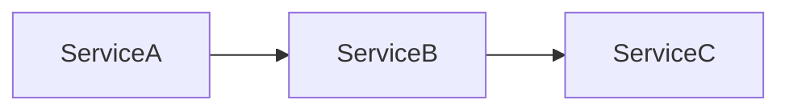

Failure in Service B can affect the entire chain.

---

## Goal

Reduce blast radius.

Contain failures within limited boundaries.

---

# Redundancy

Redundancy is one of the primary fault tolerance strategies.

---

## Example

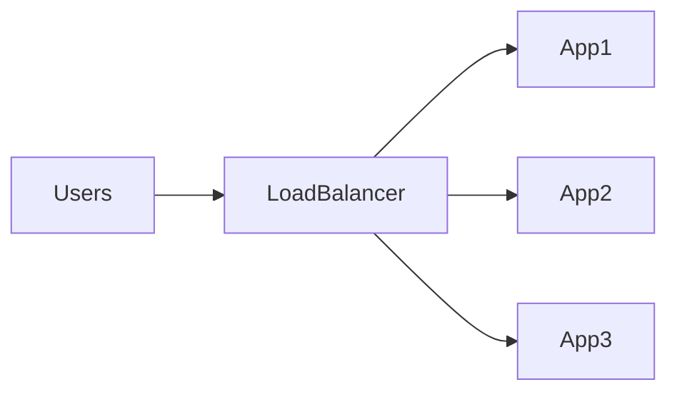

Benefits:

* Fault Isolation
* Service Continuity

---

# Graceful Degradation

Not all functionality is equally important.

Critical functionality should continue operating even if secondary services fail.

---

## Example

Ecommerce Platform:

```text id="z0cb7v"
Checkout

Critical
```

```text id="m7z9ks"
Recommendations

Optional
```

If recommendations fail:

Checkout should remain operational.

---

## Architecture

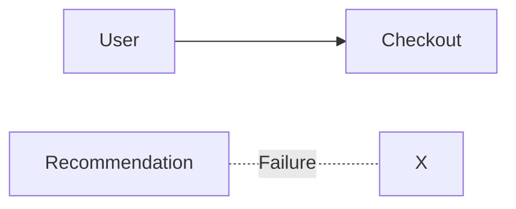

---

# Retry Pattern

Many failures are temporary.

Examples:

* Network Glitches
* Connection Timeouts
* Temporary Service Unavailability

---

## Architecture

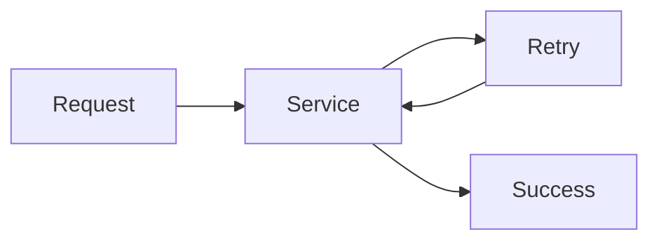

---

## Best Practices

* Exponential Backoff
* Retry Limits
* Jitter

---

## Poor Strategy

```text id="fkgv3h"
Infinite Retries
```

Can create system-wide instability.

---

# Circuit Breaker Pattern


Circuit breakers prevent cascading failures.

---

## Problem

```text id="2a0h6j"
Service A

↓

Service B Down

↓

Requests Continue
```

Resources become exhausted.

---

## Circuit Breaker States

### Closed

Normal operation.

### Open

Requests blocked.

### Half Open

Limited testing requests allowed.

---

## Architecture

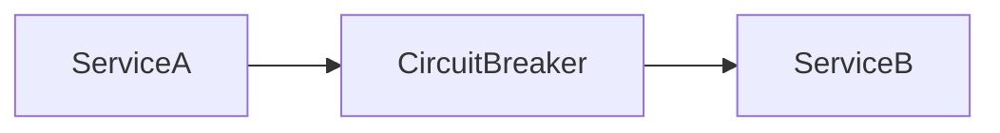

---

## Benefits

* Failure Isolation
* Resource Protection
* Faster Recovery

---

# Timeout Pattern

Operations should never wait indefinitely.

---

## Example

```text id="5q8zzf"
Request Timeout

2 Seconds
```

---

## Benefits

* Resource Protection
* Faster Failure Detection

---

## Risks

Excessive timeouts can:

* Increase Latency
* Exhaust Resources

---

# Bulkhead Pattern

Inspired by ship compartments.

Failures remain isolated.

---

## Architecture

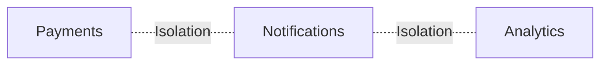

---

## Benefits

* Failure Containment
* Resource Isolation

---

# Fallback Pattern

Alternative behavior when dependencies fail.

---

## Example

Product Recommendations:

Primary Source:

```text id="l1gzwz"
ML Recommendation Engine
```

Unavailable.

Fallback:

```text id="j1lm8v"
Popular Products
```

---

## Benefits

* Improved User Experience
* Better Availability

---

# Queue-Based Fault Isolation


Queues help absorb failures.

---

## Architecture

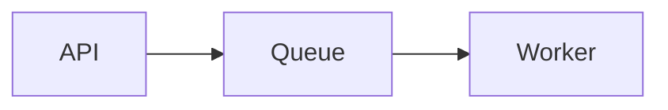

---

## Benefits

* Decoupling
* Failure Isolation
* Backpressure Handling

---

# Dead Letter Queues

Repeatedly failing jobs should be isolated.

---

## Architecture


---

## Benefits

* Prevent Infinite Retries
* Easier Investigation

---

# Database Fault Tolerance

Databases frequently represent critical failure points.

---

## Replication

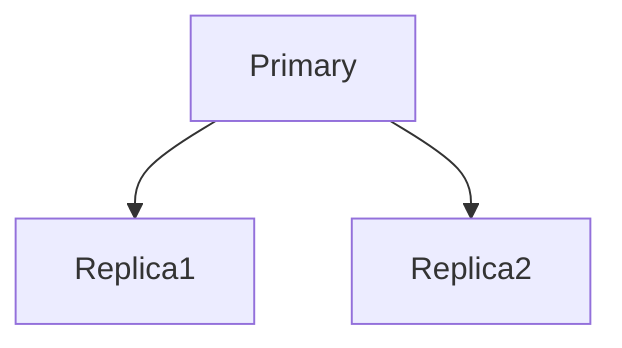

---

## Benefits

* Redundancy
* Recovery Capability

---

## Automatic Promotion

If primary fails:

```text id="r43xew"
Replica

↓

New Primary
```

---

# Cache Fault Tolerance

Redis outages should not completely break applications.

---

## Architecture

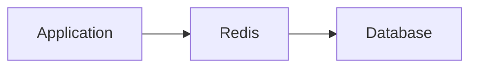

---

## Failure Scenario

Redis unavailable:

Application falls back to database.

---

## Benefits

* Continued Operation

---

# Multi-Availability Zone Design

Cloud infrastructure should tolerate zone failures.

---

## Architecture

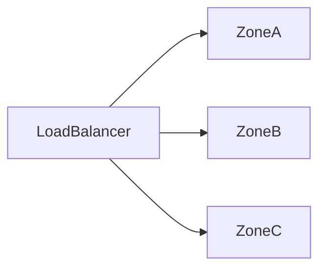

---

## Benefits

* Infrastructure Resilience
* Reduced Blast Radius

---

# Multi-Region Fault Tolerance


Entire regions can fail.

---

## Architecture

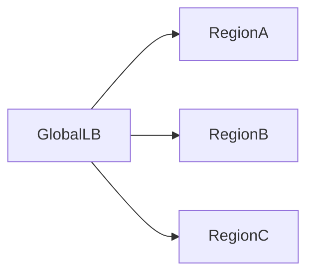

---

## Benefits

* Disaster Recovery
* Geographic Redundancy

---

# Fault Injection Testing

Reliability requires validation.

---

## Principle

Intentionally introduce failures.

Examples:

```text id="7w6pgi"
Kill Servers

Disable Databases

Inject Latency

Drop Network Traffic
```

---

## Goal

Verify system resilience.

---

# Chaos Engineering

Fault tolerance at scale often requires chaos testing.

---

## Examples

* Random Instance Termination
* Network Partition Simulation
* Dependency Failure Testing

---

## Benefits

* Increased Confidence
* Improved Reliability

---

# Observability


Fault tolerance depends on visibility.

---

## Metrics

Monitor:

* Error Rates
* Availability
* Retry Counts
* Queue Backlogs
* Failover Events

---

## Logging

Track:

* Exceptions
* Incidents
* Dependency Failures

---

## Tracing

Identify:

* Failure Sources
* Service Dependencies

---

# Real-World Examples

---

## Ecommerce Platform

Fault Tolerance Strategies:

* Payment Retries
* Queue-Based Notifications
* Read Replicas

---

## Fantasy Sports Platform

Fault Tolerance Strategies:

* Redundant Realtime Services
* Cached Match Data
* Multi-Region Infrastructure

---

## Opinion Trading Platform

Fault Tolerance Strategies:

* Queue-Based Settlement
* Database Replication
* Circuit Breakers

---

# Common Mistakes

---

## No Timeouts

Creates resource exhaustion.

---

## No Circuit Breakers

Causes cascading failures.

---

## Infinite Retries

Amplifies outages.

---

## Shared Resources

Increases blast radius.

---

## No Recovery Testing

Assumptions remain unverified.

---

# Engineering Tradeoffs

| Strategy         | Benefit                | Cost                     |
| ---------------- | ---------------------- | ------------------------ |
| Retries          | Improved Reliability   | Additional Traffic       |
| Circuit Breakers | Failure Isolation      | Configuration Complexity |
| Redundancy       | Availability           | Infrastructure Cost      |
| Multi-Region     | Disaster Recovery      | Operational Overhead     |
| Chaos Testing    | Reliability Validation | Engineering Investment   |

---

# Reliability Evolution Path

```text id="8rzah8"
Basic Error Handling
        │
        ▼
Retries
        │
        ▼
Circuit Breakers
        │
        ▼
Redundancy
        │
        ▼
Multi-Region Recovery
        │
        ▼
Fault-Tolerant Platform
```

---

# Interview Perspective

Strong system design candidates discuss:

* Failure Scenarios
* Circuit Breakers
* Retries
* Timeouts
* Redundancy
* Failover
* Recovery Strategies

Rather than assuming components never fail.

Engineering maturity is often measured by how well an engineer plans for failure.

---

# Engineering Outcome

Fault tolerance is the discipline of designing systems that continue delivering value even when components fail.

Successful fault-tolerant architectures combine redundancy, isolation, retries, circuit breakers, graceful degradation, observability, and recovery automation to ensure failures remain manageable rather than catastrophic.

The most resilient systems are not those that never fail—they are those that fail predictably, recover quickly, and minimize impact on users and business operations.
