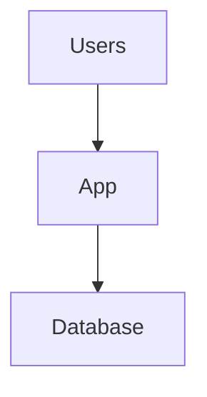
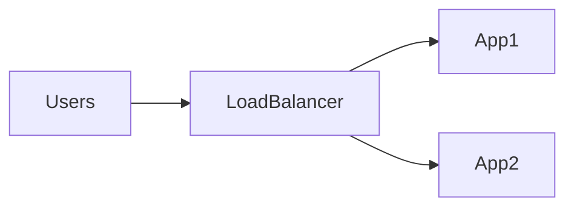
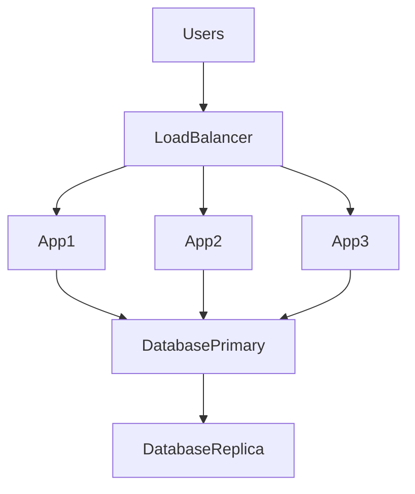
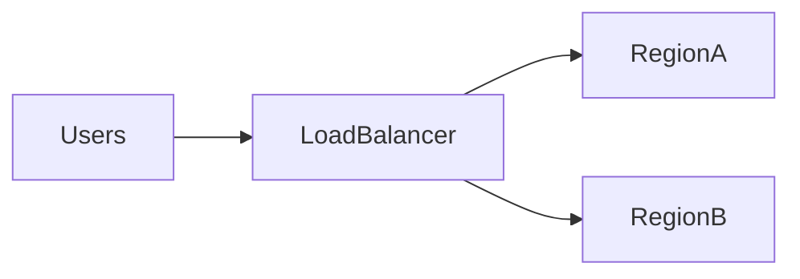
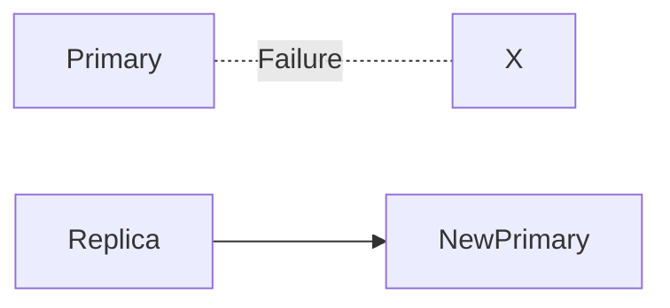
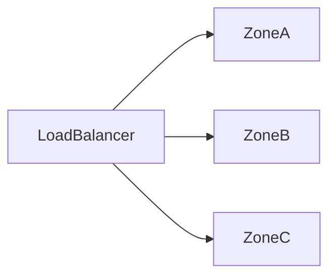
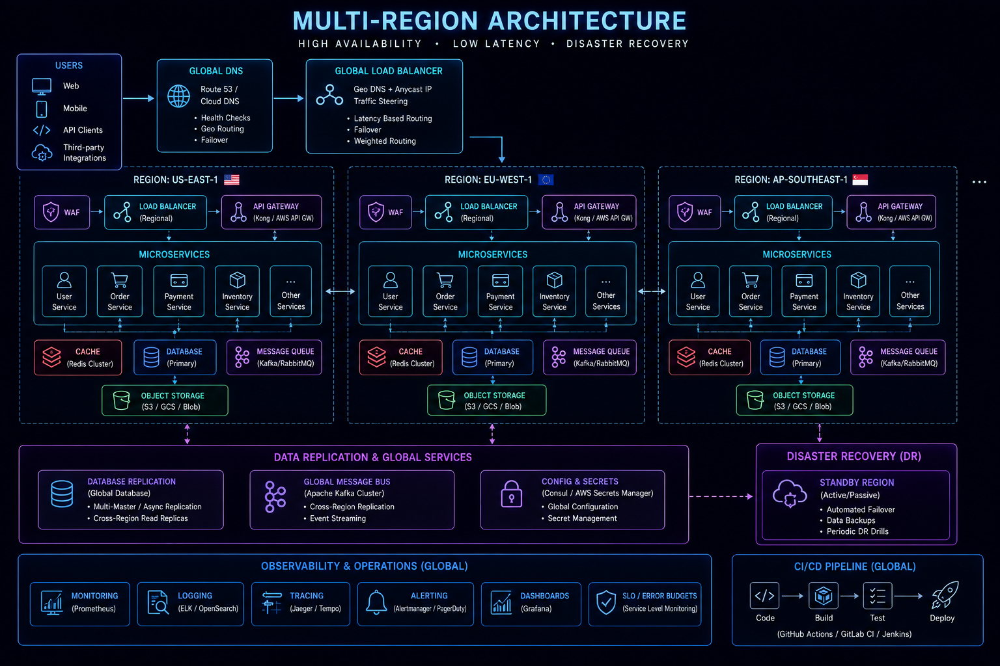
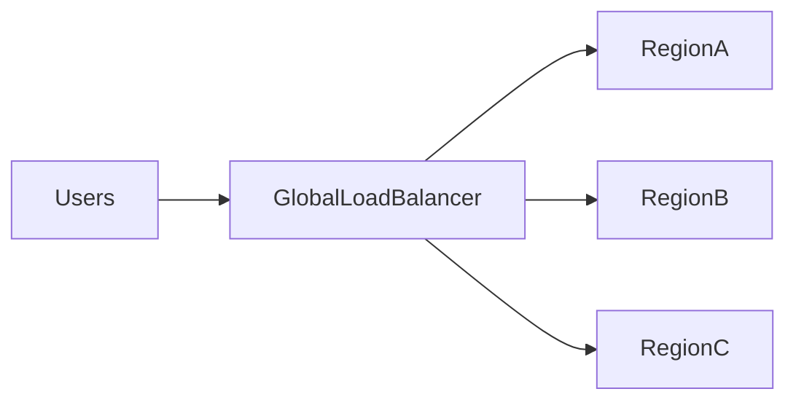
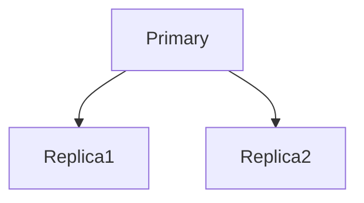
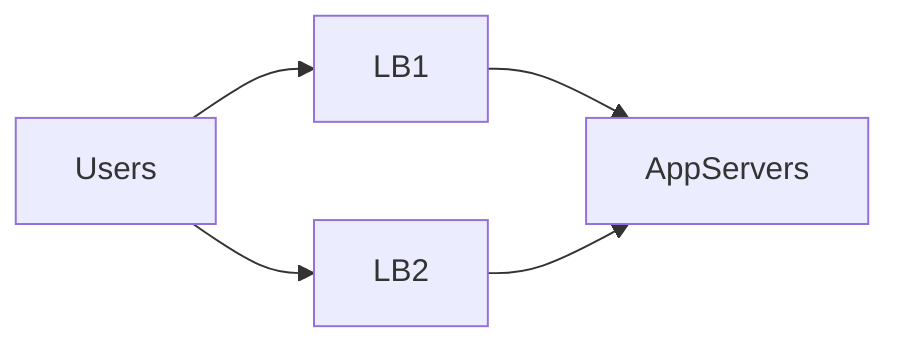

# High Availability


## Overview

High Availability (HA) is the practice of designing systems that remain operational despite failures.

In production environments, failures are inevitable.

Servers crash.
Networks fail.
Databases become unavailable.
Cloud regions experience outages.
Human errors occur.

The objective of reliability engineering is not to eliminate failures, but to ensure systems continue operating when failures happen.

High availability architecture enables organizations to:

* Minimize Downtime
* Improve User Experience
* Protect Revenue
* Meet Service Level Objectives
* Reduce Operational Risk

This document explores high availability principles, architectural patterns, tradeoffs, and production-grade reliability strategies.

---

## Objectives

High availability systems aim to:

* Eliminate Single Points of Failure
* Improve Fault Tolerance
* Enable Fast Recovery
* Maintain Service Continuity
* Support Business Reliability Goals

---

# Understanding Availability

Availability measures the percentage of time a system remains operational.

---

## Availability Formula

Availability = \frac{Uptime}{Uptime + Downtime}

---

## Common Availability Targets

| Availability | Downtime Per Year |
| ------------ | ----------------- |
| 99%          | ~3.65 Days        |
| 99.9%        | ~8.76 Hours       |
| 99.99%       | ~52.6 Minutes     |
| 99.999%      | ~5.26 Minutes     |

---

## Engineering Reality

Increasing availability becomes progressively more expensive.

Example:

```text
99% → Relatively Easy

99.9% → Moderate Complexity

99.99% → Significant Investment

99.999% → Extremely Expensive
```

Every additional "nine" requires substantial engineering effort.

---

# Why Systems Become Unavailable

---

## Infrastructure Failures

Examples:

* Server Failures
* Storage Failures
* Network Outages

---

## Application Failures

Examples:

* Memory Leaks
* Runtime Exceptions
* Deployment Issues

---

## Database Failures

Examples:

* Connection Exhaustion
* Replication Failures
* Storage Problems

---

## Human Errors

Examples:

* Incorrect Deployments
* Configuration Mistakes
* Operational Mistakes

---

## External Dependencies

Examples:

* Payment Providers
* Third-Party APIs
* Authentication Services

---

# Single Point of Failure (SPOF)

A single point of failure is any component whose failure causes service disruption.

---

## Example



Single database.

If the database fails:

System becomes unavailable.

---

## Goal

Eliminate all critical single points of failure.

---

# Redundancy

Redundancy is the foundation of high availability.

---

## Basic Principle

Never rely on a single critical component.

---

## Example



Benefits:

* Fault Tolerance
* Improved Reliability

---

# High Availability Architecture




---

# Active-Passive Architecture

One system actively serves traffic.

A secondary system remains on standby.

---

## Architecture


---

## Failure Scenario

```text
Active System Fails

↓

Passive Takes Over
```

---

## Advantages

* Simpler Operations
* Easier Recovery

---

## Tradeoffs

* Underutilized Resources
* Failover Delay

---

# Active-Active Architecture

Multiple systems actively serve traffic simultaneously.

---

## Architecture



---

## Benefits

* Better Resource Utilization
* Faster Recovery
* Improved Scalability

---

## Tradeoffs

* Increased Complexity
* Data Synchronization Challenges

---

# Failover Strategies

Failover transfers workload from failed systems to healthy systems.

---

## Automatic Failover



Benefits:

* Faster Recovery
* Reduced Downtime

---

## Manual Failover

Requires operator intervention.

Benefits:

* Greater Control

Tradeoff:

* Slower Recovery

---

# Availability Zones

Cloud providers divide infrastructure into isolated zones.

Examples:

* AWS Availability Zones
* Azure Availability Zones
* Google Cloud Zones

---

## Architecture



---

## Benefits

* Fault Isolation
* Improved Resilience

---

# Multi-Region Architecture



Regional outages can impact entire zones.

Multi-region architectures provide stronger resilience.

---

## Architecture



---

## Benefits

* Disaster Recovery
* Geographic Redundancy
* Reduced Latency

---

## Challenges

* Data Replication
* Consistency
* Operational Complexity

---

# Database High Availability

Databases are often the most critical infrastructure component.

---

## Replication



Benefits:

* Redundancy
* Recovery

---

## Automated Promotion

If primary fails:

```text
Replica Promoted

↓

New Primary
```

---

# Load Balancer High Availability

A load balancer itself can become a single point of failure.

---

## Solution



---

# Reliability Patterns

---

## Circuit Breakers

Prevent cascading failures.

---

## Retries

Handle transient failures.

---

## Timeouts

Prevent resource exhaustion.

---

## Bulkheads

Isolate workloads.

Example:

```text
Payments

Notifications

Analytics
```

Failures remain contained.

---

# SLA, SLO, and SLIs


Reliability engineering relies on measurable goals.

---

## SLA

Service Level Agreement.

Business commitment.

Example:

```text
99.9% Uptime
```

---

## SLO

Service Level Objective.

Engineering target.

Example:

```text
99.95% Availability
```

---

## SLI

Service Level Indicator.

Measured metric.

Example:

```text
Successful Requests / Total Requests
```

---

# Error Budgets

Error budgets balance reliability and innovation.

---

## Example

Availability Target:

```text
99.9%
```

Allowed Downtime:

```text
~8.76 Hours Per Year
```

This downtime allowance becomes the error budget.

---

## Benefits

* Reliability Visibility
* Better Release Decisions

---

# Disaster Recovery

High availability reduces outages.

Disaster recovery handles catastrophic failures.

---

## Recovery Metrics

### RTO

Recovery Time Objective

Maximum acceptable recovery time.

---

### RPO

Recovery Point Objective

Maximum acceptable data loss.

---

## Example

```text
RTO = 15 Minutes

RPO = 5 Minutes
```

---

# Observability

Observability is essential for high availability.

---

## Metrics

Monitor:

* Availability
* Latency
* Error Rate
* Resource Utilization

---

## Logging

Track:

* Failures
* Incidents
* Deployments

---

## Tracing

Identify:

* Failure Sources
* Dependency Problems

---

# Common Availability Mistakes

---

## Single Database

Creates critical risk.

---

## Single Region

Regional outages affect all users.

---

## Missing Health Checks

Failed systems continue receiving traffic.

---

## Weak Monitoring

Issues detected too late.

---

## No Failover Testing

Recovery procedures remain unverified.

---

# Real-World Examples

---

## Ecommerce Platform

Requirements:

* Checkout Availability
* Payment Reliability

Solutions:

* Multi-AZ Deployments
* Database Replication

---

## Fantasy Sports Platform

Requirements:

* Match Availability
* Realtime Updates

Solutions:

* Redundant Services
* Multi-Region Failover

---

## Opinion Trading Platform

Requirements:

* Trading Availability
* Settlement Reliability

Solutions:

* Active-Active Services
* Database Redundancy

---

# Engineering Tradeoffs

| Strategy           | Benefit           | Cost                 |
| ------------------ | ----------------- | -------------------- |
| Redundancy         | Reliability       | Infrastructure Cost  |
| Active-Passive     | Simplicity        | Resource Waste       |
| Active-Active      | High Availability | Complexity           |
| Multi-Region       | Disaster Recovery | Operational Overhead |
| Automated Failover | Faster Recovery   | Additional Tooling   |

---

# Reliability Maturity Path

```text
Single Server
       │
       ▼
Redundant Servers
       │
       ▼
Multi-AZ Deployment
       │
       ▼
Automated Failover
       │
       ▼
Multi-Region Architecture
       │
       ▼
Global High Availability Platform
```

---

# Interview Perspective

Strong system design candidates discuss:

* Single Points of Failure
* Redundancy
* Failover
* Availability Targets
* Multi-Region Design
* Database Reliability
* Error Budgets

Rather than simply stating:

> "Use multiple servers."

Reliability engineering is fundamentally about failure planning.

---

# Engineering Outcome

High availability is achieved not by preventing failures, but by designing systems that continue operating despite them.

Successful HA architectures combine redundancy, failover mechanisms, observability, automation, and disciplined operational practices to ensure services remain reliable under real-world conditions.

The most resilient systems are those that assume failure, prepare for failure, and recover from failure quickly and predictably.
