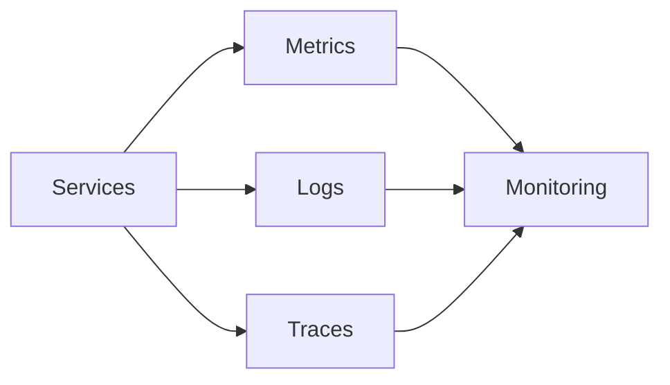
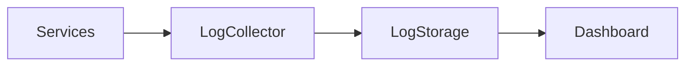
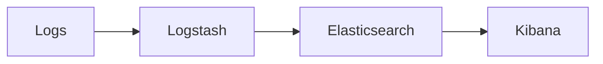
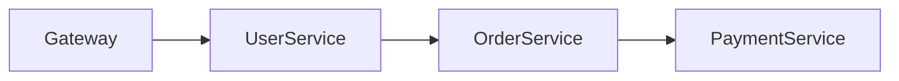
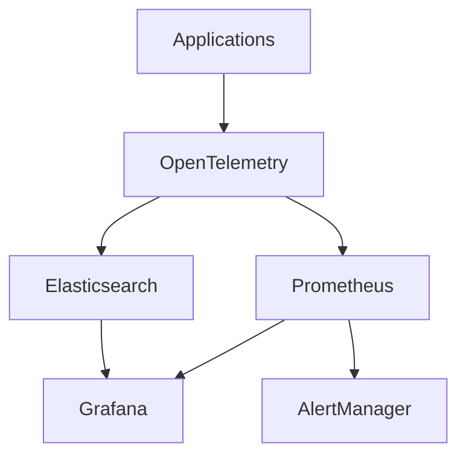

# Observability and Monitoring


## Overview

As systems scale, complexity increases dramatically.

A single server application may be easy to understand, but modern production environments often include:

* Multiple Services
* Databases
* Caches
* Message Brokers
* Load Balancers
* External APIs
* Cloud Infrastructure

When failures occur, engineers need visibility into system behavior.

Without observability:

```text id="g3q5v9"
Users Report Problems

↓

Engineers Guess

↓

Long Recovery Times
```

With observability:

```text id="r8m2hx"
Problems Detected

↓

Root Cause Identified

↓

Recovery Accelerated
```

Observability enables engineers to understand **what happened, why it happened, and how to prevent it from happening again.**

---

## Objectives

Observability aims to:

* Detect Failures Quickly
* Identify Root Causes
* Reduce MTTR
* Improve Reliability
* Support Capacity Planning
* Enable Proactive Operations

---

# Monitoring vs Observability

These terms are related but not identical.

---

## Monitoring

Monitoring answers:

> "Is something wrong?"

Examples:

* CPU Usage
* Error Rates
* Memory Consumption

---

## Observability

Observability answers:

> "Why is something wrong?"

Examples:

* Request Flow Analysis
* Dependency Failures
* Service Interactions

---

## Relationship

Monitoring identifies issues.

Observability explains issues.

Both are necessary.

---

# The Three Pillars of Observability

Modern observability relies on three primary data sources.

---

## Metrics

Numerical measurements over time.

---

## Logs

Detailed event records.

---

## Traces

Request journey visibility.

---

## Architecture



---

# Pillar 1: Metrics

Metrics provide quantitative visibility into system behavior.

---

## Examples

```text id="v7u3ph"
CPU Usage

Memory Usage

Requests Per Second

Error Rate

Response Time
```

---

## Characteristics

* Lightweight
* Efficient
* Aggregated
* Ideal For Alerting

---

# Common Metric Types

---

## Counter

Only increases.

Example:

```text id="q2wx75"
Total Requests
```

---

## Gauge

Represents current value.

Example:

```text id="i2c4kz"
Memory Usage
```

---

## Histogram

Measures distributions.

Example:

```text id="f4wv8y"
Request Latency
```

---

## Summary

Provides statistical information.

Example:

```text id="o5w7br"
95th Percentile Latency
```

---

# Golden Signals

Google's Site Reliability Engineering framework identifies four critical metrics.

---

## Latency

How long requests take.

---

## Traffic

Request volume.

---

## Errors

Failed requests.

---

## Saturation

Resource utilization.

---

## Formula

Error\ Rate = \frac{Failed\ Requests}{Total\ Requests}

---

# RED Method

Popular for service monitoring.

---

## Rate

Requests per second.

---

## Errors

Failure rate.

---

## Duration

Response latency.

---

# USE Method

Common for infrastructure monitoring.

---

## Utilization

Resource usage.

---

## Saturation

Demand beyond capacity.

---

## Errors

Resource failures.

---

# Prometheus


Prometheus is one of the most widely used monitoring systems.

---

## Responsibilities

* Metrics Collection
* Time Series Storage
* Alert Evaluation

---

## Architecture


---

## Benefits

* Open Source
* Cloud Native
* Kubernetes Friendly

---

# Grafana

Grafana visualizes operational data.

---

## Capabilities

* Dashboards
* Alerts
* Metrics Visualization

---

## Common Dashboards

* API Metrics
* Infrastructure Metrics
* Business Metrics

---

# Pillar 2: Logs

Logs capture detailed events.

---

## Examples

```text id="nt9u92"
User Login

Payment Failed

Database Error

Deployment Event
```

---

## Benefits

* Root Cause Analysis
* Debugging
* Auditing

---

# Log Levels

---

## DEBUG

Detailed diagnostic information.

---

## INFO

Normal operations.

---

## WARN

Potential issues.

---

## ERROR

Failures requiring attention.

---

## FATAL

Critical failures.

---

# Structured Logging

Preferred over plain text logging.

---

## Example

```json id="jlwm55"
{
  "service": "payment-service",
  "userId": 123,
  "orderId": 456,
  "status": "failed"
}
```

---

## Benefits

* Searchability
* Analytics
* Automation

---

# Centralized Logging

Logs should not remain on individual servers.

---

## Architecture



---

# ELK Stack

Common logging platform.

---

## Components

### Elasticsearch

Storage and search.

---

### Logstash

Log processing.

---

### Kibana

Visualization.

---

## Architecture



---

# Pillar 3: Tracing

Tracing follows requests across systems.

---

## Problem

A request may traverse:

```text id="0slsg4"
API Gateway

↓

User Service

↓

Order Service

↓

Payment Service
```

Where is the bottleneck?

---

# Distributed Tracing

Tracing provides visibility.

---

## Architecture



---

## Benefits

* Root Cause Analysis
* Latency Investigation
* Dependency Mapping

---

# Trace Components

---

## Trace

Entire request journey.

---

## Span

Individual operation.

---

## Parent Span

Originating operation.

---

## Child Span

Sub-operation.

---

# OpenTelemetry

OpenTelemetry has become the industry standard.

---

## Responsibilities

* Metrics
* Logs
* Traces

---

## Architecture


---

## Benefits

* Vendor Neutral
* Cloud Native
* Standardized Instrumentation

---

# Alerting

Monitoring without alerting is incomplete.

---

## Objectives

Detect problems rapidly.

---

## Alert Sources

* High Error Rates
* Latency Spikes
* Resource Saturation
* Availability Drops

---

# Alert Design Principles

---

## Actionable

Alerts should require action.

---

## Accurate

Avoid false positives.

---

## Prioritized

Different severities require different responses.

---

# Alert Severity Levels

---

## Critical

Immediate business impact.

---

## High

Potential service degradation.

---

## Medium

Requires investigation.

---

## Low

Informational.

---

# Incident Detection


Strong observability reduces incident detection time.

---

## Detection Sources

* Alerts
* Dashboards
* User Reports
* Automated Monitoring

---

## Goal

Reduce:

```text id="4jzvmy"
MTTD

Mean Time To Detect
```

---

# Incident Response Metrics

---

## MTTD

Mean Time To Detect

---

## MTTR

Mean Time To Recover

---

## Availability

Service uptime percentage.

---

## Error Budget Consumption

Reliability target tracking.

---

# Business Metrics

Observability should extend beyond infrastructure.

---

## Examples

```text id="owh9wk"
Orders Created

Payments Processed

Active Users

Revenue
```

---

## Importance

Systems can appear healthy while business functions fail.

---

# Capacity Planning

Observability supports growth planning.

---

## Monitor

* Traffic Growth
* Database Usage
* Queue Depth
* Resource Trends

---

## Benefits

* Predictable Scaling
* Reduced Risk

---

# Observability Architecture




---

# Real-World Examples

---

## Ecommerce Platform

Monitor:

* Checkout Success Rate
* Payment Failures
* Order Throughput

---

## Fantasy Sports Platform

Monitor:

* Match Updates
* Leaderboard Latency
* Realtime Connections

---

## Opinion Trading Platform

Monitor:

* Trade Execution Latency
* Settlement Accuracy
* Market Update Delays

---

# Common Observability Mistakes

---

## Logging Everything

Creates noise and cost.

---

## Missing Context

Logs become difficult to interpret.

---

## No Tracing

Root cause analysis becomes difficult.

---

## Poor Alerts

Alert fatigue develops.

---

## Infrastructure-Only Monitoring

Business failures remain undetected.

---

# Engineering Tradeoffs

| Capability | Benefit             | Cost                   |
| ---------- | ------------------- | ---------------------- |
| Metrics    | Fast Detection      | Limited Context        |
| Logs       | Detailed Visibility | Storage Cost           |
| Traces     | Root Cause Analysis | Instrumentation Effort |
| Alerting   | Faster Response     | False Positives        |
| Dashboards | Visibility          | Maintenance Overhead   |

---

# Observability Maturity Model

```text id="2d6wob"
Basic Logs
      │
      ▼
Metrics
      │
      ▼
Dashboards
      │
      ▼
Alerting
      │
      ▼
Distributed Tracing
      │
      ▼
Full Observability Platform
```

---

# Interview Perspective

Strong system design candidates discuss:

* Golden Signals
* Metrics
* Logs
* Traces
* Alerting
* OpenTelemetry
* Incident Detection
* MTTR Reduction

Rather than focusing only on application functionality.

Production systems must be observable to be operable.

---

# Engineering Outcome

Observability is one of the most important capabilities in modern software systems.

It enables engineers to detect problems quickly, diagnose failures efficiently, understand system behavior, and continuously improve reliability.

The strongest engineering organizations treat observability as a first-class architectural concern rather than an afterthought, ensuring systems remain understandable and manageable as complexity grows.
