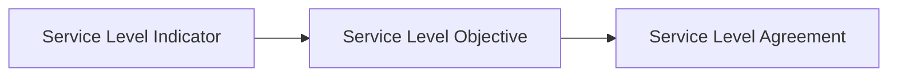
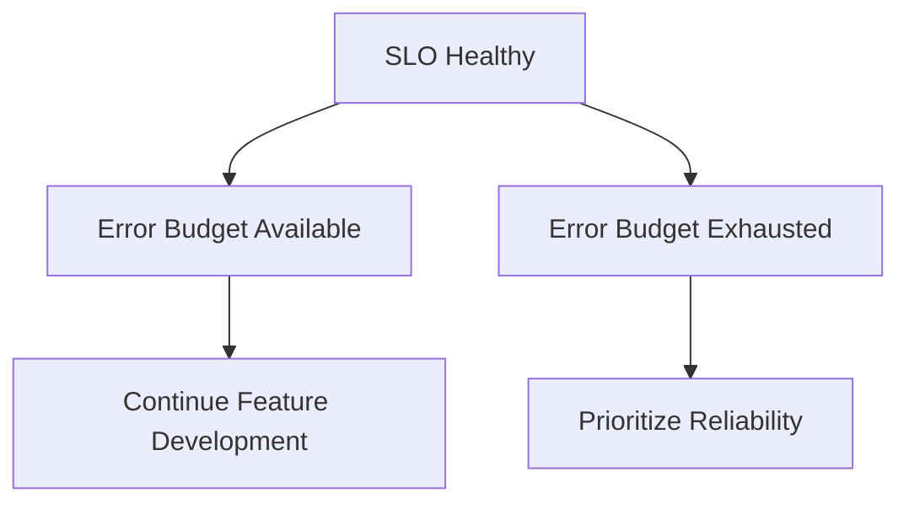
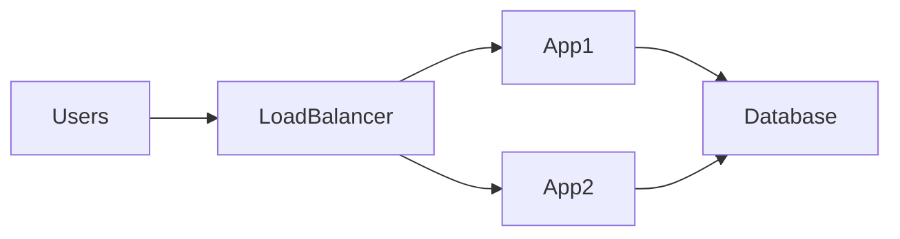

# SLA, SLO, and SLI


## Overview

Reliability engineering requires measurable objectives.

Without clearly defined targets, engineering teams cannot answer critical questions:

* Is the system reliable enough?
* Are users experiencing acceptable performance?
* Can new features be released safely?
* How much downtime is acceptable?
* When should reliability improvements take priority over feature development?

Service Level Agreements (SLAs), Service Level Objectives (SLOs), and Service Level Indicators (SLIs) provide the framework for answering these questions.

These concepts form the foundation of modern Site Reliability Engineering (SRE) practices and are widely adopted by organizations such as Google, Amazon, Netflix, Uber, and Stripe.

---

## Objectives

Reliability metrics help organizations:

* Measure Service Health
* Define Reliability Targets
* Align Engineering and Business Expectations
* Reduce Operational Risk
* Manage Reliability Investments
* Improve Customer Experience

---

# Understanding the Relationship

The three concepts work together.



---

# Service Level Indicator (SLI)

An SLI is a measurable indicator of service performance.

It represents the actual observed behavior of a system.

---

## Examples

### Availability

```text
Successful Requests / Total Requests
```

---

### Latency

```text
Request Response Time
```

---

### Error Rate

```text
Failed Requests / Total Requests
```

---

### Throughput

```text
Requests Per Second
```

---

## Availability SLI

Availability = \frac{Successful\ Requests}{Total\ Requests}

---

## Error Rate SLI

Error\ Rate = \frac{Failed\ Requests}{Total\ Requests}

---

# Characteristics of Good SLIs

A good SLI should be:

### User Focused

Measure what users experience.

---

### Quantifiable

Must be measurable.

---

### Reliable

Data collection must be accurate.

---

### Actionable

Should influence engineering decisions.

---

# Service Level Objective (SLO)

An SLO is the target value for an SLI.

It defines the level of reliability the engineering team intends to achieve.

---

## Example

SLI:

```text
Availability
```

SLO:

```text
99.9% Availability
```

---

## Example

SLI:

```text
API Latency
```

SLO:

```text
95% of requests under 200ms
```

---

## Why SLOs Matter

Without SLOs:

```text
No Reliability Target
```

Engineering decisions become subjective.

With SLOs:

```text
Reliability Expectations Defined
```

Teams can prioritize effectively.

---

# Service Level Agreement (SLA)

An SLA is a formal commitment to customers.

It usually includes:

* Availability Guarantees
* Performance Commitments
* Support Expectations
* Financial Penalties

---

## Example SLA

```text
99.9% Monthly Availability
```

If availability drops below target:

```text
Customer Compensation
```

May be required.

---

# SLI vs SLO vs SLA

| Concept | Purpose             | Audience    |
| ------- | ------------------- | ----------- |
| SLI     | Measure Performance | Engineering |
| SLO     | Reliability Target  | Engineering |
| SLA     | Business Commitment | Customers   |

---

# Availability Targets

Availability is the most common reliability metric.

---

## Common Targets

| Availability | Annual Downtime |
| ------------ | --------------- |
| 99%          | ~3.65 Days      |
| 99.9%        | ~8.76 Hours     |
| 99.99%       | ~52.6 Minutes   |
| 99.999%      | ~5.26 Minutes   |

---

## Engineering Reality

Every additional "nine" increases cost dramatically.

```text
99%

↓

99.9%

↓

99.99%

↓

99.999%
```

Complexity and investment increase significantly.

---

# Error Budgets

Error budgets are one of the most important SRE concepts.

---

## Definition

The amount of unreliability a system is allowed.

---

## Example

SLO:

```text
99.9% Availability
```

Allowed failure:

```text
0.1%
```

This becomes the error budget.

---

## Formula

Error\ Budget = 100% - SLO

---

## Example

SLO:

```text
99.95%
```

Error Budget:

```text
0.05%
```

---

# Why Error Budgets Matter

Engineering teams balance:

```text
Reliability

vs

Feature Delivery
```

---

## If Error Budget Remains Healthy

Teams may:

* Release Features
* Deploy Frequently
* Experiment More

---

## If Error Budget Is Exhausted

Teams should:

* Pause Risky Releases
* Focus on Reliability
* Improve Stability

---

# Reliability Decision Framework



---

# Common SLI Categories

---

## Availability

Measures uptime.

Examples:

* API Availability
* Website Availability
* Database Availability

---

## Latency

Measures response speed.

Examples:

* P50
* P95
* P99

---

## Quality

Measures correctness.

Examples:

* Successful Orders
* Successful Payments
* Successful Trades

---

## Freshness

Measures data recency.

Examples:

* Cache Freshness
* Realtime Feed Delay

---

# Latency Objectives

Users care about responsiveness.

---

## Example SLO

```text
95% of Requests

< 200ms
```

---

## Percentiles

Common measurements:

```text
P50

P95

P99
```

---

## Why Percentiles Matter

Average latency can be misleading.

Percentiles reveal tail latency.

---

# Availability Architecture




Reliability targets influence architecture design.

---

# Monitoring SLOs


SLOs require continuous monitoring.

---

## Metrics Sources

* Prometheus
* OpenTelemetry
* Cloud Monitoring
* Datadog

---

## Dashboards

Track:

* Availability
* Latency
* Error Rates
* Error Budget Consumption

---

# Alerting Based on SLOs

Traditional alerts:

```text
CPU > 90%
```

---

Modern SRE alerts:

```text
Error Budget Burn Rate High
```

---

## Benefits

* User-Centric Monitoring
* Reduced Alert Noise
* Better Prioritization

---

# Burn Rate

Measures how quickly error budget is consumed.

---

## Example

Monthly Budget:

```text
0.1%
```

Consumed:

```text
0.05%
```

in:

```text
1 Day
```

Problem detected.

---

## Importance

Burn rate predicts future reliability issues.

---

# Multi-Service Environments

Large systems contain multiple services.

---

## Example

```text
Authentication Service

Order Service

Payment Service

Notification Service
```

Each service may have unique SLOs.

---

# Real-World Examples

---

## Ecommerce Platform

SLIs:

* Checkout Success Rate
* Payment Success Rate
* API Availability

SLOs:

* 99.95% Availability
* 95% Requests Under 250ms

---

## Fantasy Sports Platform

SLIs:

* Score Update Latency
* Match Feed Availability

SLOs:

* Realtime Updates Under 2 Seconds
* 99.9% Availability

---

## Opinion Trading Platform

SLIs:

* Trade Execution Latency
* Settlement Accuracy

SLOs:

* 99.99% Trade Success
* 95% Requests Under 100ms

---

# Common Mistakes

---

## No SLOs

Reliability expectations unclear.

---

## Unrealistic Targets

Example:

```text
100% Availability
```

Practically impossible.

---

## Measuring Infrastructure Only

Users care about service quality.

---

## Ignoring Error Budgets

Removes objective decision-making.

---

## Too Many Metrics

Focus on meaningful indicators.

---

# Engineering Tradeoffs

| Goal                 | Benefit                | Cost                     |
| -------------------- | ---------------------- | ------------------------ |
| Higher Availability  | Better User Experience | Increased Infrastructure |
| Lower Latency        | Better Performance     | Optimization Effort      |
| Smaller Error Budget | Greater Reliability    | Slower Feature Delivery  |
| Aggressive SLOs      | Competitive Advantage  | Higher Operational Cost  |

---

# Reliability Maturity Model

```text
No Metrics
      │
      ▼
Basic Monitoring
      │
      ▼
SLIs
      │
      ▼
SLOs
      │
      ▼
Error Budgets
      │
      ▼
SRE-Driven Engineering
```

---

# Interview Perspective

Strong system design candidates discuss:

* Availability Targets
* Latency Objectives
* Error Budgets
* Burn Rates
* Reliability Tradeoffs
* Customer Impact

Rather than focusing only on infrastructure.

Reliability is measured by outcomes, not architecture diagrams.

---

# Engineering Outcome

SLAs, SLOs, and SLIs provide a structured framework for measuring and managing reliability.

By defining meaningful service indicators, setting realistic objectives, and using error budgets to guide engineering decisions, organizations can balance innovation with operational excellence.

The most successful engineering teams treat reliability as a measurable product feature rather than an abstract goal, ensuring systems remain dependable as complexity and scale continue to grow.
