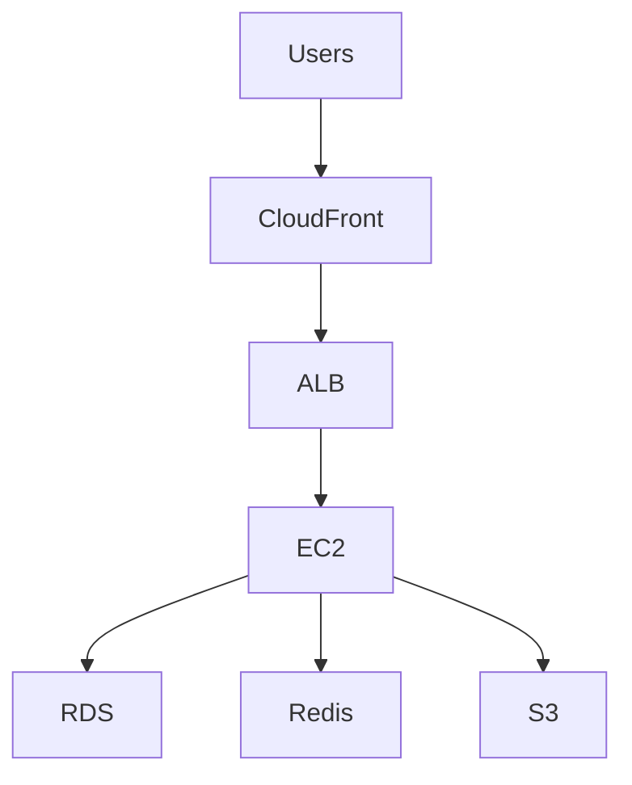
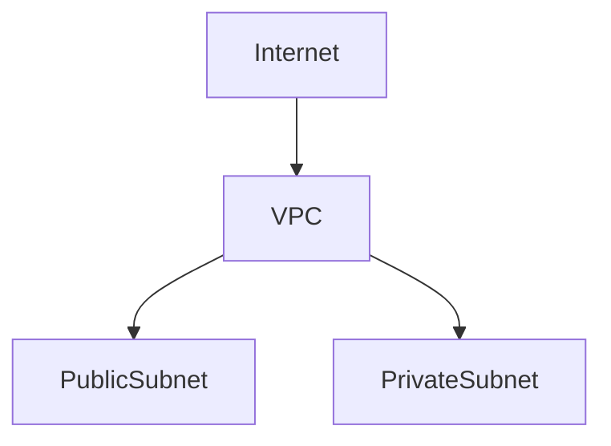
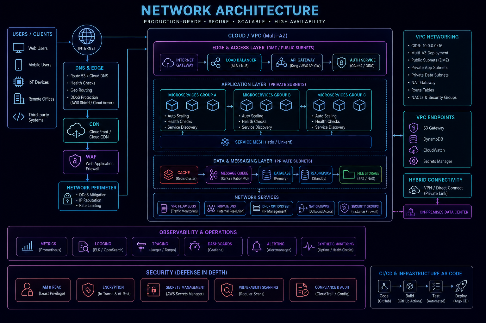
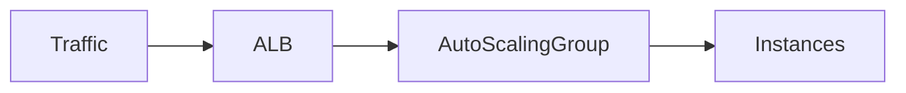
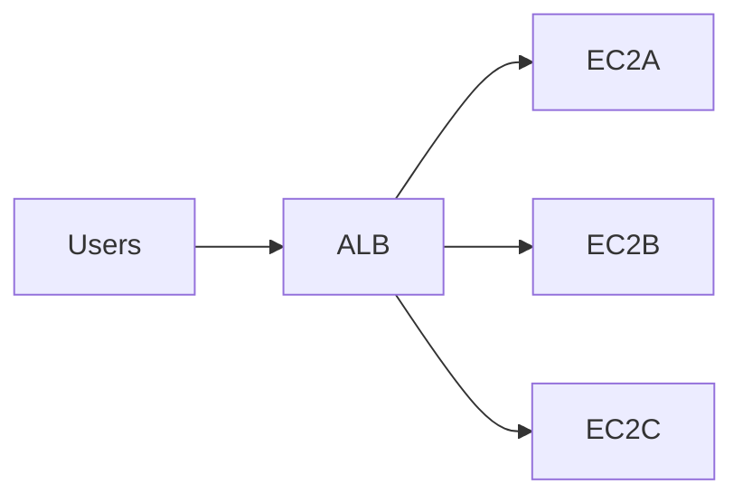
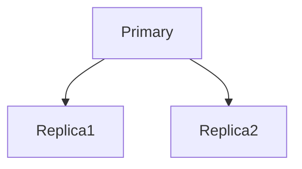
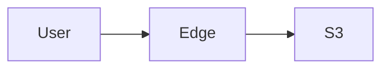
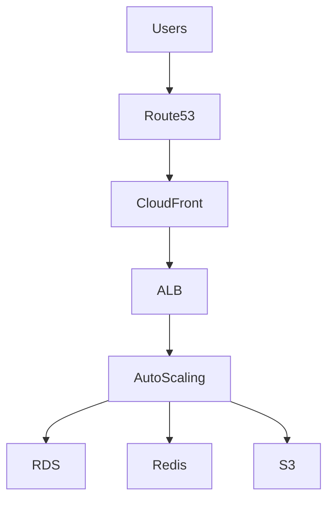
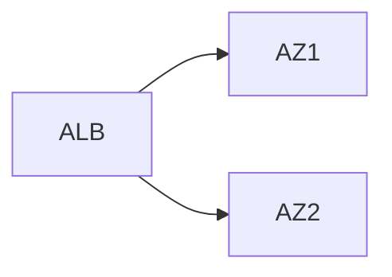
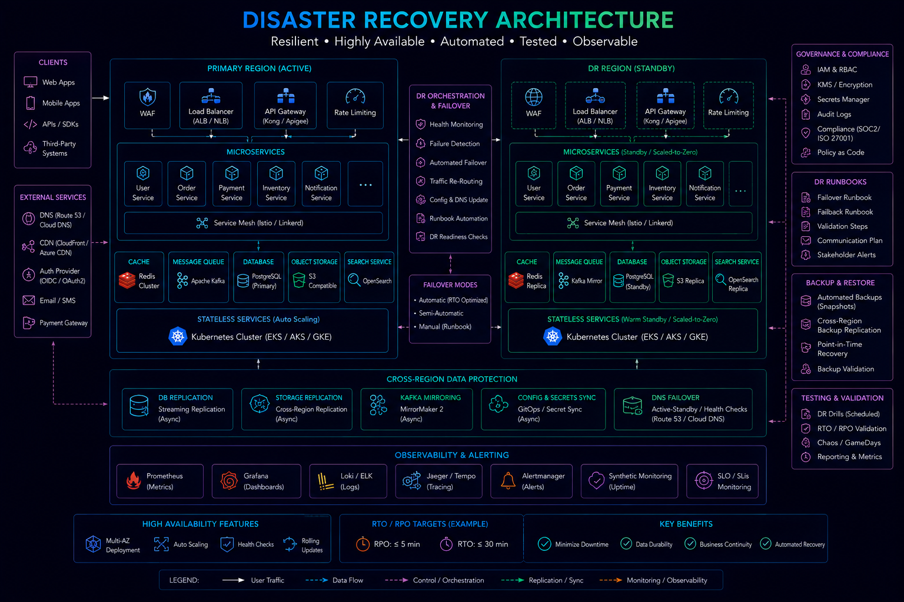

# AWS Infrastructure


## Overview

Cloud infrastructure has become the foundation of modern software platforms.

Organizations require infrastructure that can:

* Scale On Demand
* Maintain High Availability
* Support Global Users
* Improve Reliability
* Reduce Operational Overhead
* Enable Faster Delivery

Amazon Web Services (AWS) is one of the most widely adopted cloud platforms and provides a comprehensive ecosystem for building production-grade systems.

This document explores core AWS services, infrastructure architecture, deployment strategies, security considerations, and operational tradeoffs.

---

## Objectives

An AWS infrastructure strategy aims to:

* Improve Scalability
* Increase Reliability
* Enable Automation
* Support Security
* Optimize Cost
* Accelerate Delivery

---

# Why Cloud Infrastructure Matters

Traditional infrastructure often required:

```text id="wq2n5c"
Hardware Procurement

Manual Configuration

Capacity Planning

Physical Maintenance
```

---

## Cloud Approach

```text id="d8z4lm"
Provision

Scale

Deploy

Automate
```

On demand.

---

## Benefits

* Elastic Capacity
* Reduced Operational Burden
* Faster Delivery

---

# AWS Global Infrastructure

AWS operates globally.

---

## Components

### Regions

Geographic locations.

Examples:

```text id="z7a4eq"
Mumbai

Frankfurt

Virginia

Singapore
```

---

### Availability Zones (AZs)

Independent data centers within a region.

---

### Edge Locations

Support:

* CloudFront
* Global Content Delivery

---

# AWS Infrastructure Architecture




---

# Virtual Private Cloud (VPC)

The VPC is the foundation of AWS networking.

---

## Responsibilities

* Network Isolation
* Security Boundaries
* Routing Control

---

## Architecture



---

## Benefits

* Isolation
* Security
* Flexibility

---

# Public and Private Subnets

---

## Public Subnet

Accessible from the internet.

Typical Resources:

* Load Balancers
* Bastion Hosts

---

## Private Subnet

Not directly accessible.

Typical Resources:

* Application Servers
* Databases
* Internal Services

---

# Production VPC Design




---

## Benefits

* Layered Security
* Reduced Exposure

---

# EC2

Elastic Compute Cloud (EC2) provides virtual machines.

---

## Responsibilities

* Application Hosting
* Background Workers
* Compute Workloads

---

## Advantages

* Flexibility
* Scalability
* Customization

---

# EC2 Auto Scaling

Infrastructure should scale automatically.

---

## Architecture



---

## Benefits

* Elastic Capacity
* Cost Optimization

---

## Example

```text id="6s0x8d"
Traffic Increases

↓

New Instances Created
```

---

# Application Load Balancer (ALB)

ALB distributes traffic.

---

## Responsibilities

* Traffic Routing
* SSL Termination
* Health Checks

---

## Architecture



---

## Benefits

* High Availability
* Fault Tolerance

---

# RDS

Amazon Relational Database Service.

---

## Responsibilities

* Managed Databases
* Backups
* Replication
* Maintenance

---

## Supported Engines

* MySQL
* PostgreSQL
* MariaDB
* SQL Server

---

# Multi-AZ Databases


---

## Benefits

* Automated Failover
* Improved Reliability

---

# Read Replicas

Improve read scalability.

---

## Architecture



---

## Benefits

* Read Scaling
* Analytics Workloads

---

# ElastiCache

Managed caching platform.

---

## Engines

* Redis
* Memcached

---

## Use Cases

* Session Storage
* Caching
* Rate Limiting

---

## Architecture


---

# Amazon S3

Simple Storage Service.

---

## Use Cases

* Images
* Videos
* Backups
* Static Assets

---

## Benefits

* Durability
* Scalability
* Low Cost

---

# CloudFront

Content Delivery Network (CDN).

---

## Responsibilities

* Global Content Delivery
* Edge Caching

---

## Architecture



---

## Benefits

* Reduced Latency
* Improved User Experience

---

# Security Groups

Act as virtual firewalls.

---

## Example Rules

```text id="h8m4wv"
443 HTTPS

80 HTTP

22 SSH
```

---

## Benefits

* Network Security
* Traffic Control

---

# IAM

Identity and Access Management.

---

## Responsibilities

* Authentication
* Authorization
* Access Policies

---

## Best Practices

* Least Privilege
* Role-Based Access
* Temporary Credentials

---

# Route 53

Managed DNS service.

---

## Use Cases

* Domain Management
* Health Checks
* Traffic Routing

---

## Benefits

* High Availability
* Global DNS

---

# Monitoring with CloudWatch


CloudWatch provides observability.

---

## Metrics

Monitor:

* CPU
* Memory
* Latency
* Errors

---

## Benefits

* Alerting
* Visibility

---

# Infrastructure as Code

AWS infrastructure should be managed programmatically.

---

## Tools

* Terraform
* CloudFormation
* CDK

---

## Benefits

* Consistency
* Automation
* Auditability

---

# Production Architecture




---

# Multi-AZ Design

A production workload should span multiple availability zones.

---

## Architecture



---

## Benefits

* High Availability
* Reduced Failure Risk

---

# Disaster Recovery



AWS supports:

* Backups
* Replication
* Multi-Region Architectures

---

## Recovery Strategies

* Active-Passive
* Warm Standby
* Active-Active

---

# Cost Optimization

Cloud architecture should balance:

```text id="q4v8ns"
Reliability

Performance

Cost
```

---

## Common Strategies

* Auto Scaling
* Reserved Instances
* Spot Instances
* Storage Lifecycle Policies

---

# Real-World Examples

---

## Ecommerce Platform

AWS Services:

* ALB
* EC2
* RDS
* Redis
* S3
* CloudFront

---

## Fantasy Sports Platform

AWS Services:

* Realtime APIs
* Redis Clusters
* Auto Scaling
* CDN

---

## Opinion Trading Platform

AWS Services:

* Event Processing
* RDS Replication
* Queue Workers
* Monitoring

---

# Common AWS Mistakes

---

## Single Availability Zone

Creates availability risk.

---

## Overprovisioning

Increases costs.

---

## Weak IAM Policies

Creates security issues.

---

## Missing Monitoring

Reduces operational visibility.

---

## No Backup Strategy

Increases disaster risk.

---

# Engineering Tradeoffs

| Service    | Benefit     | Cost                      |
| ---------- | ----------- | ------------------------- |
| EC2        | Flexibility | Operational Management    |
| RDS        | Simplicity  | Higher Cost               |
| Redis      | Performance | Additional Infrastructure |
| CloudFront | Low Latency | CDN Costs                 |
| Multi-AZ   | Reliability | Infrastructure Cost       |

---

# Cloud Maturity Path

```text id="x8m5pu"
Single Server
      │
      ▼
Cloud VM
      │
      ▼
Load Balancer
      │
      ▼
Auto Scaling
      │
      ▼
Multi-AZ Infrastructure
      │
      ▼
Global Cloud Platform
```

---

# Interview Perspective

Strong engineers discuss:

* VPC Design
* ALB Architecture
* Auto Scaling
* Multi-AZ Deployments
* Database Reliability
* Cloud Security
* Cost Optimization

Rather than simply listing AWS services.

Cloud architecture is fundamentally about balancing scalability, reliability, security, and cost.

---

# Engineering Outcome

AWS provides a comprehensive platform for building scalable, secure, and highly available systems.

By combining networking, compute, storage, databases, observability, and automation capabilities, organizations can build cloud-native architectures that support growth, operational excellence, and business continuity at scale.
