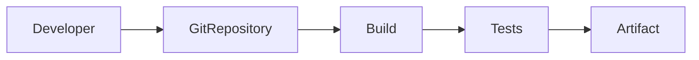
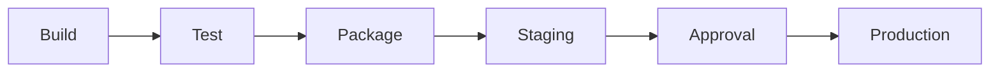
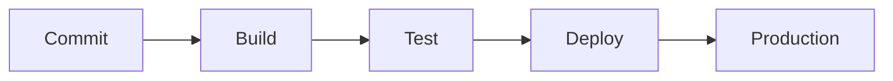
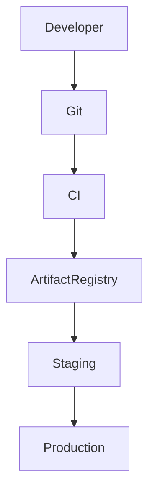
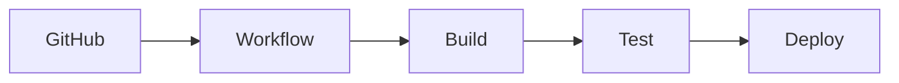
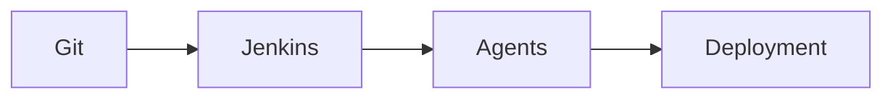
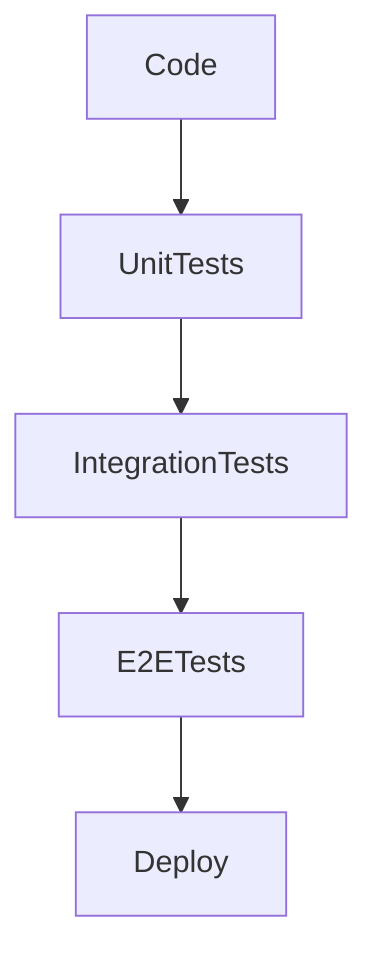
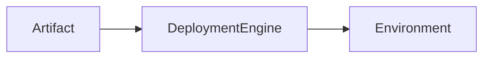

# CI/CD Pipeline


## Overview

Modern software organizations deploy code frequently, reliably, and safely.

Without automation, deployments become:

* Slow
* Error-Prone
* Difficult to Scale
* Operationally Risky

Continuous Integration (CI) and Continuous Delivery/Deployment (CD) solve these challenges by creating automated workflows that validate, test, package, and deploy software consistently.

CI/CD pipelines have become a foundational practice of high-performing engineering organizations and are critical for enabling rapid product delivery while maintaining reliability.

This document explores enterprise-grade CI/CD architecture, deployment workflows, automation strategies, and production considerations.

---

## Objectives

CI/CD pipelines aim to:

* Increase Deployment Frequency
* Improve Software Quality
* Reduce Human Error
* Accelerate Feedback Loops
* Improve Reliability
* Enable Safe Releases

---

# What Is Continuous Integration?

Continuous Integration focuses on validating code changes automatically.

---

## Typical Flow



---

## Goals

* Detect Issues Early
* Prevent Broken Builds
* Improve Collaboration

---

# What Is Continuous Delivery?

Continuous Delivery ensures software is always deployable.

---

## Flow



---

## Benefits

* Reduced Release Risk
* Faster Deployments
* Better Quality Control

---

# What Is Continuous Deployment?

Continuous Deployment automatically releases validated changes.

---

## Flow



---

## Benefits

* Extremely Fast Releases
* Reduced Manual Intervention

---

## Tradeoff

Requires strong automated testing and monitoring.

---

# Why CI/CD Matters

Traditional deployment processes often involve:

```text
Manual Builds

Manual Testing

Manual Deployments
```

Problems:

* Human Error
* Slow Releases
* Inconsistent Processes

---

## Modern Approach

```text
Automated Build

Automated Validation

Automated Deployment
```

Benefits:

* Faster Delivery
* Higher Confidence

---

# Enterprise CI/CD Architecture




---

# Source Control Integration

Source control is the pipeline trigger.

---

## Common Platforms

* GitHub
* GitLab
* Bitbucket
* Azure Repos

---

## Trigger Events

Examples:

```text
Push

Pull Request

Merge

Tag Creation
```

---

# Pipeline Stages

Most enterprise pipelines contain multiple stages.

---

## Stage 1: Source Validation

Verify:

* Branch Rules
* Commit Standards
* Security Policies

---

## Stage 2: Build

Compile or package applications.

Examples:

* Node.js Build
* React Build
* Docker Build

---

## Stage 3: Testing

Execute automated tests.

Examples:

* Unit Tests
* Integration Tests
* End-to-End Tests

---

## Stage 4: Security Validation

Run:

* Dependency Scans
* Secret Detection
* Vulnerability Checks

---

## Stage 5: Artifact Packaging

Generate deployable artifacts.

Examples:

* Docker Images
* Build Archives
* Release Bundles

---

## Stage 6: Deployment

Deploy to:

* Development
* Staging
* Production

---

# GitHub Actions


GitHub Actions is one of the most popular CI/CD platforms.

---

## Capabilities

* Build Automation
* Test Automation
* Deployment Workflows
* Scheduled Jobs

---

## Workflow Architecture



---

## Benefits

* Native GitHub Integration
* Easy Adoption
* Strong Ecosystem

---

# Jenkins

Jenkins remains a popular enterprise CI/CD solution.

---

## Strengths

* Extensive Plugin Ecosystem
* High Customization
* Enterprise Adoption

---

## Architecture



---

## Tradeoffs

* Operational Maintenance
* Plugin Management Complexity

---

# Artifact Management

Artifacts represent deployable software versions.

---

## Examples

```text
Docker Images

ZIP Packages

JAR Files

Build Artifacts
```

---

## Benefits

* Version Control
* Rollback Capability
* Deployment Consistency

---

# Artifact Repositories

Common solutions:

* Docker Hub
* Amazon ECR
* GitHub Container Registry
* Nexus Repository
* Artifactory

---

# Automated Testing

Testing is one of the most important pipeline stages.

---

## Unit Tests

Validate isolated components.

---

## Integration Tests

Validate component interactions.

---

## End-to-End Tests

Validate complete user flows.

---

## Architecture



---

# Quality Gates

Quality gates prevent low-quality releases.

---

## Examples

* Minimum Test Coverage
* Security Thresholds
* Build Success
* Code Review Requirements

---

## Benefits

* Consistent Standards
* Reduced Production Risk

---

# Environment Strategy

Most organizations use multiple environments.

---

## Typical Flow

```text
Development

↓

Testing

↓

Staging

↓

Production
```

---

## Benefits

* Validation
* Risk Reduction

---

# Deployment Automation

Deployment should be automated.

---

## Architecture



---

## Benefits

* Consistency
* Speed
* Reduced Human Error

---

# Rollback Strategy

Every deployment strategy requires rollback capability.

---

## Scenario

```text
Deployment

↓

Issue Detected

↓

Rollback
```

---

## Requirements

* Versioned Artifacts
* Automated Recovery
* Monitoring Integration

---

# Pipeline Security

Security should be integrated into CI/CD.

---

## Practices

* Secret Scanning
* Dependency Scanning
* Vulnerability Detection
* Access Controls

---

## Benefits

* Reduced Risk
* Earlier Detection

---

# Infrastructure as Code Integration

Infrastructure changes should follow CI/CD practices.

---

## Examples

* Terraform
* CloudFormation
* Pulumi

---

## Benefits

* Repeatability
* Auditability
* Automation

---

# Observability Integration


Pipelines should integrate with monitoring systems.

---

## Examples

* Deployment Metrics
* Error Tracking
* Release Monitoring

---

## Benefits

* Faster Incident Detection
* Safer Releases

---

# CI/CD Metrics

Track:

* Deployment Frequency
* Build Success Rate
* Change Failure Rate
* Mean Time To Recovery

---

## DORA Metrics

Widely used engineering metrics.

---

### Deployment Frequency

How often deployments occur.

---

### Lead Time For Changes

Time from commit to production.

---

### Change Failure Rate

Percentage of deployments causing incidents.

---

### MTTR

Mean Time To Recovery.

---

# Real-World Examples

---

## Ecommerce Platform

Pipeline Includes:

* Product Testing
* Checkout Validation
* Deployment Verification

---

## Fantasy Sports Platform

Pipeline Includes:

* Realtime Service Validation
* API Testing
* Infrastructure Verification

---

## Opinion Trading Platform

Pipeline Includes:

* Settlement Workflow Testing
* Event Processing Validation
* Performance Checks

---

# Common CI/CD Mistakes

---

## Manual Deployments

Increase operational risk.

---

## Weak Testing

Creates production incidents.

---

## Missing Rollback Strategy

Increases outage duration.

---

## Shared Environments

Create deployment conflicts.

---

## Ignoring Security

Introduces vulnerabilities.

---

# Engineering Tradeoffs

| Capability                 | Benefit            | Cost                       |
| -------------------------- | ------------------ | -------------------------- |
| Automation                 | Faster Delivery    | Initial Setup              |
| Continuous Deployment      | Rapid Releases     | Increased Monitoring Needs |
| Quality Gates              | Better Reliability | Longer Pipelines           |
| Security Scanning          | Reduced Risk       | Additional Runtime         |
| Multi-Environment Strategy | Safer Releases     | Infrastructure Cost        |

---

# DevOps Maturity Path

```text
Manual Deployments
        │
        ▼
Automated Builds
        │
        ▼
Continuous Integration
        │
        ▼
Continuous Delivery
        │
        ▼
Continuous Deployment
        │
        ▼
Enterprise DevOps Platform
```

---

# Interview Perspective

Strong engineers discuss:

* Automated Testing
* Quality Gates
* Rollbacks
* Deployment Strategies
* Artifact Management
* Security Integration
* DORA Metrics

Rather than describing CI/CD as merely:

> "Automatic deployment."

CI/CD is fundamentally about creating reliable and repeatable software delivery systems.

---

# Engineering Outcome

CI/CD pipelines are essential for enabling modern software delivery.

By automating validation, testing, packaging, deployment, and recovery workflows, organizations can release software faster while maintaining reliability and quality.

The strongest engineering teams treat CI/CD as a strategic capability that accelerates innovation, improves operational excellence, and reduces deployment risk at scale.
