# Deployment Strategies

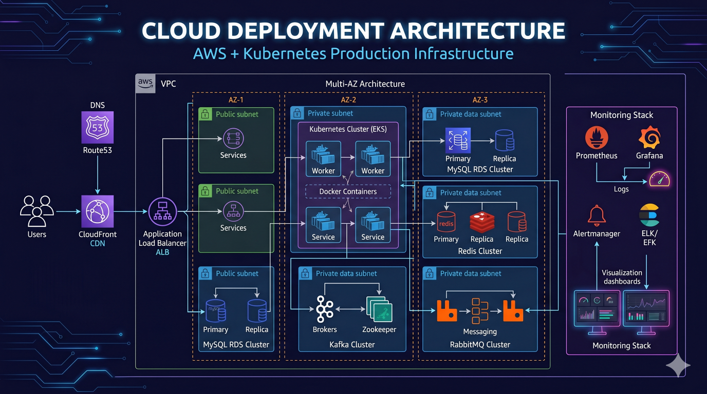

## Overview

Deploying software is one of the highest-risk activities in software engineering.

Every deployment introduces the possibility of:

* Service Outages
* Performance Degradation
* Data Corruption
* Security Issues
* Customer Impact

As organizations scale, deployment strategies become critical for balancing:

* Delivery Speed
* Reliability
* Risk Management

Modern engineering teams rely on sophisticated deployment patterns to reduce risk while maintaining rapid release cycles.

This document explores production deployment strategies, rollout techniques, rollback mechanisms, and enterprise release engineering practices.

---

## Objectives

Deployment strategies aim to:

* Reduce Release Risk
* Minimize Downtime
* Improve Reliability
* Accelerate Delivery
* Enable Safe Experimentation
* Simplify Recovery

---

# Why Deployment Strategy Matters

Traditional deployments often look like:

```text id="n4a3vg"
Stop Service

Deploy New Version

Start Service
```

Problems:

* Downtime
* High Risk
* Difficult Recovery

---

## Modern Approach

```text id="u4h6jg"
Gradual Rollout

Monitoring

Rollback Capability
```

Benefits:

* Reduced Risk
* Better Reliability

---

# Deployment Lifecycle

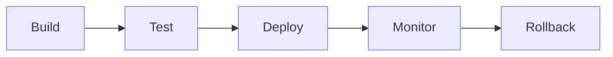

---

# Rolling Deployments

The most common deployment strategy.

---

## Concept

Replace instances gradually.

---

## Architecture

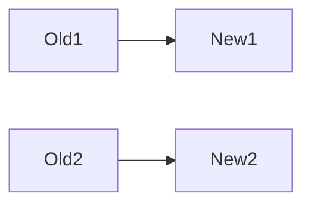

---

## Example

```text id="sm4lh2"
10 Servers

↓

Replace One At A Time
```

---

## Benefits

* Minimal Downtime
* Efficient Resource Usage

---

## Tradeoffs

* Mixed Versions During Rollout
* Rollback Complexity

---

# Rolling Deployment Flow

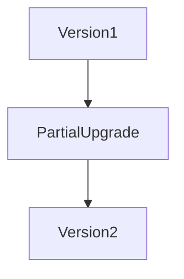

---

# Blue-Green Deployment

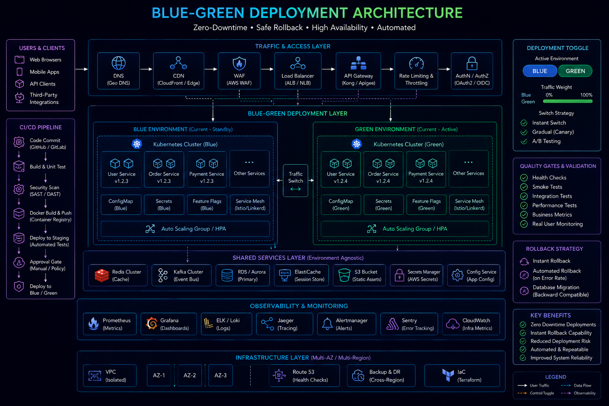

Two identical environments exist.

---

## Components

### Blue

Current production environment.

### Green

New version environment.

---

## Architecture

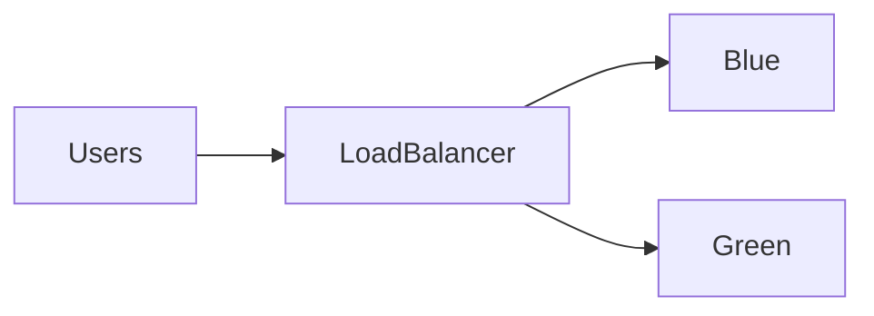

---

## Deployment Process

```text id="lxz6x0"
Blue Active

↓

Deploy To Green

↓

Validate

↓

Switch Traffic
```

---

## Benefits

* Near Zero Downtime
* Simple Rollback

---

## Tradeoffs

* Increased Infrastructure Cost

---

# Blue-Green Rollback

Rollback becomes straightforward.

---

## Process

```text id="zkc7f3"
Traffic On Green

↓

Issue Detected

↓

Switch Back To Blue
```

---

## Benefits

* Fast Recovery
* Reduced Risk

---

# Canary Deployments

Canary deployments release changes gradually.

---

## Concept

A small percentage of users receive the new version.

---

## Architecture

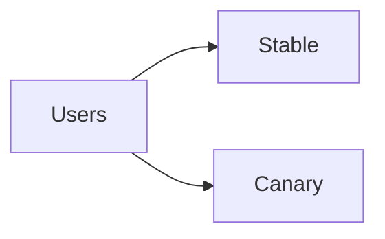

---

## Example

```text id="v9a8lz"
95% Stable

5% Canary
```

---

## Benefits

* Risk Reduction
* Real User Validation

---

## Tradeoffs

* More Complex Routing

---

# Canary Rollout Progression

```text id="1r2vpm"
5%

↓

10%

↓

25%

↓

50%

↓

100%
```

---

## Benefits

Problems are detected before full rollout.

---

# Feature Flags

Feature flags separate deployment from release.

---

## Architecture

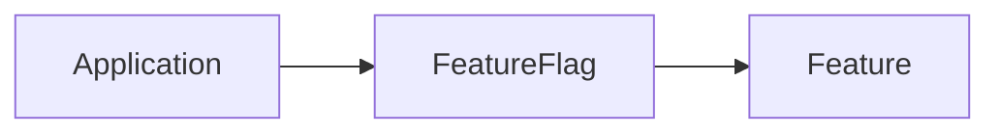

---

## Benefits

* Safer Releases
* Faster Rollbacks
* Controlled Experiments

---

# Feature Flag Use Cases

---

## Gradual Rollout

Enable features incrementally.

---

## A/B Testing

Compare behaviors.

---

## Emergency Disable

Turn off problematic functionality.

---

# Progressive Delivery

Progressive delivery combines:

* Canary Releases
* Feature Flags
* Observability

---

## Architecture

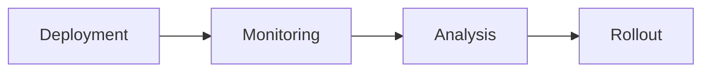

---

## Benefits

* Data-Driven Releases
* Reduced Risk

---

# Shadow Deployments

Production traffic is duplicated.

---

## Architecture

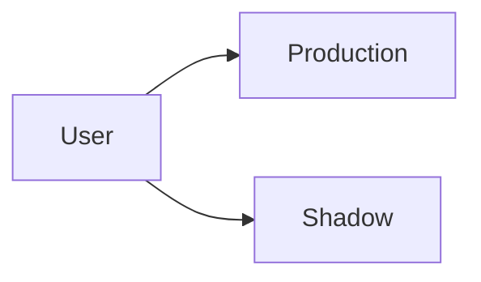

---

## Characteristics

* No User Impact
* Production Validation

---

## Benefits

* Performance Testing
* Risk Reduction

---

# A/B Deployments

Different users receive different experiences.

---

## Architecture

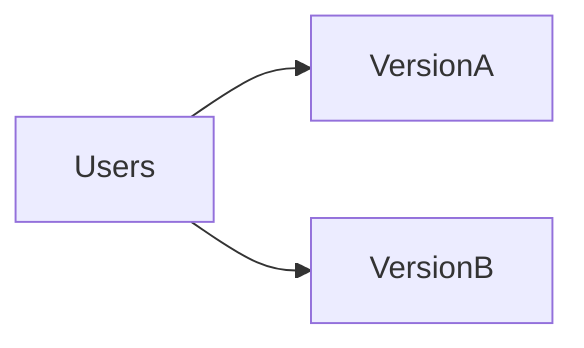

---

## Use Cases

* Experiments
* Conversion Optimization

---

# Deployment Automation


Deployments should be automated.

---

## Benefits

* Consistency
* Speed
* Reliability

---

## Integration

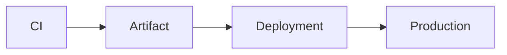

---

# Rollback Strategy

Every deployment requires recovery mechanisms.

---

## Requirements

* Versioned Artifacts
* Automated Rollback
* Monitoring Integration

---

## Flow

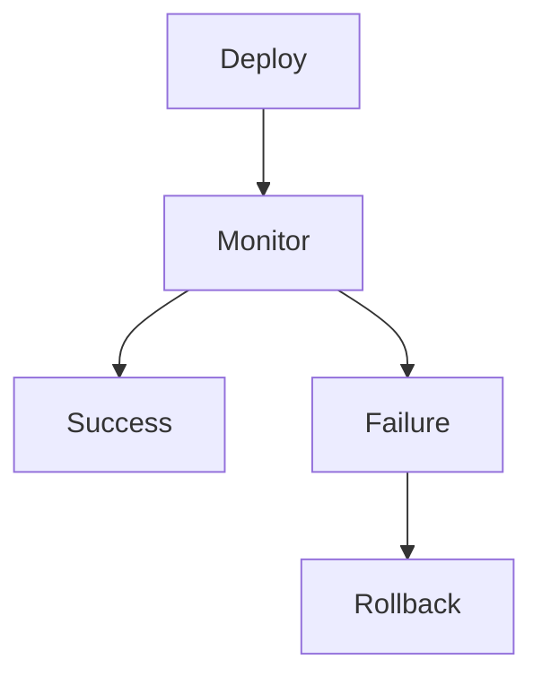

---

# Release Monitoring


Monitor deployments continuously.

---

## Metrics

Track:

* Error Rate
* Latency
* Availability
* Resource Utilization

---

## Goal

Detect regressions quickly.

---

# Deployment Gates

Quality checks before release.

---

## Examples

* Test Coverage
* Security Scans
* Performance Validation

---

## Benefits

* Reduced Production Risk

---

# Kubernetes Deployment Strategies

Kubernetes supports:

* Rolling Updates
* Blue-Green Deployments
* Canary Releases

---

## Benefits

* Automation
* Scalability

---

# Multi-Region Deployments

Large systems often deploy gradually across regions.

---

## Architecture

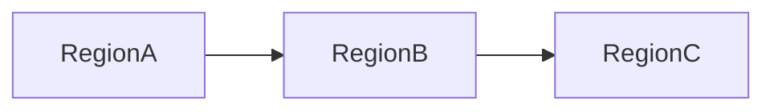

---

## Benefits

* Risk Reduction
* Regional Validation

---

# Release Engineering

Release engineering focuses on reliable software delivery.

---

## Responsibilities

* Pipeline Management
* Release Automation
* Deployment Governance
* Rollback Planning

---

# Deployment Metrics

Track:

---

## Deployment Frequency

Release velocity.

---

## Change Failure Rate

Deployment reliability.

---

## MTTR

Recovery speed.

---

## Lead Time

Commit to production duration.

---

# Real-World Examples

---

## Ecommerce Platform

Strategy:

* Canary Releases
* Feature Flags
* Automated Rollbacks

---

## Fantasy Sports Platform

Strategy:

* Regional Rollouts
* Realtime Validation
* Progressive Delivery

---

## Opinion Trading Platform

Strategy:

* Blue-Green Releases
* Traffic Monitoring
* Fast Recovery

---

# Common Deployment Mistakes

---

## Big Bang Releases

Increase risk dramatically.

---

## No Rollback Plan

Creates prolonged outages.

---

## Weak Monitoring

Problems remain undetected.

---

## Manual Deployments

Increase operational risk.

---

## No Feature Flags

Reduce release flexibility.

---

# Engineering Tradeoffs

| Strategy             | Benefit        | Cost                   |
| -------------------- | -------------- | ---------------------- |
| Rolling Deployments  | Efficient      | Mixed Versions         |
| Blue-Green           | Easy Rollback  | Double Infrastructure  |
| Canary               | Risk Reduction | Routing Complexity     |
| Feature Flags        | Flexibility    | Additional Management  |
| Progressive Delivery | Safer Releases | Operational Complexity |

---

# Deployment Maturity Path

```text id="8x7hws"
Manual Releases
       │
       ▼
Automated Deployments
       │
       ▼
Rolling Updates
       │
       ▼
Blue-Green Releases
       │
       ▼
Canary Deployments
       │
       ▼
Progressive Delivery Platform
```

---

# Interview Perspective

Strong engineers discuss:

* Deployment Risk
* Rollback Strategies
* Canary Releases
* Blue-Green Deployments
* Feature Flags
* Progressive Delivery
* Release Monitoring

Rather than viewing deployments as merely moving code to production.

Deployment engineering is fundamentally about balancing speed and reliability.

---

# Engineering Outcome

Deployment strategies are a critical component of modern software delivery.

By combining automation, progressive rollout techniques, observability, and rollback capabilities, organizations can release software safely and frequently while minimizing operational risk.

The strongest engineering teams treat deployments as engineered systems rather than operational tasks, enabling rapid innovation without sacrificing reliability.
