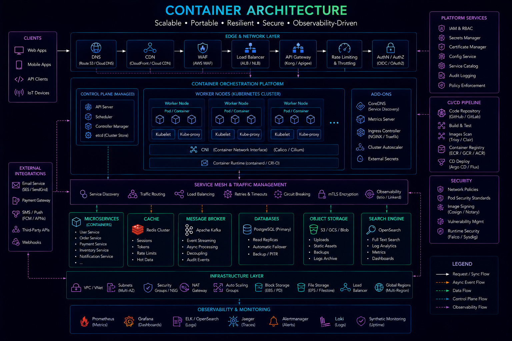
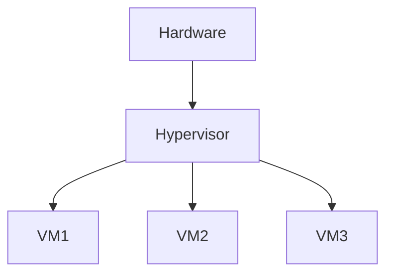
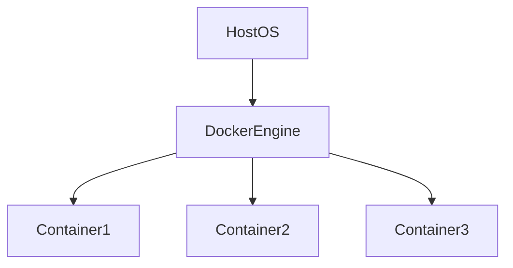

# Docker Strategy



## Overview

Containers have fundamentally changed how modern applications are built, shipped, and operated.

Before containers, software deployments often suffered from:

* Environment Inconsistencies
* Dependency Conflicts
* Complex Deployments
* Infrastructure Drift

Docker introduced a standardized packaging model that allows applications and their dependencies to be bundled into portable, reproducible units called containers.

Today, Docker serves as the foundation for:

* Cloud-Native Applications
* Microservices Platforms
* Kubernetes Deployments
* CI/CD Pipelines
* DevOps Workflows

This document explores Docker architecture, production strategies, optimization techniques, security considerations, and enterprise deployment patterns.

---

## Objectives

A container strategy aims to:

* Improve Portability
* Standardize Deployments
* Simplify Infrastructure
* Increase Reliability
* Support Scalability
* Accelerate Delivery

---

# Why Containers Matter

Traditional deployments often follow this pattern:

```text
Developer Machine

↓

Testing Server

↓

Production Server
```

Applications may behave differently in each environment.

---

## Container Approach

```text
Build Once

↓

Ship Anywhere
```

The same container image executes consistently across environments.

---

## Benefits

* Reproducibility
* Portability
* Isolation
* Scalability

---

# What Is Docker?

Docker is a containerization platform.

It packages:

* Application Code
* Runtime
* Dependencies
* Configuration

into a deployable image.

---

## High-Level Architecture


---

# Containers vs Virtual Machines

---

## Virtual Machines



Characteristics:

* Full Operating System
* Higher Resource Consumption

---

## Containers



Characteristics:

* Lightweight
* Fast Startup
* Efficient Resource Usage

---

# Docker Components

---

## Dockerfile

Defines image build instructions.

---

## Image

Immutable application package.

---

## Container

Running instance of an image.

---

## Registry

Stores images.

Examples:

* Docker Hub
* Amazon ECR
* GitHub Container Registry

---

## Docker Engine

Runs and manages containers.

---

# Docker Image Lifecycle


---

# Dockerfile Strategy

A Dockerfile should be:

* Predictable
* Reproducible
* Minimal
* Secure

---

## Goals

* Smaller Images
* Faster Builds
* Reduced Vulnerabilities

---

# Multi-Stage Builds


Multi-stage builds separate build dependencies from runtime dependencies.

---

## Architecture


---

## Benefits

* Smaller Images
* Faster Deployments
* Improved Security

---

## Example Workflow

```text
Build Dependencies

↓

Compile Application

↓

Copy Artifacts

↓

Minimal Runtime Image
```

---

# Image Optimization

Container size impacts:

* Startup Time
* Network Transfer
* Storage Usage

---

## Best Practices

### Use Minimal Base Images

Examples:

```text
Alpine Linux

Distroless Images
```

---

### Remove Unnecessary Files

Avoid:

* Logs
* Temporary Files
* Build Artifacts

---

### Layer Optimization

Combine related commands where appropriate.

---

# Production Image Strategy

Production images should contain:

```text
Application

Runtime

Required Libraries
```

Only.

---

Avoid:

```text
Debug Tools

Compilers

Unused Packages
```

---

# Container Security

Security should be integrated from the beginning.

---

## Common Risks

* Vulnerable Base Images
* Exposed Secrets
* Privileged Containers
* Unpatched Dependencies

---

# Security Best Practices

---

## Use Trusted Images

Examples:

* Official Images
* Verified Images

---

## Scan Images

Tools:

* Trivy
* Grype
* Snyk

---

## Minimize Attack Surface

Use smaller images.

---

## Non-Root Containers

Avoid:

```text
Root User
```

Run applications using restricted users.

---

# Secrets Management

Secrets should never be stored in images.

---

## Avoid

```text
Passwords

API Keys

Certificates
```

inside Dockerfiles.

---

## Preferred Approaches

* Environment Variables
* Secret Managers
* Kubernetes Secrets

---

# Container Networking

Containers communicate through virtual networks.

---

## Architecture


---

## Benefits

* Isolation
* Service Communication

---

# Persistent Storage

Containers are ephemeral.

Data should not depend on container lifecycle.

---

## Architecture


---

## Use Cases

* Databases
* Uploaded Files
* Persistent Application Data

---

# Container Registries

Images are stored and distributed through registries.

---

## Common Registries

* Docker Hub
* Amazon ECR
* Google Artifact Registry
* GitHub Container Registry
* Azure Container Registry

---

## Benefits

* Version Control
* Distribution
* Rollback Support

---

# Versioning Strategy

Container images should be versioned.

---

## Avoid

```text
latest
```

as the primary deployment strategy.

---

## Prefer

```text
v1.0.0

v1.1.0

v2.0.0
```

---

# CI/CD Integration


Containers integrate naturally with CI/CD systems.

---

## Architecture


---

## Benefits

* Consistent Deployments
* Automated Delivery

---

# Health Checks

Production containers should expose health endpoints.

---

## Example

```http
GET /health
```

---

## Benefits

* Faster Failure Detection
* Better Orchestration

---

# Logging Strategy

Containers should write logs to:

```text
stdout

stderr
```

---

## Benefits

* Centralized Collection
* Platform Compatibility

---

# Monitoring Containers


Monitor:

* CPU Usage
* Memory Usage
* Restart Count
* Network Traffic

---

## Goals

* Detect Issues Early
* Support Capacity Planning

---

# Docker Compose

Useful for local development.

---

## Example Components

```text
Application

Database

Redis

Message Broker
```

Managed together.

---

## Benefits

* Developer Productivity
* Local Environment Consistency

---

# Docker and Kubernetes

Docker commonly serves as the packaging layer for Kubernetes.

---

## Architecture


---

## Benefits

* Scalability
* Orchestration
* High Availability

---

# Real-World Examples

---

## Ecommerce Platform

Containers:

* API Services
* Frontend Applications
* Background Workers

---

## Fantasy Sports Platform

Containers:

* Match Services
* Realtime Engines
* Leaderboard Services

---

## Opinion Trading Platform

Containers:

* Trading Services
* Settlement Workers
* Notification Systems

---

# Common Docker Mistakes

---

## Large Images

Increase deployment times.

---

## Running As Root

Creates security risks.

---

## Embedding Secrets

Compromises security.

---

## Missing Health Checks

Impacts reliability.

---

## Using Latest Tags

Creates deployment unpredictability.

---

# Engineering Tradeoffs

| Strategy            | Benefit                | Cost                       |
| ------------------- | ---------------------- | -------------------------- |
| Containers          | Portability            | Operational Learning Curve |
| Multi-Stage Builds  | Smaller Images         | Build Complexity           |
| Minimal Base Images | Better Security        | Reduced Tooling            |
| Image Scanning      | Risk Reduction         | Additional Pipeline Time   |
| Registry Management | Deployment Consistency | Infrastructure Overhead    |

---

# Container Maturity Path

```text
Manual Deployments
        │
        ▼
Docker Adoption
        │
        ▼
CI/CD Integration
        │
        ▼
Container Registries
        │
        ▼
Kubernetes Orchestration
        │
        ▼
Cloud-Native Platform
```

---

# Interview Perspective

Strong engineers discuss:

* Image Optimization
* Multi-Stage Builds
* Container Security
* Registry Strategy
* Health Checks
* Deployment Pipelines

Rather than treating Docker as simply a packaging tool.

Containerization is a key part of modern platform engineering.

---

# Engineering Outcome

Docker provides a standardized approach for packaging, distributing, and operating software across environments.

When combined with strong security practices, optimized images, automated pipelines, and orchestration platforms, Docker enables organizations to build reliable, scalable, and portable systems that support modern engineering workflows.
