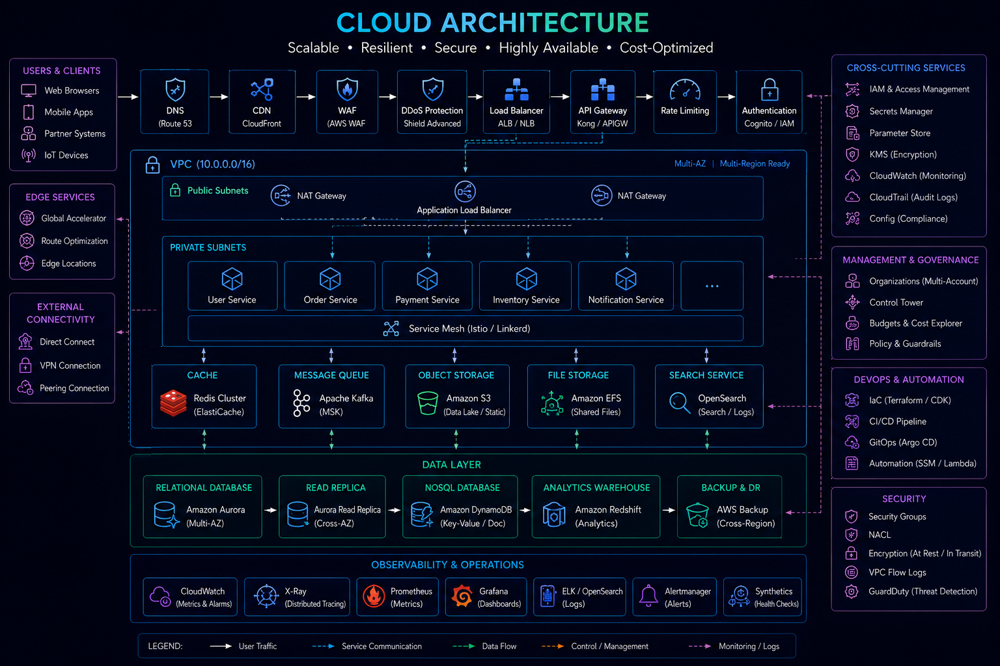
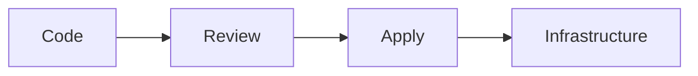
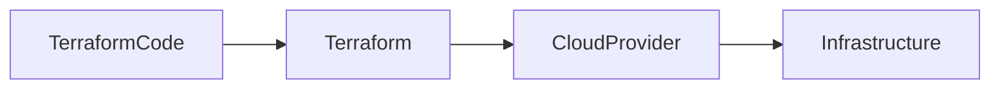
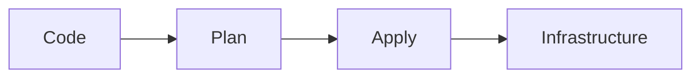
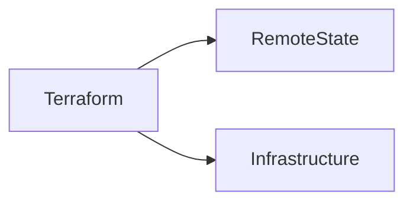
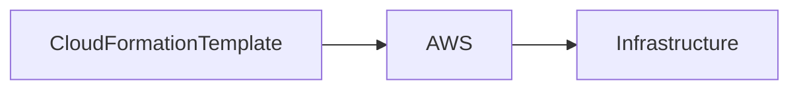
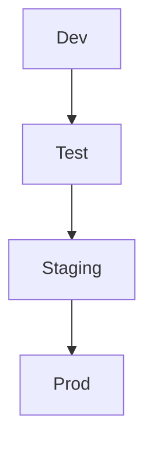
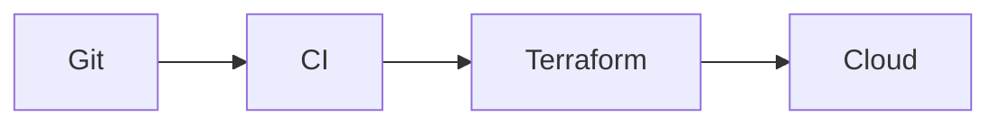
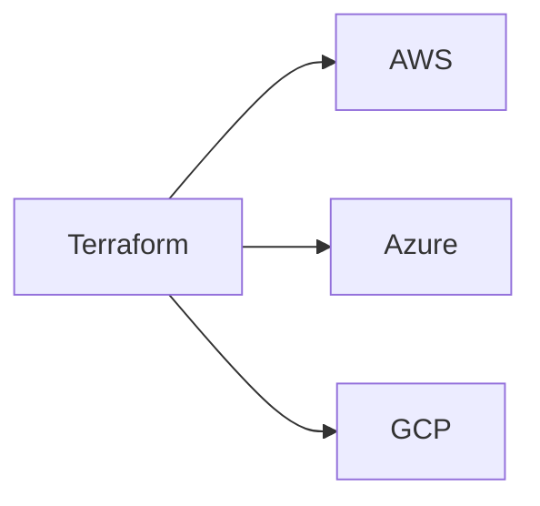

# Infrastructure as Code (IaC)



## Overview

Modern software systems require infrastructure that is scalable, repeatable, auditable, and easy to manage.

Historically, infrastructure was provisioned manually through cloud consoles, scripts, or operational runbooks.

This approach introduced challenges:

* Configuration Drift
* Human Error
* Inconsistent Environments
* Limited Auditability
* Slow Provisioning

Infrastructure as Code (IaC) addresses these issues by treating infrastructure definitions as software artifacts.

Servers, databases, networking, storage, security rules, and cloud services are defined declaratively and managed through version-controlled code.

This document explores IaC principles, architecture, governance, tooling, and production-grade infrastructure management strategies.

---

## Objectives

Infrastructure as Code aims to:

* Standardize Infrastructure
* Improve Repeatability
* Reduce Human Error
* Increase Automation
* Support Auditing
* Accelerate Delivery

---

# Why Infrastructure as Code Matters

Traditional infrastructure provisioning often follows:

```text id="o0vlzv"
Engineer

↓

Cloud Console

↓

Manual Configuration
```

Problems:

* Inconsistent Deployments
* Knowledge Silos
* Difficult Recovery

---

## IaC Approach

```text id="s5yx4q"
Code

↓

Version Control

↓

Automated Provisioning
```

Benefits:

* Predictability
* Repeatability
* Automation

---

# Core Principles

Infrastructure should be:

---

## Declarative

Define:

```text id="n3uy4z"
Desired State
```

Rather than procedural steps.

---

## Version Controlled

Infrastructure definitions belong in Git repositories.

---

## Reproducible

Environments should be recreated consistently.

---

## Automated

Provisioning should not require manual intervention.

---

# Infrastructure Lifecycle



---

# Benefits of IaC

---

## Consistency

Every environment follows the same definitions.

---

## Faster Provisioning

Infrastructure creation becomes automated.

---

## Disaster Recovery

Infrastructure can be recreated quickly.

---

## Auditing

Changes become traceable.

---

# Common IaC Tools

---

## Terraform

Industry-leading multi-cloud IaC platform.

---

## AWS CloudFormation

AWS-native infrastructure management.

---

## Pulumi

Infrastructure using programming languages.

---

## Azure Bicep

Azure-focused infrastructure definitions.

---

# Terraform


Terraform is one of the most widely adopted IaC tools.

---

## Characteristics

* Cloud Agnostic
* Declarative
* State Driven

---

## Architecture



---

## Benefits

* Multi-Cloud Support
* Strong Ecosystem
* Reusable Modules

---

# Terraform Workflow

---

## Step 1

Write Infrastructure Definitions.

---

## Step 2

Plan Changes.

---

## Step 3

Apply Changes.

---

## Architecture



---

# Terraform State

Terraform tracks infrastructure through state files.

---

## Purpose

Maintain mapping between:

```text id="0wq6y5"
Code

Infrastructure
```

---

## Importance

Without state:

Terraform cannot determine changes accurately.

---

# Remote State Management

State should not reside on developer machines.

---

## Common Storage

* Amazon S3
* Azure Storage
* Terraform Cloud

---

## Architecture



---

## Benefits

* Collaboration
* Reliability
* Recovery

---

# State Locking

Prevents simultaneous modifications.

---

## Example

```text id="ud7olp"
Engineer A

Applying Changes
```

Terraform locks state.

---

## Benefits

* Prevents Corruption
* Improves Safety

---

# Terraform Modules

Modules promote reuse.

---

## Example

```text id="eg50a9"
VPC Module

Database Module

Kubernetes Module
```

---

## Benefits

* Standardization
* Reduced Duplication

---

# CloudFormation

AWS-native infrastructure service.

---

## Architecture



---

## Benefits

* Native AWS Integration
* Managed Service

---

## Tradeoffs

* AWS Specific
* Less Portable

---

# Environment Provisioning

Most organizations maintain multiple environments.

---

## Example

```text id="6v6o1g"
Development

Testing

Staging

Production
```

---

## Goal

Consistent Infrastructure Across Environments.

---

# Environment Architecture



---

# Infrastructure Drift

Drift occurs when actual infrastructure differs from code.

---

## Example

```text id="vgn4dv"
Manual Cloud Console Change
```

Infrastructure becomes inconsistent.

---

## Risks

* Unpredictable Behavior
* Security Issues
* Recovery Problems

---

# Drift Detection

IaC tools help identify:

```text id="e5sdo2"
Code

≠

Infrastructure
```

---

## Benefits

* Governance
* Reliability

---

# CI/CD Integration


Infrastructure changes should follow the same pipeline processes as application code.

---

## Architecture



---

## Benefits

* Auditability
* Automation

---

# Policy as Code

Infrastructure governance should be automated.

---

## Examples

Policies may enforce:

* Encryption
* Network Restrictions
* Tagging Standards

---

## Benefits

* Compliance
* Security

---

# Secrets Management

Infrastructure code should never contain secrets.

---

## Avoid

```text id="uikv43"
Passwords

API Keys

Certificates
```

---

## Use

* AWS Secrets Manager
* HashiCorp Vault
* Azure Key Vault

---

# Infrastructure Security

Security should be integrated into IaC workflows.

---

## Controls

* IAM Policies
* Security Groups
* Network Segmentation
* Encryption

---

## Benefits

* Reduced Risk
* Standardized Security

---

# Multi-Cloud Infrastructure

Terraform supports multiple providers.

---

## Example



---

## Benefits

* Flexibility
* Vendor Independence

---

# Observability Integration


Infrastructure should provision:

* Monitoring
* Logging
* Alerting

Automatically.

---

## Benefits

* Faster Detection
* Operational Consistency

---

# Disaster Recovery

Infrastructure definitions support recovery.

---

## Recovery Process

```text id="q7ccg4"
Infrastructure Destroyed

↓

Terraform Apply

↓

Environment Restored
```

---

## Benefits

* Faster Recovery
* Reduced Downtime

---

# Real-World Examples

---

## Ecommerce Platform

IaC Provisions:

* VPC
* RDS
* Redis
* EC2
* Monitoring

---

## Fantasy Sports Platform

IaC Provisions:

* Realtime Services
* Auto Scaling
* Multi-AZ Infrastructure

---

## Opinion Trading Platform

IaC Provisions:

* Event Processing Infrastructure
* Database Clusters
* Queue Systems

---

# Common IaC Mistakes

---

## Manual Changes

Cause drift.

---

## Local State Files

Increase risk.

---

## Hardcoded Secrets

Create security issues.

---

## No Code Reviews

Increase operational risk.

---

## Environment Inconsistency

Creates deployment problems.

---

# Engineering Tradeoffs

| Strategy       | Benefit            | Cost                   |
| -------------- | ------------------ | ---------------------- |
| Terraform      | Flexibility        | State Management       |
| CloudFormation | Native AWS Support | Vendor Lock-In         |
| Modules        | Reusability        | Maintenance            |
| Policy as Code | Governance         | Initial Setup          |
| Multi-Cloud    | Flexibility        | Operational Complexity |

---

# Infrastructure Maturity Path

```text id="zms5wb"
Manual Provisioning
         │
         ▼
Scripts
         │
         ▼
Infrastructure as Code
         │
         ▼
Automated Pipelines
         │
         ▼
Policy as Code
         │
         ▼
Fully Automated Platform Engineering
```

---

# Interview Perspective

Strong engineers discuss:

* Terraform State
* Modules
* Environment Strategy
* Drift Detection
* Governance
* CI/CD Integration
* Disaster Recovery

Rather than viewing IaC as simply:

> "Infrastructure written in code."

IaC is fundamentally about creating repeatable, auditable, and reliable infrastructure systems.

---

# Engineering Outcome

Infrastructure as Code transforms infrastructure management from a manual operational activity into an automated engineering discipline.

By defining infrastructure declaratively, integrating governance and security, and automating provisioning through pipelines, organizations can improve reliability, accelerate delivery, and manage infrastructure at scale with confidence.
