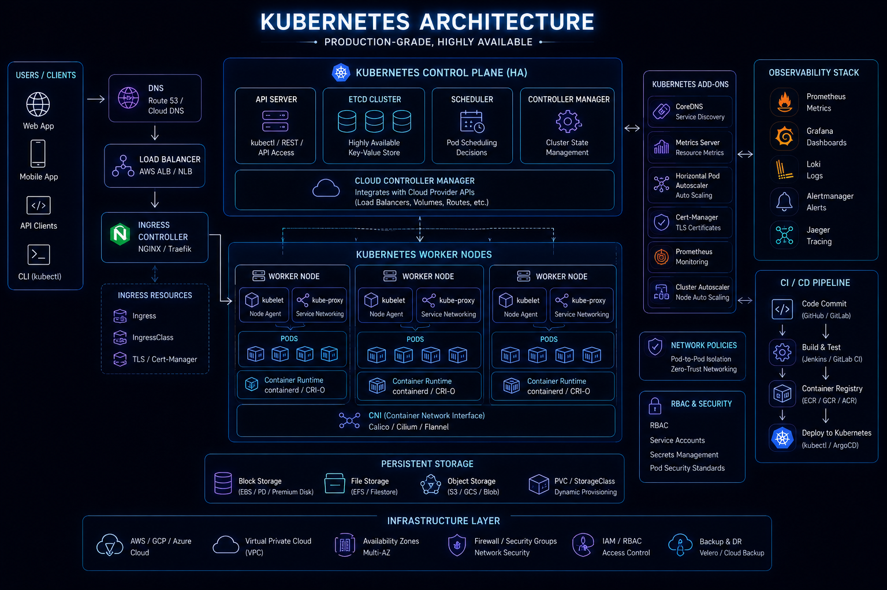
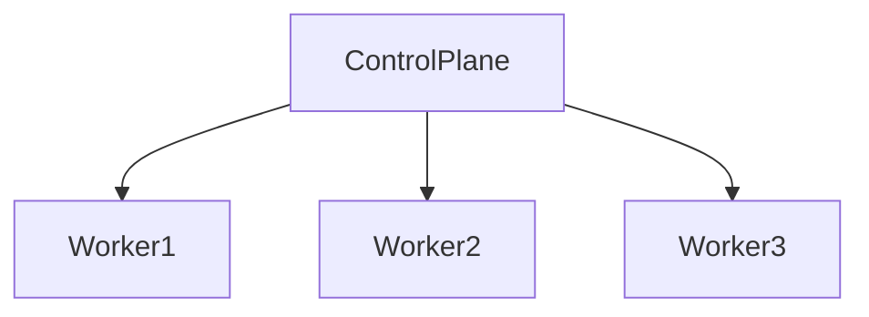
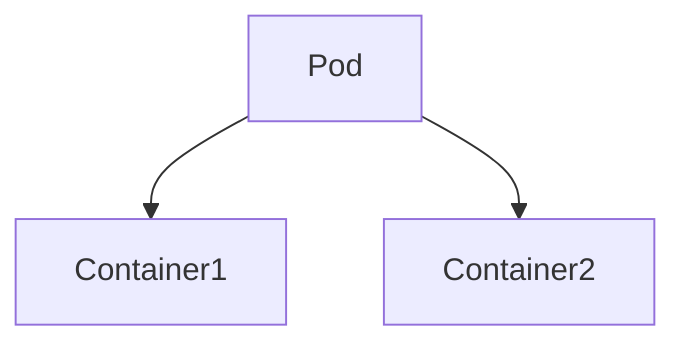
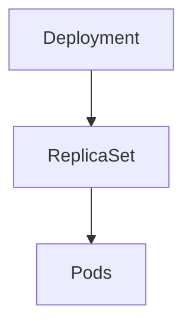
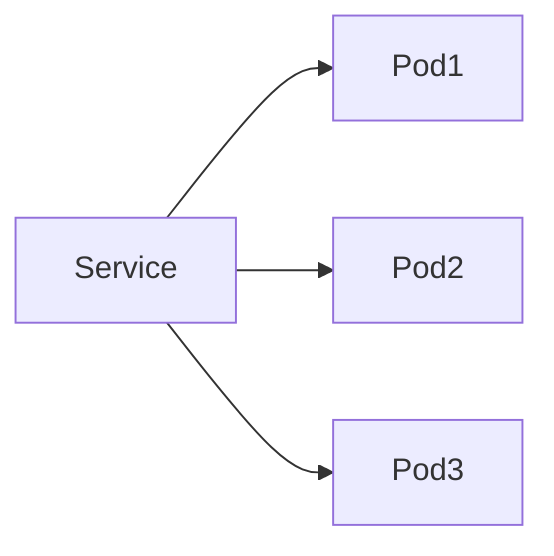
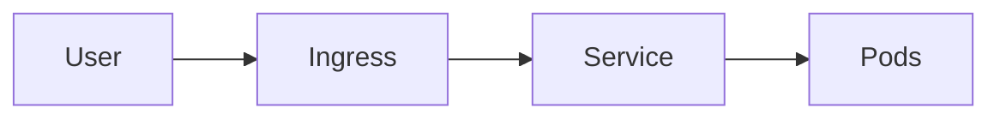
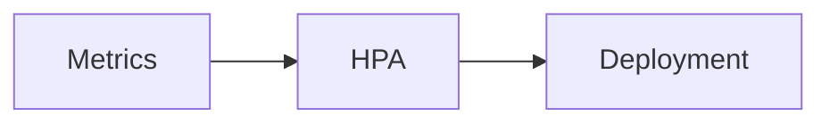
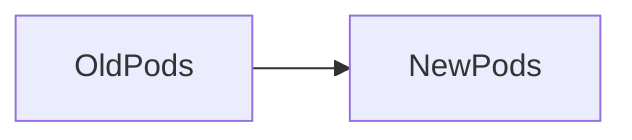
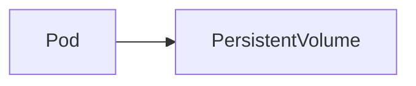
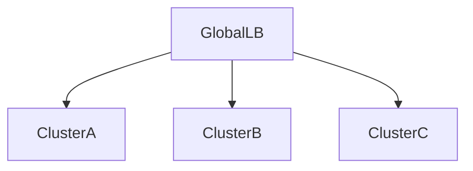

# Kubernetes Overview



## Overview

As organizations adopt microservices and containerized applications, managing hundreds or thousands of containers manually becomes impractical.

Challenges quickly emerge:

* Container Scheduling
* Service Discovery
* Scaling
* High Availability
* Networking
* Deployment Management
* Self-Healing

Kubernetes (K8s) was created to solve these challenges by providing a platform for automating deployment, scaling, networking, and management of containerized workloads.

Today, Kubernetes has become the de facto standard for container orchestration and serves as the foundation of modern cloud-native platforms.

This document explores Kubernetes architecture, core components, operational principles, and enterprise deployment strategies.

---

## Objectives

Kubernetes aims to:

* Automate Container Management
* Improve Reliability
* Enable Horizontal Scaling
* Simplify Deployments
* Increase Availability
* Support Cloud-Native Architectures

---

# Why Kubernetes Exists

Before Kubernetes:

```text id="0w6epg"
Docker Container

↓

Docker Container

↓

Docker Container
```

Managing containers manually becomes difficult at scale.

---

## Problems

* Scheduling Complexity
* Recovery Challenges
* Service Discovery Issues
* Scaling Difficulties

---

## Kubernetes Solution

```text id="q0m6b3"
Automated Scheduling

Automated Recovery

Automated Scaling

Automated Networking
```

---

# What Is Kubernetes?

Kubernetes is a container orchestration platform.

Responsibilities include:

* Scheduling Containers
* Managing Workloads
* Service Discovery
* Scaling Applications
* Health Monitoring
* Deployment Automation

---

# High-Level Architecture




---

# Kubernetes Cluster

A Kubernetes environment is called a cluster.

---

## Components

### Control Plane

Manages cluster state.

### Worker Nodes

Run workloads.

---

# Control Plane Components

The control plane acts as the brain of Kubernetes.

---

## API Server

Primary entry point.

Responsibilities:

* Receives Requests
* Validates Configuration
* Updates Cluster State

---

## etcd

Distributed key-value store.

Stores:

* Cluster Configuration
* Resource Definitions
* Desired State

---

## Scheduler

Determines where workloads should run.

Responsibilities:

* Node Selection
* Resource Allocation

---

## Controller Manager

Maintains desired state.

Example:

```text id="f7omwd"
Desired Pods = 3

Running Pods = 2
```

Controller creates missing pod.

---

# Worker Nodes

Worker nodes execute workloads.

---

## Components

* kubelet
* Container Runtime
* kube-proxy

---

## kubelet

Node agent.

Responsibilities:

* Pod Management
* Health Monitoring

---

## Container Runtime

Runs containers.

Examples:

* containerd
* CRI-O

---

## kube-proxy

Handles networking.

Responsibilities:

* Traffic Routing
* Service Communication

---

# Pods

Pods are the smallest deployable unit in Kubernetes.

---

## Architecture



---

## Characteristics

* Shared Network
* Shared Storage
* Shared Lifecycle

---

## Example

```text id="3xllut"
Node.js API

+

Logging Sidecar
```

inside a single pod.

---

# Deployments

Deployments manage pod lifecycle.

---

## Responsibilities

* Rolling Updates
* Scaling
* Self-Healing

---

## Architecture



---

# ReplicaSets

Ensure desired number of pods remain running.

---

## Example

```text id="qg6w7m"
Desired Pods = 5
```

If one pod fails:

```text id="vudpp8"
Kubernetes Creates Replacement
```

---

# Services

Pods are ephemeral.

IP addresses change.

Services provide stable access.

---

## Architecture



---

## Benefits

* Stable Endpoint
* Load Balancing
* Service Discovery

---

# Service Types

---

## ClusterIP

Internal communication.

---

## NodePort

Exposes service through node ports.

---

## LoadBalancer

Integrates with cloud load balancers.

---

## ExternalName

Maps to external services.

---

# Ingress

Ingress manages HTTP/HTTPS traffic.

---

## Architecture



---

## Benefits

* Routing Rules
* TLS Termination
* Centralized Traffic Management

---

# ConfigMaps

Store non-sensitive configuration.

---

## Examples

```text id="w9fd4j"
Feature Flags

Environment Settings

URLs
```

---

# Secrets

Store sensitive information.

---

## Examples

```text id="sq77ah"
Passwords

API Keys

Certificates
```

---

## Best Practice

Avoid storing secrets directly in manifests.

---

# Horizontal Pod Autoscaler (HPA)

Automatically scales pods.

---

## Architecture



---

## Example

```text id="mgk17m"
CPU > 70%

↓

Scale Out
```

---

# Cluster Autoscaler

Scales infrastructure itself.

---

## Example

```text id="8sqvkr"
Pods Pending

↓

Add Nodes
```

---

## Benefits

* Elastic Capacity
* Cost Optimization

---

# Self-Healing

One of Kubernetes' most valuable features.

---

## Example

```text id="5o33ub"
Pod Crash

↓

Replacement Pod Created
```

---

## Benefits

* Improved Reliability
* Reduced Manual Intervention

---

# Rolling Deployments

Safe deployment strategy.

---

## Architecture



---

## Benefits

* Zero Downtime Deployments
* Controlled Rollouts

---

# Service Discovery

Applications must find one another.

---

## Kubernetes Solution

Built-in DNS.

Example:

```text id="yyqaj9"
user-service.default.svc.cluster.local
```

---

## Benefits

* Dynamic Discovery
* Reduced Configuration

---

# Kubernetes Networking

Every pod receives:

```text id="r0y7fd"
Unique IP Address
```

---

## Characteristics

* Pod-to-Pod Communication
* Service Networking
* Ingress Routing

---

# Persistent Storage

Containers are ephemeral.

Data persistence requires volumes.

---

## Architecture



---

## Use Cases

* Databases
* File Storage
* Persistent State

---

# Kubernetes Security

Security should be integrated from the beginning.

---

## Practices

* RBAC
* Network Policies
* Secrets Management
* Image Scanning

---

## Benefits

* Reduced Risk
* Better Governance

---

# Observability


Monitor:

* Node Health
* Pod Health
* CPU Usage
* Memory Usage
* Network Traffic

---

## Common Tools

* Prometheus
* Grafana
* OpenTelemetry

---

# Kubernetes Architecture at Scale



---

## Benefits

* Disaster Recovery
* Geographic Redundancy
* High Availability

---

# Managed Kubernetes Platforms

Most organizations use managed offerings.

---

## Examples

* Amazon EKS
* Google GKE
* Azure AKS

---

## Benefits

* Reduced Operational Burden
* Managed Control Plane

---

# Real-World Examples

---

## Ecommerce Platform

Kubernetes manages:

* API Services
* Background Workers
* Frontend Applications

---

## Fantasy Sports Platform

Kubernetes manages:

* Match Services
* Realtime Engines
* Leaderboard Processing

---

## Opinion Trading Platform

Kubernetes manages:

* Trading Services
* Settlement Workers
* Event Processors

---

# Common Kubernetes Mistakes

---

## No Resource Limits

Causes instability.

---

## Weak Observability

Makes troubleshooting difficult.

---

## Large Clusters Without Governance

Creates operational risk.

---

## Poor Secret Management

Introduces security concerns.

---

## Ignoring Autoscaling

Reduces efficiency.

---

# Engineering Tradeoffs

| Capability        | Benefit     | Cost                  |
| ----------------- | ----------- | --------------------- |
| Kubernetes        | Automation  | Learning Curve        |
| Autoscaling       | Elasticity  | Complexity            |
| Self-Healing      | Reliability | Operational Overhead  |
| Service Discovery | Simplicity  | Platform Dependency   |
| Multi-Cluster     | Resilience  | Management Complexity |

---

# Kubernetes Maturity Path

```text id="o61tjh"
Containers
      │
      ▼
Single Cluster
      │
      ▼
Autoscaling
      │
      ▼
Multi-Service Platform
      │
      ▼
Multi-Cluster Architecture
      │
      ▼
Cloud-Native Enterprise Platform
```

---

# Interview Perspective

Strong engineers discuss:

* Pods
* Deployments
* Services
* Ingress
* Autoscaling
* Resource Limits
* Service Discovery
* Cluster Architecture

Rather than describing Kubernetes simply as:

> "A platform that runs containers."

Kubernetes is fundamentally an orchestration and reliability platform.

---

# Engineering Outcome

Kubernetes has become the standard platform for orchestrating containerized workloads at scale.

By automating scheduling, scaling, networking, deployment, and recovery operations, Kubernetes enables organizations to build resilient, scalable, and cloud-native platforms capable of supporting modern software delivery and operational requirements.
