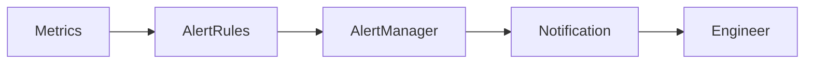
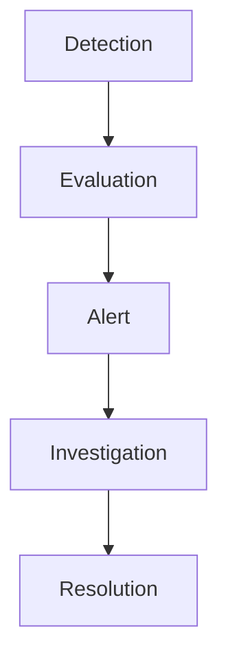
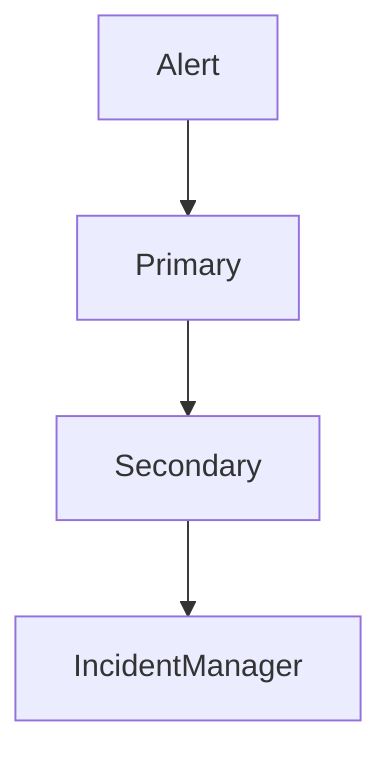

# Alerting Strategy


## Overview

Monitoring systems generate visibility.

Alerting systems generate action.

Without alerting:

```text
Issue Occurs

↓

Metrics Collected

↓

Nobody Notices
```

With alerting:

```text
Issue Occurs

↓

Alert Generated

↓

Engineer Notified

↓

Investigation Begins
```

A well-designed alerting strategy helps engineering teams identify critical problems quickly while avoiding unnecessary interruptions.

Poor alerting systems often create:

* Alert Fatigue
* False Positives
* Missed Incidents
* Burned-Out On-Call Engineers

This document explores production-grade alerting architectures, escalation policies, SLO-based alerting, incident management, and operational best practices.

---

## Objectives

Alerting aims to:

* Detect Critical Issues
* Reduce MTTD
* Improve Reliability
* Accelerate Incident Response
* Protect Customer Experience
* Reduce Operational Noise

---

# Why Alerting Matters

Monitoring alone is insufficient.

Engineers cannot continuously watch dashboards.

Alerting ensures operational issues reach the correct people at the correct time.

---

## Goals

* Fast Detection
* Actionable Notifications
* Reliable Escalation
* Reduced Noise

---

# Alerting Architecture




---

# Alert Lifecycle



---

# What Makes a Good Alert?

A good alert should be:

---

## Actionable

The recipient should know what to do.

---

## Relevant

The issue should matter.

---

## Timely

Alerts should arrive quickly.

---

## Accurate

False positives should be minimized.

---

# Alert Severity Levels

Different incidents require different urgency.

---

## Critical

Immediate customer impact.

Examples:

* Site Down
* Payment Failure
* Database Outage

---

## High

Major degradation.

Examples:

* Elevated Error Rates
* Significant Latency

---

## Medium

Operational concern.

Examples:

* Reduced Capacity
* Infrastructure Warnings

---

## Low

Informational events.

Examples:

* Maintenance Notifications
* Capacity Trends

---

# Alert Sources

Alerts can originate from:

---

## Infrastructure

* CPU
* Memory
* Disk
* Network

---

## Applications

* Error Rates
* Latency
* Availability

---

## Databases

* Replication Lag
* Slow Queries
* Connection Exhaustion

---

## Business Systems

* Failed Orders
* Payment Issues
* Revenue Drops

---

# Threshold-Based Alerts

The simplest alert type.

---

## Example

```text
CPU > 90%
```

---

## Benefits

* Easy To Understand
* Easy To Implement

---

## Problems

* Noise
* Limited Context

---

# Symptom-Based Alerts

Focus on user impact.

---

## Example

```text
Error Rate > 5%
```

Instead of:

```text
CPU > 80%
```

---

## Benefits

* User-Centric
* Higher Signal Quality

---

# SLO-Based Alerting

Modern SRE teams increasingly alert on service objectives.

---

## Example

```text
Availability Below Target
```

---

## Benefits

* Business Alignment
* Reduced Noise

---

# Error Budget Alerting

Error budgets enable reliability governance.

---

## Formula

Error\ Budget = 100% - SLO

---

## Example

```text
99.9% Availability Target

↓

0.1% Error Budget
```

---

# Burn Rate Alerts

One of the most powerful SRE alerting techniques.

---

## Concept

Measure how quickly error budgets are consumed.

---

## Example

```text
Monthly Budget

↓

Consumed In 1 Day
```

Alert immediately.

---

## Benefits

* Earlier Detection
* Better Reliability Control

---

# Multi-Window Burn Rate Alerting

Common Google SRE approach.

---

## Short Window

Fast detection.

---

## Long Window

Noise reduction.

---

## Example

```text
5 Minutes

1 Hour

6 Hours

24 Hours
```

---

# Alert Fatigue

One of the biggest operational challenges.

---

## Causes

* Too Many Alerts
* Low Quality Alerts
* Duplicate Notifications

---

## Results

```text
Engineers Ignore Alerts
```

---

# Reducing Alert Fatigue

---

## Remove Noisy Alerts

Delete alerts that provide little value.

---

## Aggregate Alerts

Combine related notifications.

---

## Prioritize Impact

Alert on customer impact first.

---

## Tune Thresholds

Reduce unnecessary triggers.

---

# Alert Routing

Different alerts should reach different teams.

---

## Example

```text
Database Alerts

↓

Platform Team

Payment Alerts

↓

Payments Team
```

---

# Alert Escalation

Critical incidents require escalation.

---

## Flow



---

## Benefits

* Faster Resolution
* Reduced Risk

---

# PagerDuty

One of the most common alert management platforms.

---

## Capabilities

* On-Call Scheduling
* Escalation Policies
* Incident Coordination

---

## Benefits

* Reliable Notification Delivery
* Structured Escalation

---

# On-Call Engineering

Production systems require ownership.

---

## Responsibilities

* Alert Response
* Incident Investigation
* Service Recovery

---

## Goals

* Fast Detection
* Fast Recovery

---

# Alert Suppression

Not all alerts should generate notifications.

---

## Example

```text
Known Maintenance Window
```

Suppress expected alerts.

---

## Benefits

* Reduced Noise

---

# Alert Correlation

Multiple failures may share a root cause.

---

## Example

```text
Database Failure

↓

API Errors

↓

Queue Backlogs
```

---

## Goal

Generate one actionable incident.

---

# Incident Management Integration


Alerting should integrate with incident response workflows.

---

## Components

* Alerts
* Runbooks
* Incident Tracking
* Postmortems

---

# Runbooks

Every critical alert should have a runbook.

---

## Contents

* Description
* Investigation Steps
* Recovery Procedures
* Escalation Contacts

---

## Benefits

* Faster Resolution
* Consistent Responses

---

# Business Alerting

Infrastructure health is not enough.

---

## Examples

```text
Checkout Success Rate

Payment Failure Rate

Trade Execution Failures
```

---

## Benefits

* Business Visibility
* Revenue Protection

---

# Alert Prioritization Matrix

| Impact | Urgency | Severity |
| ------ | ------- | -------- |
| High   | High    | Critical |
| High   | Medium  | High     |
| Medium | Medium  | Medium   |
| Low    | Low     | Low      |

---

# Alerting for Kubernetes

Common Alerts:

* Pod Restarts
* Node Failures
* Resource Saturation
* Deployment Failures

---

## Benefits

* Platform Visibility

---

# Alerting Metrics

Track alert system effectiveness.

---

## Examples

```text
Alert Volume

False Positive Rate

MTTD

MTTR
```

---

## Benefits

* Continuous Improvement

---

# Real-World Examples

---

## Ecommerce Platform

Alerts:

* Payment Failures
* Checkout Errors
* Inventory Sync Issues

---

## Fantasy Sports Platform

Alerts:

* Feed Delays
* Score Processing Failures
* Socket Connection Drops

---

## Opinion Trading Platform

Alerts:

* Trade Failures
* Settlement Delays
* Risk Calculation Issues

---

# Common Alerting Mistakes

---

## Alerting On Everything

Creates noise.

---

## Missing Critical Alerts

Creates blind spots.

---

## No Escalation Policies

Delays response.

---

## No Runbooks

Slows recovery.

---

## Infrastructure-Only Alerting

Misses business failures.

---

# Engineering Tradeoffs

| Strategy             | Benefit               | Cost                    |
| -------------------- | --------------------- | ----------------------- |
| More Alerts          | Better Coverage       | More Noise              |
| SLO Alerting         | Higher Signal Quality | Additional Setup        |
| Burn Rate Alerts     | Better Reliability    | Complexity              |
| Detailed Routing     | Better Ownership      | Administrative Overhead |
| Extensive Escalation | Faster Recovery       | Process Complexity      |

---

# Alerting Maturity Model

```text
Basic Threshold Alerts
          │
          ▼
Service Alerts
          │
          ▼
Business Alerts
          │
          ▼
SLO-Based Alerts
          │
          ▼
Burn Rate Alerting
          │
          ▼
Enterprise Incident Platform
```

---

# Interview Perspective

Strong engineers discuss:

* Alert Fatigue
* SLO Alerting
* Burn Rate Alerts
* Escalation Policies
* PagerDuty
* Runbooks
* Incident Response

Rather than viewing alerting as simple threshold monitoring.

Alerting is fundamentally about delivering the right signal to the right engineer at the right time.

---

# Engineering Outcome

A well-designed alerting strategy transforms monitoring data into operational action.

By focusing on customer impact, reducing alert fatigue, leveraging SLO-based alerting, and integrating escalation and incident management workflows, organizations can significantly improve reliability, accelerate incident response, and maintain operational excellence at scale.
