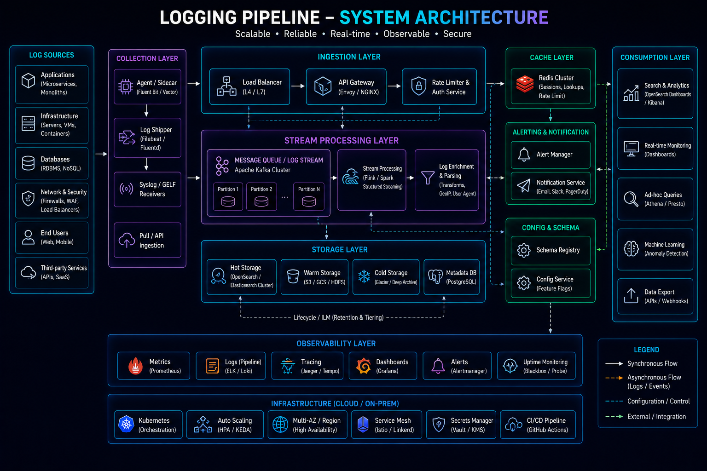
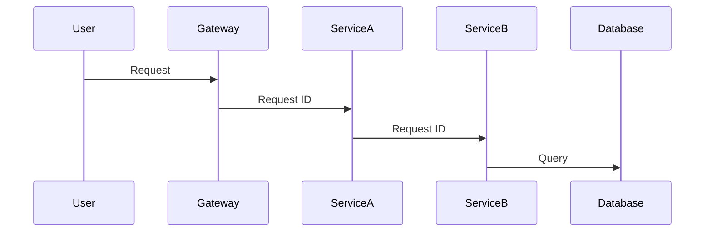
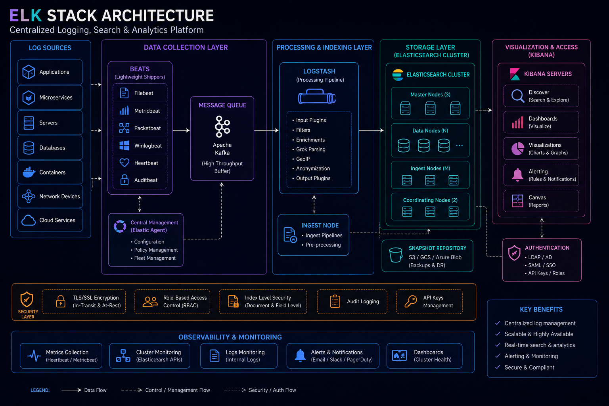
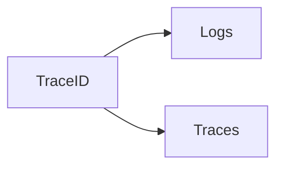
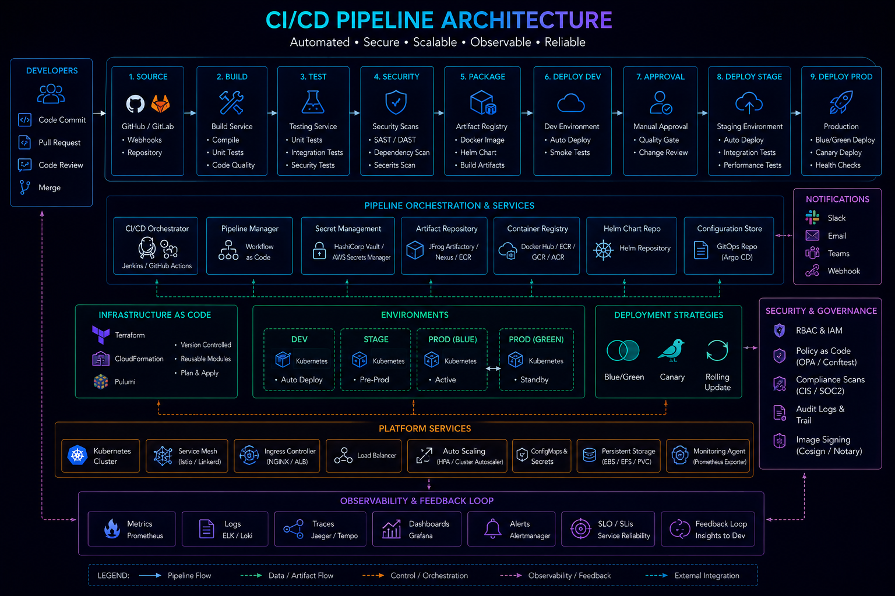

# Centralized Logging



## Overview

Logs are one of the most valuable sources of operational intelligence in software systems.

When incidents occur, logs often provide the fastest path to understanding:

* What happened
* When it happened
* Where it happened
* Why it happened

In small applications, logs may exist only on individual servers.

However, modern distributed systems contain:

* Multiple Services
* Containers
* Kubernetes Clusters
* Databases
* Message Brokers
* Cloud Infrastructure

Searching logs across hundreds or thousands of systems becomes impossible without centralized logging.

Centralized logging aggregates logs into a unified platform where they can be searched, analyzed, correlated, and retained for operational and compliance purposes.

---

## Objectives

Centralized logging aims to:

* Simplify Troubleshooting
* Improve Incident Response
* Support Auditing
* Enable Root Cause Analysis
* Improve Observability
* Meet Compliance Requirements

---

# Why Centralized Logging Matters

Without centralized logging:

```text
Application A Logs

Server A

Application B Logs

Server B

Application C Logs

Server C
```

Problems:

* Difficult Search
* Limited Visibility
* Slow Investigations

---

## Centralized Approach

```text
Applications

↓

Log Pipeline

↓

Centralized Platform
```

Benefits:

* Unified Visibility
* Faster Troubleshooting

---

# What Is a Log?

A log is a recorded event.

Examples:

```text
User Login

Order Created

Payment Failed

Database Timeout

Deployment Started
```

---

## Log Characteristics

Logs provide:

* Context
* Event History
* Diagnostic Information

---

# Logging Architecture


---

# Logging Components

---

## Log Producers

Applications and infrastructure generating logs.

---

## Log Collectors

Gather logs from systems.

Examples:

* Fluent Bit
* Fluentd
* Filebeat

---

## Log Storage

Stores logs for querying.

Examples:

* Elasticsearch
* OpenSearch
* Loki

---

## Visualization Layer

Provides search and dashboards.

Examples:

* Kibana
* Grafana

---

# Structured Logging

One of the most important logging practices.

---

## Unstructured Logging

Poor example:

```text
User logged in successfully
```

---

## Structured Logging

Preferred approach:

```json
{
  "event": "user_login",
  "user_id": 123,
  "service": "auth-service",
  "timestamp": "2026-06-04T10:00:00Z"
}
```

---

## Benefits

* Searchability
* Analytics
* Automation
* Correlation

---

# Logging Levels

Different events require different severity levels.

---

## DEBUG

Detailed troubleshooting information.

---

## INFO

Normal operations.

---

## WARN

Potential issues.

---

## ERROR

Operational failures.

---

## FATAL

Critical failures.

---

# Log Design Principles

Good logs should be:

---

## Consistent

Use common formats.

---

## Context Rich

Include identifiers.

Examples:

```text
Request ID

User ID

Order ID

Trace ID
```

---

## Actionable

Provide useful diagnostic information.

---

# Correlation IDs

Distributed systems require request tracking.

---

## Architecture



---

## Benefits

* End-to-End Visibility
* Easier Troubleshooting

---

# ELK Stack



One of the most common logging platforms.

---

## Components

### Elasticsearch

Search and storage engine.

---

### Logstash

Data processing pipeline.

---

### Kibana

Visualization platform.

---

## Architecture


---

# OpenSearch

Community-driven search platform.

---

## Capabilities

* Log Storage
* Full-Text Search
* Analytics
* Dashboards

---

## Benefits

* Open Source
* Scalable
* Cost Effective

---

# Fluent Bit

Fluent Bit is widely used for lightweight log collection.

---

## Responsibilities

* Log Collection
* Forwarding
* Filtering

---

## Architecture


---

## Benefits

* Lightweight
* Kubernetes Friendly
* High Performance

---

# Filebeat

Alternative log collector.

---

## Responsibilities

* Log Shipping
* Forwarding
* Lightweight Collection

---

## Common Usage

ELK-based environments.

---

# Kubernetes Logging

Containers are ephemeral.

Logs must be centralized.

---

## Architecture


---

## Benefits

* Persistent Visibility
* Cluster-Wide Search

---

# Cloud Logging

Cloud providers offer managed logging services.

---

## AWS

CloudWatch Logs

---

## Azure

Azure Monitor Logs

---

## GCP

Cloud Logging

---

# Log Retention Strategy

Not all logs require permanent storage.

---

## Example Policy

```text
Debug Logs

7 Days

Info Logs

30 Days

Audit Logs

365 Days
```

---

## Benefits

* Cost Optimization
* Compliance Support

---

# Log Indexing

Large-scale platforms require indexing.

---

## Benefits

* Fast Search
* Improved Performance

---

## Tradeoff

Higher Storage Cost.

---

# Log Analytics

Logs provide operational intelligence.

---

## Examples

Analyze:

* Error Trends
* Login Activity
* Payment Failures
* Deployment Events

---

# Security Logging

Security events require dedicated visibility.

---

## Examples

```text
Authentication Failures

Permission Denied

Suspicious Requests

Privilege Changes
```

---

## Benefits

* Threat Detection
* Compliance

---

# Audit Logging

Critical for regulated environments.

---

## Examples

```text
User Modified Record

Admin Changed Permissions

Data Export Performed
```

---

## Benefits

* Accountability
* Compliance

---

# Logging and Tracing

Logs become more valuable when integrated with tracing.

---

## Architecture



---

## Benefits

* Faster Root Cause Analysis
* Better Correlation

---

# Logging in CI/CD



Deployments should generate logs.

---

## Examples

* Build Events
* Deployment Events
* Rollback Events

---

## Benefits

* Auditability
* Troubleshooting

---

# Cost Management

Logging volume grows rapidly.

---

## Common Strategies

* Retention Policies
* Compression
* Tiered Storage

---

## Goal

Balance:

```text
Visibility

vs

Cost
```

---

# Real-World Examples

---

## Ecommerce Platform

Log:

* Checkout Failures
* Payment Events
* Inventory Updates

---

## Fantasy Sports Platform

Log:

* Match Updates
* Leaderboard Processing
* Realtime Events

---

## Opinion Trading Platform

Log:

* Trade Execution
* Settlement Events
* Risk Calculations

---

# Common Logging Mistakes

---

## Logging Sensitive Data

Creates security risks.

---

## Missing Context

Logs become difficult to use.

---

## Excessive Logging

Creates noise and cost.

---

## No Retention Policy

Storage grows uncontrollably.

---

## No Correlation IDs

Root cause analysis becomes difficult.

---

# Engineering Tradeoffs

| Strategy            | Benefit               | Cost                      |
| ------------------- | --------------------- | ------------------------- |
| Structured Logging  | Better Searchability  | Development Effort        |
| Long Retention      | More History          | Storage Cost              |
| Full Log Collection | Better Visibility     | Increased Volume          |
| Centralized Logging | Faster Investigations | Infrastructure Complexity |
| Security Logging    | Better Compliance     | Additional Storage        |

---

# Logging Maturity Model

```text
Application Logs
       │
       ▼
Centralized Collection
       │
       ▼
Structured Logging
       │
       ▼
Correlation IDs
       │
       ▼
Log Analytics
       │
       ▼
Enterprise Observability Platform
```

---

# Interview Perspective

Strong engineers discuss:

* Structured Logging
* Correlation IDs
* ELK Stack
* OpenSearch
* Fluent Bit
* Retention Strategies
* Security Logging

Rather than treating logs as simple text output.

Logs are one of the most powerful operational tools available to engineering teams.

---

# Engineering Outcome

Centralized logging transforms logs from isolated troubleshooting artifacts into a strategic observability platform.

By standardizing log formats, aggregating data centrally, integrating with tracing systems, and applying effective retention and governance policies, organizations can significantly improve operational visibility, incident response, security posture, and engineering productivity.
