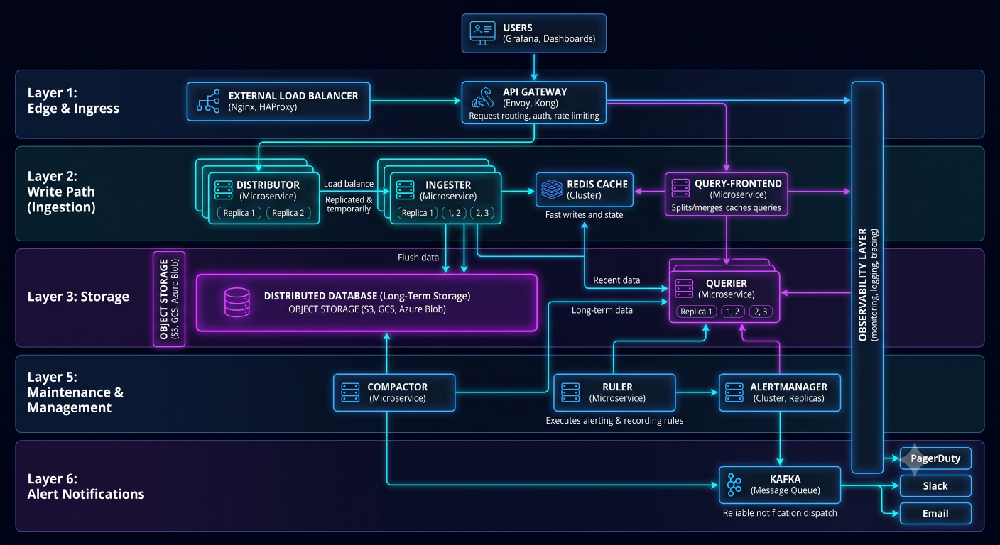
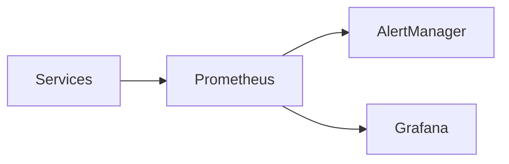
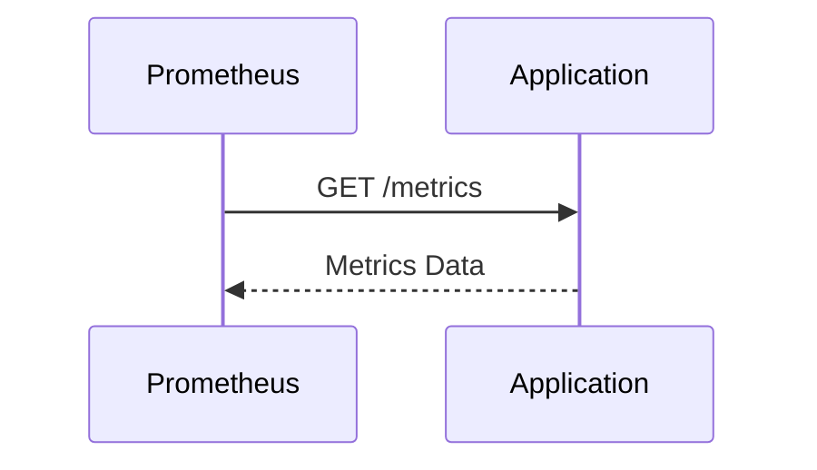

# Metrics Collection



## Overview

Metrics are the foundation of modern monitoring systems.

While logs provide detailed event information and traces reveal request flows, metrics provide the aggregated operational view required for:

* Monitoring
* Alerting
* Capacity Planning
* Trend Analysis
* Performance Optimization
* Reliability Engineering

Most production incidents are first detected through metrics before engineers investigate using logs and traces.

Metrics must therefore be designed carefully to provide meaningful operational visibility without creating excessive storage, query, or maintenance costs.

---

## Objectives

Metrics collection aims to:

* Measure System Health
* Detect Operational Issues
* Enable Alerting
* Support Capacity Planning
* Improve Reliability
* Provide Operational Visibility

---

# What Are Metrics?

Metrics are numerical measurements collected over time.

Examples:

```text
Requests Per Second

CPU Usage

Memory Usage

Error Rate

Response Latency
```

---

## Characteristics

Metrics are:

* Aggregated
* Lightweight
* Queryable
* Efficient

---

## Why Metrics Matter

Metrics answer questions such as:

```text
Is Traffic Increasing?

Are Errors Growing?

Is Latency Degrading?

Will Capacity Run Out?
```

---

# Metrics Architecture


---

# Types of Metrics

Most monitoring systems rely on four core metric types.

---

# Counter

Counters only increase.

---

## Examples

```text
Total Requests

Total Orders

Total Errors

Total Payments
```

---

## Characteristics

* Monotonic
* Reset On Restart

---

## Use Cases

* Request Tracking
* Error Tracking
* Event Counting

---

# Gauge

Gauges represent current values.

---

## Examples

```text
CPU Usage

Memory Usage

Queue Length

Active Users
```

---

## Characteristics

Can increase or decrease.

---

## Use Cases

* Resource Monitoring
* Current State Visibility

---

# Histogram

Histograms measure value distributions.

---

## Examples

```text
Response Times

Query Duration

Job Processing Time
```

---

## Benefits

* Percentile Calculations
* Latency Analysis

---

# Summary

Summaries also measure distributions.

---

## Characteristics

Pre-calculated quantiles.

---

## Tradeoff

Less flexible aggregation.

---

# Metric Selection Guide

| Metric Type | Use Case                |
| ----------- | ----------------------- |
| Counter     | Events                  |
| Gauge       | Current State           |
| Histogram   | Latency Distribution    |
| Summary     | Client-Side Percentiles |

---

# Prometheus

Prometheus has become the standard metrics platform.

---

## Responsibilities

* Collection
* Storage
* Querying
* Alert Evaluation

---

## Architecture



---

# Prometheus Pull Model

Prometheus collects metrics by scraping endpoints.

---

## Flow



---

## Benefits

* Simplicity
* Reliability
* Service Discovery Support

---

# Exporters

Exporters expose metrics for systems that cannot provide them directly.

---

## Common Exporters

### Node Exporter

Infrastructure metrics.

---

### MySQL Exporter

Database metrics.

---

### Redis Exporter

Cache metrics.

---

### Blackbox Exporter

Availability checks.

---

### Kafka Exporter

Message broker metrics.

---

# OpenTelemetry Metrics


OpenTelemetry standardizes telemetry collection.

---

## Capabilities

* Metrics
* Logs
* Traces

---

## Benefits

* Vendor Neutral
* Standardized Instrumentation

---

# Metric Naming

Metric naming should be consistent.

---

## Example

```text
http_requests_total

payment_success_total

database_query_duration_seconds
```

---

## Benefits

* Searchability
* Consistency

---

# Labels

Labels provide dimensions.

---

## Example

```text
http_requests_total

method=GET

status=200

service=api
```

---

## Benefits

* Flexible Queries
* Rich Analytics

---

# Cardinality

One of the most important monitoring concepts.

---

## Definition

The number of unique metric combinations.

---

## Example

Good:

```text
status=200

status=500
```

---

Bad:

```text
user_id=123

user_id=124

user_id=125
```

---

## Problem

High cardinality increases:

* Storage Usage
* Query Complexity
* Operational Cost

---

# Cardinality Explosion

Example:

```text
100 Services

×

1000 Users

×

100 Endpoints
```

Millions of series created.

---

## Risks

* Slow Queries
* Increased Costs
* Monitoring Instability

---

# Best Practices

Avoid labels such as:

```text
User ID

Email

Request ID
```

---

Prefer:

```text
Status

Region

Service

Environment
```

---

# Histograms and Percentiles

Latency monitoring often relies on percentiles.

---

## Common Percentiles

```text
P50

P95

P99
```

---

## Importance

Average latency hides tail behavior.

---

## Example

```text
Average = 100ms

P99 = 2000ms
```

Users still experience problems.

---

# Error Rate Metrics

One of the most important service metrics.

---

## Formula

Error\ Rate = \frac{Failed\ Requests}{Total\ Requests}

---

## Benefits

* Reliability Visibility
* Alerting Support

---

# Availability Metrics

Availability measures successful operations.

---

## Formula

Availability = \frac{Successful\ Requests}{Total\ Requests}

---

# Business Metrics

Technical metrics are insufficient.

---

## Examples

```text
Orders Created

Revenue

Payments Processed

Trades Executed
```

---

## Benefits

* Business Visibility
* Product Health Monitoring

---

# Infrastructure Metrics

Monitor:

* CPU
* Memory
* Disk
* Network

---

## Benefits

* Capacity Planning
* Resource Optimization

---

# Application Metrics

Monitor:

* Request Rate
* Error Rate
* Latency
* Queue Depth

---

## Benefits

* Service Health Visibility

---

# Database Metrics

Monitor:

* Query Latency
* Connection Count
* Replication Lag
* Cache Hit Rate

---

## Benefits

* Database Reliability

---

# Queue Metrics

Monitor:

* Queue Depth
* Processing Rate
* Retry Count
* DLQ Volume

---

## Benefits

* Bottleneck Detection

---

# Time-Series Storage

Metrics are stored as time-series data.

---

## Example

```text
Time

↓

Value
```

---

## Benefits

* Trend Analysis
* Forecasting

---

# Retention Strategy

Metrics retention affects cost.

---

## Example

```text
Raw Metrics

30 Days

Aggregated Metrics

1 Year
```

---

## Benefits

* Cost Optimization

---

# Recording Rules

Prometheus can precompute queries.

---

## Benefits

* Faster Dashboards
* Reduced Query Cost

---

# Metrics for Kubernetes

Monitor:

* Node Health
* Pod Health
* CPU Usage
* Memory Usage
* Restart Count

---

## Benefits

* Cluster Visibility

---

# Metrics and Alerting

Metrics drive alerting systems.

---

## Examples

```text
Error Rate > 5%

CPU > 90%

Latency > 500ms
```

---

## Benefits

* Faster Detection

---

# Capacity Planning

Metrics enable forecasting.

---

## Example

```text
Traffic Growth

↓

Infrastructure Scaling
```

---

## Benefits

* Predictable Growth

---

# Real-World Examples

---

## Ecommerce Platform

Metrics:

* Checkout Success Rate
* Payment Latency
* Order Throughput

---

## Fantasy Sports Platform

Metrics:

* Score Processing Rate
* Active Connections
* Feed Latency

---

## Opinion Trading Platform

Metrics:

* Trade Volume
* Execution Latency
* Settlement Throughput

---

# Common Metrics Mistakes

---

## High Cardinality

Creates scaling issues.

---

## Missing Business Metrics

Limits visibility.

---

## Too Many Metrics

Creates operational overhead.

---

## Inconsistent Naming

Complicates analysis.

---

## Poor Label Design

Increases costs.

---

# Engineering Tradeoffs

| Strategy           | Benefit             | Cost                   |
| ------------------ | ------------------- | ---------------------- |
| Detailed Metrics   | Better Visibility   | Storage Cost           |
| Histograms         | Rich Analytics      | Increased Cardinality  |
| Long Retention     | Historical Insights | Higher Cost            |
| Business Metrics   | Product Visibility  | Instrumentation Effort |
| Extensive Labeling | Better Queries      | Cardinality Risk       |

---

# Metrics Maturity Model

```text
Basic Counters
      │
      ▼
Infrastructure Metrics
      │
      ▼
Application Metrics
      │
      ▼
Business Metrics
      │
      ▼
OpenTelemetry
      │
      ▼
Enterprise Observability Platform
```

---

# Interview Perspective

Strong engineers discuss:

* Counters
* Gauges
* Histograms
* Cardinality
* Prometheus
* OpenTelemetry
* Metric Design
* Capacity Planning

Rather than treating metrics as simple monitoring values.

Metric design directly impacts reliability, visibility, and operational cost.

---

# Engineering Outcome

Metrics collection is a foundational capability for modern observability platforms.

By designing meaningful metrics, controlling cardinality, leveraging time-series storage, and integrating monitoring with alerting and capacity planning, organizations gain the visibility required to operate complex distributed systems reliably and efficiently.
