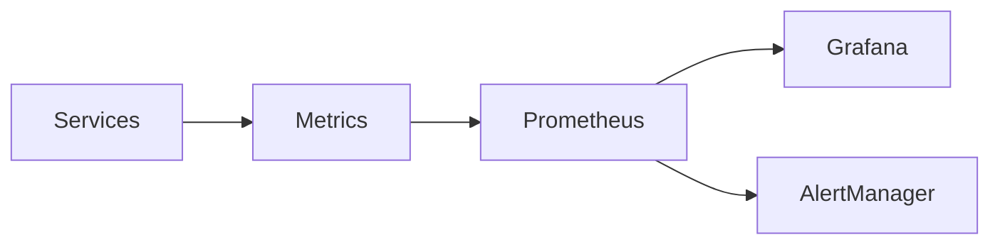
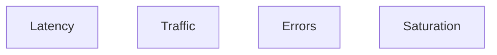
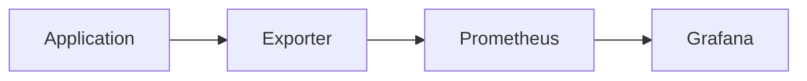
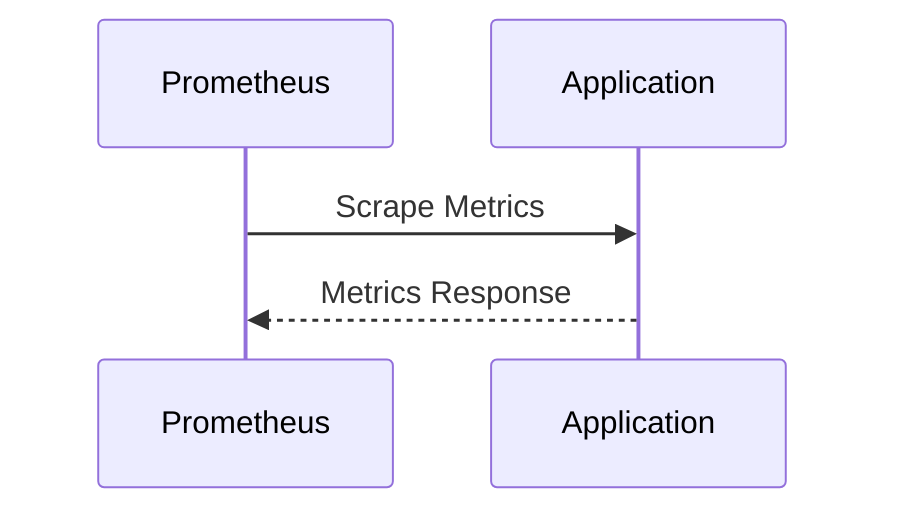
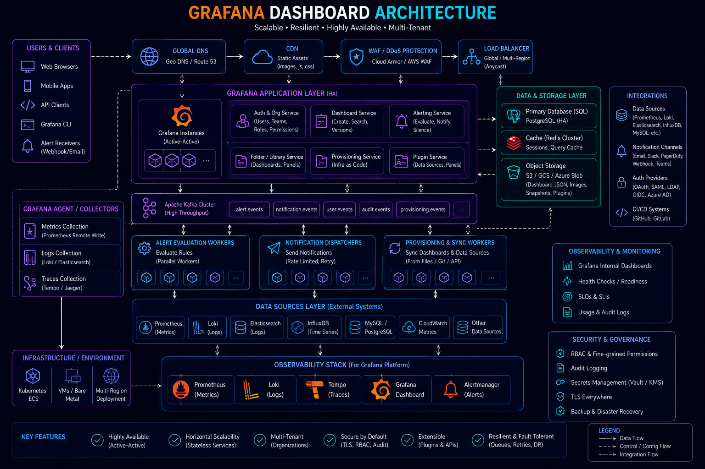
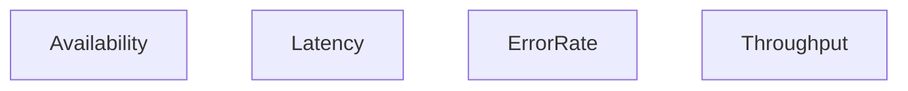
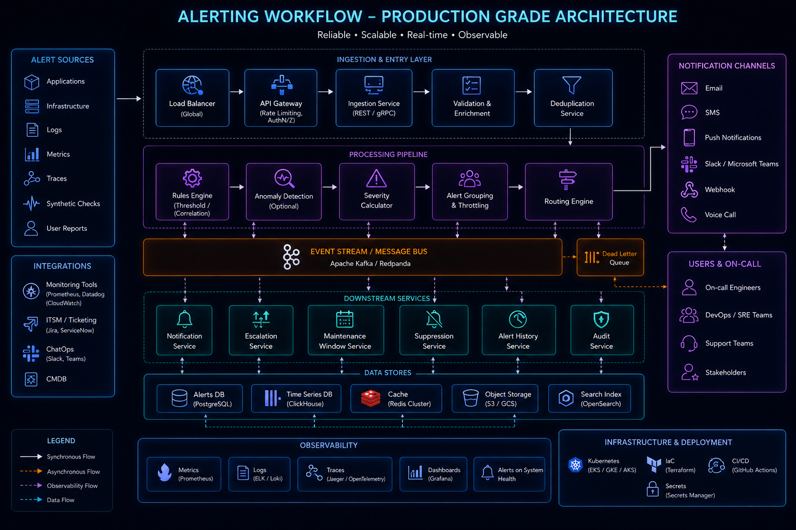
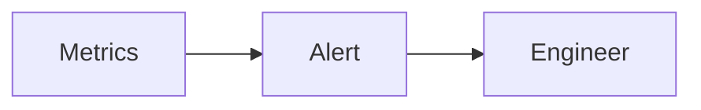

# Monitoring


## Overview

Monitoring is one of the most critical operational capabilities in modern software systems.

As platforms scale from a single application into distributed architectures containing:

* APIs
* Databases
* Caches
* Message Brokers
* Containers
* Kubernetes Clusters
* Cloud Infrastructure

the ability to detect issues quickly becomes essential.

Without monitoring:

```text
Failures Occur

↓

Users Discover Them

↓

Engineering Responds
```

With monitoring:

```text
Failure Detected

↓

Alert Triggered

↓

Engineering Responds
```

The goal is to identify problems before they significantly impact users.

Monitoring serves as the foundation of reliability engineering, observability, capacity planning, incident response, and operational excellence.

---

## Objectives

Monitoring systems aim to:

* Detect Failures Early
* Reduce MTTD
* Improve Reliability
* Support Incident Response
* Enable Capacity Planning
* Measure Service Health

---

# What Is Monitoring?

Monitoring is the continuous collection and analysis of operational data.

Examples:

* CPU Usage
* Memory Usage
* Request Volume
* Error Rates
* Latency
* Availability

Monitoring answers:

> "Is something wrong?"

Observability answers:

> "Why is it wrong?"

---

# Monitoring Architecture




---

# Monitoring Data Sources

Production systems generate telemetry from many sources.

---

## Applications

Examples:

* APIs
* Microservices
* Background Workers

---

## Infrastructure

Examples:

* EC2
* Kubernetes Nodes
* Databases

---

## Network

Examples:

* Load Balancers
* Firewalls
* DNS

---

## Business Systems

Examples:

* Orders
* Payments
* User Registrations

---

# Metrics

Metrics are numerical measurements collected over time.

---

## Characteristics

* Lightweight
* Aggregated
* Efficient
* Ideal For Alerting

---

## Examples

```text
CPU Usage

Memory Usage

Error Rate

Request Rate

Latency
```

---

# Golden Signals

Google SRE introduced four critical monitoring signals.

---

## Latency

Measures request duration.

---

## Traffic

Measures workload volume.

---

## Errors

Measures failed requests.

---

## Saturation

Measures resource utilization.

---

## Architecture



These four metrics often reveal most production issues.

---

# RED Method

Widely used for service monitoring.

---

## Rate

Requests per second.

---

## Errors

Failure rate.

---

## Duration

Request latency.

---

## Example

```text
API Requests/sec

API Error %

API Response Time
```

---

# USE Method

Common for infrastructure monitoring.

---

## Utilization

Resource usage.

---

## Saturation

Resource demand.

---

## Errors

Infrastructure failures.

---

## Example

```text
CPU Utilization

Disk Queue Length

Network Errors
```

---

# Prometheus


Prometheus is the most common cloud-native monitoring platform.

---

## Responsibilities

* Metric Collection
* Storage
* Querying
* Alert Evaluation

---

## Architecture



---

# Pull-Based Collection

Prometheus uses a pull model.

---

## Flow



---

## Benefits

* Simplicity
* Reliability
* Service Discovery Integration

---

# Exporters

Exporters expose metrics.

---

## Common Exporters

### Node Exporter

Host metrics.

---

### MySQL Exporter

Database metrics.

---

### Redis Exporter

Cache metrics.

---

### Blackbox Exporter

Availability monitoring.

---

# Time-Series Data

Monitoring data changes over time.

---

## Example

```text
CPU

10%

20%

50%

90%
```

Time-series storage enables trend analysis.

---

# Grafana



Grafana visualizes monitoring data.

---

## Responsibilities

* Dashboards
* Analytics
* Alert Visualization

---

## Benefits

* Flexible Dashboards
* Multiple Data Sources
* Operational Visibility

---

# Dashboard Design

A dashboard should answer:

```text
Is The System Healthy?
```

within seconds.

---

## Recommended Sections

### Availability

---

### Latency

---

### Error Rate

---

### Infrastructure Health

---

### Business Metrics

---

# Service Monitoring Dashboard



---

# Infrastructure Monitoring

Monitor:

* CPU
* Memory
* Disk
* Network

---

## Example Metrics

```text
CPU Utilization

Memory Consumption

Disk Space

Network Throughput
```

---

# Application Monitoring

Monitor:

* Request Volume
* Error Rate
* Response Time
* Queue Backlogs

---

## Benefits

* User Experience Visibility
* Faster Troubleshooting

---

# Database Monitoring

Databases are critical infrastructure.

---

## Monitor

* Query Latency
* Connection Count
* Replication Lag
* Storage Growth

---

## Example

```text
Slow Queries

Replication Delay

Connection Pool Usage
```

---

# Cache Monitoring

Redis and Memcached require dedicated monitoring.

---

## Metrics

* Hit Rate
* Miss Rate
* Memory Usage
* Evictions

---

## Example

```text
Cache Hit Ratio

95%
```

---

# Queue Monitoring

Message queues require visibility.

---

## Monitor

* Queue Depth
* Processing Rate
* Retry Count
* Dead Letter Queues

---

## Example

```text
Queue Backlog

10

100

10,000
```

Large growth indicates bottlenecks.

---

# Kubernetes Monitoring

Monitor:

* Pod Health
* Node Health
* Restart Count
* Resource Usage

---

## Architecture


---

# Cloud Monitoring

Cloud services generate critical metrics.

---

## Examples

### AWS

* CloudWatch

### Azure

* Azure Monitor

### GCP

* Cloud Monitoring

---

# Availability Monitoring


Track service availability continuously.

---

## Example

```text
Successful Requests

Total Requests
```

---

## Formula

Availability = \frac{Successful\ Requests}{Total\ Requests}

---

# Synthetic Monitoring

Simulated user activity.

---

## Examples

* Login Flow
* Checkout Flow
* Search Flow

---

## Benefits

* Detect User-Facing Issues
* Validate Critical Paths

---

# Capacity Planning

Monitoring supports growth forecasting.

---

## Track

* Traffic Growth
* Resource Usage
* Storage Consumption

---

## Benefits

* Predictable Scaling
* Cost Optimization

---

# Alerting Integration



Monitoring without alerting is incomplete.

---

## Alert Sources

* High Error Rate
* Availability Drops
* Resource Saturation
* Latency Spikes

---

## Flow



---

# Incident Detection

Monitoring reduces:

```text
MTTD

Mean Time To Detect
```

---

## Goal

Detect issues before users report them.

---

# Business Monitoring

Technical metrics are insufficient.

---

## Examples

```text
Orders Created

Payments Processed

Revenue

Active Users
```

---

## Importance

A healthy system can still produce broken business outcomes.

---

# Monitoring Maturity Model

```text
Basic Metrics
      │
      ▼
Dashboards
      │
      ▼
Alerting
      │
      ▼
Service Monitoring
      │
      ▼
Business Monitoring
      │
      ▼
Full Observability Platform
```

---

# Common Monitoring Mistakes

---

## Monitoring Too Little

Issues remain invisible.

---

## Monitoring Everything

Creates noise.

---

## Infrastructure-Only Monitoring

Misses business failures.

---

## Poor Dashboards

Reduce operational visibility.

---

## No Ownership

Alerts become ignored.

---

# Engineering Tradeoffs

| Strategy                | Benefit             | Cost                       |
| ----------------------- | ------------------- | -------------------------- |
| Detailed Metrics        | Better Visibility   | Storage Cost               |
| Frequent Collection     | Faster Detection    | Higher Overhead            |
| Business Monitoring     | Better Insights     | Additional Instrumentation |
| Extensive Dashboards    | Improved Visibility | Maintenance Effort         |
| Multi-Region Monitoring | Global Visibility   | Increased Complexity       |

---

# Interview Perspective

Strong engineers discuss:

* Golden Signals
* RED Method
* USE Method
* Prometheus
* Grafana
* Capacity Planning
* Monitoring Strategy

Rather than focusing only on infrastructure metrics.

Monitoring exists to support operational decision-making.

---

# Engineering Outcome

Monitoring provides the visibility required to operate modern distributed systems reliably.

By collecting meaningful metrics, visualizing system behavior, detecting anomalies early, and supporting operational decisions, monitoring becomes a foundational capability for reliability, scalability, and engineering excellence.

The strongest engineering organizations treat monitoring as a product, continuously improving visibility as systems evolve.
