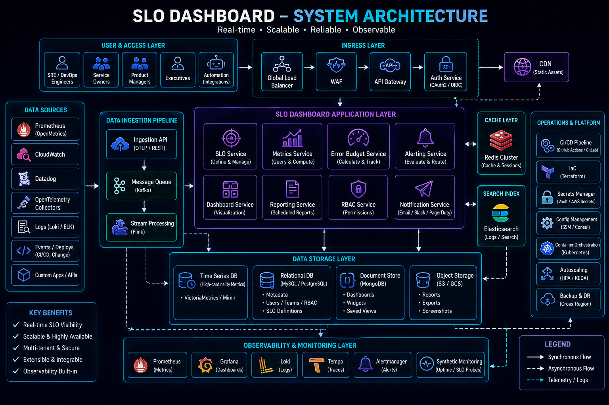
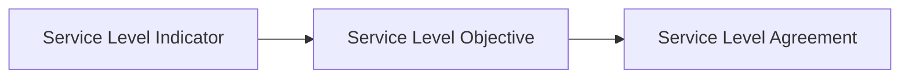
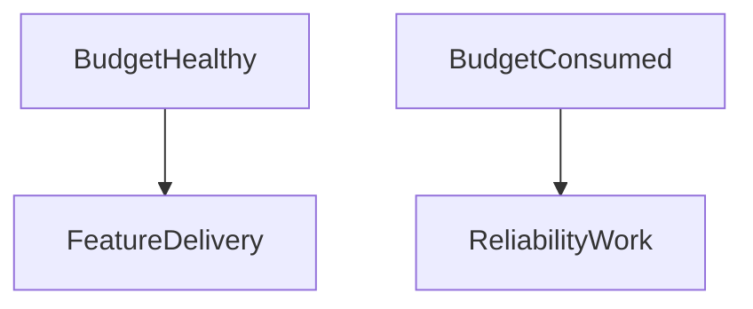

# SLA, SLO, and SLI (Operational SRE Perspective)



## Overview

Reliability cannot be managed through intuition.

As systems scale, engineering organizations require objective mechanisms to measure service quality, balance feature velocity against operational stability, and align technical decisions with business expectations.

This is the purpose of:

* SLIs (Service Level Indicators)
* SLOs (Service Level Objectives)
* SLAs (Service Level Agreements)

These concepts form the foundation of Site Reliability Engineering (SRE) and modern reliability governance.

While monitoring answers:

> Is the system healthy?

SLOs answer:

> Is the system healthy enough?

This distinction fundamentally changes how engineering organizations operate.

---

## Objectives

SRE-based reliability management aims to:

* Define Measurable Reliability Targets
* Improve Operational Decision Making
* Reduce Reliability Disputes
* Balance Innovation and Stability
* Improve Customer Experience
* Create Reliability Accountability

---

# Reliability Measurement Framework



---

# Service Level Indicators (SLIs)

An SLI is a measurement.

It represents observed system behavior.

---

## Common SLIs

### Availability

Measures successful requests.

---

### Latency

Measures response speed.

---

### Error Rate

Measures failed operations.

---

### Throughput

Measures request volume.

---

### Data Freshness

Measures timeliness.

---

# Availability SLI

Most organizations track availability.

---

## Formula

Availability = \frac{Successful\ Requests}{Total\ Requests}

---

## Example

```text
999,000 Successful Requests

1,000 Failed Requests
```

Availability:

```text
99.9%
```

---

# Latency SLIs

Users care about responsiveness.

---

## Common Measurements

```text
P50

P95

P99
```

---

## Example SLI

```text
95% Requests < 200ms
```

---

# Error Rate SLI

Measures operational correctness.

---

## Formula

Error\ Rate = \frac{Failed\ Requests}{Total\ Requests}

---

## Benefits

* Reliability Visibility
* Incident Detection
* SLO Tracking

---

# Service Level Objectives (SLOs)

SLOs define targets for SLIs.

---

## Example

SLI:

```text
Availability
```

SLO:

```text
99.95%
```

---

## Purpose

SLOs create explicit reliability expectations.

Without SLOs:

```text
Reliability Is Subjective
```

With SLOs:

```text
Reliability Is Measurable
```

---

# SLO Design Principles

Good SLOs should be:

---

## User Focused

Measure user experience.

---

## Realistic

Achievable with available resources.

---

## Actionable

Influence engineering behavior.

---

## Measurable

Supported by reliable telemetry.

---

# Common SLO Examples

| Service               | SLO         |
| --------------------- | ----------- |
| API Availability      | 99.9%       |
| Checkout Success Rate | 99.95%      |
| Payment Processing    | 99.99%      |
| Login Latency         | P95 < 200ms |
| Trade Execution       | P95 < 100ms |

---

# Service Level Agreements (SLAs)

SLAs are customer-facing commitments.

---

## Typical Components

* Availability Guarantees
* Support Commitments
* Response Times
* Financial Penalties

---

## Example

```text
99.9% Monthly Availability
```

---

## Difference

SLOs guide engineering.

SLAs protect customers.

---

# Error Budgets

Error budgets are one of the most important SRE concepts.

---

## Formula

Error\ Budget = 100% - SLO

---

## Example

SLO:

```text
99.9%
```

Error Budget:

```text
0.1%
```

---

# Why Error Budgets Matter

Engineering teams constantly balance:

```text
Feature Delivery

vs

Reliability
```

Error budgets provide an objective decision framework.

---

## Healthy Budget

Continue:

* Feature Development
* Deployments
* Experiments

---

## Exhausted Budget

Prioritize:

* Stability
* Bug Fixes
* Reliability Work

---

# Error Budget Governance



---

# Burn Rate

Burn rate measures how quickly error budgets are consumed.

---

## Example

Monthly Error Budget:

```text
0.1%
```

Consumed:

```text
0.05%
```

In:

```text
1 Day
```

This indicates elevated risk.

---

# Burn Rate Formula

Burn\ Rate = \frac{Observed\ Error\ Rate}{Allowed\ Error\ Rate}

---

## Interpretation

| Burn Rate | Meaning                      |
| --------- | ---------------------------- |
| < 1       | Healthy                      |
| 1         | On Target                    |
| > 1       | Consuming Budget Too Quickly |
| >> 1      | Incident Likely              |

---

# Multi-Window Burn Rate Alerting

Google SRE popularized multi-window alerting.

---

## Short Window

Detect issues rapidly.

---

## Long Window

Reduce alert noise.

---

## Example

```text
5 Minutes

1 Hour

6 Hours

24 Hours
```

---

# SLO Dashboards


Executives and engineering leaders require visibility into reliability performance.

---

## Dashboard Components

* Availability
* Latency
* Error Budget
* Burn Rate
* Incident Count

---

## Benefits

* Transparency
* Governance
* Decision Support

---

# Reliability Reviews

Leading organizations review reliability regularly.

---

## Review Topics

* SLO Compliance
* Error Budget Consumption
* Major Incidents
* Reliability Investments

---

## Benefits

* Continuous Improvement
* Better Prioritization

---

# Reliability Governance

Reliability should be managed intentionally.

---

## Governance Components

* SLO Ownership
* Reliability Targets
* Escalation Policies
* Reporting Standards

---

## Goal

Reliability becomes an organizational responsibility.

---

# SLO-Based Alerting

Traditional alert:

```text
CPU > 90%
```

---

SRE alert:

```text
Error Budget Burn Rate High
```

---

## Benefits

* User-Centric
* Less Noise
* Better Prioritization

---

# Reliability Reporting

Reliability data should reach multiple audiences.

---

## Engineering Teams

Operational insights.

---

## Leadership

Reliability trends.

---

## Executives

Business impact.

---

# Executive Reliability Dashboard

Common KPIs:

```text
Availability

SLO Compliance

Major Incidents

Error Budget Remaining
```

---

# Reliability and Release Management

Error budgets influence deployment decisions.

---

## Example

Healthy Budget:

```text
Continue Releases
```

---

Exhausted Budget:

```text
Pause High-Risk Changes
```

---

# Incident Management Integration

Reliability metrics should integrate with incident workflows.

---

## Components

* Alerts
* Runbooks
* Postmortems
* Reliability Reviews

---

## Benefits

* Faster Recovery
* Better Learning

---

# Real-World Examples

---

## Ecommerce Platform

SLIs:

* Checkout Success Rate
* Payment Success Rate

SLOs:

* 99.95% Availability
* P95 < 250ms

---

## Fantasy Sports Platform

SLIs:

* Score Feed Availability
* Leaderboard Latency

SLOs:

* 99.9% Availability
* Updates < 2 Seconds

---

## Opinion Trading Platform

SLIs:

* Trade Success Rate
* Settlement Accuracy

SLOs:

* 99.99% Reliability
* P95 < 100ms

---

# Common SLO Mistakes

---

## Unrealistic Targets

Example:

```text
100% Availability
```

Rarely practical.

---

## Infrastructure-Centric SLIs

Users care about service quality.

---

## Ignoring Error Budgets

Removes objective decision-making.

---

## Too Many SLOs

Creates operational overhead.

---

## No Ownership

Reliability becomes ambiguous.

---

# Engineering Tradeoffs

| Goal                 | Benefit               | Cost                          |
| -------------------- | --------------------- | ----------------------------- |
| Higher Availability  | Better UX             | Increased Infrastructure Cost |
| Lower Latency        | Better Performance    | Optimization Complexity       |
| Smaller Error Budget | Higher Reliability    | Reduced Release Velocity      |
| Aggressive SLOs      | Competitive Advantage | Higher Operational Cost       |

---

# SRE Maturity Model

```text
Basic Monitoring
        │
        ▼
SLIs
        │
        ▼
SLOs
        │
        ▼
Error Budgets
        │
        ▼
Burn Rate Alerting
        │
        ▼
Reliability Governance
        │
        ▼
SRE Organization
```

---

# Interview Perspective

Strong senior engineers discuss:

* SLIs
* SLO Design
* Error Budgets
* Burn Rate Alerting
* Reliability Governance
* Executive Reporting
* Operational Tradeoffs

Rather than simply defining SLA, SLO, and SLI terminology.

The real value comes from how these concepts influence engineering behavior.

---

# Engineering Outcome

SLAs, SLOs, and SLIs provide a measurable framework for managing reliability at scale.

By combining service indicators, reliability objectives, error budgets, burn-rate monitoring, and governance practices, engineering organizations can make informed decisions that balance innovation with operational excellence.

The most mature organizations treat reliability as a managed product capability, measured continuously and improved systematically through data-driven engineering practices.
