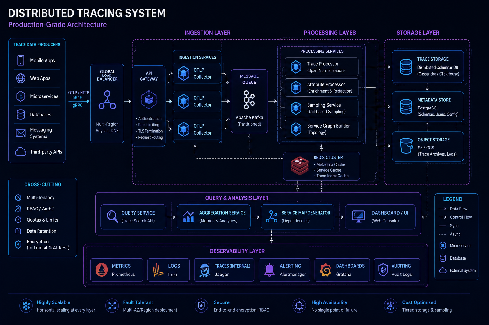
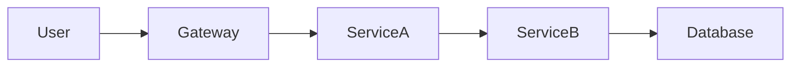
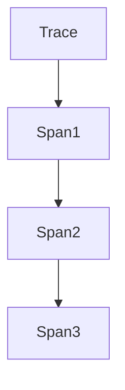
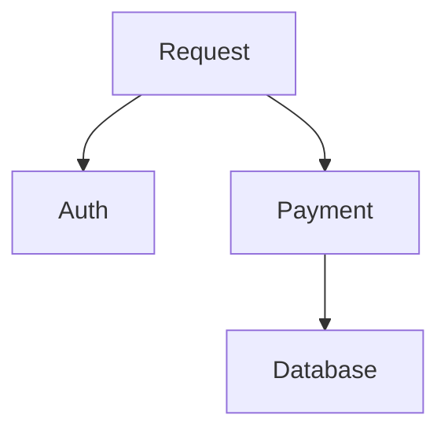
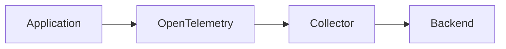
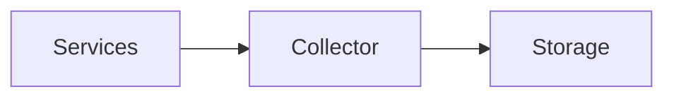
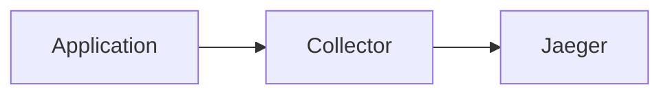
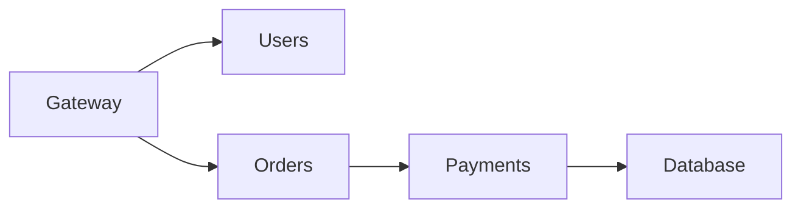
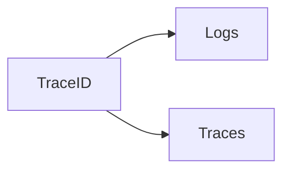

# Distributed Tracing



## Overview

Modern applications are rarely composed of a single service.

A typical production request may travel through:

* API Gateway
* Authentication Service
* User Service
* Payment Service
* Database
* Cache
* Message Broker

When latency increases or failures occur, identifying the exact source becomes difficult.

Metrics can indicate that a problem exists.

Logs can reveal specific events.

Distributed tracing reveals the complete request journey.

Tracing provides visibility into:

* Request Flow
* Service Dependencies
* Latency Distribution
* Failure Points
* Bottlenecks

Distributed tracing has become a critical component of modern observability platforms.

---

## Objectives

Distributed tracing aims to:

* Understand Request Flow
* Improve Root Cause Analysis
* Reduce MTTR
* Identify Bottlenecks
* Improve Performance
* Support Reliability Engineering

---

# The Problem Tracing Solves

Consider a user request.

```text id="n48j7c"
User

↓

API Gateway

↓

Order Service

↓

Payment Service

↓

Database
```

Response time:

```text id="hsm8kk"
3 Seconds
```

Question:

```text id="q03x61"
Where Was Time Spent?
```

Without tracing:

Difficult to determine.

---

# Distributed Tracing Architecture




Tracing captures every step.

---

# Core Concepts

Distributed tracing relies on several fundamental concepts.

---

# Trace

A trace represents the complete lifecycle of a request.

---

## Example

```text id="c0s06o"
User Request

↓

Gateway

↓

Service

↓

Database

↓

Response
```

Entire flow = Trace.

---

# Span

A span represents a single operation.

---

## Examples

```text id="jv1rxr"
Database Query

HTTP Request

Cache Lookup

Message Publish
```

Each operation becomes a span.

---

# Trace Structure



---

# Parent and Child Spans

Spans form hierarchies.

---

## Example



---

## Benefits

* Dependency Visibility
* Execution Flow Analysis

---

# Trace Context Propagation

Tracing requires context to move across services.

---

## Example

```text id="7ekklj"
Gateway

↓

Service A

↓

Service B
```

All services share trace identifiers.

---

## Benefits

* End-to-End Visibility

---

# Trace Identifiers

Each trace receives:

```text id="d7vl8q"
Trace ID
```

Each span receives:

```text id="j0wo4e"
Span ID
```

---

## Purpose

Enable request correlation across systems.

---

# Span Metadata

Spans contain contextual information.

---

## Examples

```text id="k2lcrz"
HTTP Method

Status Code

Service Name

Database Query Time
```

---

## Benefits

* Rich Diagnostics
* Better Analysis

---

# OpenTelemetry


OpenTelemetry has become the industry standard for telemetry collection.

---

## Responsibilities

* Traces
* Metrics
* Logs

---

## Benefits

* Vendor Neutral
* Open Standard
* Cloud Native

---

# OpenTelemetry Architecture



---

# Instrumentation

Applications must generate trace data.

---

## Methods

### Automatic Instrumentation

Minimal code changes.

---

### Manual Instrumentation

Custom spans added by engineers.

---

## Benefits

* Detailed Visibility
* Business Context

---

# OpenTelemetry Collector

The collector acts as a telemetry gateway.

---

## Responsibilities

* Receive Data
* Process Data
* Export Data

---

## Architecture



---

# Jaeger

Jaeger is a popular distributed tracing platform.

---

## Capabilities

* Trace Visualization
* Service Dependency Mapping
* Latency Analysis

---

## Architecture



---

# Zipkin

Alternative tracing platform.

---

## Features

* Distributed Tracing
* Request Visualization
* Latency Analysis

---

## Benefits

* Lightweight
* Mature Ecosystem

---

# Service Maps

Tracing reveals service relationships.

---

## Example



---

## Benefits

* Dependency Visibility
* Architecture Understanding

---

# Latency Analysis

One of the primary tracing use cases.

---

## Example

```text id="9g5rdn"
Gateway

50ms

User Service

100ms

Database

1800ms
```

---

## Result

Database identified as bottleneck.

---

# Root Cause Analysis

Tracing accelerates investigations.

---

## Example

```text id="4y2wd8"
High Latency

↓

Trace Inspection

↓

Slow Database Query

↓

Root Cause Found
```

---

# Error Analysis

Tracing helps identify failures.

---

## Example

```text id="hjg7h3"
Payment Service Error

↓

Specific Span Failed

↓

Root Cause Identified
```

---

# Sampling

Large systems generate enormous trace volumes.

---

## Problem

Tracing every request becomes expensive.

---

## Solution

Sample a subset.

---

## Example

```text id="j60ysr"
1%

5%

10%
```

of requests.

---

## Benefits

* Reduced Storage Cost
* Reduced Processing Cost

---

# Trace Storage

Trace data requires specialized storage.

---

## Characteristics

* High Volume
* High Cardinality
* Complex Queries

---

## Common Backends

* Jaeger Storage
* Elasticsearch
* OpenSearch
* Tempo

---

# Tracing and Logging

Tracing and logging complement each other.

---

## Architecture



---

## Benefits

* Faster Investigations
* Better Context

---

# Tracing and Metrics

Tracing explains why metrics changed.

---

## Example

```text id="tb7sc4"
Latency Increased

↓

Trace Analysis

↓

Slow Service Found
```

---

# Kubernetes Tracing

Containerized environments benefit significantly from tracing.

---

## Benefits

* Service Visibility
* Request Flow Analysis
* Dependency Mapping

---

# Business Tracing

Tracing can include business operations.

---

## Examples

```text id="5o5o4d"
Order Creation

Payment Processing

Trade Execution

Settlement
```

---

## Benefits

* Operational Visibility
* Product Diagnostics

---

# Performance Optimization

Tracing reveals inefficiencies.

---

## Examples

* N+1 Queries
* Slow APIs
* Cache Misses
* Excessive Network Calls

---

## Benefits

* Faster Systems
* Better User Experience

---

# Real-World Examples

---

## Ecommerce Platform

Trace:

```text id="j0h5mf"
Checkout

↓

Inventory

↓

Payment

↓

Order Creation
```

---

## Fantasy Sports Platform

Trace:

```text id="j43bb4"
Match Feed

↓

Processing

↓

Leaderboard Update
```

---

## Opinion Trading Platform

Trace:

```text id="v1wv8z"
Trade Request

↓

Risk Check

↓

Settlement
```

---

# Common Tracing Mistakes

---

## Missing Context Propagation

Breaks traces.

---

## Over-Instrumentation

Creates excessive cost.

---

## No Sampling Strategy

Increases storage requirements.

---

## Ignoring Business Flows

Limits visibility.

---

## No Correlation With Logs

Reduces troubleshooting effectiveness.

---

# Engineering Tradeoffs

| Strategy             | Benefit             | Cost                  |
| -------------------- | ------------------- | --------------------- |
| Full Tracing         | Maximum Visibility  | High Cost             |
| Sampling             | Lower Cost          | Reduced Coverage      |
| Deep Instrumentation | Rich Diagnostics    | Development Effort    |
| Long Retention       | Historical Analysis | Storage Cost          |
| Business Tracing     | Better Insights     | Additional Complexity |

---

# Tracing Maturity Model

```text id="tt9y84"
Basic Logs
      │
      ▼
Metrics
      │
      ▼
Request Tracing
      │
      ▼
Distributed Tracing
      │
      ▼
OpenTelemetry Platform
      │
      ▼
Full Observability Ecosystem
```

---

# Interview Perspective

Strong engineers discuss:

* Traces
* Spans
* Context Propagation
* OpenTelemetry
* Jaeger
* Sampling
* Service Maps
* Root Cause Analysis

Rather than describing tracing as simple request logging.

Distributed tracing is one of the most powerful tools for understanding modern distributed systems.

---

# Engineering Outcome

Distributed tracing provides deep visibility into request behavior across complex service architectures.

By combining trace context propagation, OpenTelemetry instrumentation, service maps, latency analysis, and root cause investigation, organizations can dramatically improve troubleshooting efficiency, performance optimization, and operational reliability.

Tracing transforms distributed systems from opaque networks of services into observable and understandable platforms.
