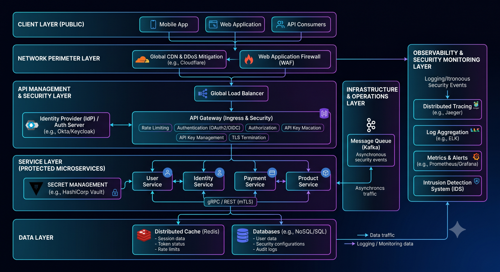
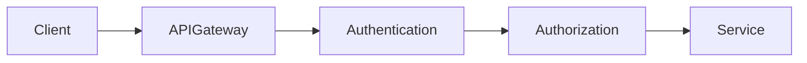
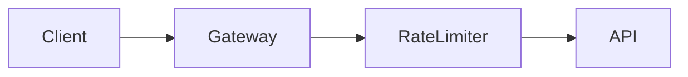
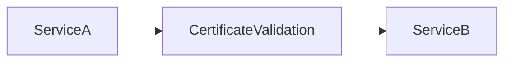

# API Security



## Overview

APIs are the backbone of modern software systems.

They power:

* Web Applications
* Mobile Applications
* Third-Party Integrations
* Microservices
* Partner Ecosystems
* Internal Platforms

Because APIs expose business functionality and data, they are one of the most common attack surfaces in modern architectures.

Poor API security can result in:

* Data Breaches
* Account Takeovers
* Financial Fraud
* Service Disruption
* Compliance Violations

API security therefore requires a layered defense strategy combining authentication, authorization, rate limiting, monitoring, validation, encryption, and governance.

---

## Objectives

API security aims to:

* Protect Data
* Prevent Unauthorized Access
* Mitigate Abuse
* Reduce Attack Surface
* Ensure Compliance
* Improve Reliability

---

# API Security Architecture




---

# Security Layers

Production APIs should implement multiple security layers.

---

## Layer 1

Transport Security

---

## Layer 2

Authentication

---

## Layer 3

Authorization

---

## Layer 4

Rate Limiting

---

## Layer 5

Input Validation

---

## Layer 6

Monitoring and Auditing

---

# HTTPS Everywhere

All API traffic should use encryption.

---

## Purpose

Protect:

* Credentials
* Tokens
* Sensitive Data

---

## Risks Without HTTPS

```text
Credential Theft

Session Hijacking

Data Exposure
```

---

# API Authentication

Authentication verifies identity.

---

## Common Approaches

* JWT
* OAuth 2.0
* API Keys
* Mutual TLS

---

# Bearer Token Authentication

Common API pattern.

---

## Example

```http
Authorization: Bearer ACCESS_TOKEN
```

---

## Benefits

* Simplicity
* Stateless Design

---

## Risks

* Token Leakage
* Replay Attacks

---

# JWT Security

JWTs are widely used but require careful implementation.

---

## Best Practices

* Short Expiration Times
* Signature Validation
* Token Rotation
* Secure Storage

---

## Avoid

```text
Long-Lived Tokens
```

---

# Refresh Token Security

Refresh tokens should be:

* Rotated
* Revocable
* Stored Securely

---

## Benefits

* Better User Experience
* Reduced Exposure

---

# OAuth 2.0 Security

OAuth enables delegated access.

---

## Common Risks

* Token Leakage
* Redirect Abuse
* Scope Misconfiguration

---

## Mitigations

* PKCE
* Secure Redirect URIs
* Least Privilege Scopes

---

# API Authorization

Authentication alone is insufficient.

---

## Example

Authenticated User:

```text
User A
```

Should not access:

```text
User B Data
```

---

# Authorization Layers

Common checks:

* Role Validation
* Permission Validation
* Ownership Validation
* Policy Evaluation

---

# Object-Level Authorization

One of the most critical API controls.

---

## Example

```text
GET /orders/123
```

System must verify ownership.

---

## Risks

Unauthorized data exposure.

---

# OWASP API Security Risks

Common API vulnerabilities include:

---

## Broken Object Level Authorization

BOLA

---

## Broken Authentication

Weak identity controls.

---

## Excessive Data Exposure

Sensitive data leaks.

---

## Lack of Rate Limiting

Resource abuse.

---

## Security Misconfiguration

Incorrect protections.

---

# Rate Limiting

Protects APIs from abuse.

---

## Examples

```text
100 Requests / Minute

1000 Requests / Hour
```

---

## Benefits

* Abuse Prevention
* DDoS Mitigation
* Resource Protection

---

# Rate Limiting Architecture



---

# Redis-Based Rate Limiting

Common implementation.

---

## Benefits

* Fast
* Distributed
* Scalable

---

# Input Validation

All inputs must be validated.

---

## Risks

* Injection Attacks
* Invalid Data
* Business Logic Abuse

---

## Validation Types

* Type Validation
* Schema Validation
* Business Rule Validation

---

# SQL Injection Protection

Never trust user input.

---

## Use

* Parameterized Queries
* ORM Protections

---

## Avoid

```sql
SELECT * FROM users WHERE id = 'INPUT'
```

---

# API Gateway Security

API gateways centralize protections.

---

## Responsibilities

* Authentication
* Rate Limiting
* Logging
* Traffic Control

---

## Benefits

* Consistency
* Reduced Duplication

---

# API Key Security

API keys remain common for integrations.

---

## Best Practices

* Rotation
* Expiration
* Scope Restrictions

---

## Avoid

Hardcoded Keys.

---

# Mutual TLS (mTLS)

Strong service-to-service authentication.

---

## Architecture



---

## Benefits

* Strong Identity Verification
* Encryption

---

# Secrets Management

Sensitive credentials should never reside in code.

---

## Use

* AWS Secrets Manager
* HashiCorp Vault
* Azure Key Vault

---

## Benefits

* Reduced Risk
* Better Governance

---

# API Monitoring


Monitor:

* Error Rates
* Authentication Failures
* Rate Limit Violations
* Suspicious Activity

---

## Benefits

* Faster Detection
* Security Visibility

---

# Audit Logging

Critical API actions should be logged.

---

## Examples

```text
Login

Permission Changes

Data Exports

Admin Actions
```

---

## Benefits

* Compliance
* Investigations

---

# API Versioning

Versioning supports safe evolution.

---

## Example

```text
/v1/orders

/v2/orders
```

---

## Benefits

* Backward Compatibility

---

# DDoS Protection

APIs must resist traffic floods.

---

## Techniques

* Rate Limiting
* WAF
* CDN Protection

---

## Benefits

* Improved Availability

---

# Web Application Firewalls (WAF)

Provide additional protection.

---

## Capabilities

* Request Filtering
* Threat Detection
* Traffic Analysis

---

## Benefits

* Reduced Attack Surface

---

# Zero Trust APIs

Modern architectures assume:

```text
Never Trust

Always Verify
```

---

## Characteristics

* Continuous Validation
* Least Privilege
* Strong Identity

---

# Security Testing

APIs require continuous validation.

---

## Methods

* Penetration Testing
* Vulnerability Scanning
* Security Reviews

---

## Benefits

* Risk Reduction

---

# Real-World Examples

---

## Ecommerce Platform

Controls:

* JWT Authentication
* Checkout Authorization
* Rate Limiting

---

## Fantasy Sports Platform

Controls:

* Contest Access Validation
* Wallet Protection
* Session Security

---

## Opinion Trading Platform

Controls:

* Trade Authorization
* MFA
* Audit Logging

---

# Common API Security Mistakes

---

## Missing Authorization Checks

Critical vulnerability.

---

## Excessive Data Exposure

Leaks information.

---

## Weak Token Security

Increases compromise risk.

---

## No Rate Limiting

Enables abuse.

---

## Poor Monitoring

Delays detection.

---

# Engineering Tradeoffs

| Strategy      | Benefit                | Cost                      |
| ------------- | ---------------------- | ------------------------- |
| JWT           | Scalability            | Revocation Complexity     |
| OAuth         | Delegated Access       | Complexity                |
| mTLS          | Strong Security        | Operational Overhead      |
| API Gateway   | Centralized Protection | Infrastructure Cost       |
| Rate Limiting | Abuse Prevention       | Additional Infrastructure |

---

# API Security Maturity Model

```text
Basic Authentication
         │
         ▼
Authorization Controls
         │
         ▼
Rate Limiting
         │
         ▼
Gateway Security
         │
         ▼
Zero Trust APIs
         │
         ▼
Enterprise Security Platform
```

---

# Interview Perspective

Strong engineers discuss:

* JWT Security
* OAuth Security
* Authorization Models
* Rate Limiting
* OWASP API Risks
* Gateway Architecture
* Zero Trust Principles

Rather than focusing solely on authentication.

API security requires defense in depth.

---

# Engineering Outcome

API security is a foundational capability for modern platforms.

By combining strong authentication, fine-grained authorization, transport security, rate limiting, monitoring, auditing, and governance controls, organizations can significantly reduce risk while enabling secure and scalable application ecosystems.
