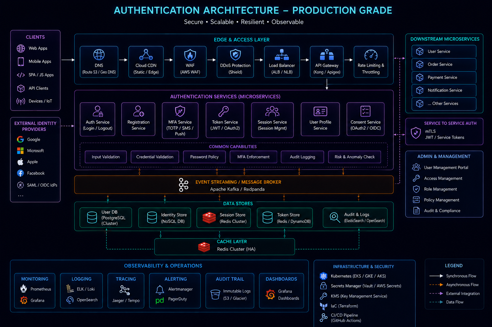
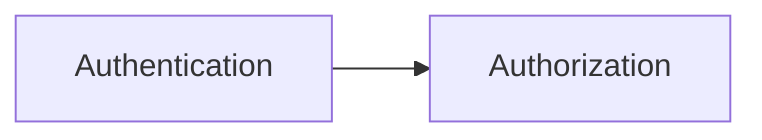
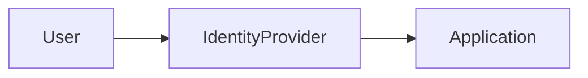
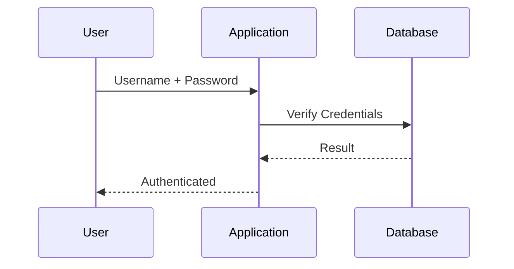
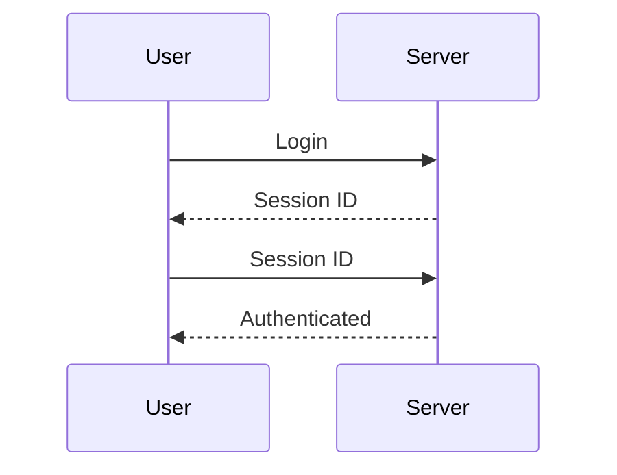
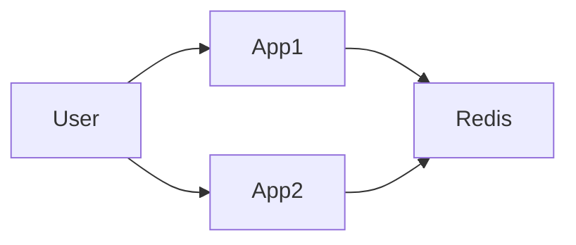
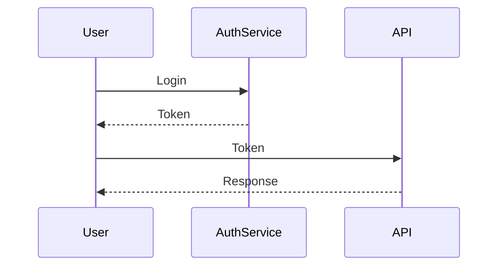
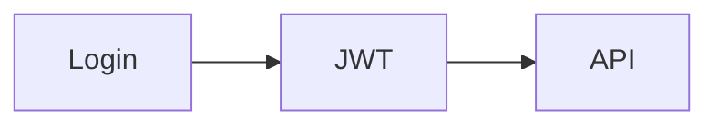
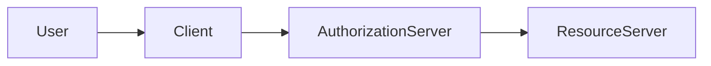
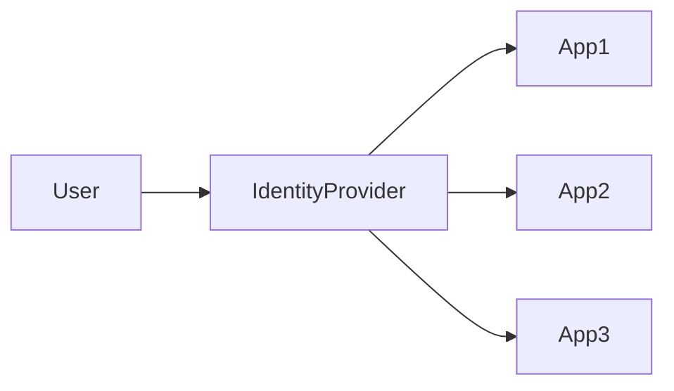

# Authentication



## Overview

Authentication is the process of verifying identity.

Before a system can determine what a user is allowed to do, it must first determine who the user is.

Modern applications serve:

* Customers
* Administrators
* Internal Employees
* Third-Party Integrations
* Mobile Applications
* APIs

As systems grow, authentication becomes a foundational security capability that impacts:

* Security
* User Experience
* Compliance
* Scalability
* Operational Complexity

This document explores authentication strategies, token-based architectures, OAuth, OpenID Connect, Single Sign-On (SSO), and enterprise identity management practices.

---

## Objectives

Authentication systems aim to:

* Verify Identity
* Protect Resources
* Improve Security
* Support Scalability
* Enable Auditing
* Simplify User Access

---

# Authentication vs Authorization

These concepts are often confused.

---

## Authentication

Answers:

```text
Who Are You?
```

Example:

```text
User Login
```

---

## Authorization

Answers:

```text
What Are You Allowed To Do?
```

Example:

```text
Admin Access
```

---

## Flow



---

# Identity Architecture




---

# Authentication Factors

Authentication relies on one or more factors.

---

## Something You Know

Examples:

* Password
* PIN

---

## Something You Have

Examples:

* Mobile Device
* Hardware Token

---

## Something You Are

Examples:

* Fingerprint
* Face Recognition

---

# Multi-Factor Authentication (MFA)

MFA combines multiple factors.

---

## Example

```text
Password

+

OTP
```

---

## Benefits

* Stronger Security
* Reduced Account Compromise Risk

---

# Password-Based Authentication

Traditional authentication method.

---

## Flow



---

## Challenges

* Weak Passwords
* Credential Reuse
* Phishing Attacks

---

# Password Storage

Passwords must never be stored in plain text.

---

## Recommended Approach

```text
Password

↓

Hash

↓

Store Hash
```

---

## Common Algorithms

* bcrypt
* Argon2
* scrypt

---

## Benefits

* Improved Security
* Reduced Risk

---

# Session-Based Authentication

Traditional web applications commonly use sessions.

---

## Flow



---

## Characteristics

* Server Maintains State
* Session Stored Centrally

---

## Benefits

* Simplicity
* Mature Model

---

## Tradeoffs

* Horizontal Scaling Challenges
* Session Storage Requirements

---

# Distributed Session Storage

Large systems require centralized session management.

---

## Examples

* Redis
* Database

---

## Architecture



---

# Token-Based Authentication

Modern APIs commonly use tokens.

---

## Flow



---

## Benefits

* Stateless
* Scalable
* API Friendly

---

# JSON Web Tokens (JWT)

JWT is one of the most widely used token formats.

---

## Structure

```text
Header

Payload

Signature
```

---

## Benefits

* Compact
* Self-Contained
* Easy Distribution

---

## Tradeoffs

* Revocation Complexity
* Token Leakage Risk

---

# JWT Lifecycle



---

# Access Tokens

Short-lived credentials.

---

## Purpose

Authorize requests.

---

## Example Lifetime

```text
15 Minutes
```

---

# Refresh Tokens

Longer-lived credentials.

---

## Purpose

Issue new access tokens.

---

## Benefits

* Improved Security
* Better User Experience

---

# Token Rotation

Refresh tokens should rotate.

---

## Benefits

* Reduced Token Theft Risk
* Improved Security

---

# OAuth 2.0

OAuth enables delegated access.

---

## Example

```text
Login With Google
```

---

## Benefits

* Reduced Credential Sharing
* Improved User Experience

---

# OAuth Roles

---

## Resource Owner

User.

---

## Client

Application.

---

## Authorization Server

Identity Provider.

---

## Resource Server

Protected API.

---

# OAuth Architecture



---

# OAuth Flows

Common flows include:

---

## Authorization Code Flow

Recommended for web applications.

---

## Client Credentials Flow

Service-to-service authentication.

---

## Device Flow

Smart TVs and IoT devices.

---

# OpenID Connect (OIDC)

OIDC extends OAuth.

---

## Purpose

Authentication and identity.

---

## Benefits

* User Identity
* Standardized Claims

---

## Common Providers

* Google
* Microsoft
* Auth0
* Okta

---

# Single Sign-On (SSO)

SSO enables one login across multiple systems.

---

## Architecture



---

## Benefits

* Better User Experience
* Centralized Identity Management

---

# Enterprise Identity Providers

Common solutions:

* Okta
* Azure AD
* Auth0
* Keycloak

---

## Benefits

* Governance
* Security
* Compliance

---

# Service Authentication

Systems must authenticate with one another.

---

## Examples

* APIs
* Microservices
* Workers

---

## Approaches

* API Keys
* JWT
* Mutual TLS

---

# API Authentication

Common approaches:

---

## Bearer Tokens

```http
Authorization: Bearer TOKEN
```

---

## API Keys

Suitable for integrations.

---

## OAuth

Preferred for delegated access.

---

# Authentication Security

Authentication systems require strong protections.

---

## Practices

* MFA
* Password Hashing
* Token Expiration
* Rate Limiting

---

## Benefits

* Reduced Attack Surface

---

# Account Protection

Common controls:

* Login Rate Limits
* Account Lockout
* Device Verification
* Suspicious Activity Detection

---

# Authentication Monitoring


Monitor:

* Failed Logins
* MFA Failures
* Token Abuse
* Suspicious Access Patterns

---

## Benefits

* Threat Detection
* Incident Response

---

# Authentication Logs

Critical events:

```text
Login Success

Login Failure

Password Reset

MFA Challenge
```

---

## Benefits

* Auditing
* Compliance

---

# Real-World Examples

---

## Ecommerce Platform

Authentication:

* Customer Login
* Admin Login
* Social Login

---

## Fantasy Sports Platform

Authentication:

* User Accounts
* Wallet Access
* Session Management

---

## Opinion Trading Platform

Authentication:

* Trading Access
* Compliance Controls
* MFA Protection

---

# Common Authentication Mistakes

---

## Plain Text Passwords

Severe security risk.

---

## Long-Lived Tokens

Increase exposure.

---

## Missing MFA

Weakens security.

---

## Weak Session Management

Creates account risks.

---

## Poor Monitoring

Delays threat detection.

---

# Engineering Tradeoffs

| Strategy | Benefit          | Cost                         |
| -------- | ---------------- | ---------------------------- |
| Sessions | Simplicity       | Stateful Infrastructure      |
| JWT      | Scalability      | Revocation Complexity        |
| OAuth    | Delegated Access | Implementation Complexity    |
| MFA      | Strong Security  | Additional User Friction     |
| SSO      | Better UX        | Identity Provider Dependency |

---

# Authentication Maturity Model

```text
Username & Password
          │
          ▼
Password Hashing
          │
          ▼
JWT Authentication
          │
          ▼
OAuth/OIDC
          │
          ▼
MFA
          │
          ▼
Enterprise Identity Platform
```

---

# Interview Perspective

Strong engineers discuss:

* Sessions
* JWT
* OAuth 2.0
* OpenID Connect
* MFA
* SSO
* Token Rotation
* Identity Architecture

Rather than viewing authentication as simply a login form.

Authentication is the foundation upon which application security is built.

---

# Engineering Outcome

Authentication systems establish trust within software platforms.

By combining secure credential handling, token-based architectures, MFA, OAuth, OpenID Connect, and enterprise identity management practices, organizations can protect users, secure applications, and build scalable identity platforms capable of supporting modern distributed systems.
