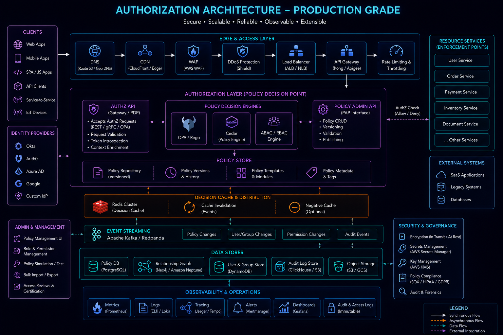
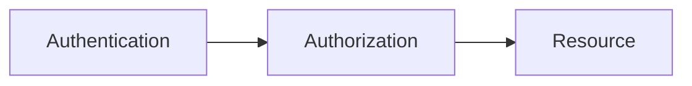
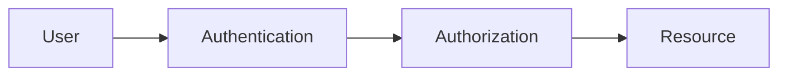
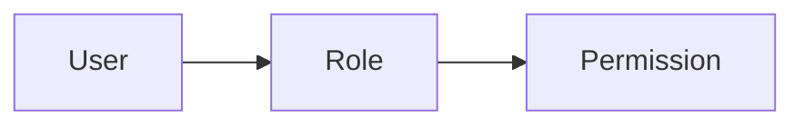
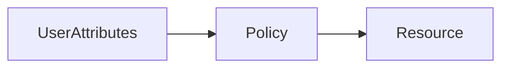
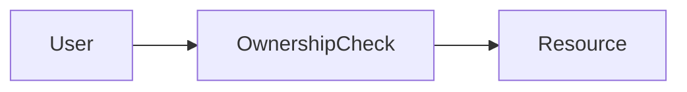
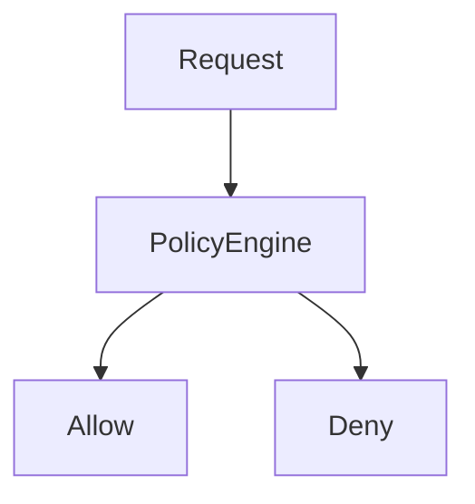
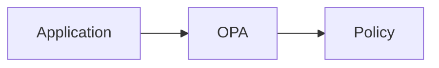
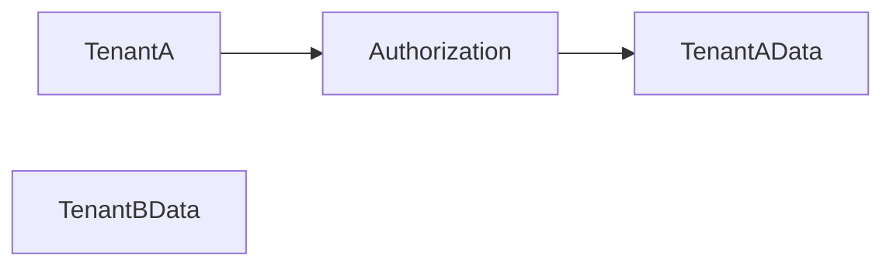

# Authorization



## Overview

Authentication determines identity.

Authorization determines access.

After a user, service, or application has been authenticated, the system must decide:

```text
What Is This Identity Allowed To Do?
```

Authorization is one of the most critical security controls in modern software systems.

Poor authorization design can result in:

* Data Breaches
* Privilege Escalation
* Unauthorized Actions
* Compliance Violations
* Multi-Tenant Isolation Failures

As organizations scale, authorization evolves from simple role checks into sophisticated policy-based access control systems.

This document explores authorization models, role management, policy engines, fine-grained permissions, and enterprise access control strategies.

---

## Objectives

Authorization systems aim to:

* Protect Resources
* Enforce Business Rules
* Prevent Unauthorized Access
* Support Compliance
* Enable Multi-Tenant Security
* Scale Securely

---

# Authentication vs Authorization

These concepts work together.

---

## Authentication

Answers:

```text
Who Are You?
```

---

## Authorization

Answers:

```text
What Can You Do?
```

---

## Flow



---

# Authorization Architecture




---

# Access Control Fundamentals

Authorization decisions are typically based on:

* Identity
* Roles
* Permissions
* Policies
* Resource Ownership
* Context

---

# Permission Model

Permissions define allowed actions.

---

## Examples

```text
CREATE_USER

UPDATE_ORDER

DELETE_PRODUCT

VIEW_REPORTS
```

---

## Benefits

* Explicit Access Control
* Fine-Grained Security

---

# Role-Based Access Control (RBAC)

RBAC is the most common authorization model.

---

## Concept

Users receive roles.

Roles receive permissions.

---

## Architecture



---

## Example

### Admin

Permissions:

```text
Create Users

Delete Users

Manage Settings
```

---

### Customer

Permissions:

```text
View Orders

Update Profile
```

---

# RBAC Benefits

* Simplicity
* Scalability
* Easy Management

---

# RBAC Challenges

Large organizations often encounter:

```text
Role Explosion
```

---

## Example

```text
Admin

SupportAdmin

RegionalAdmin

FinanceAdmin

OperationsAdmin
```

Too many roles become difficult to manage.

---

# Attribute-Based Access Control (ABAC)

ABAC uses attributes instead of static roles.

---

## Examples

Attributes may include:

* Department
* Region
* Subscription Plan
* Ownership
* Environment

---

## Architecture



---

## Example

Policy:

```text
Users Can Access Orders

Where Region Matches
```

---

# ABAC Benefits

* Flexible
* Context Aware
* Fine-Grained

---

# ABAC Tradeoffs

* More Complex
* Harder To Audit
* Policy Management Challenges

---

# Resource-Based Authorization

Access decisions depend on ownership.

---

## Example

```text
User Can Edit Own Profile
```

but not:

```text
Another User Profile
```

---

## Architecture



---

# Policy-Based Authorization

Policies define access decisions.

---

## Benefits

* Centralized Control
* Consistency
* Governance

---

## Examples

```text
Allow

Deny

Conditional Access
```

---

# Policy Evaluation Flow



---

# Policy Engines

Enterprise platforms often use dedicated policy engines.

---

## Examples

* Open Policy Agent (OPA)
* Cedar
* Casbin

---

## Benefits

* Centralized Rules
* Consistent Enforcement

---

# Open Policy Agent (OPA)

Popular policy-based authorization platform.

---

## Architecture



---

## Benefits

* Vendor Neutral
* Cloud Native
* Flexible Policies

---

# Fine-Grained Authorization

Large systems often require access beyond roles.

---

## Example

```text
View Project

Edit Project

Delete Project

Manage Billing
```

Each action requires separate evaluation.

---

# Multi-Tenant Authorization

Critical for SaaS applications.

---

## Problem

Tenant A must never access:

```text
Tenant B Data
```

---

## Architecture



---

## Benefits

* Data Isolation
* Compliance

---

# Tenant Isolation Controls

Common controls:

* Tenant IDs
* Row-Level Security
* Policy Enforcement

---

## Goal

Prevent cross-tenant access.

---

# Hierarchical Permissions

Organizations often contain permission hierarchies.

---

## Example

```text
Organization

↓

Department

↓

Project

↓

Resource
```

---

## Benefits

* Granular Control
* Better Governance

---

# Just-In-Time Access

Temporary permissions granted when needed.

---

## Example

```text
Production Access

30 Minutes
```

---

## Benefits

* Reduced Risk
* Better Security

---

# Principle of Least Privilege

One of the most important authorization principles.

---

## Rule

Grant:

```text
Minimum Required Access
```

---

## Benefits

* Reduced Attack Surface
* Improved Security

---

# Zero Trust Authorization

Modern security architecture assumes:

```text
Never Trust

Always Verify
```

---

## Characteristics

* Continuous Verification
* Context Awareness
* Strong Policies

---

# Service-to-Service Authorization

Microservices require authorization as well.

---

## Examples

* API Calls
* Internal Services
* Background Workers

---

## Approaches

* JWT Claims
* Service Accounts
* Mutual TLS

---

# API Authorization

Common approaches:

---

## Role Checks

```text
Admin Only
```

---

## Permission Checks

```text
MANAGE_USERS
```

---

## Policy Evaluation

Dynamic decisions.

---

# Authorization Auditing


Authorization decisions should be logged.

---

## Examples

```text
Permission Granted

Permission Denied

Policy Evaluated
```

---

## Benefits

* Security Monitoring
* Compliance

---

# Compliance Requirements

Industries often require:

* Access Auditing
* Permission Reviews
* Segregation of Duties

---

## Benefits

* Regulatory Compliance
* Reduced Risk

---

# Real-World Examples

---

## Ecommerce Platform

Roles:

* Customer
* Admin
* Support

Permissions:

* Manage Orders
* Manage Products
* Manage Users

---

## Fantasy Sports Platform

Roles:

* User
* Moderator
* Administrator

Permissions:

* Contest Management
* Match Management
* User Administration

---

## Opinion Trading Platform

Roles:

* Trader
* Risk Manager
* Compliance Officer

Permissions:

* Trade Access
* Risk Controls
* Audit Review

---

# Common Authorization Mistakes

---

## Overprivileged Users

Increase security risk.

---

## Missing Tenant Isolation

Creates severe vulnerabilities.

---

## Hardcoded Permissions

Reduce flexibility.

---

## No Auditing

Limits visibility.

---

## Weak Policy Governance

Creates inconsistency.

---

# Engineering Tradeoffs

| Strategy                 | Benefit         | Cost                   |
| ------------------------ | --------------- | ---------------------- |
| RBAC                     | Simplicity      | Role Explosion         |
| ABAC                     | Flexibility     | Complexity             |
| Policy Engines           | Centralization  | Operational Overhead   |
| Fine-Grained Permissions | Better Security | Additional Development |
| Zero Trust               | Strong Security | Increased Complexity   |

---

# Authorization Maturity Model

```text
Basic Roles
      │
      ▼
RBAC
      │
      ▼
Fine-Grained Permissions
      │
      ▼
ABAC
      │
      ▼
Policy Engines
      │
      ▼
Zero Trust Authorization
```

---

# Interview Perspective

Strong engineers discuss:

* RBAC
* ABAC
* Least Privilege
* Multi-Tenant Security
* Policy Engines
* Fine-Grained Permissions
* Zero Trust

Rather than implementing authorization using simple role checks throughout application code.

Authorization should be designed as a scalable security system.

---

# Engineering Outcome

Authorization systems control access to critical resources and business capabilities.

By combining RBAC, ABAC, policy-based controls, tenant isolation, fine-grained permissions, and least-privilege principles, organizations can build secure, scalable, and governable access control platforms that support modern applications and distributed systems.
