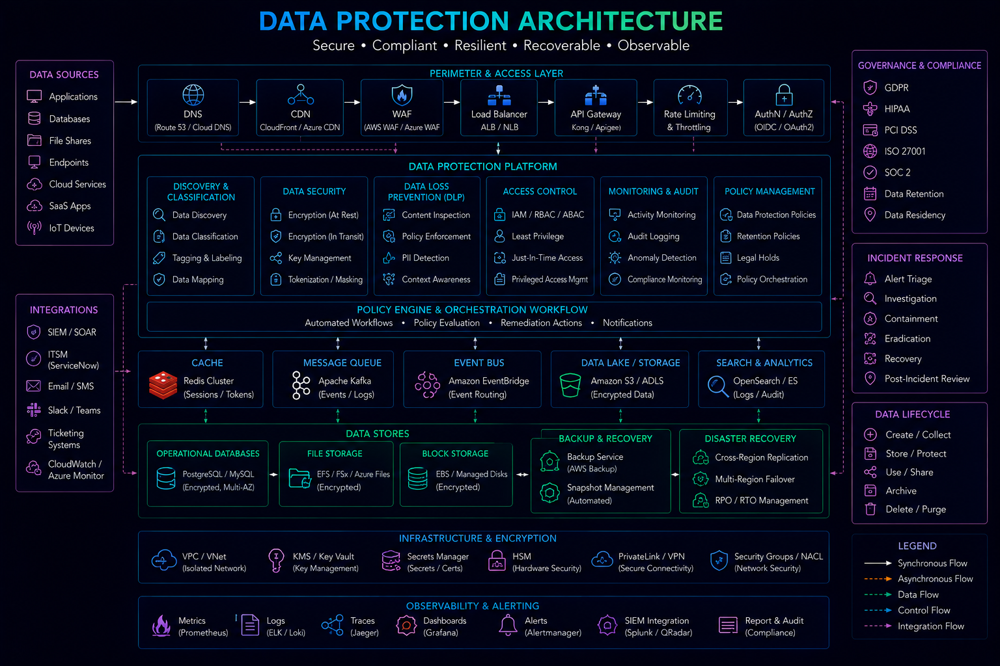
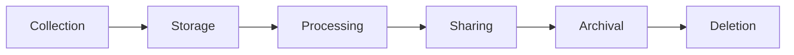
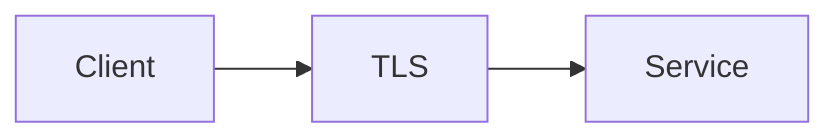

# Data Protection



## Overview

Data is one of the most valuable assets in modern software systems.

Organizations store and process:

* Customer Information
* Financial Records
* Personal Data
* Authentication Credentials
* Business Intelligence
* Operational Data

Protecting this information is a core engineering responsibility.

Data protection extends beyond encryption and includes:

* Data Classification
* Access Controls
* Retention Policies
* Compliance Requirements
* Auditability
* Privacy Controls

A comprehensive data protection strategy reduces risk, supports regulatory compliance, and builds customer trust.

---

## Objectives

Data protection aims to:

* Protect Sensitive Information
* Prevent Unauthorized Access
* Ensure Regulatory Compliance
* Support Privacy Requirements
* Reduce Breach Impact
* Improve Governance

---

# Data Protection Principles

Modern security programs are built around several core principles.

---

## Confidentiality

Protect data from unauthorized access.

---

## Integrity

Prevent unauthorized modification.

---

## Availability

Ensure authorized access when needed.

---

## Privacy

Protect individual rights and personal information.

---

# Data Lifecycle

Data protection applies throughout the entire lifecycle.

---

## Stages



---

# Data Classification

Not all data has the same sensitivity.

---

## Public

Low sensitivity.

Examples:

* Marketing Content
* Public Documentation

---

## Internal

Restricted to employees.

Examples:

* Internal Reports
* Operational Metrics

---

## Confidential

Sensitive business information.

Examples:

* Customer Records
* Contracts

---

## Restricted

Highly sensitive information.

Examples:

* Payment Data
* Government Identifiers
* Encryption Keys

---

# Data Classification Matrix

| Classification | Example             | Protection Level |
| -------------- | ------------------- | ---------------- |
| Public         | Website Content     | Low              |
| Internal       | Operational Reports | Medium           |
| Confidential   | Customer Data       | High             |
| Restricted     | Payment Data        | Critical         |

---

# Data Protection Architecture


---

# Encryption

Encryption is a fundamental protection mechanism.

---

## Goals

* Confidentiality
* Regulatory Compliance
* Breach Mitigation

---

# Encryption in Transit

Protects data moving between systems.

---

## Examples

* Browser to API
* Service to Service
* Application to Database

---

## Architecture



---

## Common Protocols

* TLS 1.2
* TLS 1.3

---

# Encryption at Rest

Protects stored information.

---

## Examples

* Databases
* Object Storage
* Backups
* Logs

---

## Benefits

* Reduced Breach Impact
* Compliance Support

---

# Database Encryption

Common approaches:

---

## Full Disk Encryption

Infrastructure-level protection.

---

## Database Encryption

Managed by database engines.

---

## Column-Level Encryption

Sensitive fields encrypted individually.

---

# Application-Level Encryption

Applications encrypt data before storage.

---

## Benefits

* Strong Protection
* Reduced Infrastructure Trust Requirements

---

## Tradeoffs

* Increased Complexity
* Key Management Challenges

---

# Key Management

Encryption is only as secure as key management.

---

## Requirements

* Rotation
* Auditing
* Access Control

---

## Common Tools

* AWS KMS
* Azure Key Vault
* HashiCorp Vault

---

# Personally Identifiable Information (PII)

PII requires special protection.

---

## Examples

```text
Name

Email Address

Phone Number

Government Identifier
```

---

## Risks

* Identity Theft
* Privacy Violations
* Compliance Penalties

---

# Data Minimization

Collect only necessary data.

---

## Benefits

* Reduced Risk
* Easier Compliance

---

## Principle

```text
Collect Less

Protect More
```

---

# Data Masking

Hide sensitive information.

---

## Example

Instead of:

```text
4111111111111111
```

Display:

```text
**** **** **** 1111
```

---

## Benefits

* Reduced Exposure
* Better Security

---

# Tokenization

Replace sensitive values with tokens.

---

## Example

```text
Credit Card

↓

Token

↓

Storage
```

---

## Benefits

* Reduced Risk
* Compliance Support

---

# Backup Protection

Backups often contain sensitive information.

---

## Requirements

* Encryption
* Access Controls
* Retention Policies

---

## Benefits

* Secure Recovery

---

# Data Retention

Data should not be retained indefinitely.

---

## Benefits

* Reduced Liability
* Lower Storage Costs

---

## Example Policy

```text
Audit Logs

7 Years

Customer Data

Business Requirement Based

Debug Logs

30 Days
```

---

# Data Deletion

Organizations must support secure deletion.

---

## Examples

* User Account Deletion
* Retention Expiration
* Compliance Requests

---

## Benefits

* Privacy Compliance

---

# GDPR Concepts

Many organizations operate under privacy regulations.

---

## Core Concepts

* Consent
* Transparency
* Data Access
* Data Deletion
* Data Portability

---

## Goals

Protect personal privacy.

---

# Privacy by Design

Privacy should be integrated early.

---

## Principles

* Minimal Collection
* Secure Defaults
* Transparency

---

## Benefits

* Better Compliance
* Reduced Risk

---

# Access Controls

Data protection requires strong authorization.

---

## Controls

* RBAC
* ABAC
* Least Privilege

---

## Benefits

* Reduced Unauthorized Access

---

# Data Auditing

Track access to sensitive information.

---

## Examples

```text
Record Viewed

Record Updated

Record Exported
```

---

## Benefits

* Accountability
* Compliance

---

# Secure Data Sharing

Data sharing should be controlled.

---

## Approaches

* APIs
* Temporary Access
* Policy Controls

---

## Benefits

* Reduced Exposure

---

# Monitoring Sensitive Data


Monitor:

* Access Patterns
* Data Exports
* Failed Access Attempts
* Suspicious Activity

---

## Benefits

* Threat Detection
* Compliance Support

---

# Cloud Data Protection

Cloud providers offer native controls.

---

## Examples

* AWS KMS
* Azure Key Vault
* Google Cloud KMS

---

## Benefits

* Managed Security
* Simplified Operations

---

# Data Loss Prevention (DLP)

Prevent accidental exposure.

---

## Examples

* Sensitive Data Detection
* Export Restrictions
* Email Scanning

---

## Benefits

* Reduced Data Leakage

---

# Compliance Considerations

Common frameworks include:

* GDPR
* SOC 2
* ISO 27001
* PCI DSS

---

## Benefits

* Customer Trust
* Regulatory Alignment

---

# Real-World Examples

---

## Ecommerce Platform

Protected Data:

* Customer Profiles
* Orders
* Payment Information

Controls:

* Encryption
* Tokenization
* Auditing

---

## Fantasy Sports Platform

Protected Data:

* User Profiles
* Wallet Data
* Transaction History

Controls:

* Access Controls
* Encryption
* Monitoring

---

## Opinion Trading Platform

Protected Data:

* Trading Activity
* Financial Records
* Compliance Data

Controls:

* Encryption
* Audit Trails
* Retention Policies

---

# Common Data Protection Mistakes

---

## Storing Sensitive Data Unencrypted

Major security risk.

---

## Weak Key Management

Compromises encryption.

---

## Excessive Data Collection

Increases liability.

---

## Missing Retention Policies

Creates compliance issues.

---

## Poor Access Controls

Increases breach risk.

---

# Engineering Tradeoffs

| Strategy               | Benefit           | Cost                      |
| ---------------------- | ----------------- | ------------------------- |
| Full Encryption        | Strong Security   | Performance Overhead      |
| Tokenization           | Reduced Exposure  | Additional Infrastructure |
| Long Retention         | Historical Access | Compliance Risk           |
| Application Encryption | Strong Protection | Operational Complexity    |
| Extensive Auditing     | Better Governance | Storage Cost              |

---

# Data Protection Maturity Model

```text
Basic Storage
       │
       ▼
Encryption
       │
       ▼
Access Controls
       │
       ▼
Data Classification
       │
       ▼
Privacy Governance
       │
       ▼
Enterprise Data Protection Program
```

---

# Interview Perspective

Strong engineers discuss:

* Encryption at Rest
* Encryption in Transit
* Key Management
* Data Classification
* PII Protection
* Retention Policies
* Privacy by Design

Rather than viewing data protection as simply encrypting databases.

Effective data protection requires governance, architecture, security controls, and operational discipline.

---

# Engineering Outcome

Data protection is a foundational capability for modern software platforms.

By combining encryption, key management, privacy controls, classification frameworks, retention policies, auditing, and compliance practices, organizations can protect sensitive information, reduce risk, and maintain customer trust while supporting business growth and regulatory requirements.
