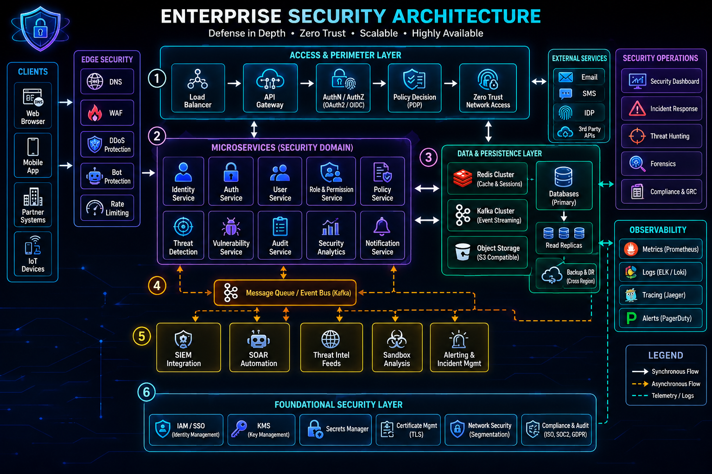
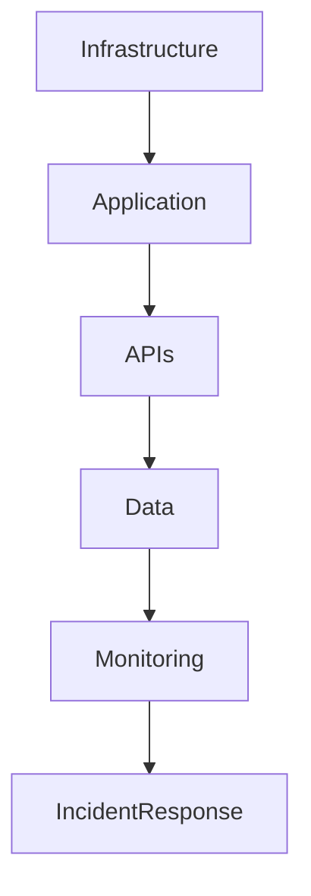
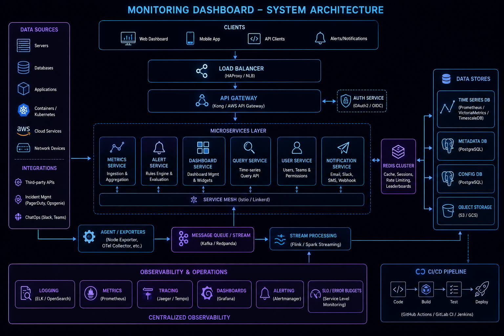

# Production Security Checklist



## Overview

Security is not a single feature.

It is a collection of engineering practices, architectural decisions, operational controls, monitoring systems, governance processes, and organizational responsibilities.

Many production incidents occur not because security controls were unavailable, but because critical controls were never implemented, reviewed, or validated.

This document serves as a production-readiness security checklist for engineering teams preparing systems for launch or conducting periodic security reviews.

The checklist focuses on practical security controls commonly required for:

* SaaS Platforms
* Ecommerce Systems
* Financial Applications
* Realtime Systems
* Cloud-Native Applications
* Enterprise Platforms

---

## Objectives

This checklist helps teams:

* Reduce Security Risk
* Improve Security Posture
* Increase Production Readiness
* Support Compliance Efforts
* Standardize Security Reviews
* Improve Operational Resilience

---

# Security Review Process

A production security review should evaluate:



---

# Authentication Checklist

## Identity Controls

* [ ] Passwords hashed using bcrypt, Argon2, or equivalent
* [ ] MFA available for privileged users
* [ ] Password reset workflow secured
* [ ] Session expiration configured
* [ ] Refresh token rotation implemented
* [ ] Failed login monitoring enabled

---

## Account Protection

* [ ] Brute-force protection enabled
* [ ] Account lockout policy defined
* [ ] Device verification strategy documented
* [ ] Suspicious login detection implemented

---

# Authorization Checklist

## Access Control

* [ ] RBAC implemented
* [ ] Least privilege enforced
* [ ] Resource ownership validation implemented
* [ ] Administrative actions restricted

---

## Multi-Tenant Security

* [ ] Tenant isolation validated
* [ ] Cross-tenant access testing completed
* [ ] Authorization audit logging enabled

---

# API Security Checklist

## Authentication

* [ ] JWT validation enforced
* [ ] Token expiration configured
* [ ] OAuth scopes reviewed
* [ ] Service-to-service authentication implemented

---

## Authorization

* [ ] Object-level authorization validated
* [ ] Endpoint permission review completed
* [ ] Sensitive endpoints protected

---

## Abuse Protection

* [ ] Rate limiting enabled
* [ ] WAF configured
* [ ] DDoS protections reviewed
* [ ] Input validation enforced

---

# OWASP Review

## Top Risks

* [ ] Broken Access Control Review
* [ ] Authentication Review
* [ ] Injection Review
* [ ] Security Misconfiguration Review
* [ ] Logging and Monitoring Review

---

# Secrets Management Checklist

## Secret Storage

* [ ] No secrets committed to Git
* [ ] Secret manager implemented
* [ ] Secret access audited

---

## Secret Rotation

* [ ] Rotation policy documented
* [ ] High-risk secrets rotated automatically
* [ ] Certificate renewal automated

---

## Governance

* [ ] Secret ownership defined
* [ ] Access reviews completed

---

# Data Protection Checklist

## Encryption

* [ ] Encryption in transit enabled
* [ ] Encryption at rest enabled
* [ ] Database encryption reviewed
* [ ] Backup encryption enabled

---

## PII Protection

* [ ] Sensitive data identified
* [ ] Data classification completed
* [ ] Data masking implemented where required
* [ ] Retention policy documented

---

# Infrastructure Security Checklist

## Cloud Security

* [ ] IAM roles reviewed
* [ ] Least privilege applied
* [ ] Security groups reviewed
* [ ] Public exposure minimized

---

## Network Security

* [ ] Private subnets used where appropriate
* [ ] Administrative access restricted
* [ ] Network segmentation reviewed

---

## Backup Security

* [ ] Backup encryption enabled
* [ ] Restore testing completed
* [ ] Recovery procedures documented

---

# AWS Security Checklist

## IAM

* [ ] Root account protected
* [ ] MFA enabled
* [ ] Excessive permissions removed

---

## Storage

* [ ] S3 buckets reviewed
* [ ] Public access blocked
* [ ] Lifecycle policies configured

---

## Monitoring

* [ ] CloudTrail enabled
* [ ] CloudWatch alerts configured
* [ ] Security findings monitored

---

# Kubernetes Security Checklist

## Cluster Security

* [ ] RBAC configured
* [ ] Namespace isolation reviewed
* [ ] Network policies enabled

---

## Workload Security

* [ ] Container images scanned
* [ ] Resource limits configured
* [ ] Secrets protected

---

## Runtime Security

* [ ] Audit logging enabled
* [ ] Pod security controls enforced

---

# Container Security Checklist

## Image Security

* [ ] Vulnerability scanning enabled
* [ ] Base images reviewed
* [ ] Unused packages removed

---

## Runtime Controls

* [ ] Containers run as non-root
* [ ] Privileged containers restricted
* [ ] File system protections enabled

---

# CI/CD Security Checklist

## Pipeline Security

* [ ] Secrets protected
* [ ] Build artifacts signed
* [ ] Security scans integrated

---

## Release Controls

* [ ] Deployment approvals documented
* [ ] Rollback process tested
* [ ] Production access restricted

---

# Dependency Security Checklist

## Dependency Management

* [ ] Dependency scanning enabled
* [ ] Vulnerability review process defined
* [ ] Unsupported libraries removed

---

## Supply Chain Security

* [ ] Third-party risk reviewed
* [ ] Artifact integrity validated

---

# Monitoring Checklist



## Security Monitoring

* [ ] Authentication failures monitored
* [ ] Authorization failures monitored
* [ ] Sensitive actions logged

---

## Infrastructure Monitoring

* [ ] CPU alerts configured
* [ ] Memory alerts configured
* [ ] Availability monitoring enabled

---

## Security Alerts

* [ ] Incident alerts tested
* [ ] Escalation policies documented

---

# Logging Checklist

## Audit Logging

* [ ] Authentication events logged
* [ ] Authorization events logged
* [ ] Administrative actions logged

---

## Retention

* [ ] Log retention policy defined
* [ ] Compliance requirements reviewed

---

# Incident Response Checklist

## Preparation

* [ ] Incident response plan documented
* [ ] Escalation matrix available
* [ ] Contact information verified

---

## Investigation

* [ ] Log access available
* [ ] Monitoring dashboards accessible
* [ ] Runbooks documented

---

## Recovery

* [ ] Backup restoration tested
* [ ] Disaster recovery procedures validated

---

# Compliance Checklist

## Governance

* [ ] Security ownership defined
* [ ] Risk register maintained
* [ ] Security reviews scheduled

---

## Regulatory Considerations

* [ ] GDPR requirements reviewed
* [ ] SOC 2 controls reviewed
* [ ] PCI DSS requirements reviewed (if applicable)

---

# Security Testing Checklist

## Validation Activities

* [ ] Penetration testing completed
* [ ] Vulnerability scanning completed
* [ ] Dependency review completed

---

## Application Security

* [ ] Authorization testing completed
* [ ] Input validation testing completed
* [ ] Session management reviewed

---

# Production Readiness Review

## Architecture

* [ ] Security architecture reviewed
* [ ] Threat model completed
* [ ] Risk assessment documented

---

## Operations

* [ ] Monitoring operational
* [ ] Alerting operational
* [ ] On-call ownership assigned

---

## Recovery

* [ ] Disaster recovery validated
* [ ] Backup restoration tested
* [ ] Incident response exercised

---

# Executive Security Summary

Before production launch, leadership should be able to answer:

```text
Can We Detect A Breach?

Can We Recover From Failure?

Can We Protect Customer Data?

Can We Meet Compliance Requirements?

Can We Operate Securely At Scale?
```

---

# Security Maturity Levels

| Level   | Characteristics                |
| ------- | ------------------------------ |
| Level 1 | Basic Security Controls        |
| Level 2 | Centralized Security Practices |
| Level 3 | Automated Security Processes   |
| Level 4 | Security Integrated Into SDLC  |
| Level 5 | Enterprise Security Governance |

---

# Engineering Perspective

Strong engineers treat security as a continuous process rather than a launch milestone.

The most resilient systems are built through:

* Secure Architecture
* Operational Discipline
* Continuous Validation
* Automated Controls
* Ongoing Governance

---

# Engineering Outcome

Production security is achieved through layered defenses, operational excellence, governance, and continuous improvement.

By systematically validating authentication, authorization, APIs, infrastructure, secrets, observability, compliance, and incident response readiness, engineering teams can significantly reduce risk and improve confidence before production deployment.

This checklist serves as a practical framework for conducting repeatable security reviews and improving the overall security posture of software systems.
