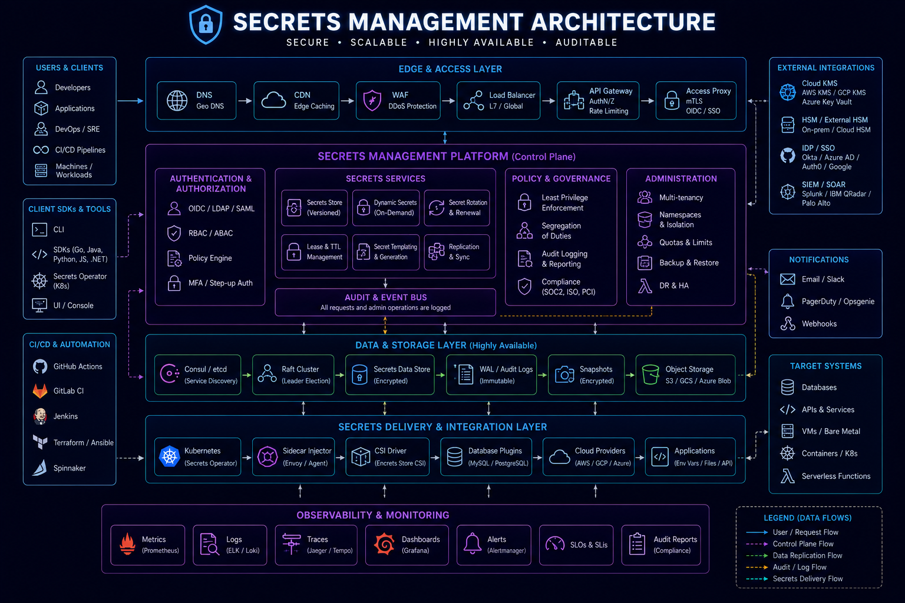
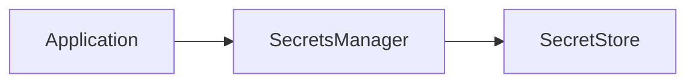
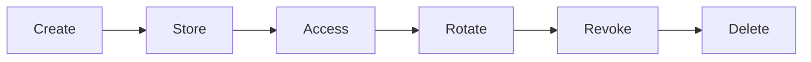
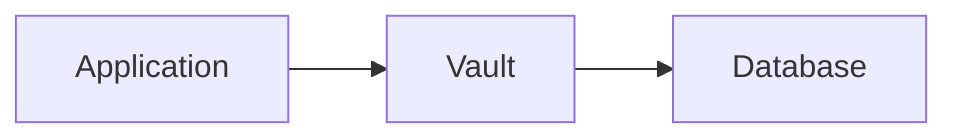
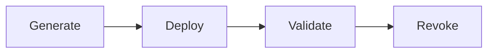
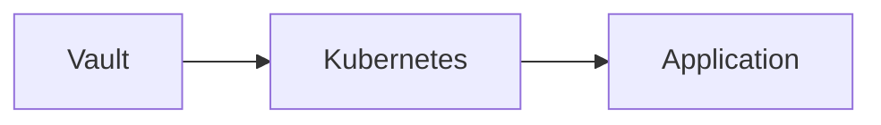

# Secrets Management



## Overview

Modern software systems depend on secrets to operate securely.

Examples include:

* Database Passwords
* API Keys
* Access Tokens
* Encryption Keys
* Certificates
* Service Credentials

Every application, infrastructure component, deployment pipeline, and cloud service requires access to sensitive credentials.

Poor secrets management remains one of the most common causes of security incidents.

Examples include:

* Hardcoded Credentials
* Leaked API Keys
* Public Git Repositories
* Shared Passwords
* Long-Lived Secrets

Enterprise-grade systems require centralized secrets management platforms that support:

* Secure Storage
* Rotation
* Auditing
* Access Control
* Lifecycle Management

---

## Objectives

Secrets management aims to:

* Protect Sensitive Credentials
* Reduce Exposure Risk
* Simplify Rotation
* Improve Governance
* Support Compliance
* Enable Secure Automation

---

# What Is a Secret?

A secret is any sensitive value that grants access or control.

---

## Examples

```text id="x34hza"
Database Password

API Key

JWT Signing Key

Cloud Credential

TLS Certificate
```

---

## Risk

Compromised secrets often lead directly to system compromise.

---

# Secrets Management Architecture




---

# Common Secret Types

---

## Credentials

Examples:

* Username
* Password

---

## API Keys

Used by third-party integrations.

---

## Tokens

Examples:

* Access Tokens
* Refresh Tokens

---

## Certificates

Used for encryption and identity.

---

## Cryptographic Keys

Used for signing and encryption.

---

# Why Hardcoded Secrets Are Dangerous

Bad example:

```javascript id="hyk5g7"
const password = "my-secret-password";
```

---

## Risks

* Source Code Exposure
* Repository Leaks
* Difficult Rotation

---

## Better Approach

```text id="h2l3pi"
Application

↓

Secret Manager

↓

Credential
```

---

# Secrets Lifecycle

Secrets should be managed throughout their lifecycle.

---

## Stages



---

# Secret Storage Principles

Secrets should be:

* Encrypted
* Audited
* Access Controlled
* Rotated

---

## Benefits

* Reduced Risk
* Better Governance

---

# HashiCorp Vault

One of the most widely used enterprise secrets platforms.

---

## Capabilities

* Secret Storage
* Dynamic Credentials
* Encryption
* Auditing

---

## Architecture



---

# Vault Benefits

* Centralized Management
* Strong Security
* Dynamic Credentials

---

# AWS Secrets Manager

Managed cloud-native secrets platform.

---

## Features

* Secure Storage
* Rotation
* IAM Integration

---

## Benefits

* Reduced Operational Overhead
* Cloud Integration

---

# Azure Key Vault

Enterprise secret management for Azure environments.

---

## Capabilities

* Secret Storage
* Certificate Management
* Key Management

---

# Google Secret Manager

Managed secret storage for GCP.

---

## Benefits

* Centralized Security
* Cloud Integration

---

# Dynamic Secrets

Traditional secrets are static.

Dynamic secrets are generated on demand.

---

## Example

```text id="2qwj5u"
Temporary Database User
```

Generated automatically.

---

## Benefits

* Reduced Exposure
* Automatic Expiration

---

# Secret Rotation

Secrets should not remain valid indefinitely.

---

## Example

```text id="v9l4iv"
Rotate Every 90 Days
```

---

## Benefits

* Reduced Compromise Window
* Better Compliance

---

# Rotation Workflow



---

# Certificate Management

Certificates require lifecycle management.

---

## Tasks

* Issuance
* Renewal
* Revocation

---

## Risks

Expired certificates can cause outages.

---

# TLS Certificates

Used for:

* HTTPS
* Service Authentication
* Encryption

---

## Benefits

* Secure Communication

---

# Kubernetes Secrets

Kubernetes supports secret storage.

---

## Examples

* Database Passwords
* API Keys
* Certificates

---

## Architecture


---

# Kubernetes Secret Risks

Secrets stored in Kubernetes require additional protection.

---

## Best Practices

* Encrypt at Rest
* Restrict Access
* Use External Secret Stores

---

# External Secrets

Common pattern:



---

## Benefits

* Centralized Governance
* Improved Security

---

# CI/CD Secret Management

Deployment pipelines require secrets.

---

## Examples

* Cloud Credentials
* Deployment Tokens
* Signing Keys

---

## Risks

Pipeline compromise.

---

# CI/CD Best Practices

* Temporary Credentials
* Secret Injection
* Rotation

---

## Avoid

```text id="ygo1kx"
Secrets In Repository
```

---

# Access Control

Not everyone should access every secret.

---

## Principle

```text id="3mfxk5"
Least Privilege
```

---

## Benefits

* Reduced Risk
* Better Governance

---

# Secret Auditing

Every access should be recorded.

---

## Example Events

```text id="xsh5fy"
Secret Read

Secret Updated

Secret Deleted
```

---

## Benefits

* Compliance
* Threat Detection

---

# Monitoring Secret Usage


Monitor:

* Secret Access
* Failed Retrievals
* Unusual Usage Patterns

---

## Benefits

* Threat Detection
* Operational Visibility

---

# Key Management

Encryption keys require special handling.

---

## Common Systems

* AWS KMS
* Azure Key Vault
* Cloud KMS

---

## Benefits

* Secure Cryptography
* Compliance Support

---

# Service-to-Service Secrets

Microservices require credentials.

---

## Examples

* API Tokens
* Service Accounts
* Certificates

---

## Goal

Secure communication between services.

---

# Secret Governance

Enterprise environments require policies.

---

## Policies

* Rotation Requirements
* Access Reviews
* Expiration Policies

---

## Benefits

* Standardization
* Compliance

---

# Compliance Considerations

Many regulations require:

* Secret Rotation
* Auditing
* Access Controls

---

## Examples

* SOC 2
* ISO 27001
* PCI DSS

---

# Real-World Examples

---

## Ecommerce Platform

Secrets:

* Payment Gateway Keys
* Database Credentials
* JWT Signing Keys

---

## Fantasy Sports Platform

Secrets:

* Feed Provider Credentials
* Redis Access
* Cloud Credentials

---

## Opinion Trading Platform

Secrets:

* Trading Integrations
* Risk Systems
* Compliance Services

---

# Common Secrets Management Mistakes

---

## Hardcoded Credentials

Major security risk.

---

## Shared Credentials

Reduce accountability.

---

## Long-Lived Secrets

Increase exposure.

---

## Missing Rotation

Creates security debt.

---

## No Auditing

Limits visibility.

---

# Engineering Tradeoffs

| Strategy                   | Benefit           | Cost                      |
| -------------------------- | ----------------- | ------------------------- |
| Centralized Secret Store   | Better Security   | Additional Infrastructure |
| Dynamic Secrets            | Reduced Risk      | Complexity                |
| Frequent Rotation          | Stronger Security | Operational Overhead      |
| External Secret Management | Better Governance | Integration Effort        |
| Extensive Auditing         | Better Compliance | Storage Cost              |

---

# Secrets Management Maturity Model

```text id="f6w5t3"
Hardcoded Secrets
        │
        ▼
Environment Variables
        │
        ▼
Secret Managers
        │
        ▼
Rotation
        │
        ▼
Dynamic Credentials
        │
        ▼
Enterprise Secret Governance
```

---

# Interview Perspective

Strong engineers discuss:

* Secret Rotation
* Vault
* AWS Secrets Manager
* Dynamic Credentials
* Certificate Management
* Kubernetes Secrets
* Governance

Rather than treating secrets as configuration values.

Secrets are security-critical assets that require lifecycle management.

---

# Engineering Outcome

Secrets management is a foundational component of modern security architecture.

By centralizing secret storage, enforcing rotation policies, implementing strong access controls, leveraging dynamic credentials, and integrating auditing and monitoring, organizations can significantly reduce security risk while enabling secure automation and scalable infrastructure operations.
