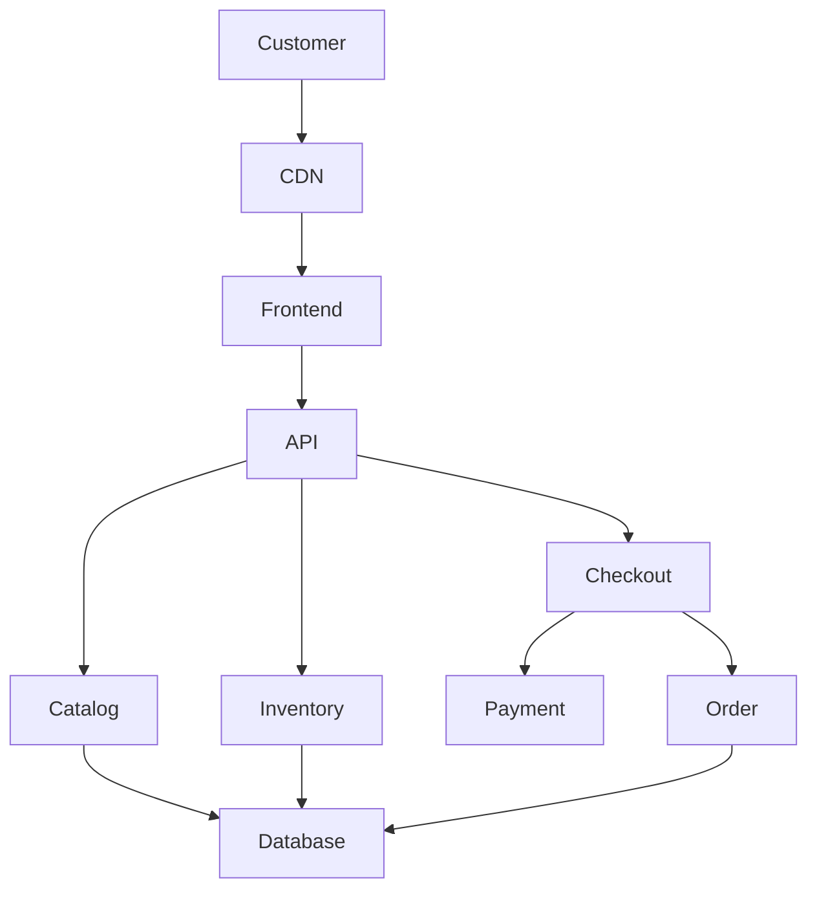
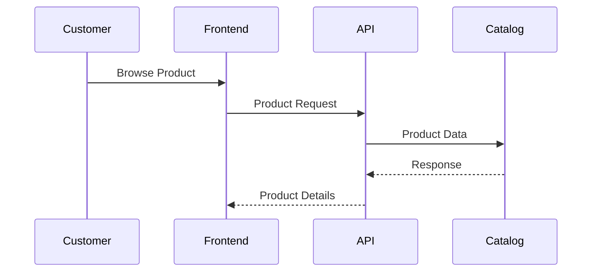
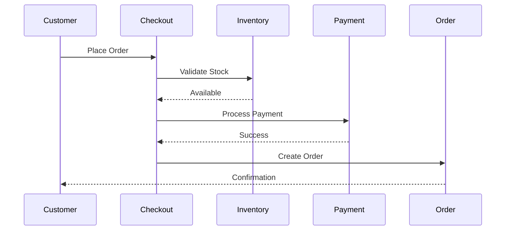
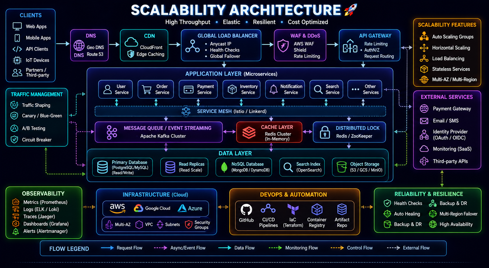
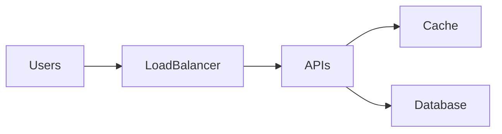

# Ecommerce Platform Architecture Case Study


## Overview

Ecommerce systems are among the most complex business platforms in modern software engineering.

Unlike content websites or simple CRUD applications, ecommerce platforms must coordinate multiple business domains simultaneously:

* Product Catalog
* Inventory Management
* Cart Management
* Checkout
* Payments
* Orders
* Shipping
* Promotions
* Customer Accounts
* Notifications

Every customer interaction directly impacts revenue, making reliability, scalability, and user experience critical engineering concerns.

This case study explores the architecture of a production-grade ecommerce platform from an engineering and system design perspective without exposing proprietary implementation details.

---

## Business Objectives

The platform is designed to support:

### Customers

* Product Discovery
* Cart Management
* Checkout
* Order Tracking

### Operations Teams

* Inventory Management
* Product Administration
* Order Processing

### Business Teams

* Promotions
* Reporting
* Analytics

### Engineering Teams

* Scalability
* Reliability
* Operational Visibility

---

# Engineering Challenges

Ecommerce introduces unique technical requirements.

---

## Inventory Accuracy

Products cannot be oversold.

---

## Checkout Reliability

Checkout failures directly impact revenue.

---

## Payment Integration

External payment systems introduce dependencies.

---

## High Traffic Events

Examples:

```text
Flash Sales

Seasonal Campaigns

Tournament Merchandise Launches

Holiday Traffic
```

---

## Data Consistency

Orders, inventory, and payments must remain synchronized.

---

# High-Level Architecture




---

# Core Platform Domains

---

## Product Catalog

Responsible for:

* Product Information
* Categories
* Attributes
* Variants
* Search Metadata

---

## Inventory Domain

Responsible for:

* Stock Levels
* Reservations
* Availability

---

## Cart Domain

Responsible for:

* Cart Persistence
* Quantity Management
* Pricing Calculation

---

## Checkout Domain

Responsible for:

* Address Validation
* Shipping Selection
* Payment Initiation

---

## Payment Domain

Responsible for:

* Transaction Processing
* Payment Validation
* Payment Status Tracking

---

## Order Domain

Responsible for:

* Order Creation
* Status Management
* Fulfillment Coordination

---

# Customer Request Flow



---

# Checkout Flow

One of the most critical platform workflows.

---

## Flow



---

# Inventory Management Strategy

Inventory is one of the most sensitive areas.

---

## Requirements

* Accuracy
* Consistency
* Reliability

---

## Risks

```text
Overselling

Double Reservations

Incorrect Stock Levels
```

---

# Inventory Reservation Model

Instead of reducing stock immediately:

```text
Stock

↓

Reservation

↓

Payment

↓

Order Confirmation
```

---

## Benefits

* Reduced Overselling Risk
* Better Consistency

---

# Product Catalog Architecture

Product data includes:

* Products
* Categories
* Variants
* Images
* Pricing

---

## Design Goals

* Fast Reads
* Flexible Modeling
* Efficient Search

---

# Search Architecture

Customers expect fast discovery.

---

## Search Features

* Keyword Search
* Category Filtering
* Price Filtering
* Attribute Filtering

---

## Benefits

* Improved Conversion

---

# Caching Strategy


Ecommerce traffic is heavily read-oriented.

---

## Cached Data

* Product Details
* Categories
* Featured Products
* Search Results

---

## Benefits

* Lower Database Load
* Faster User Experience

---

# Database Architecture

Primary entities include:

* Users
* Products
* Variants
* Inventory
* Orders
* Payments

---

## Goals

* Consistency
* Reliability
* Auditability

---

# Scalability Architecture





---

## Scaling Priorities

### Product Reads

Aggressively optimized.

---

### Checkout Operations

Protected carefully.

---

### Order Creation

Consistency prioritized.

---

# Reliability Architecture

Revenue-generating systems require strong reliability.

---

## Goals

* Checkout Availability
* Payment Reliability
* Order Integrity

---

## Strategies

* Retries
* Monitoring
* Failover
* Auditing

---

# Payment Integration Architecture

External payment providers are critical dependencies.

---

## Responsibilities

* Payment Initiation
* Verification
* Status Updates

---

## Challenges

* Network Failures
* Delayed Callbacks
* Partial Failures

---

# Payment Flow


---

# Order Lifecycle

```text
Created

↓

Paid

↓

Packed

↓

Shipped

↓

Delivered
```

---

## Benefits

* Operational Visibility
* Fulfillment Tracking

---

# Event-Driven Opportunities

Certain workflows benefit from asynchronous processing.

---

## Examples

* Email Notifications
* Order Confirmations
* Analytics Events
* Inventory Updates

---

## Benefits

* Reduced Coupling
* Better Scalability

---

# Security Considerations

Core controls include:

* Authentication
* Authorization
* Payment Security
* Data Protection

---

## Goals

* Customer Protection
* Regulatory Compliance

---

# Observability Strategy


Monitor:

* Checkout Success Rate
* Payment Success Rate
* Order Throughput
* Inventory Accuracy

---

## Benefits

* Revenue Protection
* Faster Detection

---

# Deployment Architecture


---

## Benefits

* Consistent Deployments
* Automated Releases

---

# Engineering Decisions

---

## Inventory Reservations

Reason:

```text
Prevent Overselling
```

---

## Redis Caching

Reason:

```text
Reduce Product Read Load
```

---

## Stateless APIs

Reason:

```text
Horizontal Scaling
```

---

## Event-Driven Notifications

Reason:

```text
Reduce Checkout Latency
```

---

# Key Tradeoffs

| Decision               | Benefit      | Tradeoff                |
| ---------------------- | ------------ | ----------------------- |
| Inventory Reservations | Accuracy     | Additional Complexity   |
| Redis Caching          | Faster Reads | Cache Management        |
| Event-Driven Workflows | Scalability  | Operational Complexity  |
| Payment Abstraction    | Flexibility  | Additional Development  |
| Distributed Services   | Scalability  | Coordination Complexity |

---

# Future Evolution

Potential enhancements:

* Multi-Warehouse Inventory
* Global Fulfillment
* Recommendation Engine
* Personalization Platform
* Event Streaming Architecture

---

# Engineering Outcome

The ecommerce platform architecture demonstrates how modern commerce systems balance performance, consistency, reliability, and scalability.

By separating core business domains, protecting critical revenue workflows, leveraging caching, implementing inventory safeguards, and investing in observability and operational resilience, the platform architecture supports sustainable growth while delivering a reliable customer experience.

This case study highlights the engineering tradeoffs and architectural principles required to build production-grade ecommerce platforms at scale.
