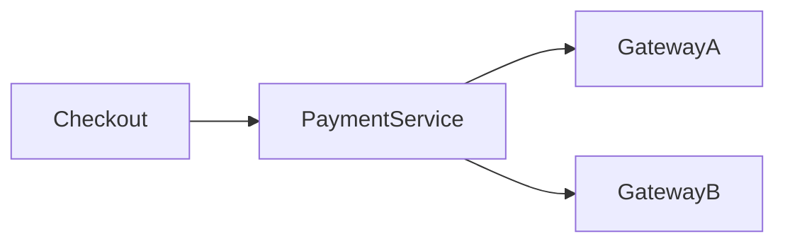

# Ecommerce Platform Engineering Decisions


## Overview

Building an ecommerce platform is not primarily a technology challenge.

It is a decision-making challenge.

Most architectural failures occur not because engineers selected the wrong framework, but because critical tradeoffs were misunderstood.

Successful ecommerce systems balance:

* Performance
* Reliability
* Consistency
* Scalability
* Operational Complexity
* Business Requirements

This document captures the reasoning behind major architectural decisions made for a production-grade ecommerce platform.

The focus is not on implementation details.

The focus is on engineering thinking.

---

## Engineering Principles

Several principles guided platform design.

---

### Revenue Protection First

Checkout reliability is more important than feature richness.

---

### Consistency Where Money Is Involved

Orders, inventory, and payments require strong correctness guarantees.

---

### Scale Reads Aggressively

Product browsing dominates platform traffic.

---

### Prefer Simplicity Until Complexity Is Justified

Avoid introducing distributed complexity prematurely.

---

### Reliability Is A Product Feature

Customers remember failed purchases.

---

# Decision Framework

Architectural decisions were evaluated using:

| Criteria               | Importance |
| ---------------------- | ---------- |
| Revenue Impact         | Critical   |
| Consistency            | Critical   |
| Reliability            | High       |
| Scalability            | High       |
| Development Velocity   | Medium     |
| Operational Complexity | High       |

---

# Decision: Reservation-Based Inventory

## Problem

Multiple customers may purchase the same product simultaneously.

---

## Option 1

Direct Stock Reduction

```text id="9ajxko"
Checkout

↓

Payment

↓

Reduce Inventory
```

---

## Risk

Overselling.

---

## Option 2

Inventory Reservation

```text id="9lh2bn"
Reserve

↓

Pay

↓

Confirm
```

---

## Selected

```text id="0v41wd"
Reservation-Based Inventory
```

---

## Reasoning

Inventory correctness directly impacts:

* Customer Trust
* Fulfillment
* Revenue

---

## Benefits

* Oversell Protection
* Better Consistency

---

## Tradeoffs

* Reservation Expiration Logic
* Additional Complexity

---

# Decision: Event-Driven Order Processing

## Problem

Checkout triggers multiple workflows.

---

## Examples

```text id="4yzhy9"
Email

Inventory Update

Analytics

Notifications
```

---

## Option 1

Synchronous Execution

---

## Option 2

Event-Driven Processing

---

## Selected

```text id="yofj0m"
Event-Driven Architecture
```

---

## Reasoning

Checkout should focus on:

```text id="m6w8sl"
Complete Purchase Quickly
```

---

## Benefits

* Reduced Checkout Latency
* Loose Coupling
* Independent Scaling

---

## Tradeoffs

* Distributed Complexity
* Operational Overhead

---

# Decision: Redis For Product Reads

## Problem

Product browsing generates significant traffic.

---

## Traffic Pattern

```text id="xgs5a7"
Reads >> Writes
```

---

## Example

```text id="9t16n7"
Product Page

Viewed Thousands Of Times
```

---

## Selected

```text id="52qll9"
Redis Caching Layer
```

---

## Benefits

* Lower Database Load
* Faster Responses

---

## Tradeoffs

* Cache Invalidation
* Additional Infrastructure

---

# Decision: Relational Database For Core Commerce Data

## Problem

Orders and payments require strong consistency.

---

## Options

### NoSQL First

---

### Relational Database

---

## Selected

```text id="pnpgb9"
Relational Database
```

---

## Reasoning

Commerce systems require:

* Transactions
* Constraints
* Auditing

---

## Benefits

* Data Integrity
* Reliable Transactions

---

## Tradeoffs

* Scaling Complexity

---

# Decision: API-First Architecture

## Clients

* Website
* Mobile App
* Admin Panel

---

## Selected

```text id="3lp7lk"
API-Centric Design
```

---

## Benefits

* Reusability
* Independent Frontends

---

## Tradeoffs

* API Governance Requirements

---

# Decision: Stateless Services

## Problem

Traffic fluctuates significantly.

---

## Selected

```text id="v9u0ha"
Stateless Application Layer
```

---

## State Stored In

* Database
* Redis

---

## Benefits

* Horizontal Scaling
* Faster Recovery

---

## Tradeoffs

* Additional Infrastructure Dependencies

---

# Decision: Checkout Consistency Over Availability

## Problem

Should checkout continue during partial failures?

---

## Example

Inventory service unavailable.

---

## Selected

```text id="lccv8o"
Consistency First
```

---

## Reasoning

Creating incorrect orders causes more damage than rejecting orders temporarily.

---

## Benefits

* Accurate Orders
* Inventory Protection

---

## Tradeoffs

* Reduced Availability During Failures

---

# Decision: Payment Abstraction Layer

## Problem

Payment providers may change.

---

## Selected

```text id="0j7pqj"
Payment Abstraction
```

---

## Architecture



---

## Benefits

* Provider Flexibility
* Easier Migration

---

## Tradeoffs

* Additional Development Effort

---

# Decision: Asynchronous Notifications

## Problem

Emails and SMS should not delay checkout.

---

## Selected

```text id="vy0s7c"
Asynchronous Processing
```

---

## Benefits

* Faster Checkout
* Better Scalability

---

## Tradeoffs

* Event Monitoring Required

---

# Decision: Order State Machine

## Problem

Orders progress through many stages.

---

## Selected

```text id="i5wj11"
Explicit State Machine
```

---

## Benefits

* Workflow Control
* Easier Auditing

---

## Tradeoffs

* Additional Business Logic

---

# Decision: CDN For Assets

## Assets

* Product Images
* Marketing Banners
* Static Content

---

## Selected

```text id="7wvwjl"
CDN Distribution
```

---

## Benefits

* Faster Delivery
* Reduced Origin Traffic

---

## Tradeoffs

* Cache Management

---

# Decision: Full Audit Trails

## Problem

Commerce systems require traceability.

---

## Examples

```text id="p2a79y"
Order Updates

Inventory Changes

Refund Actions
```

---

## Benefits

* Compliance
* Debugging
* Customer Support

---

## Tradeoffs

* Storage Cost

---

# Decision: Inventory At Variant Level

## Example

```text id="vdc7yx"
Small

Medium

Large
```

---

## Selected

```text id="2i4gxy"
Variant Inventory Tracking
```

---

## Benefits

* Accurate Availability

---

## Tradeoffs

* More Complex Data Model

---

# Decision: Monitoring Business Metrics

## Problem

Infrastructure metrics alone are insufficient.

---

## Monitored

* Checkout Success Rate
* Payment Success Rate
* Orders Per Minute
* Refund Volume

---

## Benefits

* Revenue Visibility

---

## Tradeoffs

* Additional Instrumentation

---

# Decision: Modular Monolith First

## Problem

Should the platform begin with microservices?

---

## Selected

```text id="xg2h7u"
Modular Monolith
```

---

## Reasoning

Premature microservices create:

* Deployment Complexity
* Operational Burden

---

## Benefits

* Faster Development
* Easier Debugging

---

## Tradeoffs

* Future Service Extraction

---

# Consistency vs Availability

One of the most important decisions.

---

## Catalog Browsing

Availability prioritized.

---

## Checkout

Consistency prioritized.

---

## Orders

Consistency prioritized.

---

## Search

Availability prioritized.

---

# CAP-Inspired Decisions

| Domain          | Priority     |
| --------------- | ------------ |
| Product Catalog | Availability |
| Search          | Availability |
| Inventory       | Consistency  |
| Orders          | Consistency  |
| Payments        | Consistency  |
| Analytics       | Availability |

---

# Scalability Decisions

---

## Product Catalog

Aggressive caching.

---

## Orders

Careful scaling.

---

## Checkout

Controlled scaling.

---

## Search

Independent optimization.

---

# Reliability Decisions

Key investments:

* Monitoring
* Alerting
* Retry Policies
* Auditing
* Failover Procedures

---

## Reasoning

Revenue-generating workflows require resilience.

---

# Lessons Learned

---

## Inventory Is Hard

Overselling prevention deserves significant attention.

---

## Payments Are Distributed Systems

Failures are inevitable.

---

## Checkout Latency Matters

Small delays impact conversion.

---

## Operational Visibility Is Critical

Monitoring often prevents larger incidents.

---

## Simplicity Delays Complexity

Architectures should evolve with scale.

---

# Technology Selection Summary

| Area               | Decision            |
| ------------------ | ------------------- |
| Product Reads      | Redis               |
| Orders             | Relational Database |
| Payments           | Abstraction Layer   |
| Notifications      | Event-Driven        |
| Checkout           | Consistency First   |
| Assets             | CDN                 |
| Scaling            | Horizontal APIs     |
| Architecture Style | Modular Monolith    |

---

# Engineering Tradeoffs Summary

| Decision               | Benefit      | Cost                |
| ---------------------- | ------------ | ------------------- |
| Inventory Reservations | Consistency  | Complexity          |
| Event Processing       | Scalability  | Operations Overhead |
| Redis                  | Performance  | Cache Management    |
| State Machines         | Reliability  | Additional Logic    |
| Audit Trails           | Traceability | Storage Cost        |
| Payment Abstraction    | Flexibility  | Development Effort  |

---

# Interview Perspective

Strong senior engineers discuss:

* Inventory Reservations
* Consistency Tradeoffs
* Checkout Reliability
* Event-Driven Order Processing
* Payment Abstraction
* Scalability Strategy
* Operational Considerations

Rather than focusing only on frameworks and implementation details.

Architecture decisions reveal engineering maturity.

---

# Engineering Outcome

The ecommerce platform architecture reflects a series of deliberate engineering decisions designed to balance business requirements, customer experience, operational simplicity, scalability, and reliability.

By prioritizing inventory correctness, checkout reliability, payment flexibility, event-driven workflows, caching strategies, and strong observability practices, the platform architecture can support sustainable growth while protecting revenue and maintaining customer trust.

This case study demonstrates the type of decision-making required to build production-grade commerce platforms at scale.
