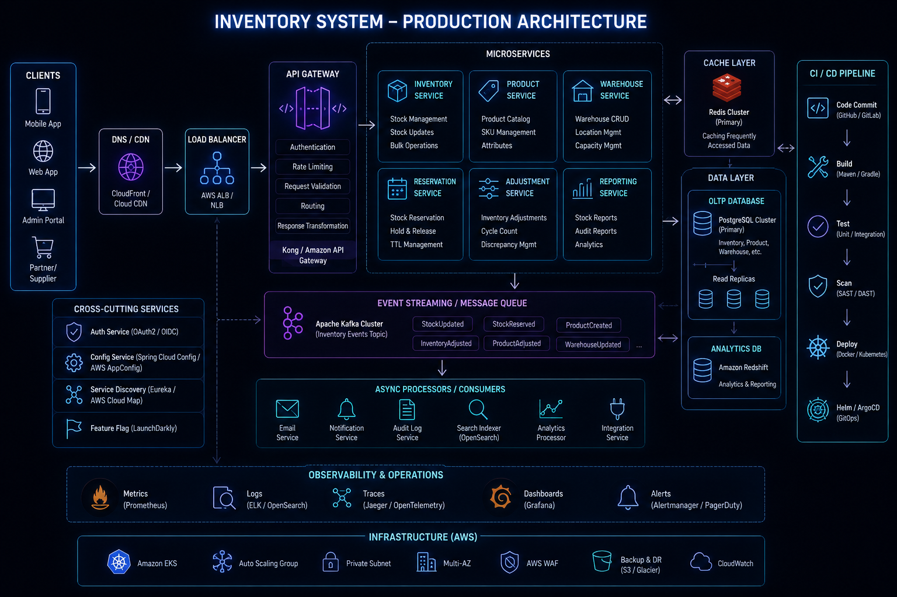
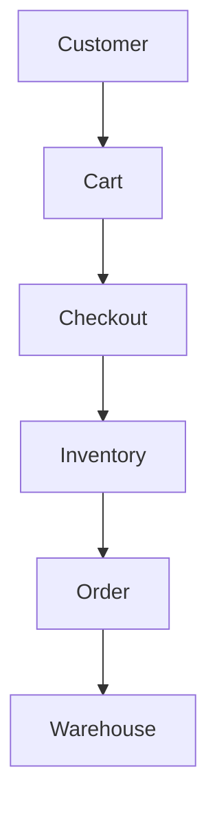
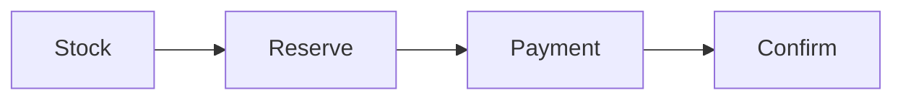
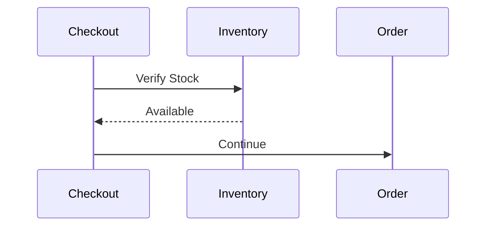
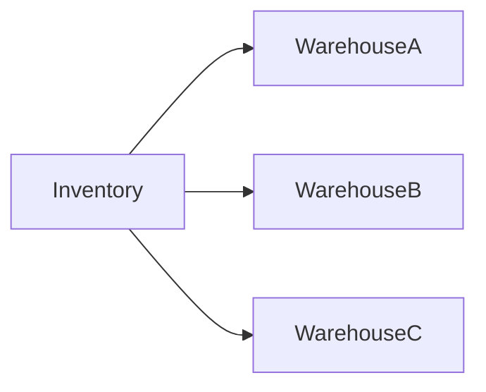

# Inventory Management System



## Overview

Inventory management is one of the most critical and difficult components of an ecommerce platform.

Customers expect product availability information to be accurate.

Business teams expect stock levels to remain synchronized.

Operations teams depend on inventory data for fulfillment.

Engineers must ensure consistency under high concurrency.

Unlike product catalogs, which are primarily read-oriented, inventory systems involve constant state changes and business-critical correctness requirements.

A single inventory mistake can result in:

* Overselling
* Revenue Loss
* Fulfillment Delays
* Customer Dissatisfaction
* Operational Complexity

This document explores the architectural decisions and engineering tradeoffs involved in building a production-grade inventory platform.

---

## Business Objectives

The inventory system must support:

### Customers

* Accurate Stock Visibility
* Reliable Ordering

### Operations Teams

* Inventory Tracking
* Stock Reconciliation

### Fulfillment Teams

* Warehouse Coordination
* Shipment Planning

### Engineering Teams

* Scalability
* Reliability
* Consistency

---

# Core Inventory Challenges

Inventory systems operate differently from most business systems.

---

## High Concurrency

Many customers may attempt to purchase the same product simultaneously.

---

## Overselling Risk

The most common ecommerce inventory failure.

---

## Inventory Synchronization

Stock must remain consistent across systems.

---

## Warehouse Coordination

Inventory may exist across multiple locations.

---

# Inventory Architecture




---

# Inventory Domain Responsibilities

The inventory service manages:

* Stock Levels
* Reservations
* Availability
* Replenishment
* Warehouse Quantities

---

# Inventory States

Inventory is not simply:

```text id="3q4n1a"
In Stock

Out Of Stock
```

Multiple states often exist.

---

## Example

```text id="1zwx1k"
Available

Reserved

Allocated

Shipped
```

---

## Benefits

* Better Accuracy
* Improved Visibility

---

# Stock Lifecycle


---

# Inventory Reservation Model

One of the most important engineering decisions.

---

## Problem

Two users attempt to buy the final item.

---

## Naive Approach

```text id="z4i6sv"
Check Stock

↓

Process Payment

↓

Reduce Stock
```

---

## Risk

Overselling.

---

# Reservation-Based Approach

Preferred architecture.

---

## Flow



---

## Benefits

* Prevents Overselling
* Improves Consistency

---

# Reservation Lifecycle

Reservations should expire.

---

## Example

```text id="k5d8x0"
Reserved

↓

15 Minutes

↓

Expired
```

---

## Benefits

* Inventory Recovery
* Better Utilization

---

# Available Inventory Formula

Inventory visibility should consider reservations.

---

## Formula

Available\ Inventory = Total\ Stock - Reserved\ Stock

---

# Stock Validation

Validation occurs during checkout.

---

## Flow



---

## Benefits

* Improved Accuracy

---

# Inventory Consistency

Consistency is critical.

---

## Goal

```text id="r0n5wt"
Never Sell

More Than Exists
```

---

# Consistency Strategies

Common approaches:

* Transactions
* Row Locking
* Optimistic Concurrency
* Reservations

---

# Database Locking

Traditional approach.

---

## Benefits

* Strong Consistency

---

## Challenges

* Reduced Throughput
* Contention

---

# Optimistic Concurrency

Version-based updates.

---

## Example

```text id="3z9bme"
Version Check

↓

Update
```

---

## Benefits

* Better Scalability

---

## Tradeoffs

* Retry Logic

---

# Multi-Warehouse Inventory

Large ecommerce systems often support multiple locations.

---

## Example

```text id="v3km7x"
Warehouse A

Warehouse B

Warehouse C
```

---

# Multi-Warehouse Architecture



---

## Benefits

* Faster Delivery
* Better Availability

---

# Inventory Allocation

Orders must be assigned to warehouses.

---

## Factors

* Availability
* Distance
* Shipping Cost

---

## Goal

Optimal fulfillment.

---

# Event-Driven Inventory Updates

Inventory changes should propagate efficiently.

---

## Events

```text id="7e0mcn"
Order Created

Reservation Created

Reservation Expired

Shipment Completed
```

---

## Benefits

* Decoupling
* Scalability

---

# Inventory Event Flow


---

# Inventory Reconciliation

Reality and system state may diverge.

---

## Causes

* Warehouse Errors
* Damaged Goods
* Returns

---

## Goal

Restore accuracy.

---

# Inventory Auditing

Every inventory change should be recorded.

---

## Examples

```text id="8msr0p"
Reservation

Adjustment

Shipment

Return
```

---

## Benefits

* Traceability
* Compliance

---

# Product Variants

Inventory is usually tracked at variant level.

---

## Example

```text id="6f1ldv"
T-Shirt

Size M

Size L

Size XL
```

---

## Benefits

* Accurate Stock Tracking

---

# Returns Impact Inventory

Returns can increase stock.

---

## Flow

```text id="4b1vfx"
Return Received

↓

Quality Check

↓

Inventory Update
```

---

## Benefits

* Accurate Availability

---

# Inventory Forecasting

Future demand impacts planning.

---

## Inputs

* Historical Sales
* Seasonal Trends
* Promotions

---

## Benefits

* Better Purchasing Decisions

---

# Scalability Challenges

As business grows:

---

## Increased Orders

Higher write volume.

---

## More Warehouses

Greater coordination complexity.

---

## More Products

Larger datasets.

---

# Inventory Monitoring


Monitor:

* Stock Levels
* Reservation Volume
* Oversell Events
* Inventory Accuracy

---

## Benefits

* Faster Detection
* Operational Visibility

---

# Inventory Metrics

Key metrics include:

```text id="zq8aqd"
Available Stock

Reservation Count

Inventory Accuracy

Stockouts
```

---

# Failure Scenarios

---

## Overselling

Critical business failure.

---

## Reservation Leak

Inventory locked indefinitely.

---

## Synchronization Failure

Incorrect stock visibility.

---

## Warehouse Mismatch

Inventory discrepancies.

---

# Mitigation Strategies

* Reservation Expiration
* Auditing
* Reconciliation
* Monitoring

---

# Engineering Decisions

---

## Reservation-Based Inventory

Reason:

```text id="8m9fw4"
Prevent Overselling
```

---

## Variant-Level Tracking

Reason:

```text id="q0y75n"
Accurate Availability
```

---

## Event-Driven Updates

Reason:

```text id="0v66e5"
Scalable Synchronization
```

---

## Multi-Warehouse Support

Reason:

```text id="u7qz4r"
Growth Readiness
```

---

# Engineering Tradeoffs

| Decision               | Benefit            | Tradeoff               |
| ---------------------- | ------------------ | ---------------------- |
| Reservations           | Consistency        | Additional Complexity  |
| Multi-Warehouse        | Better Fulfillment | Coordination Overhead  |
| Event Processing       | Scalability        | Operational Complexity |
| Auditing               | Traceability       | Storage Cost           |
| Optimistic Concurrency | Better Throughput  | Retry Handling         |

---

# Inventory Maturity Model

```text id="4h1gca"
Basic Stock Tracking
          │
          ▼
Reservations
          │
          ▼
Variant Inventory
          │
          ▼
Event-Driven Updates
          │
          ▼
Multi-Warehouse Management
          │
          ▼
Enterprise Inventory Platform
```

---

# Interview Perspective

Strong engineers discuss:

* Inventory Reservations
* Overselling Prevention
* Consistency Models
* Warehouse Allocation
* Event-Driven Synchronization
* Inventory Auditing

Rather than viewing inventory as a simple stock column in a database.

Inventory systems are distributed consistency problems.

---

# Engineering Outcome

The inventory management platform is designed to balance consistency, scalability, operational visibility, and business correctness.

By leveraging reservation-based inventory control, variant-level tracking, event-driven updates, warehouse-aware fulfillment, auditing, and monitoring, the system can maintain accurate stock visibility while supporting business growth and protecting customer trust.

This architecture reflects the engineering principles required to build production-grade commerce inventory systems at scale.
