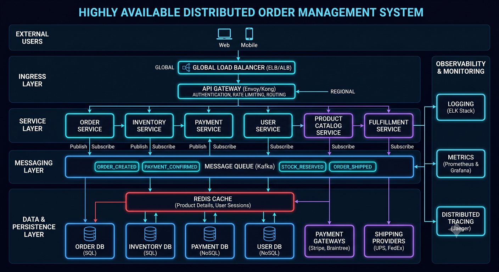
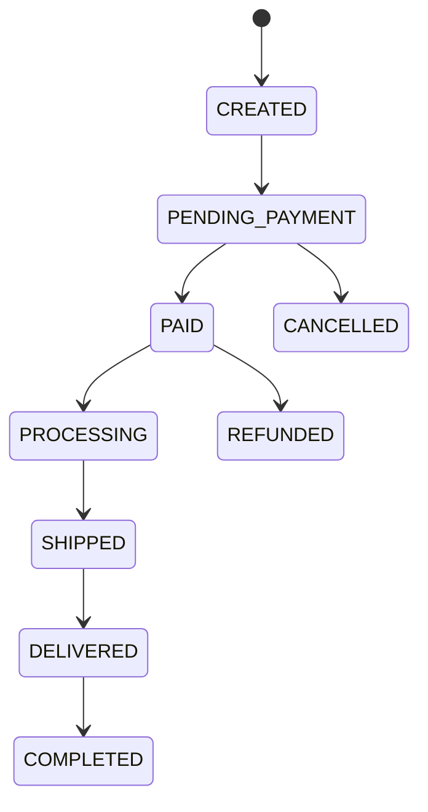
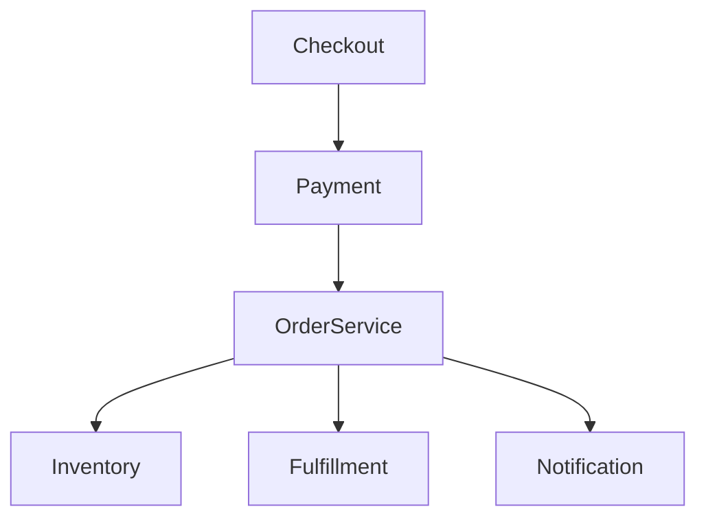
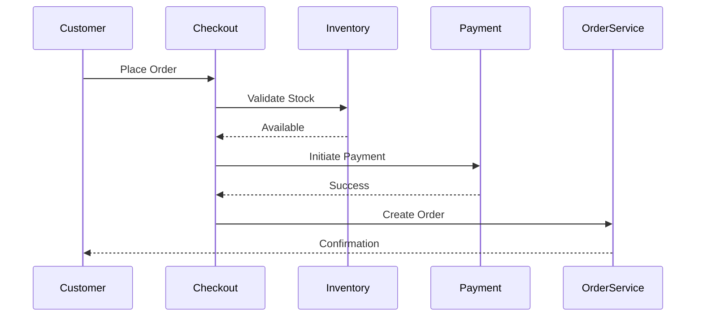
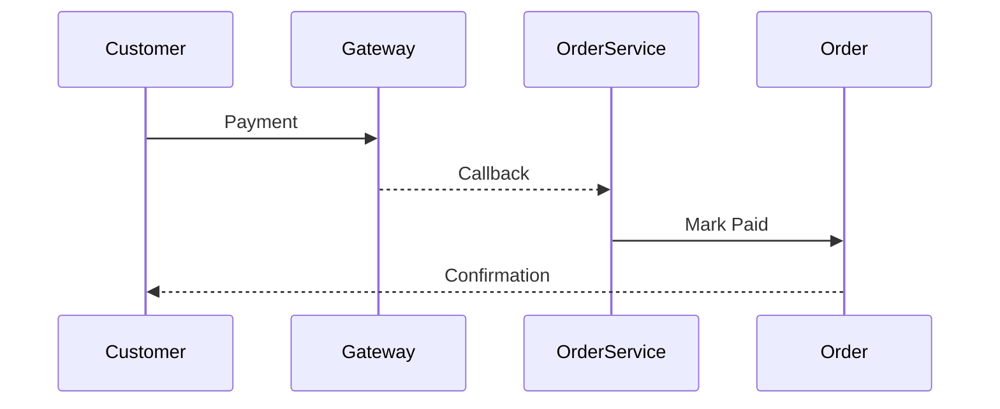

# Order Management System



## Overview

The Order Management System (OMS) is the operational backbone of an ecommerce platform.

While customers typically interact with product pages, carts, and checkout experiences, the order management domain is responsible for ensuring that every purchase is tracked, validated, fulfilled, and audited throughout its lifecycle.

A well-designed OMS must coordinate:

* Orders
* Payments
* Inventory
* Shipping
* Returns
* Notifications
* Customer Support

Because revenue depends on successful order execution, reliability and consistency are primary architectural concerns.

---

## Business Objectives

The OMS must support:

### Customers

* Order Placement
* Order Tracking
* Order Cancellation
* Return Requests

### Operations Teams

* Fulfillment
* Shipping
* Inventory Reconciliation

### Business Teams

* Revenue Reporting
* Customer Analytics

### Engineering Teams

* Scalability
* Reliability
* Auditability

---

# Engineering Challenges

Order management introduces several complexities.

---

## Payment Coordination

Orders must align with payment status.

---

## Inventory Consistency

Stock levels must remain accurate.

---

## Fulfillment Reliability

Orders must move through operational workflows correctly.

---

## Failure Recovery

Partial failures must not create data inconsistencies.

---

# Order Lifecycle

Every order progresses through a series of states.

---

## State Flow



---

## Benefits

* Operational Visibility
* Controlled Transitions
* Easier Auditing

---

# Order State Machine

State machines prevent invalid transitions.

---

## Example

Valid:

```text
PAID

↓

PROCESSING
```

---

Invalid:

```text
DELIVERED

↓

CREATED
```

---

## Benefits

* Data Integrity
* Workflow Control

---

# Order Architecture




---

# Order Creation Workflow

Order creation begins after checkout validation.

---

## Flow



---

# Order Data Model

Core entities include:

* Orders
* Order Items
* Payments
* Shipments
* Returns

---

## Goals

* Traceability
* Consistency
* Auditability

---

# Order Identification

Each order should have a unique identifier.

---

## Example

```text
ORD-2026-000123
```

---

## Benefits

* Customer Support
* Operational Tracking

---

# Payment Coordination

Payments and orders must remain synchronized.

---

## Common States

```text
Pending

Paid

Failed

Refunded
```

---

## Challenge

Payment providers may respond asynchronously.

---

# Payment Success Flow



---

## Benefits

* Reliable State Management

---

# Inventory Coordination

Inventory must be protected during checkout.

---

## Strategy

Reservation Model.

---

## Flow

```text
Stock

↓

Reserve

↓

Payment

↓

Confirm
```

---

## Benefits

* Prevents Overselling
* Better Consistency

---

# Fulfillment Workflow

After payment, orders enter fulfillment.

---

## Typical Stages

```text
Processing

↓

Packed

↓

Shipped

↓

Delivered
```

---

## Benefits

* Operational Visibility
* Customer Transparency

---

# Shipment Management

Shipments contain:

* Carrier Information
* Tracking Numbers
* Delivery Status

---

## Benefits

* Customer Experience
* Operational Control

---

# Notification Integration

Customers expect visibility.

---

## Events

* Order Created
* Payment Confirmed
* Order Shipped
* Order Delivered

---

## Benefits

* Trust
* Reduced Support Requests

---

# Event-Driven Order Processing

Certain workflows should be asynchronous.

---

## Examples

* Emails
* Analytics
* Notifications
* Integrations

---

## Architecture


---

## Benefits

* Scalability
* Loose Coupling

---

# Reliability Considerations

Orders represent revenue.

---

## Goals

* No Lost Orders
* Consistent State
* Reliable Recovery

---

# Idempotency

Critical for payment systems.

---

## Example

Duplicate request:

```text
Create Order
```

Executed twice.

---

## Desired Result

```text
Single Order
```

---

## Benefits

* Duplicate Prevention
* Reliability

---

# Retry Handling

External systems can fail.

---

## Examples

* Payment Providers
* Shipping Services
* Notification Systems

---

## Strategy

Controlled retries.

---

# Audit Trail

Every order action should be recorded.

---

## Examples

```text
Created

Paid

Packed

Shipped

Delivered
```

---

## Benefits

* Compliance
* Debugging
* Customer Support

---

# Order Cancellation

Cancellation rules vary.

---

## Example

Allowed:

```text
Before Shipment
```

---

Not Allowed:

```text
Delivered Orders
```

---

## Benefits

* Business Control

---

# Refund Processing

Refunds require coordination.

---

## Flow


---

## Benefits

* Customer Satisfaction
* Financial Accuracy

---

# Return Management

Returns introduce additional complexity.

---

## Stages

```text
Requested

↓

Approved

↓

Received

↓

Refunded
```

---

## Benefits

* Operational Visibility

---

# Scalability Considerations

Order volume grows with business success.

---

## Scaling Areas

* Order Creation
* Fulfillment
* Reporting
* Notifications

---

## Strategy

Independent scaling where appropriate.

---

# Monitoring Strategy


Monitor:

* Order Creation Rate
* Payment Success Rate
* Fulfillment Throughput
* Refund Volume

---

## Benefits

* Revenue Protection
* Faster Detection

---

# Operational Metrics

Key metrics include:

```text
Orders Per Minute

Payment Success %

Average Fulfillment Time

Refund Rate
```

---

# Failure Scenarios

---

## Payment Failure

Order remains unpaid.

---

## Inventory Conflict

Reservation failure.

---

## Shipping Delay

Fulfillment impact.

---

## Notification Failure

Customer visibility issue.

---

# Mitigation Strategies

* Retries
* Monitoring
* Auditing
* Manual Recovery Processes

---

# Engineering Decisions

---

## State Machine Model

Reason:

```text
Controlled Transitions
```

---

## Inventory Reservation

Reason:

```text
Prevent Overselling
```

---

## Event-Driven Notifications

Reason:

```text
Reduce Coupling
```

---

## Idempotent Order Creation

Reason:

```text
Prevent Duplicate Orders
```

---

# Engineering Tradeoffs

| Decision               | Benefit      | Tradeoff                 |
| ---------------------- | ------------ | ------------------------ |
| State Machines         | Consistency  | Additional Logic         |
| Inventory Reservations | Accuracy     | Complexity               |
| Event Processing       | Scalability  | Operational Overhead     |
| Audit Trails           | Traceability | Storage Cost             |
| Idempotency            | Reliability  | Additional Design Effort |

---

# Order Management Maturity Model

```text
Basic Orders
      │
      ▼
Order Tracking
      │
      ▼
State Machines
      │
      ▼
Inventory Coordination
      │
      ▼
Event-Driven Processing
      │
      ▼
Enterprise OMS
```

---

# Interview Perspective

Strong engineers discuss:

* Order State Machines
* Payment Coordination
* Inventory Reservations
* Idempotency
* Event-Driven Processing
* Reliability Controls

Rather than describing orders as simple database records.

Order systems are distributed business workflows.

---

# Engineering Outcome

The Order Management System serves as the operational core of the ecommerce platform.

By combining state-machine-driven workflows, payment coordination, inventory protection, event-driven processing, auditability, and strong reliability controls, the platform can process orders consistently while supporting growth, operational visibility, and customer trust.

This architecture reflects the engineering considerations required to build production-grade commerce systems where correctness, reliability, and revenue protection are paramount.
