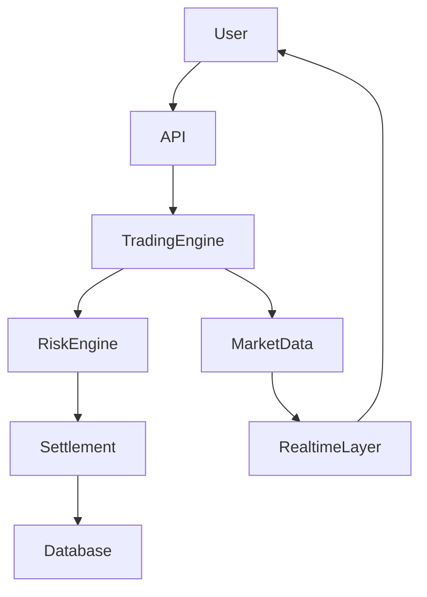
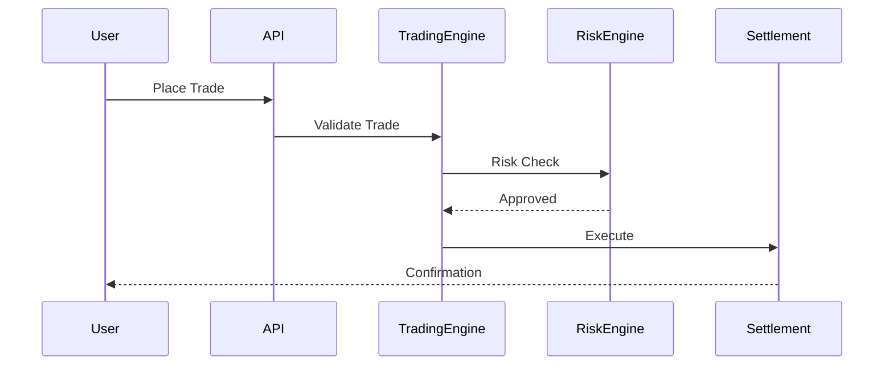
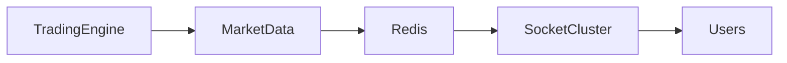
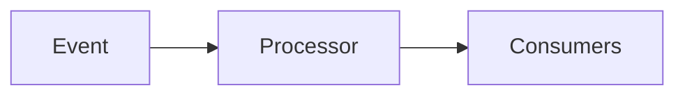
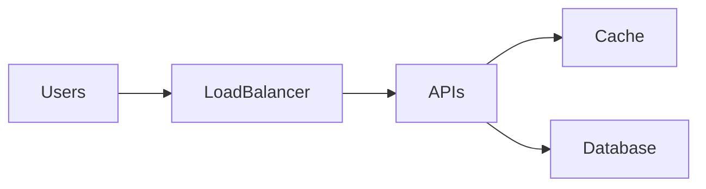
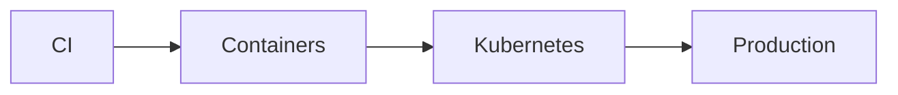

# Opinion Trading Platform Architecture Case Study


## Overview

Opinion trading platforms combine elements of:

* Financial Systems
* Prediction Markets
* Realtime Trading Engines
* Market Data Platforms
* Risk Management Systems

Users participate in markets by expressing opinions on future outcomes through buy and sell actions.

Unlike traditional ecommerce or content platforms, trading systems require:

* High Accuracy
* Strong Consistency
* Low Latency
* Auditability
* Risk Controls
* Realtime Market Visibility

Every transaction impacts balances, positions, and market states, making correctness a fundamental architectural requirement.

This case study explores the architecture of a production-grade opinion trading platform while focusing on engineering principles rather than proprietary implementation details.

---

## Business Objectives

The platform must support:

### Traders

* Market Participation
* Position Tracking
* Realtime Updates

### Operations Teams

* Market Management
* Risk Monitoring
* Compliance Controls

### Business Teams

* Market Analytics
* Revenue Monitoring

### Engineering Teams

* Reliability
* Scalability
* Observability

---

# Engineering Challenges

Trading systems introduce unique constraints.

---

## Financial Correctness

Incorrect balances are unacceptable.

---

## Realtime Market Data

Users expect immediate visibility.

---

## Concurrent Transactions

Many users interact simultaneously.

---

## Risk Management

Market integrity must be protected.

---

## Audit Requirements

Every action must be traceable.

---

# High-Level Architecture




---

# Core Platform Domains

---

## Market Domain

Responsible for:

* Market Creation
* Market State
* Market Visibility

---

## Trading Domain

Responsible for:

* Order Placement
* Order Validation
* Position Updates

---

## Risk Domain

Responsible for:

* Exposure Limits
* Fraud Detection
* Trading Controls

---

## Settlement Domain

Responsible for:

* Balance Updates
* Position Accounting
* Financial Integrity

---

## Realtime Domain

Responsible for:

* Market Updates
* Price Changes
* User Notifications

---

# Trading Request Flow



---

# Market Data Architecture

Market visibility is a critical user experience requirement.

---

## Examples

```text
Market Price

Market Volume

Trade Activity

Position Information
```

---

## Goal

Deliver updates with minimal latency.

---

# Realtime Architecture




---

## Benefits

* Fast Updates
* Scalable Distribution

---

# Order Lifecycle

Trades progress through multiple stages.

---

## Example

```text
Created

↓

Validated

↓

Risk Checked

↓

Executed

↓

Settled
```

---

## Benefits

* Traceability
* Controlled Processing

---

# Risk Management Architecture

Risk controls are mandatory.

---

## Objectives

* Prevent Abuse
* Protect Market Integrity
* Reduce Financial Risk

---

## Checks

```text
Position Limits

Trading Limits

Exposure Controls
```

---

# Settlement Architecture

Settlement ensures correctness.

---

## Responsibilities

* Balance Updates
* Position Tracking
* Financial Reconciliation

---

## Requirement

```text
Strong Consistency
```

---

# Event-Driven Architecture

Trading systems generate continuous events.

---

## Examples

```text
Trade Executed

Position Updated

Market Updated

Settlement Completed
```

---

## Benefits

* Scalability
* Loose Coupling

---

# Event Flow



---

# Database Design Considerations

Critical entities include:

* Users
* Markets
* Trades
* Positions
* Wallets
* Settlements

---

## Goals

* Consistency
* Auditability
* Reliability

---

# Transaction Management

Financial operations require transactional guarantees.

---

## Benefits

* Data Integrity
* Consistent Outcomes

---

# Scalability Architecture




---

## Scaling Priorities

### Market Data

High scale.

---

### Trading Operations

Careful scaling.

---

### Settlement

Consistency focused.

---

# Reliability Requirements

Trading platforms require strong reliability.

---

## Goals

* No Lost Trades
* Accurate Balances
* Reliable Settlements

---

## Strategies

* Auditing
* Monitoring
* Recovery Workflows
* Redundancy

---

# Security Considerations

Core controls include:

* Authentication
* Authorization
* Fraud Controls
* Audit Logging

---

## Benefits

* Platform Integrity
* User Protection

---

# Observability Strategy


Monitor:

* Trade Throughput
* Execution Latency
* Settlement Success Rate
* Error Rates

---

## Benefits

* Faster Detection
* Operational Visibility

---

# Deployment Architecture



---

## Benefits

* Automated Delivery
* Consistent Operations

---

# Engineering Decisions

---

## Risk Checks Before Execution

Reason:

```text
Protect Market Integrity
```

---

## Event-Driven Processing

Reason:

```text
Scalable Trading Workflows
```

---

## Realtime Market Distribution

Reason:

```text
Low Latency User Experience
```

---

## Strong Settlement Consistency

Reason:

```text
Financial Correctness
```

---

# Key Tradeoffs

| Decision           | Benefit             | Tradeoff               |
| ------------------ | ------------------- | ---------------------- |
| Risk Validation    | Platform Protection | Additional Latency     |
| Event Processing   | Scalability         | Operational Complexity |
| Realtime Updates   | Better UX           | Infrastructure Cost    |
| Audit Trails       | Traceability        | Storage Cost           |
| Strong Consistency | Financial Accuracy  | Reduced Flexibility    |

---

# Future Evolution

Potential enhancements:

* Multi-Region Trading
* Advanced Risk Models
* Event Streaming Platforms
* Machine Learning Analytics
* Enhanced Market Intelligence

---

# Engineering Outcome

The opinion trading platform architecture demonstrates how financial-style systems can be designed for correctness, scalability, reliability, and realtime user experiences.

By combining trading engines, risk controls, settlement workflows, event-driven processing, realtime distribution, observability, and strong operational practices, the platform architecture supports market participation while protecting financial integrity and maintaining user trust.

This case study highlights the architectural principles and engineering tradeoffs required to build production-grade trading platforms.
