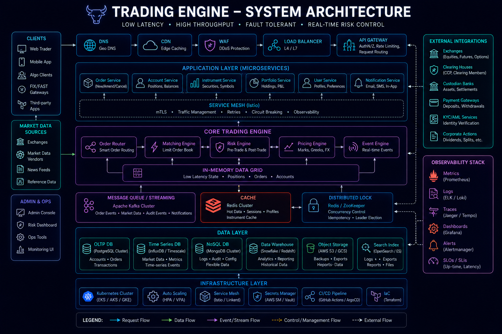
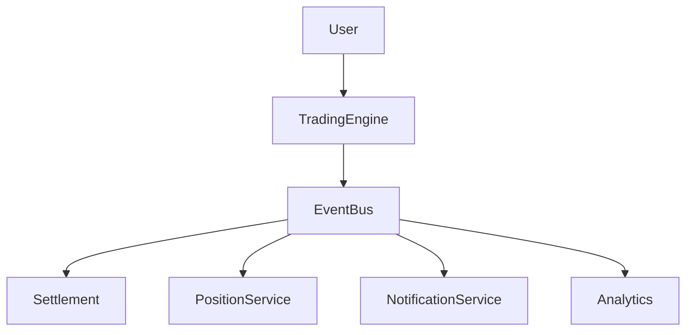
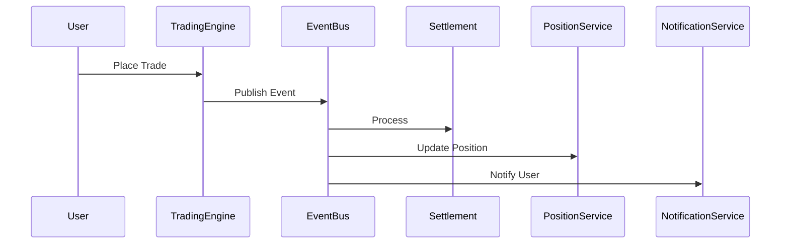
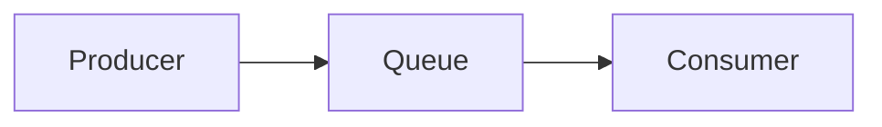
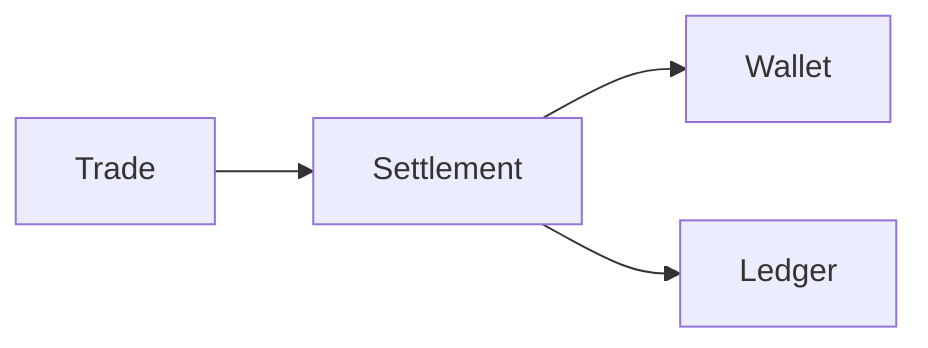
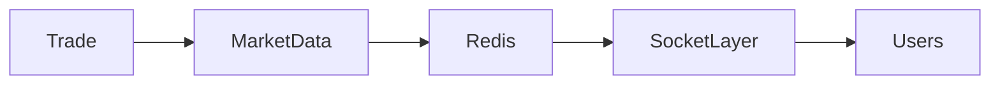
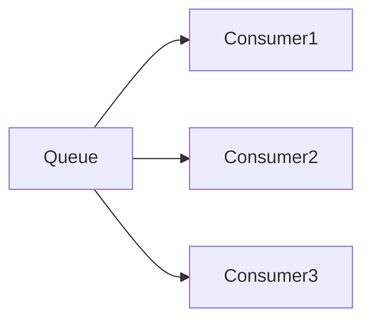

# Opinion Trading Event Processing Architecture



## Overview

Modern trading systems are fundamentally event-driven systems.

Every user action, market update, risk evaluation, settlement operation, and notification generates events that must be processed reliably and consistently.

As platform adoption grows, synchronous request-response workflows become increasingly difficult to scale.

Event-driven processing allows trading systems to:

* Scale Independently
* Improve Reliability
* Increase Throughput
* Support Realtime Experiences
* Isolate Failures
* Simplify System Evolution

This document explores the event processing architecture behind a production-grade opinion trading platform.

---

## Engineering Goals

The event platform is designed to provide:

* Reliable Event Delivery
* Scalable Processing
* Realtime Distribution
* Fault Tolerance
* Auditability
* Operational Visibility

---

# Why Event-Driven Processing?

Trading systems generate large volumes of independent actions.

---

## Examples

```text
Trade Created

Trade Executed

Position Updated

Wallet Updated

Settlement Completed

Market Updated
```

---

## Challenge

A synchronous architecture creates tight coupling between domains.

---

## Solution

```text
Event Producers

↓

Event Stream

↓

Independent Consumers
```

---

# Event Processing Architecture




---

# Core Event Types

Trading platforms produce many event categories.

---

## Trading Events

```text
Trade Created

Trade Validated

Trade Executed

Trade Rejected
```

---

## Settlement Events

```text
Settlement Started

Settlement Completed

Settlement Failed
```

---

## Position Events

```text
Position Opened

Position Updated

Position Closed
```

---

## Market Events

```text
Market Opened

Market Updated

Market Closed
```

---

## Notification Events

```text
Trade Confirmation

Balance Update

Market Alert
```

---

# Trade Lifecycle

Every trade follows a controlled workflow.

---

## Example Flow


---

# Event Pipeline

The event pipeline coordinates processing.

---

## Flow



---

# Queue-Based Processing

Queues provide buffering and decoupling.

---

## Benefits

* Traffic Smoothing
* Failure Isolation
* Independent Scaling

---

## Architecture



---

# Why Queues Matter

Without queues:

```text
Trade

↓

All Services Must Respond
```

---

## Problems

* Tight Coupling
* Cascading Failures
* Increased Latency

---

## With Queues

```text
Trade

↓

Publish Event

↓

Process Independently
```

---

# Settlement Pipeline

Settlement is one of the most sensitive workflows.

---

## Responsibilities

* Balance Updates
* Position Accounting
* Financial Reconciliation

---

## Requirements

```text
Correctness First
```

---

# Settlement Flow



---

## Benefits

* Financial Integrity
* Traceability

---

# Event Ordering

Ordering matters in financial systems.

---

## Example

Correct:

```text
Trade Executed

↓

Balance Updated
```

---

Incorrect:

```text
Balance Updated

↓

Trade Executed
```

---

## Goal

Maintain logical consistency.

---

# Idempotent Processing

Duplicate events are inevitable.

---

## Example

```text
Trade Executed Event

Received Twice
```

---

## Desired Outcome

```text
Processed Once
```

---

## Benefits

* Reliability
* Data Integrity

---

# Retry Strategy

Failures occur.

---

## Causes

* Network Issues
* Service Outages
* Temporary Errors

---

## Strategy

```text
Retry

↓

Backoff

↓

Recovery
```

---

## Benefits

* Improved Reliability

---

# Dead Letter Queues

Some failures require manual attention.

---

## Flow


---

## Benefits

* Failure Visibility
* Recovery Support

---

# Realtime Market Distribution

Executed trades often impact market state.

---

## Examples

```text
Market Price

Volume

Liquidity

Participation
```

---

## Goal

Update users immediately.

---

# Realtime Flow




---

# Event Fan-Out

One trade may generate many downstream events.

---

## Example

```text
Trade Executed

↓

Settlement

↓

Position Update

↓

Market Update

↓

Notification

↓

Analytics
```

---

## Benefit

Independent processing.

---

# Risk Event Processing

Risk systems consume events continuously.

---

## Examples

* Exposure Checks
* Trading Limits
* Fraud Signals

---

## Goal

Protect market integrity.

---

# Event Auditing

Every important event should be recorded.

---

## Benefits

* Compliance
* Investigation
* Recovery

---

## Example Events

```text
Trade

Settlement

Risk Decision

Position Update
```

---

# Scalability Strategy

As traffic grows:

---

## Scale Producers

Independent scaling.

---

## Scale Consumers

Independent scaling.

---

## Scale Queues

Partitioned processing.

---

# Horizontal Consumer Scaling



---

## Benefits

* Increased Throughput
* Better Resilience

---

# Monitoring Event Systems


Monitor:

* Event Throughput
* Queue Depth
* Consumer Lag
* Processing Errors

---

## Benefits

* Early Detection
* Operational Awareness

---

# Failure Scenarios

---

## Queue Saturation

Events accumulate.

---

## Consumer Failure

Processing delays.

---

## Settlement Failure

Financial risk.

---

## Realtime Distribution Failure

User experience degradation.

---

# Recovery Strategies

* Retries
* DLQs
* Monitoring
* Replay Mechanisms

---

## Goal

Reliable processing.

---

# Engineering Decisions

---

## Event-Driven Architecture

Reason:

```text
Independent Scaling
```

---

## Queue-Based Processing

Reason:

```text
Traffic Smoothing
```

---

## Idempotent Consumers

Reason:

```text
Duplicate Protection
```

---

## Settlement Isolation

Reason:

```text
Financial Correctness
```

---

# Engineering Tradeoffs

| Decision              | Benefit            | Tradeoff                  |
| --------------------- | ------------------ | ------------------------- |
| Event Processing      | Scalability        | Operational Complexity    |
| Queues                | Reliability        | Additional Infrastructure |
| Retries               | Recovery           | Duplicate Handling        |
| DLQs                  | Failure Visibility | Operational Overhead      |
| Realtime Distribution | Better UX          | Infrastructure Cost       |

---

# Event Processing Maturity Model

```text
Synchronous Calls
         │
         ▼
Simple Queues
         │
         ▼
Event-Driven Workflows
         │
         ▼
Distributed Consumers
         │
         ▼
Streaming Architecture
         │
         ▼
Enterprise Event Platform
```

---

# Interview Perspective

Strong backend engineers discuss:

* Event Ordering
* Idempotency
* Retry Strategies
* Queue Architecture
* Settlement Reliability
* Consumer Scaling
* Realtime Distribution

rather than viewing queues as simple background jobs.

Event systems are a core scalability primitive.

---

# Engineering Outcome

The opinion trading event-processing architecture enables scalable, reliable, and auditable workflow execution across the platform.

By combining event-driven design, queue-based processing, settlement isolation, realtime distribution, auditing, and operational monitoring, the platform can process high volumes of trading activity while maintaining correctness, responsiveness, and resilience.

This architecture demonstrates the engineering principles required to build production-grade realtime trading platforms at scale.
