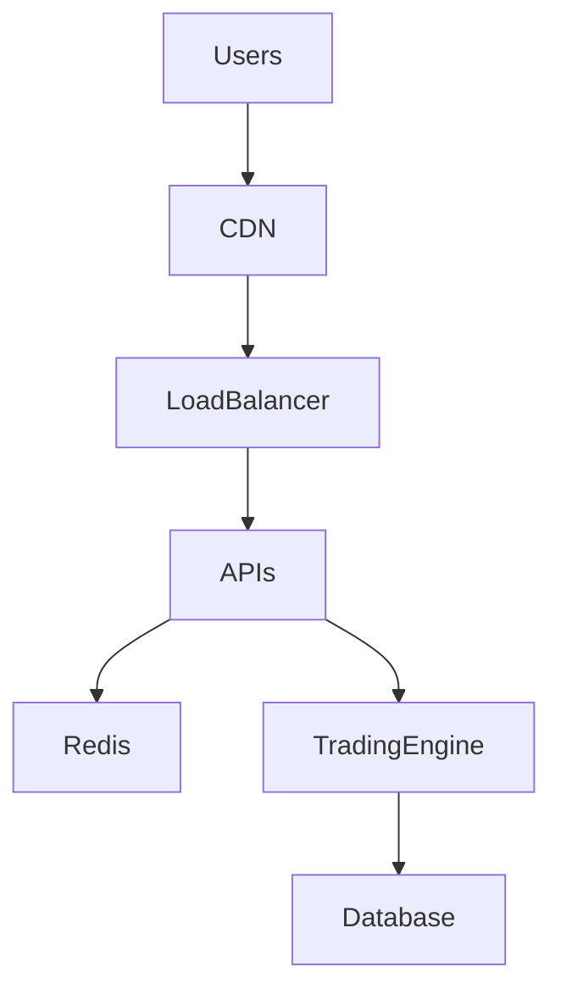
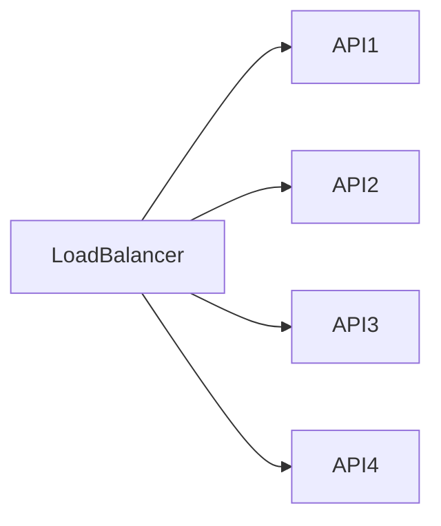
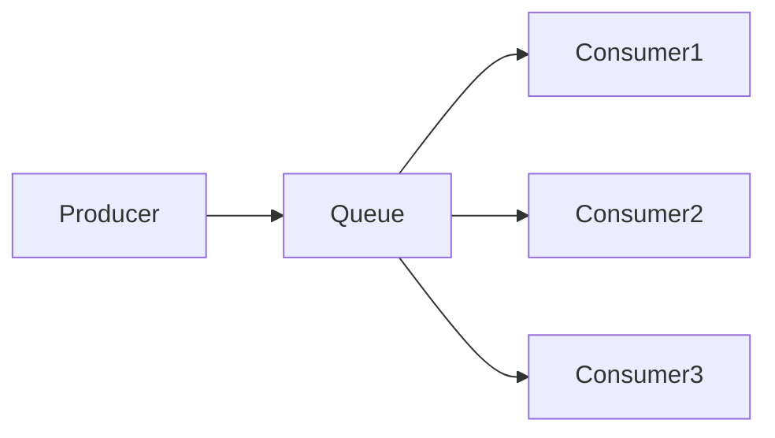
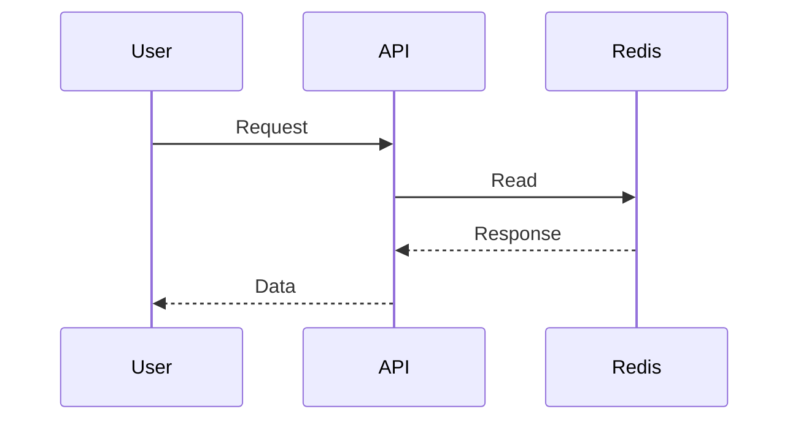
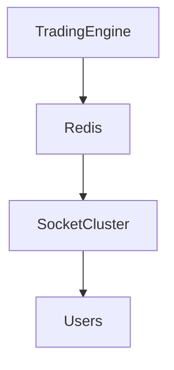
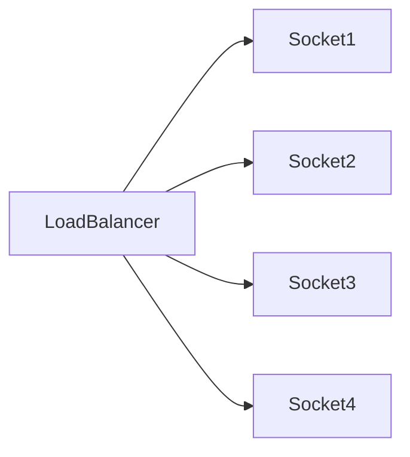
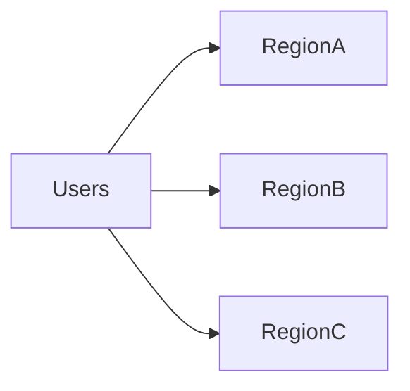

# Opinion Trading Platform Scalability Strategy


## Overview

Scalability in trading platforms differs significantly from traditional web applications.

A content platform may tolerate delayed updates.

An ecommerce platform may tolerate slight search delays.

A trading platform cannot tolerate:

* Lost Transactions
* Inconsistent Balances
* Delayed Market Updates
* Settlement Failures

As user growth increases, the platform must scale while preserving correctness.

This creates a unique challenge:

```text
Scale Aggressively

Without Sacrificing Correctness
```

This document explores the scalability strategy behind a production-grade opinion trading platform.

---

## Scalability Goals

The platform is designed to support:

* High Concurrent Users
* Large Market Participation
* Realtime Market Distribution
* Reliable Settlement
* Low Latency
* Sustainable Growth

---

# Trading Traffic Characteristics

Trading workloads behave differently from standard applications.

---

## Read Traffic

Examples:

* Market Data
* Prices
* Volumes
* Rankings

---

## Write Traffic

Examples:

* Trade Placement
* Position Updates
* Settlement Operations

---

## Observation

```text
Market Reads >> Trade Writes
```

---

## Result

Read optimization becomes critical.

---

# Market Activity Spikes

Traffic is highly event-driven.

---

## Examples

```text
Market Opening

Breaking News

Trending Markets

Market Settlement Windows
```

---

## Impact

Large user activity bursts.

---

# Scalability Architecture




---

# Scalability Philosophy

Different workloads scale differently.

---

## Market Data

Scale aggressively.

---

## Trading Operations

Scale carefully.

---

## Settlement

Prioritize consistency.

---

# API Scaling Strategy

APIs handle:

* Market Discovery
* User Data
* Position Queries
* Portfolio Views

---

## Approach

Horizontal scaling.

---

## Architecture



---

## Benefits

* Elastic Capacity
* Fault Isolation

---

# Stateless Services

Application nodes remain stateless.

---

## State Stored In

* Redis
* Database

---

## Benefits

* Easier Scaling
* Faster Recovery

---

# Trading Engine Scaling

The trading engine processes:

* Trade Requests
* Validation
* Execution
* Event Generation

---

## Goal

Maintain correctness under load.

---

# Trading Workflow


---

## Design Principle

```text
Correctness Before Throughput
```

---

# Queue Scaling Strategy

Event-driven systems depend on queue infrastructure.

---

## Benefits

* Decoupling
* Traffic Buffering
* Independent Scaling

---

# Queue Architecture



---

## Result

Consumers scale independently.

---

# Queue Partitioning

As volume grows:

```text
Single Queue

↓

Partitioned Queues
```

---

## Benefits

* Higher Throughput
* Better Scalability

---

# Redis Scaling Strategy

Redis supports:

* Market Data
* Caching
* Realtime Distribution

---

## Cached Data

* Prices
* Volumes
* Rankings
* Market States

---

## Benefits

* Reduced Database Load
* Low Latency Reads

---

# Redis Request Flow



---

## Result

Most requests bypass databases.

---

# Redis Cluster Evolution

```text
Single Redis

↓

Replication

↓

Cluster

↓

Distributed Cache Platform
```

---

## Benefits

* Growth Capacity
* Better Availability

---

# Realtime Feed Scaling


Realtime updates are central to user experience.

---

## Examples

```text
Market Price

Volume Updates

Position Changes
```

---

## Challenge

Large concurrent audiences.

---

# Realtime Distribution Architecture



---

## Benefits

* Fast Propagation
* Horizontal Scaling

---

# Fan-Out Challenge

One trade may affect thousands of users.

---

## Example

```text
Market Event

↓

100,000 Connected Users
```

---

## Requirement

Efficient broadcasting.

---

# Socket Scaling



---

## Benefits

* Capacity Growth
* Reliability

---

# Database Scaling Strategy

Trading systems require careful database scaling.

---

## Goals

* Transaction Integrity
* Reliable Writes
* Historical Analysis

---

# Read Optimization

Strategies include:

* Caching
* Read Replicas
* Materialized Views

---

## Benefits

* Reduced Load
* Better Performance

---

# Write Protection

Critical writes remain protected.

---

## Examples

* Trade Execution
* Settlement
* Balance Updates

---

## Goal

Preserve correctness.

---

# Capacity Planning

Capacity planning is mandatory.

---

## Inputs

```text
Users

Markets

Trades Per Second

Events Per Second

Connections
```

---

## Goal

Predict resource requirements.

---

# Load Testing

Scalability assumptions must be validated.

---

## Scenarios

* Market Opening
* Breaking News
* Viral Market Activity

---

## Objectives

* Bottleneck Discovery
* Capacity Validation

---

# Failure Isolation

Scaling requires fault isolation.

---

## Example

Notification service failure should not affect:

```text
Trade Execution
```

---

## Benefits

* Improved Reliability

---

# Geographic Growth

Regional expansion introduces new requirements.

---

## Architecture



---

## Benefits

* Reduced Latency
* Better Availability

---

# Monitoring Scalability


Monitor:

* Requests Per Second
* Queue Depth
* Consumer Lag
* Trade Throughput
* Active Connections

---

## Benefits

* Early Detection
* Better Forecasting

---

# Reliability Under Load

Scalability and reliability must work together.

---

## Techniques

* Backpressure
* Retries
* Queueing
* Autoscaling

---

## Goal

Graceful handling of spikes.

---

# Cost Considerations

Scaling introduces operational costs.

---

## Tradeoff

```text
Performance

vs

Infrastructure Cost
```

---

## Goal

Efficient resource utilization.

---

# Engineering Decisions

---

## Redis For Market Reads

Reason:

```text
Fast Access
```

---

## Queue-Based Processing

Reason:

```text
Traffic Buffering
```

---

## Socket Clusters

Reason:

```text
Realtime Distribution
```

---

## Settlement Isolation

Reason:

```text
Financial Correctness
```

---

# Common Scaling Mistakes

---

## Database-First Reads

Creates bottlenecks.

---

## Ignoring Queue Monitoring

Creates hidden failures.

---

## Shared Stateful Services

Complicates scaling.

---

## Missing Capacity Planning

Leads to outages.

---

## No Load Testing

Leaves bottlenecks undiscovered.

---

# Engineering Tradeoffs

| Decision          | Benefit           | Tradeoff                  |
| ----------------- | ----------------- | ------------------------- |
| Redis Caching     | Fast Reads        | Additional Infrastructure |
| Queue Processing  | Scalability       | Operational Complexity    |
| Socket Clusters   | Realtime Capacity | Connection Management     |
| Read Replicas     | Read Scaling      | Replication Complexity    |
| Global Deployment | Better UX         | Infrastructure Cost       |

---

# Scalability Maturity Model

```text
Single Node
      │
      ▼
Load Balanced APIs
      │
      ▼
Redis Caching
      │
      ▼
Event Processing
      │
      ▼
Distributed Realtime Layer
      │
      ▼
Global Trading Platform
```

---

# Interview Perspective

Strong engineers discuss:

* Trading Engine Bottlenecks
* Queue Scaling
* Realtime Distribution
* Settlement Protection
* Capacity Planning
* Consistency Tradeoffs
* Failure Isolation

rather than focusing solely on infrastructure components.

Scalability decisions must be aligned with business correctness requirements.

---

# Engineering Outcome

The opinion trading platform scalability strategy balances growth, performance, and correctness.

By combining horizontal API scaling, Redis-based market distribution, queue-driven workflows, distributed realtime delivery, careful settlement protection, observability-driven operations, and capacity planning, the platform can support increasing market participation while maintaining responsiveness, reliability, and financial integrity.

This architecture demonstrates the engineering principles required to scale modern realtime trading platforms in production environments.
