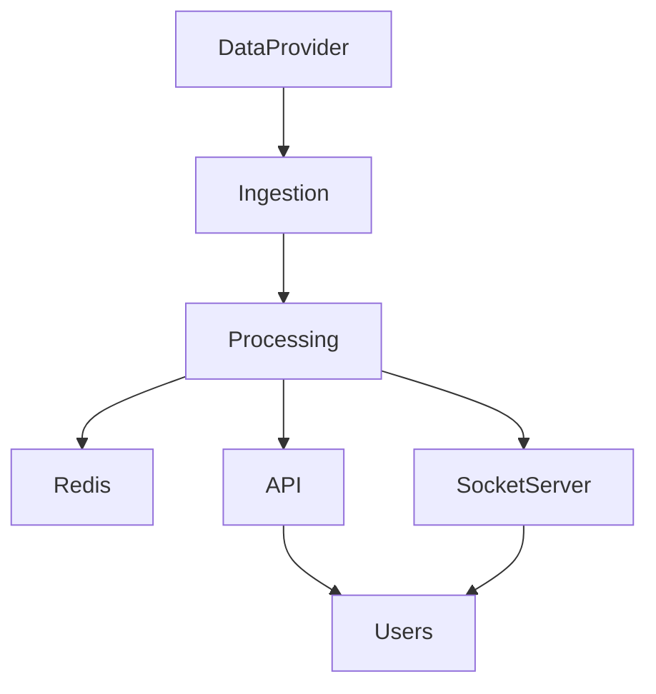
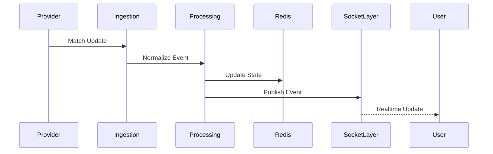
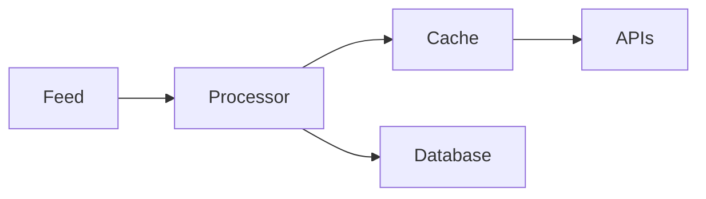
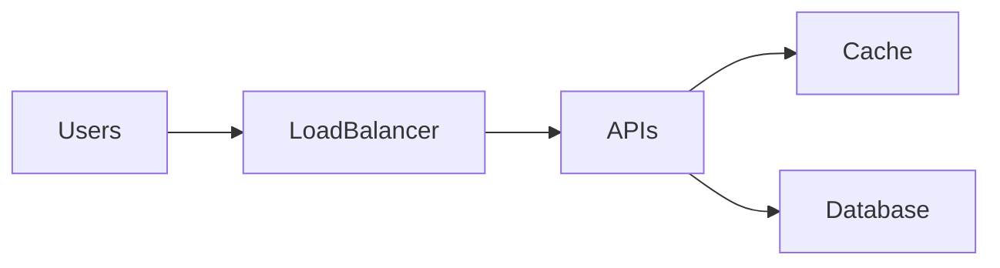
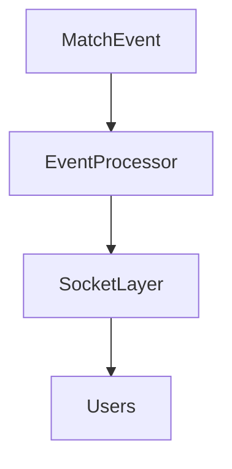
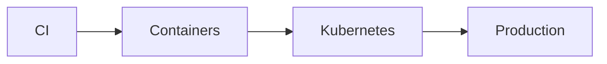

# Sportswiz Architecture Case Study


## Overview

Sportswiz is a large-scale sports technology platform designed to deliver:

* Live Scores
* Match Statistics
* Player Analytics
* Realtime Match Updates
* Fantasy Sports Experiences
* Sports Commerce Experiences

The platform architecture is designed around the challenges of realtime sports data processing where thousands of events can occur during a single match and must be delivered to users with minimal latency.

This case study focuses on architectural thinking, scalability patterns, operational design decisions, and production considerations without exposing proprietary implementation details.

---

## Business Objectives

The platform was designed to support:

### Sports Fans

* Realtime Scores
* Match Tracking
* Player Insights

### Fantasy Sports Users

* Live Points
* Team Performance
* Rankings

### Ecommerce Customers

* Merchandise Discovery
* Order Management
* Checkout Experiences

### Platform Operators

* Match Management
* Statistics Management
* Content Operations

---

# Engineering Challenges

Sports platforms introduce unique technical challenges.

---

## Realtime Data Ingestion

External sports feeds generate frequent updates.

Examples:

```text
Ball-by-Ball Events

Player Statistics

Match State Changes

Score Updates
```

---

## Traffic Spikes

Traffic is highly event driven.

Example:

```text
Match Start

↓

Traffic Surge

↓

Peak Concurrent Users
```

---

## Low Latency Expectations

Users expect updates within seconds.

---

## High Read Volume

Millions of score reads may occur during major events.

---

## Data Consistency

Statistics and rankings must remain accurate.

---

# High-Level Architecture




---

# Core Architecture Components

---

## Sports Data Provider Layer

External providers supply:

* Match Data
* Player Statistics
* Event Streams

---

## Ingestion Layer

Responsible for:

* Feed Collection
* Validation
* Normalization

---

## Processing Layer

Transforms raw feed data into platform-ready information.

Responsibilities:

* Score Updates
* Statistics Calculation
* Event Processing

---

## Storage Layer

Primary responsibilities:

* Match Data
* Historical Statistics
* Player Records
* Team Information

---

## Caching Layer

Redis provides:

* Fast Reads
* Session Storage
* Realtime State

---

## API Layer

Serves:

* Mobile Applications
* Web Clients
* Internal Services

---

## Realtime Delivery Layer

Responsible for:

* Live Score Updates
* Match Events
* Leaderboard Changes

---

# Request Flow



---

# Data Flow Architecture



---

# Realtime Architecture

Sports platforms are fundamentally event-driven.

---

## Event Types

```text
Match Started

Boundary

Wicket

Player Milestone

Match Finished
```

---

## Benefits

* Loose Coupling
* Fast Processing
* Scalability

---

# Caching Strategy


Most user requests target frequently accessed information.

---

## Cached Data

* Live Scores
* Match State
* Player Rankings
* Leaderboards

---

## Benefits

* Reduced Database Load
* Faster Responses

---

# Database Design Considerations

Core entities include:

* Matches
* Teams
* Players
* Statistics
* Rankings

---

## Design Goals

* Efficient Reads
* Historical Analysis
* Data Integrity

---

# Scalability Architecture




---

## Scaling Priorities

### API Layer

Horizontal Scaling

---

### Cache Layer

Redis Clustering

---

### Realtime Layer

Distributed Socket Infrastructure

---

# Reliability Design

Sports traffic is unpredictable.

---

## Reliability Goals

* Continuous Availability
* Fast Recovery
* Fault Isolation

---

## Strategies

* Redundant Services
* Multi-AZ Infrastructure
* Automated Recovery

---

# Realtime Delivery Design



---

## Benefits

* Low Latency
* Efficient Distribution

---

# Observability Strategy


Monitor:

* Feed Latency
* API Latency
* Cache Health
* Socket Connections
* Error Rates

---

## Goal

Detect issues before users notice them.

---

# Security Architecture

Core controls:

* Authentication
* Authorization
* API Security
* Rate Limiting

---

## Benefits

* User Protection
* Operational Security

---

# Deployment Architecture



---

## Benefits

* Automated Delivery
* Consistent Deployments

---

# Engineering Decisions

---

## Redis For Live State

Reason:

```text
Sub-Millisecond Access
```

---

## Event-Driven Processing

Reason:

```text
Realtime Workloads
```

---

## Horizontal API Scaling

Reason:

```text
Traffic Volatility
```

---

## Socket-Based Delivery

Reason:

```text
Low Latency User Updates
```

---

# Key Tradeoffs

| Decision             | Benefit         | Tradeoff                  |
| -------------------- | --------------- | ------------------------- |
| Redis Caching        | Fast Reads      | Additional Infrastructure |
| Event Processing     | Scalability     | Operational Complexity    |
| Realtime Delivery    | Better UX       | Connection Management     |
| Horizontal Scaling   | Capacity Growth | Infrastructure Cost       |
| Distributed Services | Flexibility     | Increased Complexity      |

---

# Production Challenges

---

## Feed Reliability

External providers may experience delays.

---

## Traffic Spikes

Major matches create sudden demand.

---

## Cache Consistency

Realtime systems require accurate state.

---

## Connection Scaling

Large concurrent user counts increase complexity.

---

# Future Evolution

Potential enhancements:

* Multi-Region Deployment
* Event Streaming Platforms
* Advanced Analytics Pipelines
* AI-Based Insights
* Personalized Recommendations

---

# Engineering Outcome

The Sportswiz architecture demonstrates how realtime sports platforms can be designed for scalability, reliability, and low-latency user experiences.

By combining event-driven processing, caching strategies, distributed APIs, realtime communication channels, and strong operational practices, the platform architecture supports high-volume sports workloads while maintaining responsiveness and reliability during peak traffic events.

This case study highlights engineering decision-making, architectural tradeoffs, and production design principles commonly required for modern sports technology platforms.
